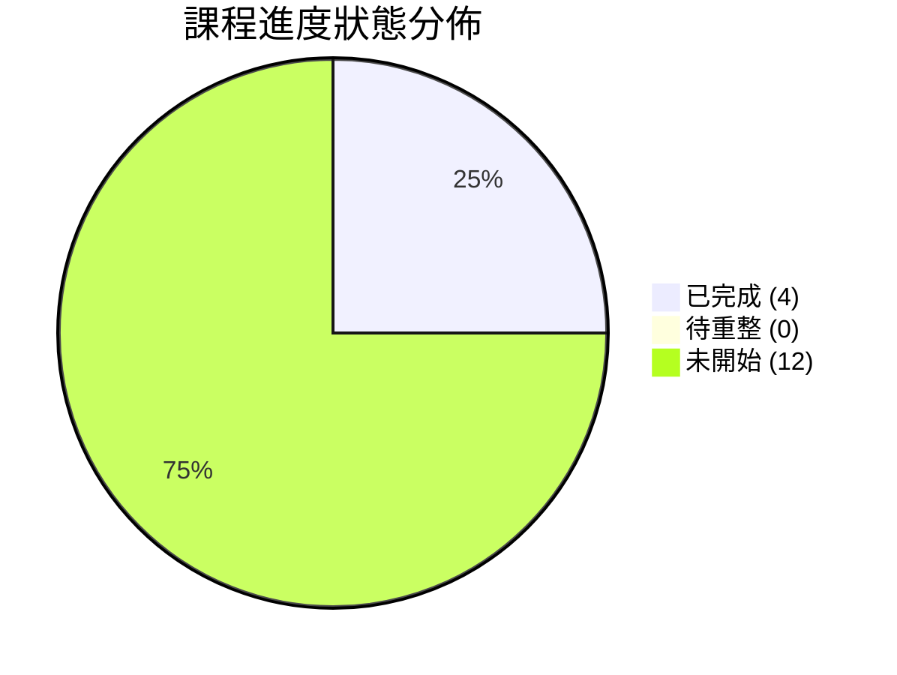

---
{"dg-publish":true,"permalink":"/04/10/00/progress/","title":"課程與筆記進度追蹤","dg-note-properties":{"permalink":"/notes/10/progress/","title":"課程與筆記進度追蹤"}}
---

# 📊 課程與筆記進度追蹤看板

> **課程名稱**：國立臺灣大學進修推廣學院（NTU SPECS）PMBA「創業與企業財務策略」 (Entrepreneurship and Corporate Financial Strategy)  
> **學期進度**：2026 Fall（全學期 16 週 · 09/08 ~ 12/22）  
> **學程定位**：高階商管（PMBA / EMBA）暨創投資本決策實戰  
> **知識架構**：四大核心模組 × 理論實踐 × 創投個案與資本市場決策  
> **導航定位**：本看板為全課程知識庫的頂層導航核心，記錄每週課程進度、雲端原稿連結、個案時事沉澱與筆記重整狀態。

---

## 📌 狀態標記圖例 (Legend)

| 圖示 | 狀態說明 | 處理指引 |
| :---: | :--- | :--- |
| 🟢 | **已完成 (Completed)** | 該週筆記已結構化重整、雙向鏈結完畢，並整合至核心模組庫。 |
| 🟡 | **整理中 (In Progress)** | 正在進行逐字稿校對、白板推導圖解化或案例歸檔。 |
| ⚪ | **待重整 (To Reorganize)** | 已有雲端原稿或舊筆記，待依全新四維模組規格進行深度重構。 |
| ⚪ | **未開始 (Not Started)** | 課程尚未進行，預先鎖定主題大綱與骨架節點。 |

---

## 📈 總覽指標與進度統計

| 總週次 | 歸屬模組 | 筆記已完成 | 待重整 / 複審 | 未開始 | 總體推進率 |
| :---: | :---: | :---: | :---: | :---: | :---: |
| **16 週** | 4 大模組 | 4 週 (W01~W04) | 0 週 | 12 週 | **25.0%** (進度四分之一) |

---

## 🗓️ 16 週課程進度與筆記對照總表

| 週次與日期 | 官方授課主題（對照 16 週大綱） | 歸屬模組 | 雲端原稿連結 | 筆記整理狀態 | 課堂備註 / 核心關鍵詞對接 |
| :--- | :--- | :--- | :---: | :---: | :--- |
| **W01** 09/08 | **創業概論** *(Introduction to Entrepreneurship)* | **Module 1** 創新思維與商業模式 | [🔗 雲端講義](https://drive.google.com/file/d/1mkfS-Di_BKkpdruuYmDDTWdV05_yfDVG/view?usp=drivesdk) | 🟢 已完成 | • 核心本質：[[04_主題選修/10_創業與企業財務策略/02_模組筆記/Module_1_創新思維與商業模式/M1-1_創業本質與創業家精神\|M1-1 創業本質與創業家精神]] (三創脈絡、四大奠基學派、冒險型肥尾分佈 Fat Tail、3F 原則) • 白板決策鏈：[[04_主題選修/10_創業與企業財務策略/02_模組筆記/Module_1_創新思維與商業模式/M1-2_白板決策鏈與財務價值三角\|M1-2 白板決策鏈與財務價值三角]] (PEST × VRIO × SWOT 四向策略、永續成長率公式 $g = b \times ROE = (1 - d) \times ROE$、受償順位) • 數位新經濟：[[04_主題選修/10_創業與企業財務策略/02_模組筆記/Module_1_創新思維與商業模式/M1-3_數位新經濟與精實創業方法論\|M1-3 數位新經濟與精實創業方法論]] (五大新經濟 × 五大科技引擎、精實三位一體 MVP/PMF/Pivot、顧客開發模型) • 總經時事庫：[[資本市場與創投總經時事#2026-09-08\|2026-09-08 總經時事]] (美非農就業、高利率折現率、日圓套利平倉、募資寒冬) • 新創個案庫：[[新創與企業融資案例庫#台積電\|台積電]]、[[新創與企業融資案例庫#聯發科\|聯發科]]、[[新創與企業融資案例庫#輝達\|輝達]]、[[新創與企業融資案例庫#Walgreens\|Walgreens]] |
| **W02** 09/15 | **創業構想與商業計畫** *(Entrepreneurial Concept & Business Plan)* | **Module 1** 創新思維與商業模式 | [🔗 雲端講義](https://drive.google.com/file/d/1-rL1MJcfKCAYo-yMpVjHEp9HMYBO8-jT/view?usp=drivesdk) | 🟢 已完成 | • 創意思考工具：[[04_主題選修/10_創業與企業財務策略/02_模組筆記/Module_1_創新思維與商業模式/M1-4_創意思考工具與設計思考方法\|M1-4 創意思考工具與設計思考方法]] (Drucker 創新七來源、六大創意工具、d.school 設計思考五步、兩全思維) • 構想與評估：[[04_主題選修/10_創業與企業財務策略/02_模組筆記/Module_1_創新思維與商業模式/M1-5_創業構想發展與兩階段可行性評估\|M1-5 創業構想發展與兩階段可行性評估]] (機會六來源、八步驟流程、初步評估 8 問、深入評估 5 構面) • 觀念模式與審查：[[04_主題選修/10_創業與企業財務策略/02_模組筆記/Module_1_創新思維與商業模式/M1-6_創業觀念模式與商業計畫書審查\|M1-6 創業觀念模式與商業計畫書審查]] (Timmons/Bruyat/Dollinger/劉謝四大模式、Startup 特質、BP 創投審查六維度、智財四大保護) • 白板推導深化：[[04_主題選修/10_創業與企業財務策略/02_模組筆記/Module_1_創新思維與商業模式/M1-2_白板決策鏈與財務價值三角\|M1-2 財務價值三角]] (折舊回沖現金流機制、CLC 投融資演進矩陣、資本三階進化、現金股利 vs 庫藏股回購) • 敏捷案例深化：[[04_主題選修/10_創業與企業財務策略/02_模組筆記/Module_1_創新思維與商業模式/M1-3_數位新經濟與精實創業方法論\|M1-3 精實創業方法論]] (創業 0→1、興業 1→n、展業 n→N 價值演進三部曲) • 總經時事庫：[[資本市場與創投總經時事#2026-09-15\|2026-09-15 總經時事]] (通膨 CPI vs PCE 拆解、四大 CSP 資本支出、細光子題材退潮與大立光估值重整) • 新創個案庫：[[新創與企業融資案例庫#Airbnb\|Airbnb 深度剖析]] (雙邊平台輕資產、攝影服務 PMF、$2B 債務危機融資)、[[新創與企業融資案例庫#藍河科技\|藍河科技]] (精實客戶驗證)、[[新創與企業融資案例庫#奇異\|GE Durathon]] (大企業內部創業反面教材) |
| **W03** 09/22 | **創新創業與策略思維** *(Innovative Entrepreneurship & Strategic Thinking)* | **Module 1** 創新思維與商業模式 | [🔗 雲端講義](https://drive.google.com/file/d/1VGZIXYrEHYIYaqQglFYBHBIjRW4RVdtU/view?usp=drivesdk) | 🟢 已完成 | • **策略思維與 BSC**：[[04_主題選修/10_創業與企業財務策略/02_模組筆記/Module_1_創新思維與商業模式/M1-7_創新策略思維與平衡計分卡架構\|M1-7 創新策略思維與平衡計分卡架構]] (As-Is/To-Be 策略差距、BSC 四構面因果鏈、競爭優勢四基石、SMART 目標原則、創業初期 KPI 落地) • **資源理論與動態能耐**：[[04_主題選修/10_創業與企業財務策略/02_模組筆記/Module_1_創新思維與商業模式/M1-8_企業內部資源理論與動態能耐矩陣\|M1-8 企業內部資源理論與動態能耐矩陣]] (RBV 三大資源層級、VRIO 四層次檢驗矩陣、動態能耐三部曲 Sensing/Seizing/Transforming、動態競爭 AMC 模型) • **白板推導專題**：[[04_主題選修/10_創業與企業財務策略/02_模組筆記/Module_1_創新思維與商業模式/M1-8_企業內部資源理論與動態能耐矩陣#五-課堂白板推導專題產業與企業生命週期四大關鍵維度\|生命週期四大幾何維度]] (斜率成長速度、高度市場天花板、平坦度持續性競爭優勢、長度累積價值 EV；成長期看 ROIC，成熟期看 ROE) • **STP 與 AIO 生活型態深化**：[[04_主題選修/10_創業與企業財務策略/02_模組筆記/Module_1_創新思維與商業模式/M1-5_創業構想發展與兩階段可行性評估#3-stp-市場區隔深化與-aio-生活型態變數架構-class-3-課堂深化\|M1-5 STP/AIO 深化]] (人口/地理/行為/心理變數、AIO 活動/興趣/意見畫像、四大目標市場涵蓋策略比較) • **決策鏈與財務價值三角跨構面對齊**：[[04_主題選修/10_創業與企業財務策略/02_模組筆記/Module_1_創新思維與商業模式/M1-2_白板決策鏈與財務價值三角#5-平衡計分卡四基石與財務價值三角跨構面對齊-class-3-跨堂整合\|M1-2 財務價值三角跨構面對齊]] (BSC 四基石映射至營業利潤率、資產週轉率、財務槓桿與永續成長率) • **總經時事庫**：[[資本市場與創投總經時事#2026-09-22\|2026-09-22 總經時事]] (台灣央行連10凍實質負利率 -0.4%、第七波房市管制、HLW 中性利率模型、日銀升息1碼與日圓走貶157、WTI 柴油裂解價差飆升) • **新創與企業案例庫**：[[新創與企業融資案例庫#友達光電\|友達光電與群創]] (面板廠跨界半導體 FOPLP 面板級封裝與 TGV 玻璃基板先進封裝轉型典範) |
| **W04** 09/29 | **創業商業模式** *(Entrepreneurial Business Models)* | **Module 1** 創新思維與商業模式 | [🔗 雲端講義](https://drive.google.com/file/d/1NdwPJqJPV9vTiNT53qSqzYaYPhDylfsx/view?usp=drivesdk) | 🟢 已完成 | • **商業模式畫布與價值**：[[04_主題選修/10_創業與企業財務策略/02_模組筆記/Module_1_創新思維與商業模式/M1-9_商業模式畫布架構與價值主張設計\|M1-9 商業模式畫布架構與價值主張設計]] (BMC 四大導向九大要素、顧客感知淨價值方程式、總價值 4 項 vs 總成本 4 項、Showrooming 展廳 vs Webrooming 反向展廳、RFM 客戶模型、CLV 顧客終身價值與單位經濟學 $\text{CLV} \ge 3 \times \text{CAC}$) • **市場力量與商業戰略**：[[04_主題選修/10_創業與企業財務策略/02_模組筆記/Module_1_創新思維與商業模式/M1-10_七大市場力量與商業戰略價值公式\|M1-10 七大市場力量與商業戰略價值公式]] (商模到戰略躍遷、7 Powers 七大市場力量全解構、起始/起飛/穩定三階段、潛在價值公式 $\text{Value} = \text{市場規模} \times \text{市場力量}$、領導者/挑戰者/利基者角色矩陣、PVGO 股價模型與杜邦分析) • **TAM/SAM/SOM 估算法深化**：[[04_主題選修/10_創業與企業財務策略/02_模組筆記/Module_1_創新思維與商業模式/M1-6_創業觀念模式與商業計畫書審查#3-tam-sam-som-三層市場規模評估三大計算方法論-class-4-課堂深化\|M1-6 TAM/SAM/SOM 深化]] (Steve Blank 三層市場規模評估、自上而下 Top-down、自下而上 Bottom-up、價值理論法 Value Theory、寵物產業與 AI 新創算例) • **精實驗證與標準制定**：[[04_主題選修/10_創業與企業財務策略/02_模組筆記/Module_1_創新思維與商業模式/M1-3_數位新經濟與精實創業方法論#3-低成本精實驗證路徑與標準制定戰略-class-4-課堂深化\|M1-3 精實驗證深化]] (微型創業鳳凰/新創企業署政府資源、獎金獵人零成本競賽市場驗證法、由 B 端切入掌握標準與利潤咽喉) • **總經時事庫**：[[資本市場與創投總經時事#2026-09-29\|2026-09-29 總經時事]] (美債殖利率破 5.2% 股債雙跌、美元指數突破 101.5、外銷訂單單月破千億美元歷史新高、景氣連九紅 41 分、HBM 良性估值結構與 Meta P/FCF 45 倍警訊) • **新創與企業案例庫**：[[新創與企業融資案例庫#寵物洗劑新創\|寵物洗劑新創 (寶奇個案)]] (B 端標準切入帶動 C 端指名)、[[新創與企業融資案例庫#SK海力士\|SK海力士與美光]] (HBM 前瞻本益比下修至 5.38 倍與 PEG 0.05 拆解) |
| **W05** 10/06 | **產品與服務創新** *(Product & Service Innovation)* | **Module 1** 創新思維與商業模式 | [🔗 雲端原稿]() | ⚪ 未開始 | • 精實創業架構：Build-Measure-Learn 快速驗證式學習循環 • 最小可行產品 (MVP) 假說設計與低成本驗證工具箱 • 產品市場適配 (PMF) 關鍵量化指標與 Pivot 樞紐轉向決策模型 |
| **W06** 10/13 | **創業行銷** *(Entrepreneurial Marketing)* | **Module 1** 創新思維與商業模式 | [🔗 雲端原稿]() | ⚪ 未開始 | • STP 市場精準定位與 4P/4C 行銷組合落地 • 單位經濟學 (Unit Economics)：CAC (顧客獲取成本) vs LTV (顧客終身價值) • AARRR 成長駭客漏斗模型與顧客流失率 (Churn Rate) 敏感度分析 |
| **W07** 10/20 | **創業資金與財務規劃** *(Entrepreneurial Financing & Financial Planning)* | **Module 2** 創業融資與創投資本 | [🔗 雲端原稿]() | ⚪ 未開始 | • 新創三大財務報表動態預測 (銷售百分比法與營運資本需求) • 現金跑道 (Runway) 測算與淨現金消耗率 (Net Burn Rate) 監控 • 損益兩平點 (BEP) 與安全邊際分析、資本支出 (CapEx) 預算編列 |
| **W08** 10/27 | **創業投資** *(Venture Capital)* | **Module 2** 創業融資與創投資本 | [🔗 雲端原稿]() | ⚪ 未開始 | • 創投機構 (VC) 運作：GP / LP 架構、基金生命週期、管理費與 Carry 分潤 • 估值方法論：Pre-money / Post-money 估值、創投倍數法、情境分析 DCF • Term Sheet 核心條款：清算優先權 (Liquidation Preference)、反稀釋 (Anti-dilution)、領售權 (Drag-Along) • 資本結構表 (Cap Table) 股權稀釋動態試算與 ESOP 激勵池規劃 |
| **W09** 11/03 | **企業財務策略概論** *(Introduction to Corporate Financial Strategy)* | **Module 3** 企業生命週期與財務戰略 | [🔗 雲端原稿]() | ⚪ 未開始 | • 企業財務最高目標：企業價值 (Firm Value) 極大化 • 加權平均資本成本 (WACC) 與資本資產定價模型 (CAPM) 連動 • 資本結構 MM 理論：無稅/有稅模型、稅盾利益與破產危機成本權衡 |
| **W10** 11/10 | **企業經營與財務策略** *(Corporate Operations & Financial Strategy)* | **Module 3** 企業生命週期與財務戰略 | [🔗 雲端原稿]() | ⚪ 未開始 | • 營運資金管理：應收帳款、存貨、應付帳款週轉率與現金轉換週期 (CCC) • 企業價值創造利差：投入資本報酬率 (ROIC) vs WACC 核心驅動因子 • 自由現金流 (FCFF / FCFE) 創造能耐與資本配置優先序 |
| **W11** 11/17 | **企業生命週期的財務策略** *(Financial Strategy across Corporate Lifecycle)* | **Module 3** 企業生命週期與財務戰略 | [🔗 雲端原稿]() | ⚪ 未開始 | • 企業生命週期 (CLC) 五階段財務決策矩陣 (導入/成長/成熟/衰退/重組) • 成熟期股利政策與買回庫藏股策略、可轉債 (CB/ECB) 結構設計 • 企業併購 (M&A) 戰略：綜效評估、盡職調查 (DD) 與收購融資結構 |
| **W12** 11/24 | **公司治理與財務策略** *(Corporate Governance & Financial Strategy)* | **Module 3** 企業生命週期與財務戰略 | [🔗 雲端原稿]() | ⚪ 未開始 | • 代理人問題 (Agency Problem) 與股東/經理人/債權人利益衝突化解 • 董事會治理架構：獨立董事、審計與薪酬委員會運作機制 • 高階經理人長期激勵機制 (RSU, 股票選擇權) 與內部控制體系 • ESG 永續評級對資本成本及估值乘數之實質影響 |
| **W13** 12/01 | **期末報告 (一)：創業商業計畫分組路演** *(Final Project Pitching I)* | **Module 4** 實戰專題與期末總結 | [🔗 雲端原稿]() | ⚪ 未開始 | • 商業計畫書 (BP) 實體演練、Investor Pitch Deck 簡報報告 • 市場痛點、商業模式與核心能耐答辯攻防 |
| **W14** 12/08 | **期末報告 (二)：創業商業計畫分組路演** *(Final Project Pitching II)* | **Module 4** 實戰專題與期末總結 | [🔗 雲端原稿]() | ⚪ 未開始 | • 財務預測動態模型防禦、估值定價合理性答辯 • 融資里程碑安排與出場路徑 (Exit Strategy) 規劃審核 |
| **W15** 12/15 | **業師專題講座：台灣創業投資產業趨勢** *(Guest Lecture: Taiwan VC Industry Trends)* | **Module 4** 實戰專題與期末總結 | [🔗 雲端原稿]() | ⚪ 未開始 | • 客座業師實戰分享：中信證券創投總經理 • 台灣與亞太一級創投市場募資與投資現況、CVC 策略併購佈局 • 臺灣創新板 (TIB) 與公開市場 IPO 審查實戰洞察 |
| **W16** 12/22 | **課程總結：創業管理與企業生命週期** *(Course Summary: Entrepreneurial Management & Lifecycle)* | **Module 4** 實戰專題與期末總結 | [🔗 雲端原稿]() | ⚪ 未開始 | • 全學期四大模組跨維度全域整合復盤 • 從 0 到 1、1 到 N 到大 N 之企業治理典範躍遷 • 高階經理人與創投資本家之雙重視野昇華 |

---

## 🧭 四大模組核心對應指南

1. **Module 1：創新思維與商業模式 (W01~W06)**
   - *核心任務*：打通「好點子 ➔ 好事業」的商業化轉譯路徑，奠定市場驗證與戰略定位基礎。
   - *對應目錄*：`02_模組筆記/Module_1_創新思維與商業模式/`
2. **Module 2：創業融資與創投資本 (W07~W08)**
   - *核心任務*：掌握新創企業資本募集、Term Sheet 條款談判、Cap Table 股權結構及 VC 評價思維。
   - *對應目錄*：`10_創業與企業財務策略_new/03_模組二_創業融資與創投資本/`
3. **Module 3：企業生命週期與財務戰略 (W09~W12)**
   - *核心任務*：由新創擴展至成熟與大型企業，建立資本結構、營運資金、價值創造與公司治理的頂層財務防禦體系。
   - *對應目錄*：`10_創業與企業財務策略_new/04_模組三_企業生命週期與財務戰略/`
4. **Module 4：實戰專題與期末總結 (W13~W16)**
   - *核心任務*：整合 BP 實戰路演答辯、業師前沿趨勢對齊，建立企業家與投資人的全域決策視野。
   - *對應目錄*：`10_創業與企業財務策略_new/05_模組四_實戰專題與期末總結/`

---

## 📌 跨目錄雙向鏈結工作流規範

1. **原稿導入**：課後取得錄音逐字稿與簡報，於 `[🔗 雲端原稿]()` 填入實際連結。
2. **狀態流轉**：`⚪ 未開始` ➔ `🟡 整理中` ➔ `⚪ 待重整 (若需深度校準)` ➔ `🟢 已完成`。
3. **時事追蹤**：總經變數、利率政策及一級市場流動性事件，統一收攏至 [[04_主題選修/10_創業與企業財務策略/_歷史版本封存/資本市場與創投總經時事\|資本市場與創投總經時事庫]]。
4. **個案沉澱**：課堂引用之海內外新創與成熟企業實例，統一歸檔至 [[04_主題選修/10_創業與企業財務策略/_歷史版本封存/新創與企業融資案例庫\|新創與企業融資案例庫]]。
5. **概念抽取**：通用型商管框架與財務公式沉澱至 `98_商業概念庫/`，並以 `[[概念名稱]]` 雙向鏈結貫穿全庫。
