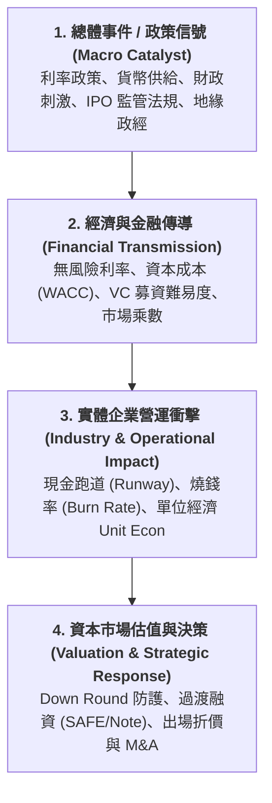

---
{"dg-publish":true,"permalink":"/04/10/01//","dg-note-properties":{}}
---

# 🌐 資本市場與創投總經時事庫

> **記錄目的**：建立跨越「總體經濟 $\rightarrow$ 金融市場 $\rightarrow$ 產業營運 $\rightarrow$ 企業估值決策」的縱深視野。  
> **核心工具**：**總經傳導四層因果鏈 (Macro Transmission 4-Layer Causal Chain)**  
> **使用指南**：每逢重大總經事件、貨幣政策轉向或資本市場法規異動時，以此模板拆解其對一級市場創投（VC）及實體新創企業之傳導路徑與防禦戰略。

---

## 📐 分析方法論：總經傳導四層因果鏈架構

---

## 🗂️ 時事案例記錄底稿（標準模板區塊）

> *使用說明：複製以下空白模板，置於案例庫最上方進行新增。*

### 📝 [時事案例標題]：[事件核心主題簡述]
- **事件日期**：YYYY-MM-DD
- **涉及市場 / 賽道**：[例如：美國一級市場 / 生成式 AI 新創 / 台灣半導體供應鏈]
- **課堂對接週次**：[[W00_週次主題名稱]]
- **對接商業概念**：[[概念A]]、[[概念B]]

#### 1. 總體事件 / 政策信號 (Macro Catalyst)
- **政策或數據核心事實**：
- **政策背景與預期落差**：

#### 2. 經濟與金融傳導 (Financial Transmission)
- **基準利率與殖利率曲線反應**：
- **股權風險溢酬 (ERP) 與資本成本 (WACC)**：
- **一級市場 VC/PE 基金流動性 (Dry Powder / LP 信心)**：
- **公開市場同業估值乘數變化 (P/S, EV/ARR, P/E)**：

#### 3. 實體企業營運衝擊 (Industry & Operational Impact)
- **新創企業現金跑道 (Runway) 壓力變化**：
- **營運策略轉變 (Growth at all costs vs. Default Alive)**：
- **客戶採購預算與銷售週期 (Sales Cycle)**：

#### 4. 資本市場估值與決策 (Valuation & Strategic Response)
- **估值重錨 (Valuation Reset) 與融資定價壓力**：
- **特殊融資條款介入 (Liquidation Preference, Pay-to-Play, Down Round 條款)**：
- **非股權替代融資方案 (Venture Debt, SAFE, 可轉換公司債 Note)**：
- **高階經理人財務戰略應對方針**：

---

## 📚 經典示範個案存檔

### 📝 2026-09-29 ｜ 股債雙跌與強勢美元、美債殖利率破5.2%、外銷訂單首度破千億與記憶體前瞻本益比下修 (W04) ^2026-09-29

#### 1. 總體事件 / 政策信號 (Macro Catalyst)
- **全球金融資產劇震：股債雙跌與強勢美元**：
  - 美國十年期國債殖利率飆破 **5.20%**，長短天期利差持續擴大，引發美國股市與債券市場罕見同步重挫。
  - **避險資產大分化**：國際黃金價格單日重挫近 4%，自 4,400 美元快速跌破 4,200 美元關卡；反觀美元指數（DXY）突破 **101.5**，比特幣同步走強。實質利率上升直接推升全球流動性湧向美元短期國庫券（T-Bills）避險。
- **台灣外銷訂單締造歷史紀錄（單月破千億美元）**：
  - 經濟部公布 8 月份外銷訂單達 **1,029 億美元（年增高達 70%）**，歷史首度突破單月千億美元大關，推動台灣全年 GDP 總量邁向 1 兆美元里程碑。
  - **景氣燈號連九紅（41 分）**：台灣景氣對策信號逼近過熱門檻（38~45 分），市場預期央行在連十凍後，面臨通膨黏著與房市過熱下的潛在升息壓力。

#### 2. 經濟與金融傳導 (Financial Transmission)
- **記憶體產業之「良性估值結構」（股價漲、前瞻本益比反向下修）**：
  - SK 海力士（SK Hynix）與美光（Micron）股價屢創新高，但前瞻本益比（Forward P/E）卻反向大幅下修（海力士前瞻 P/E 僅 **5.38 倍**、美光僅 **6.68 倍**，本益成長比 PEG 僅 **0.05**）。
  - **傳導機制**：AI 伺服器對 HBM（高頻寬記憶體）需求爆發，帶動每股盈餘（EPS）呈現翻倍成長（年增 113%~160%），分母成長速度遠超越分子股價漲幅，反映具備實質基本面與定價權之「真實繁榮」。
- **科技巨頭自由現金流折現警訊（Price to FCF 高達 45 倍）**：
  - 美股科技巨頭（如 Meta）股價雖高，但股價自由現金流比（P/FCF）高達 **45 倍**（顯示為警戒紅字）。
  - **傳導機制**：四大 CSP 巨頭為爭奪 AI 霸權大舉投入逾兆美元資本支出（CapEx），嚴重擠壓短期自由現金流（FCF），迫使企業採取大規模股票回購（Nvidia 加碼回購 1,500 億美元）以拉抬每股盈餘。

#### 3. 實體企業營運衝擊 (Industry & Operational Impact)
- **資本與訂單極度分化（K 型擴大）**：
  - 資金與訂單高度集中於 AI 算力、先進封裝（CoWoS/FOPLP）與 HBM 供應鏈；傳統傳產、消費電子與無 AI 題材之新創企業面臨資金嚴苛排擠，民間消費意願出現放緩跡象。
- **全球化演進三部曲對實體供應鏈之約束**：
  - **1980~1990 全球化分工**：追求極致低成本，中國崛起與全球物價下行。
  - **2000~2011 慢速全球化與快時尚**：Zara、H&M 引領快速消費主義，但引發過度消耗與金融海嘯反思。
  - **2011 至今 ESG 與減法消費**：歐盟推行 WEEE、RoHS 零鉛毒標準與碳關稅，企業必須建立循環經濟與綠色供應鏈，提升法規遵循成本。

#### 4. 資本市場估值與決策 (Valuation & Strategic Response)
- **新創融資之「造血防守線」**：
  - 在長天期利率高懸（Higher for longer）環境下，折現率分母居高不下，純靠「本夢比」敘事之新創難以獲得高估值。
  - 創業者必須以 **BMC 九大模組健全單位經濟學（$\text{CLV} \ge 3 \times \text{CAC}$）**，並嚴格維持 18 個月以上正向現金跑道（Default Alive），方能在資本逆風中存活。

### 📝 2026-09-22 ｜ 台灣央行連10凍實質負利率、HLW自然利率模型、日圓套利平倉再起與半導體先進封裝外溢 (W03) ^2026-09-22

#### 1. 總體事件 / 政策信號 (Macro Catalyst)
- **台灣央行政策利率「連十凍」與實質負利率**：
  - 台灣央行理監事會決議維持重貼現率在 2.00% 不變，達成連續十季利率凍結；但 8 月 CPI 年增率達 2.04%，名目利率扣除通膨後的「實質利率」為 **-0.04%（實質負利率）**。
  - 與此同時，央行祭出第七波房市選擇性信用管制（升存準率 1 碼、擴大全國第二戶房貸成數上限至 5 成且無寬限期），形成「表面利率不變、實質信貸緊縮」的雙軌格局。
- **中性利率與自然利率模型 (HLW Model)**：
  - 課堂白板剖析：聯準會動態隨機一般均衡模型中，中性利率等於「自然利率 ($r^*$) ＋ 預期通膨率 ($\pi$)」。聯準會依據 Laubach-Williams (HLW) 模型評估，若政策利率大於中性利率，為限制性（緊縮）；反之為擴張性。目前台灣名目利率低於中性利率水準，本質仍屬實質寬鬆。
- **日本央行升息與日圓不升反貶 (Carry Trade 異動)**：
  - 日本央行 (BOJ) 雖象徵性升息 1 碼至 0.25%，但日圓並未如市場預期升向 150，反而大幅走貶逼近 **157**。由於美日實質利差依然寬廣，原先市場擔憂的「日圓套利平倉海嘯（Carry Trade Unwind）」並未全面爆發，平倉資金轉向湧入日股與台美科技股。
- **能源商品警訊：柴油裂解價差 (Crack Spread) 暴衝**：
  - 西德州原油 (WTI) 與柴油之裂解價差，自常態的 15~50 美元區間大幅向上飆升。柴油為工業製造、卡車貨運與航運核心動力，裂解價差暴衝往往領先預告通膨黏著性（Sticky Inflation），對下半年降息預期構成隱形天花板。

#### 2. 經濟與金融傳導 (Financial Transmission)
- **傳導路徑一：中性利率錨定與實質負利率擴張**：
  - 實質利率為負意味著「持有現金購買力實質縮水」，逼迫資本持續尋求高回報資產，形成台股與科技資本市場熱錢洶湧；但銀行端受限於《銀行法》第 72-2 條放款天花板，實體中小企業借貸門檻實質提高。
- **傳導路徑二：日圓走貶與全球流動性續命**：
  - 日圓貶至 157 使得借入零成本日圓、投資高收益科技資產的槓桿資金尚未斷鏈，帶動費城半導體指數大漲 4.3%，美股那斯達克強彈，全球風險資產暫獲流動性喘息。
- **傳導路徑三：原油裂解價差擠壓產業供應鏈毛利**：
  - 裂解價差推升物流運輸附加費與石化衍生材料成本，直接侵蝕製造業營業毛利，延緩通膨降溫進程，限制各國央行激進降息空間。

#### 3. 實體企業營運衝擊 (Industry & Operational Impact)
- **半導體先進封裝外溢與面板雙虎跨界轉型 (AUO & Innolux)**：
  - 台積電 CoWoS 先進封裝產能極度供不應求，訂單滿溢外溢至晶圓與面板供應鏈。
  - 友達 (AUO) 與群創利用既有成熟玻璃基板產線，大舉跨入**面板級扇出型封裝 (FOPLP)** 與**玻璃基板穿孔 (TGV, Through-Glass Via)** 技術，老牌面板廠瞬間成為 AI 伺服器先進封裝核心受惠者，激勵友達連拉兩根漲停。
- **實體製造業融資與現金流壓力分化**：
  - 大企業（如聯發科、廣達）具備充沛自體營運現金流，無懼升息；而重資產、依賴銀行短期週轉金的中小企業，則面臨銀行放款額度緊縮與貸款利率上浮之雙重夾擊。

#### 4. 資本市場估值與決策 (Valuation & Strategic Response)
- **科技股評價乘數重新定價 (Re-rating)**：
  - 題材股與實質技術壁壘股走勢分化。具備實質 CoWoS / TGV / 矽光子技術供應能力之企業享有高估值溢價；缺乏實質訂單支撐之純題材股則面臨劇烈均值回歸。
- **高階經理人與新創融資策略指引**：
  - **嚴控融資槓桿**：在央行信貸緊縮與流動性不對稱環境下，創業者應強化自身造血能力（Default Alive），確保營業現金流滿足 18 個月以上安全跑道，降低對外部銀行債務借貸的依賴。

### 📝 2026-09-15 ｜ 美國通膨黏著性（CPI vs PCE 拆解）、四大 CSP 資本支出與題材股估值重整 (W02) ^2026-09-15
- **事件日期**：2026-09-15 (課堂開場時事)
- **涉及市場 / 賽道**：全球總體通膨、美國貨幣政策、AI 算力基礎設施、光通訊/細光子 (CPO) 族群
- **課堂對接週次**：[[04_主題選修/10_創業與企業財務策略/_歷史版本封存/M1-2_白板決策鏈與財務價值三角|W02 M1-2]] ｜ [[04_主題選修/10_創業與企業財務策略/_歷史版本封存/M1-6_創業觀念模式與商業計畫書審查|W02 M1-6]]
- **對接商業概念**：[[WACC加權平均資本成本]] ｜ [[資本支出CapEx]] ｜ [[估值乘數重錨]]

#### 1. 總體事件 / 政策信號 (Macro Catalyst)
- **通膨指標雙軌拆解與黏著性**：
  - 美國勞工統計局與商務部最新數據：CPI 年增率達 3.4%，PCE 達 3.7%，核心 PCE 達 3.4%，通膨持續位於 2% 目標之上，展現頑固黏著性（Sticky Inflation）。
  - **聯準會（Fed）指標錨定密碼**：聯準會決策以 **PCE** 為核心依歸而非 CPI。
    - **CPI 結構**：居住租金佔比高達 **44%**，具備 12~18 個月顯著統計時滯；
    - **PCE 結構**：租金佔比大幅降低，提高醫療保健、強制性服務與日用開銷佔比，更真實反映消費者黏著性支出。
- **上游輸入型通膨升溫**：生產者物價指數（PPI）與國際原油價格同步上揚，終端製造成本壓力持續向下游傳導。
- **硬體新機與技術週期**：蘋果發表 iPhone 16 / 18 系列（台積電 2 奈米前瞻技術導入），但折疊機全球滲透率僅 5%~6%，消費電子換機潮力道仍待檢驗。

#### 2. 經濟與金融傳導 (Financial Transmission)
- **無風險利率長期錨定高位**：通膨黏著性破滅降息幻想，長天期美債殖利率維持 4.8%~5.2%，折現模型分母 $r$ 居高不下。
- **題材股估值乘數急劇均值回歸 (Valuation Mean Reversion)**：
  - 過去數月市場瘋炒「細光子（CPO, Co-Packaged Optics）」題材，股價脫離基本面暴漲；
  - 外資法人調降光學鏡頭龍頭**大立光（3008）**投資評等，點出大立光手機業務佔比仍高達 **80%**，細光子題材短期內無法貢獻實質營收；引發光聖、上詮、波若威等概念股集體跌停回檔，市場由「本夢比」打回「本益比」。
- **資本支出訂單傳導鏈**：美國身為淨進口國，四大 CSP（Microsoft、Google、AWS、Meta）之巨額 AI CapEx（合計逾兆美元）實質轉化為台灣半導體與伺服器代工廠的「剩餘履約義務（RPO）」與預訂單。

#### 3. 實體企業營運衝擊 (Industry & Operational Impact)
- **概念炒作退潮，回歸訂單可見度 (Order Visibility)**：實體新創與供應鏈企業面臨資本市場「不看故事、看真實交付」的冷酷檢驗。
- **營運資本與借貸成本壓力**：重資產製造業短期借貸利息高昂，若庫存去化不及，將直接侵蝕營業利益。

#### 4. 資本市場估值與決策 (Valuation & Strategic Response)
- **創投投資策略收緊**：VC 對待融資新創的商業計畫書（BP），嚴格審查其單位經濟學（Unit Economics）與客觀 SOM 測算，要求在 B 輪前必須展現清晰獲利路徑。
- **資本返還與股東價值防禦**：
  - 美股科技大廠：大舉執行**庫藏股回購（Share Repurchase）**，降低分母在外流通股數，推升每股盈餘（EPS）；
  - 台灣企業：以**高配息現金股利**維持實質殖利率，吸引防禦型資金進駐。

---

### 📝 2026-09-08 ｜ 全球升息尾聲震盪、日圓套利平倉與一級市場資本逆風 (W01) ^2026-09-08
- **事件日期**：2026-09-08 (課堂開場時事)
- **涉及市場 / 賽道**：全球一級創投市場 / 美日貨幣政策背離 / AI 與半導體新創
- **課堂對接週次**：[[M1-1_創業本質與創業家精神|W01 M1-1]] ｜ [[04_主題選修/10_創業與企業財務策略/_歷史版本封存/M1-2_白板決策鏈與財務價值三角|W01 M1-2]]
- **對接商業概念**：[[WACC加權平均資本成本]] ｜ [[肥尾理論]] ｜ [[永續成長率]]

#### 1. 總體事件 / 政策信號 (Macro Catalyst)
- **美國就業數據擾動**：美國勞工統計局 (BLS) 發布大非農新增就業人口高達 16 萬人遠超市場預期，形成「經濟好消息即股市壞消息」，推升市場對聯準會利率高懸與升息機率（升息一碼機率逼近六成）之擔憂。
- **能源成本推升通膨**：西德州原油 (WTI) 與布蘭特原油 (Brent) 價差擴大至 4~4.5 美元（過去常態為 2~3 美元），反映地緣政治談判受阻與物流摩擦，對 CPI 三大核心（租金、工資、原物料）形成持續上行壓力。
- **日美利差收斂與套利平倉**：日本央行啟動升息，日圓大幅升值；過去借便宜日圓投資高息美元資產的利差交易 (Carry Trade) 面臨強大平倉賣壓。
- **中國市場政策脫鉤**：全球多數經濟體處於升息抗通膨循環，唯獨中國面臨房市通縮，人行撒資 3,000 億人民幣救市與降息降準。

#### 2. 經濟與金融傳導 (Financial Transmission)
- **長天期無風險利率居高不下**：美國 30 年期國債殖利率突破 5.0%~5.2%，日本 10 年期公債突破 1%~3%。資產折現公式中分母折現率 $r$ 高懸。
- **資金機會成本巨幅攀升**：無風險資產可提供年化約 5% 確定收益，巨幅抽離一級市場流動性（「躺平買公債就有 5%，為何冒險投資新創？」）。
- **一級市場募資與 IPO 寒冬**：自 2021 年募資高點後，2022~2023 全球與台灣申請公開上市 (IPO) 案量急遽萎縮。

#### 3. 實體企業營運衝擊 (Industry & Operational Impact)
- **資本分化加劇（K 型經濟）**：全美 60% 新創資金高度向 AI 與先進半導體賽道集中；非 AI 領域之傳統製造、消費型新創面臨嚴苛資金排擠。
- **借貸利息成本攀升**：重資產與勞力密集型企業負債融資成本激增，營運資金 (Working Capital) 壓力沉重。
- **傳產二代接班痛點浮現**：傳統中小企業一代講求實體造血，二代急欲導入 AI 與數位轉型，面臨高利率與少子化雙重考驗。

#### 4. 資本市場估值與決策 (Valuation & Strategic Response)
- **創投 (VC) 改變注資節奏**：由過去一次性大額給付，轉向嚴格依據里程碑分批分期到位（例如承諾 5,000 萬台幣，首期僅撥付 3,000 萬）。
- **創業家財務戰略應對**：
  1. 徹底放棄低利率寬鬆幻想，回歸「Default Alive」體質。
  2. 依據永續成長率公式 $g = b \times ROE = (1 - d) \times ROE$，全面壓制不必要之資本開銷，以營運獲利與內部保留盈餘支撐成長，降低對外部高成本股權稀釋之依賴。

---

### 📝 示範案例 01：聯準會激進升息週期引發之一級市場估值重錨與資本寒冬
- **事件日期**：2022-2023 全球週期性傳導
- **涉及市場 / 賽道**：全球一級創投市場 / 高估值 SaaS 獨角獸
- **課堂對接週次**：[[W01_創業概論]]、[[W08_創業投資]]、[[W09_企業財務策略概論]]
- **對接商業概念**：[[WACC加權平均資本成本]]、[[肥尾理論]]、[[DCF現金流折現模型]]

#### 1. 總體事件 / 政策信號 (Macro Catalyst)
- 美國聯準會（Fed）為對抗高通膨，於 2022～2023 年間將聯邦基金基準利率由 0%~0.25% 迅速推升至 5.25%~5.50%。
- 量化緊縮（QT）全面啟動，全球央行流動性快速收水。

#### 2. 經濟與金融傳導 (Financial Transmission)
- **折現率急遽攀升**：無風險利率（10 年期美債殖利率）突破 4.5%~5.0%，使 DCF 折現模型中的分母折現率 $r$ 大幅跳升。
- **公開市場乘數雪崩**：未獲利高成長科技股與 SaaS 企業之 EV/ARR 乘數由高峰期之 30x~50x 均值回歸至 6x~10x。
- **一級市場傳導滯後**：LP 資金轉向固定收益市場，VC 募資困難；VC 對既有投資組合啟動嚴格「分類挽救」，放緩投資節奏（Deployment Pace）。

#### 3. 實體企業營運衝擊 (Industry & Operational Impact)
- **Runway 告急**：過去依賴「以虧損換規模」的高現金消耗率（High Burn Rate）新創面臨斷流風險。
- **戰略範式轉移**：企業由「Growth at all costs」被迫切換至「Default Alive」（默認存活用自有現金流運營）。啟動裁員、優化 CAC、聚焦核心產品。

#### 4. 資本市場估值與決策 (Valuation & Strategic Response)
- **Down Round 防護**：創辦人極力避免公開「跌價融資」（Down Round），轉向採用 **過渡性可轉債 (Convertible Note)** 或 **SAFE** 並附帶較低估值上限（Cap）。
- **嚴苛條款湧現**：投資人要求 2x~3x 非參與型/參與型清算優先權（Liquidation Preference）、強制分紅條款與反稀釋保證。
- **戰略應對**：高階經理人必須重新計算永續成長率，透過提高營運獲利與緊縮 CapEx 保留內部現金，推遲外部股權稀釋時機。

---

### 📝 示範案例 02：台灣證交所推動「臺灣創新板 (TIB)」對新創早期流動性之結構變革
- **事件日期**：2023-2024
- **涉及市場 / 賽道**：台灣資本市場 / 軟體、生技、綠能高潛力新創
- **課堂對接週次**：[[W02_創業構想與商業計畫]]、[[W08_創業投資]]、[[W15_業師專題_台灣創投產業趨勢]]
- **對接商業概念**：[[企業生命週期]]、[[創投出場機制Exit]]

#### 1. 總體事件 / 政策信號 (Macro Catalyst)
- 金管會與台灣證交所放寬「臺灣創新板 (Taiwan Innovation Board, TIB)」上市審查條件，以「市值」取代傳統「獲利門檻」，並逐步鬆綁合格投資人限制。

#### 2. 經濟與金融傳導 (Financial Transmission)
- **打通一二級市場折價瓶頸**：縮短早期投資人（Angel / VC）的平均出場週期（由過去 7~10 年縮短至 4~6 年）。
- **資本循環加速**：早期資金回收再投入本地生態系，提高 LP 對台灣早期新創創投基金的出資意願。

#### 3. 實體企業營運衝擊 (Industry & Operational Impact)
- 具備技術壁壘但仍處於擴張虧損期之新創（如泓德能源、雲豹能源、走著瞧 Gogolook 等），獲得公開市場流動性支持，避免因傳統獲利審查標準而被迫遠赴海外掛牌。

#### 4. 資本市場估值與決策 (Valuation & Strategic Response)
- **估值定價重整**：新創在 Pre-IPO 輪次融資時，具備更明確的本益比/本銷比參照基準。
- **治理結構提前合規**：新創公司必須在更早階段（Series B/C 階段）健全內控制度、董事會與 ESG 架構，平衡擴張速度與合規成本。