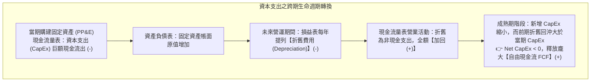

---
{"dg-publish":true,"permalink":"/04/10/02/module-1/m1-2/","tags":["白板決策鏈","PEST","VRIO","SWOT","永續成長率","企業價值","資本支出","折舊回沖","企業生命週期","股利政策","庫藏股"],"dg-note-properties":{"類別":"課程筆記","課程名稱":"創業與企業財務策略_心智圖導航","模組編號":"Module 1","模組名稱":"創新思維與商業模式","章節編號":"M1-2","主題":"白板決策鏈與財務價值三角 (Decision Chain & Corporate Value Triangle)","對應週次":"Week 1 & Week 2 跨堂深化 (2026-09-08 & 2026-09-15)","狀態":"🟢 已完成","tags":["白板決策鏈","PEST","VRIO","SWOT","永續成長率","企業價值","資本支出","折舊回沖","企業生命週期","股利政策","庫藏股"]}}
---


# 📐 M1-2 白板決策鏈與財務價值三角：從總體戰略、折舊回沖到生命週期融資矩陣

> **導讀與對接**：  
> 本筆記為《創業與企業財務策略》最核心之跨堂白板推導精華（整合 W01 與 W02 白板實錄）。貫穿「外部環境分析 ➔ 內部資源檢驗 ➔ 策略交叉矩陣 ➔ 商業決策四階躍遷」，並深入推導**永續成長率公式 ($g=b\times ROE$)**、**資本支出與折舊回沖現金流機制**、**企業生命週期（CLC）五階段投融資矩陣**，以及**資本取得 (ROA) ➔ 運用 (ROIC) ➔ 返還 (ROE) 之股利與庫藏股戰略**。  
> - 上級地圖：[[04_主題選修/10_創業與企業財務策略/00_課程導航與進度/mindmap_創業與企業財務策略_心智圖導航\|全課程心智圖導航]]  
> - 進度看板：[[04_主題選修/12_產業分析與投資策略/00_課程導航與進度/progress_📊 課程與筆記進度追蹤\|progress_📊 課程與筆記進度追蹤]]  
> - 核心概念庫：[[98_商業概念庫/PEST分析\|PEST分析]] ｜ [[98_商業概念庫/VRIO架構\|VRIO架構]] ｜ [[98_商業概念庫/SWOT分析\|SWOT分析]] ｜ [[98_商業概念庫/sustainable-growth-rate_永續成長率\|yong-xu-cheng-zhang-rate_永續成長率]] ｜ [[98_商業概念庫/corporate-life-cycle_企業生命週期\|enterprise-sheng-ming-cycle_企業生命週期]] ｜ [[98_商業概念庫/dcf_現金流量折現法\|DCF 現金流量折現法]] ｜ [[98_商業概念庫/sva_股東價值增加\|SVA 股東價值增加]]

---

## 🏛️ 一、 核心理論本質：白板戰略決策全景鏈

教授於課堂白板推導出創業家與高階經理人從宏觀環境審視到微觀落地的完整思維鏈條：

```
[總體超環境] PESTEL 分析 (政治地緣、利率通膨、社會人口、科技變革)
       │
       ▼
[產業環境]   Porter 五力分析 (既有競爭、進入障礙、替代威脅、買賣方議價力)
       │
       ▼
[企業內部]   價值鏈活動 (Value Chain) ──▶ VRIO 核心能耐檢驗 (V-R-I-O)
       │
       ▼
[策略交叉]   SWOT 四象限決策矩陣 (Maxi-Maxi / Maxi-Mini / Mini-Maxi / Mini-Mini)
       │
       ▼
[商業模式]   商業模式畫布 (BMC) ＋ 兩全思維 (Trade-On Thinking)
       │
       ▼
[價值實現]   營業活動 (ROE) ＋ 融資結構 (Debt/Equity) ＋ 投資成長率 (g = b × ROE) ──▶ 企業價值 EV
```

### 商業決策四階段躍遷 (The 4-Stage Leap)
企業決策本質上經歷四個層級的質變：
1. **好點子 (Good Idea)**：突破傳統的創意發想，但尚未經過市場檢驗。
2. **好事業 (Good Business)**：透過商業模式畫布（BMC），確立價值主張、通路與成本收益對稱性，具備市場生存力。
3. **好公司 (Good Company)**：具備健全內部控制、團隊分工、文化凝聚力與公司治理結構。
4. **好投資 (Good Investment)**：能為股東與資本市場創造實質資本利得與超額回報（ROIC > WACC），實現流動性溢價。

---

## 🛠️ 二、 分析工具與白板推導三大專題

### 1. 內外部環境評估與交叉工具
* **PEST 分析**：政治政策（P）、總體經濟利率（E）、社會人口高齡少子化（S）、前沿科技 AI（T）。
* **VRIO 矩陣**：價值性（Value）、稀缺性（Rarity）、難模仿性（Inimitability）、組織配套（Organization）。
* **SWOT 四向策略**：S-O 積極擴張、S-T 差異化防禦、W-O 策略轉型聯盟、W-T 停損退守。

---

### 2. 課堂白板推導專題一：資本支出與折舊回沖現金流機制
在 W02 課堂中，學生提問：「資本支出（CapEx）明明是現金流出，為什麼在現金流量表分析中，有時會看到資本支出反而帶動現金回流？」



* **數理拆解**：
  $$\text{自由現金流 (FCF)} = \text{營業現金流 (CFO)} - \text{資本支出 (CapEx)}$$
  $$\text{其中 } \text{CFO} = \text{稅後淨利 (NI)} + \text{折舊與攤銷 (D&A)} - \Delta\text{營運資金 (NWC)}$$
* **管理意涵與實證對標**：
  * **台積電 (TSMC)**：每年投入 300~400 億美元 CapEx 擴建先進製程晶圓廠，當期現金大量流出；但若未來進入成熟期（如假設 2029 年後放緩建廠），龐大前期固定資產的「折舊回沖」將以每年數千億台幣的規模加回營業現金流，成為支撐巨額股利發放之現金機器。
  * **可口可樂 (Coca-Cola)**：典型的成熟期企業，全球工廠與裝瓶體系已建置完備，新增 CapEx 佔營收極低，每年僅需微幅維護性支出，而前期折舊源源不絕回沖，自由現金流充沛。

---

### 3. 課堂白板推導專題二：企業生命週期 (CLC) 五階段投融資矩陣
教授於課堂白板詳細繪製了企業從 0 到 N 在不同生命週期階段的「投資活動」與「融資工具」演進矩陣：

| 維度構面 | 1. 新創期<br>*(Startup)* | 2. 高速成長期<br>*(High Growth)* | 3. 穩定成長期<br>*(Stable Growth)* | 4. 成熟期<br>*(Maturity)* | 5. 衰退期<br>*(Decline)* |
| :--- | :--- | :--- | :--- | :--- | :--- |
| **核心投資活動**<br>*(Investment)* | • 概念驗證 (POC)<br>• 技術可行性試錯 | • 商業模式 (BMC)<br>• 尋找可重複模式 | • 產品研發 (PDC)<br>• 擴建產能設備 | • 市場擴張 (CapEx)<br>• 營運資金最佳化 | • 業務撤資或<br>• 轉向第二成長曲線 |
| **融資工具配置**<br>*(Financing)* | • 創辦人自籌<br>• 3F 資金<br>• (天使輪 / Seed) | • 創投 VC 股權<br>• ＋ 認股選擇權<br>• (Series A/B) | • 私募股權 PE<br>• 銀行優先債權<br>• (Series C / Pre-IPO) | • 銀行長期借貸<br>• IPO 資本市場<br>• 公司債 / CB / ECB | • 停止外部融資<br>• 現金全面返還股東<br>• (清算或私有化) |
| **自由現金流**<br>*(Cash Flow)* | **FCF < 0**<br>(嚴重燒錢階段) | **FCF < 0**<br>(淨現金消耗高峰) | **轉虧為盈**<br>(營運現金流轉正) | **FCF 龐大且穩定**<br>(達到全盛現金牛) | **自由現金流縮減**<br>(逐漸枯竭) |

* **發行者 vs. 投資人視角的「風險與報酬非對稱性」**：
  * **從發行者（公司 CEO）角度**：
    * **債權融資風險極高**：具備法定還本付息義務，一旦營收中斷無法償債，將直接觸發破產清算；
    * **股權融資風險較低**：無固定利息支出，若創業失敗無需退還資本。
  * **從投資人角度**：
    * **債權優先受償**：享有破產第一順位清償權，風險最低，僅要求固定利差；
    * **股權剩餘索償權**：承擔新創可能歸零之肥尾風險（Fat Tail），因此要求 10x~100x 的非對稱股權回報。
  * **可轉換公司債 (Convertible Bond, CB) 的混血精髓**：
    * 票面利率通常為 0%（發行公司無需承擔利息負擔借得資金）；
    * 投資人則著眼於未來股票上市後的股價轉換溢價，達成兩全。

---

### 4. 課堂白板推導專題三：資本三階進化與返還政策（股利 vs. 庫藏股）
企業在生命週期中的財務指標與決策重心呈現三階躍遷：
```
[階段一：資本取得] ──────────▶ [階段二：資本運用] ──────────▶ [階段三：資本返還]
 關注資產配置與啟動規模        關注營運效率與產能放大        關注股東報酬與盈餘處分
 核心指標：資產報酬率 ROA      核心指標：投入資本回報率 ROIC  核心指標：股東權益報酬率 ROE
 (新創探索期)                 (成長擴張期)                 (成熟與衰退期)
```

#### 資本返還策略的台美市場對照與代理人問題
當企業邁入成熟期（或衰退期），資本支出需求放緩，每年產生的龐大現金必須返還股東，否則將引發經營階層亂投資的**代理人成本（Agency Cost）**。台美資本市場在返還路徑上展現顯著偏好差異：
* **台灣市場偏好：現金股利（Cash Dividends）**  
  * 投資人偏好立即可見的現金入帳（如高股息 ETF 00878、0056 熱銷），除息當日即獲配現金，感受強烈；
  * 但現金股利在個人綜合所得稅上可能面臨稅負扣繳，且除息後股價自動扣減。
* **美國市場偏好：庫藏股回購計劃（Share Repurchase / Buyback）**  
  * 科技巨頭（Apple、Google、Meta）每年動輒宣布數百億至千億美元庫藏股回購；
  * **三大財務優勢**：
    1. **減少在外流通股數**：在淨利不變下直接拉升每股盈餘（EPS）；
    2. **拉高本益比乘數與股價**：資本市場給予更高評價，股東享受資本利得低稅率優勢；
    3. **保留彈性**：庫藏股計劃可分批執行，不受每年固定配息之強制約束。

---

### 5. 平衡計分卡四基石與財務價值三角跨構面對齊 (Class 3 跨堂整合)

第三週講述的平衡計分卡（BSC）四大基石（效率、品質、創新、顧客回應），在財務決策維度上，與白板推導的「企業財務價值三角」形成一對一的精密傳導機制：

| BSC 競爭優勢基石 | 核心運營作為與管理焦點 | 對應財務價值三角維度 | 實質財務指標與比率驅動 | 終極企業價值 (EV) 影響路徑 |
| :--- | :--- | :--- | :--- | :--- |
| **優異效率<br>(Efficiency)** | 流程自動化、精實生產、消弭浪費、提高人員與機台稼動率。 | **營業活動：獲利能力**<br>(Profitability) | • 降低銷貨成本率 (COGS %)<br>• 推升營業利益率 (Operating Margin)<br>• 提高 EBITDA Margin | 擴大每 1 元營收轉化為現金利益的厚度，直接拉高 NOPAT。 |
| **卓越品質<br>(Quality)** | 零缺陷管理、高可靠度規格、降低售後保固與退換貨損失。 | **投資活動：資產效率**<br>(Asset Turnover) | • 降低瑕疵品庫存積壓<br>• 加速存貨週轉天數 (DSI)<br>• 縮短現金轉換週期 (CCC) | 以較少的營運資本投入支撐更龐大的營收，大幅提升投入資本報酬率 (ROIC)。 |
| **顧客回應<br>(Responsiveness)** | 客製化迅速交期、卓越技術支援、高滿意度與品牌忠誠度。 | **融資與資本定價**<br>(Pricing Power & WACC) | • 享有產品定價溢價 (Price Premium)<br>• 降低營運現金流波動性 ($\sigma_{CF}$)<br>• 降低股權風險溢酬 (ERP) 與 WACC | 定價權支撐高毛利率；穩定的現金流降低企業破產風險，壓低資本折現率。 |
| **持續創新<br>(Innovation)** | 研發新一代產品架構、開拓新商業模式、跨界第二成長曲線。 | **永續成長動能**<br>(Growth Rate: $g$) | • 提升永續成長率 $g = b \times ROE$<br>• 延長企業生命週期平坦度 (Flatness)<br>• 突破傳統行業高度天花板 (Ceiling) | 為企業創造非線性成長期權，抵消成熟期衰退，享有遠期估值乘數溢價。 |

## 🔍 三、 實務批判與挑戰

### 1. 永續成長率公式與「成長的陷阱」
$$g = b \times ROE = (1 - d) \times ROE$$
* 許多經理人誤以為「成長率越高越好」，盲目以借債擴充產能，使得實際銷售增長率遠超過永續成長率 $g$。
* 一旦外部信貸收縮或景氣反轉，過高負債比將引發致命的流動性危機（如中國恒大等高槓桿房企之崩解）。

---

## 📚 四、 案例深度映射與雙向鏈結

### 1. 課堂實證案例對標
* **台積電 (TSMC)**：低負債比（~30%）以抵禦半導體景氣波動，高額 CapEx 轉化為龐大折舊回沖，再投資於 2 奈米先進製程。
* **聯發科 (MediaTek)**：善用研發投資抵減租稅盾，以知識密集輕資產創造高 ROE。
* **美國四大 CSP 巨頭**：以庫藏股回購抵銷員工股權激勵（ESOP）稀釋，維持高階主管與股東利益一致。

### 2. 跨模組雙向鏈結網絡
- ◀️ 上級架構：[[mindmap_創業與企業財務策略_心智圖導航|全課程心智圖導航]]
- 📊 進度追蹤：[[04_主題選修/12_產業分析與投資策略/00_課程導航與進度/progress_📊 課程與筆記進度追蹤|📊 課程與筆記進度追蹤看板]]
- 🌐 時事收納：[[macro_資本市場與創投總經時事|資本市場與創投總經時事庫]]
- 🏢 個案庫對接：[[cases_新創與企業融資案例庫#🏛️ 深入案例剖析 04：友達光電 (AUO) 與群創 —— 成熟面板廠跨入半導體先進封裝 (FOPLP / TGV) 的動態轉型之路|新創與企業融資案例庫 (台積電)]] [[corporate-life-cycle_企業生命週期|enterprise-sheng-ming-cycle_企業生命週期]] ｜ [[dcf_現金流量折現法|DCF 現金流量折現法]] ｜ [[sva_股東價值增加|SVA 股東價值增加]]
