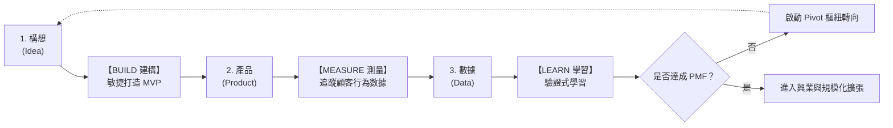

---
{"dg-publish":true,"permalink":"/04/10/02/module-1/m1-3/","tags":["精實創業","創業興業展業","MVP","PMF","Pivot","顧客開發模型","商業模式畫布","藍河科技","奇異Durathon"],"dg-note-properties":{"類別":"課程筆記","課程名稱":"創業與企業財務策略_心智圖導航","模組編號":"Module 1","模組名稱":"創新思維與商業模式","章節編號":"M1-3","主題":"數位新經濟與精實創業方法論 (Digital New Economy & Lean Startup Methodology)","對應週次":"Week 1 & Week 2 跨堂深化 (2026-09-08 & 2026-09-15)","狀態":"🟢 已完成","tags":["精實創業","創業興業展業","MVP","PMF","Pivot","顧客開發模型","商業模式畫布","藍河科技","奇異Durathon"]}}
---


# 💡 M1-3 數位新經濟與精實創業方法論：從顧客驗證、敏捷商業模式到價值演進三部曲

> **導讀與對接**：  
> 本筆記為《創業與企業財務策略》敏捷架構與企業成長精華（整合 W01 與 W02 講義）。全面解構五大新經濟浪潮與前沿科技引擎，對比傳統線性法與精實創業法（Lean Startup）之思維範式轉移，深入剖析 **MVP ➔ PMF ➔ Pivot 三位一體**、顧客開發四階段模型，並系統性推導「**創業 (0➔1) ➔ 興業 (1➔N) ➔ 展業 (N➔大N)**」在組織、策略與財務視角上的全景躍遷。  
> - 上級地圖：[[04_主題選修/10_創業與企業財務策略/_歷史版本封存/創業與企業財務策略_心智圖導航\|全課程心智圖導航]]  
> - 進度看板：[[04_主題選修/12_產業分析與投資策略/00_課程導航與進度/progress_📊 課程與筆記進度追蹤\|progress_📊 課程與筆記進度追蹤]]  
> - 核心概念庫：[[98_商業概念庫/pmba-dg-publish_精實創業\|pmba-dg-publish_精實創業]] ｜ [[98_商業概念庫/MVP最小可行產品\|MVP最小可行產品]] ｜ [[98_商業概念庫/pmba-dg-publish_關鍵轉折\|pmba-dg-publish_關鍵轉折]] ｜ [[98_商業概念庫/business-model_商業模式\|business-model_商業模式]] ｜ [[98_商業概念庫/corporate-life-cycle_企業生命週期\|corporate-life-cycle_企業生命週期]]

---

## 🏛️ 一、 核心理論本質：傳統線性法 vs. 精實假設法

### 1. 創業思維範式轉移 (Paradigm Shift)
哈佛商學院統計指出，高達 **75% 的新創公司最終以失敗告終**。傳統企業管理將成熟企業的運作邏輯直接套用在新創事業上，正是問題的根源：

```
傳統創業法 (線性流程，極易失敗)
[龐大市場調研] ──▶ [耗時撰寫50頁BP] ──▶ [長期封閉研發] ──▶ [大量試產上市] ──▶ (市場不買單 ➔ 破產)

精實創業法 (假設驅動，敏捷迭代)
[商業模式假設] ──▶ [打造最簡可行產品 MVP] ──▶ [推向真實市場] ──▶ [驗證式學習] ──▶ [持續優化或 Pivot]
```

| 比較維度 | 傳統創業模式 (Traditional Method) | 精實創業模式 (Lean Startup Method) |
| :--- | :--- | :--- |
| **商業模式** | 預設模式已知，由「實踐與執行」驅動 | 承認模式未知，由「假設與驗證」驅動 |
| **產品開發** | 線性瀑布式開發，漫長、完美主義且高風險 | 敏捷迭代開發，強調以最低成本推向市場驗證 |
| **顧客反饋** | 上市前極少接觸真實顧客 | 走出辦公室，持續進行「顧客發掘與驗證」 |
| **財務指標** | 會計指標：靜態損益表、資產負債表預測 | 營運指標：CAC、LTV、留存率、淨現金消耗率 |
| **失敗應對** | 解雇高階主管、認列巨額沉沒資產損失 | 快速失敗 (Fail Cheap)，以樞紐轉向 (Pivot) 解決 |

---

### 2. 企業價值演進三部曲：創業 ➔ 興業 ➔ 展業
課堂特別強調，企業在不同發展階段具備完全不同的戰略任務與財務邏輯：
```
[創業 (Entrepreneurship)] ────────▶ [興業 (Business Building)] ────────▶ [展業 (Expansion)]
         0 ➔ 1                                1 ➔ n                               n ➔ N
      找對事 (Survival)                  把事做好 (Efficiency)                做大做久 (Dominance)
```

| 比較維度 | 創業階段 (Startup, 0 ➔ 1) | 興業階段 (Building, 1 ➔ n) | 展業階段 (Expansion, n ➔ N) |
| :--- | :--- | :--- | :--- |
| **核心目標** | **存活下來 (Survival)**：驗證商模 | **穩定獲利 (Profitability)**：制度化 | **做大做強 (Dominance)**：規模與範疇 |
| **組織型態** | 小組敏捷、創辦人直覺決策 | 建立制度、專業經理人、KPI 導向 | 多層級矩陣組織、跨國事業群、併購整併 |
| **商業模式** | 探索未知、假設驗證、MVP 試錯 | 模式確立、標準化作業程序 (SOP) | 模式跨市場複製、生態系延展、M&A |
| **主要風險** | 市場需求不存在、假痛點、產品無人買 | 營運瓶頸、內部控制失效、品質失控 | 資本配置失策、反托拉斯審查、跨文化衝突 |
| **財務視角** | **實質選擇權價值 (Real Options)**<br>• FCF < 0（淨現金流為負）<br>• 關鍵指標：Burn Rate & Runway | **經濟附加價值 (EVA)**<br>• 現金流轉正 (Cash Flow > 0)<br>• 關鍵公式：$\text{ROIC} > \text{WACC}$ | **資本配置極大化 (Capital Allocation)**<br>• 併購門檻：$\text{Post-ROIC} > \text{WACC}$<br>• 價值源泉：長期的永續成長率 $g$ |

---

## 🛠️ 二、 分析工具與關鍵維度

### 1. 精實創業三大核心原則 (The Lean Principles)
1. **以假設為基礎的商業模式圖 (BMC)**：放棄冗長的五年間預測，將九大商業假設濃縮在一張畫布上同步檢視。
2. **走出象牙塔的顧客開發 (Customer Development)**：Steve Blank 四階段模型（顧客發掘 ➔ 顧客驗證 ➔ 顧客創造 ➔ 公司建立）。
3. **快速回應的敏捷開發 (Agile Development)**：Build-Measure-Learn 閉環，以最短時間產出 MVP 搜集用戶反饋。



---

### 2. 催生新創業經濟的四大變革力量
1. **降低軟體開發成本**：開放原始碼工具（GitHub）與雲端計算基礎設施（AWS、Google Cloud）將伺服器建置成本降低 90% 以上。
2. **籌資管道多元分散**：除了傳統創投，超級天使（Super Angels）、育成加速器（Y Combinator）與群眾募資（Kickstarter）填補早期種子資金缺口。
3. **全球彈性代工製造**：硬體新創無須自建昂貴廠房，可輕易對接台灣與全球 OEM/EMS 代工體系。
4. **即時市場資訊取得**：數據分析工具讓新創能在數天內獲得 A/B 測試反饋。

---

### 3. 低成本精實驗證路徑與標準制定戰略 (Class 4 課堂深化)

在第四週課堂中，同學實務分享（寶奇個案）進一步豐富了精實創業「以最低成本驗證商業模式」的工具箱：

#### (1) 政府創業資源與免費賦能生態
* **經濟部中小及新創企業署**：提供涵蓋諮詢、輔導、融資貸款與新創對接的整合平台，協助新創企業打通政企合作管道。
* **微型創業鳳凰輔導體系**：
  * **零門檻初階班**：協助無經驗創業者梳理創業主題、盤點個人專長與市場可行性。
  * **實戰進階班**：提供實務技能培育（商品專業攝影、電商架站、數位行銷）與免費法規諮詢（工時、勞健保計算，防止初創團隊踩雷受罰）。

#### (2) 競賽驗證法（The Competition Validation Model）
* **以比賽評委篩選替代真金白銀試錯**：
  * 早期創業者往往缺乏高階顧問指導。透過「獎金獵人」等創業競賽平台，將商業計畫書報名參賽。
  * **決策原則**：
    * **入選獲獎** ➔ 說明計畫通過專業產官學評委的初步商業審查，具備可行性，果斷啟動執行。
    * **初審落選** ➔ 零成本發現缺陷，立即修正或放棄，避免投入數十萬積蓄後才發現市場不買單。

#### (3) 由 B 端建立標準切入 C 端的「利潤咽喉掌握策略」
* **產業標準決定利潤分配**：
  * 創業者切忌直接在 C 端大眾市場燒錢打廣告。高明戰略是先攻下產業垂直體系的「B 端意見領袖（KOL / 專業技師）」。
  * **實踐步驟**：
    1. **贊助專業賽事**：資助頂尖選手與專業師資，以專利產品換取賽事曝光與專業背書。
    2. **教育市場痛點**：揭發同業劣質原料（如劣質清潔劑）之安全危害，喚醒終端消費者意識。
    3. **建立認證與指名消費**：推動行業使用規範，使終端 C 端顧客到實體店面「主動指名使用」，由下而上反向掌控 B 端採購通路，牢牢卡位產業利潤咽喉！

## 🔍 三、 實務批判與挑戰

### 1. 商業計畫書的「泰森鐵律」
* 拳王泰森：「直到臉上挨了一拳之前，每個人都有一個完美的計畫。」
* 新創公司不能仰賴靜態預測，而必須擁有承受市場重擊後迅速調整產品假設的韌性。

---

## 📚 四、 案例深度映射與雙向鏈結

### 1. 課堂經典案例對照剖析

#### 案例 A：藍河科技 (Blue River Technology) —— 精實顧客驗證的成功典範
* **最初假設**：為高爾夫球場建造自動化除草割草機。
* **顧客開發**：創辦人走出辦公室，十週內深入訪談超過 100 位高爾夫球場經理，震驚發現高爾夫球場對此功能毫無強烈需求。
* **發現真痛點**：轉向農田訪談農民，發現農夫面臨雜草抗藥性，對「精準噴藥、非化學自動除草機器人」存在極大剛需。
* **敏捷原型與結果**：十週內組裝出極簡農田除草原型機；9 個月後獲得 300 萬美元創投資金，最終獲農業機械巨頭 John Deere 以 **3.05 億美元溢價併購**。

#### 案例 B：奇異 (GE Durathon 電池) —— 脫離市場驗證之反面教材
* **背景與技術**：GE 能源部門研發出技術突破之新型工業儲能電池 Durathon。
* **錯誤模式**：高層未充分驗證真實客戶需求，即斥資一億美元成立世界級自動化電池工廠。
* **精實補救**：新任主管啟動顧客訪談，發現原設定目標客群「大型資料中心」根本不需要此類電池；及時將目標調整為「電力調峰公司」與「開發中國家手機基地台」，才避免工廠全數報廢。證明：**再雄厚的跨國資本，也無法取代真實的市場驗證 (PMF)！**

### 2. 跨模組雙向鏈結網絡
- ◀️ 上級架構：[[04_主題選修/10_創業與企業財務策略/_歷史版本封存/創業與企業財務策略_心智圖導航|全課程心智圖導航]]
- 📊 進度追蹤：[[04_主題選修/12_產業分析與投資策略/00_課程導航與進度/progress_📊 課程與筆記進度追蹤|📊 課程與筆記進度追蹤看板]]
- 🌐 時事收納：[[04_主題選修/10_創業與企業財務策略/_歷史版本封存/資本市場與創投總經時事|資本市場與創投總經時事庫]]
- 🏢 個案庫對接：[[04_主題選修/10_創業與企業財務策略/_歷史版本封存/新創與企業融資案例庫#^藍河科技|新創與企業融資案例庫 (藍河科技)]] ｜ [[04_主題選修/10_創業與企業財務策略/_歷史版本封存/新創與企業融資案例庫#^奇異|新創與企業融資案例庫 (奇異 Durathon)]]
- 📚 概念庫對接：[[pmba-dg-publish_精實創業]] ｜ [[MVP最小可行產品]] ｜ [[pmba-dg-publish_關鍵轉折]] ｜ [[business-model_商業模式]]
