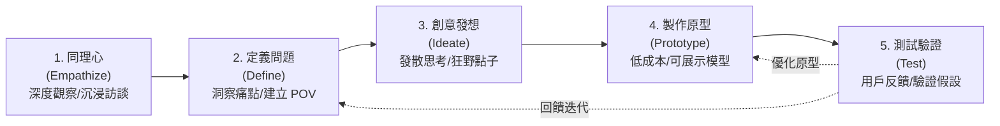

---
{"dg-publish":true,"permalink":"/04/10/02/module-1/m1-4/","tags":["創意思考","創新來源","設計思考","兩全思維","TRIZ","SCAMPER","六頂思考帽"],"dg-note-properties":{"類別":"課程筆記","課程名稱":"創業與企業財務策略_心智圖導航","模組編號":"Module 1","模組名稱":"創新思維與商業模式","章節編號":"M1-4","主題":"創意思考工具與設計思考方法 (Creative Thinking Tools & Design Thinking)","對應週次":"Week 2 (2026-09-15)","狀態":"🟢 已完成","tags":["創意思考","創新來源","設計思考","兩全思維","TRIZ","SCAMPER","六頂思考帽"]}}
---


# 💡 M1-4 創意思考工具與設計思考方法：從靈感發想到以使用者為中心的價值創造

> **導讀與對接**：  
> 本筆記為《創業與企業財務策略》第二週核心單元之一，聚焦於如何將未經雕琢的原始構想轉化為具備商業可行性之創新方案。涵蓋彼得·杜拉克（Peter Drucker）之有目的創新七大來源、六大經典創意思考工具庫、Stanford d.school 設計思考（Design Thinking）五步驟框架，以及破除二選一權衡的「兩全思維（Trade-On Thinking）」。  
> - 上級地圖：[[04_主題選修/10_創業與企業財務策略/_歷史版本封存/創業與企業財務策略_心智圖導航\|全課程心智圖導航]]  
> - 進度看板：[[04_主題選修/12_產業分析與投資策略/00_課程導航與進度/progress_📊 課程與筆記進度追蹤\|progress_📊 課程與筆記進度追蹤]]  
> - 核心概念庫：[[98_商業概念庫/pmba-dg-publish_設計思考\|pmba-dg-publish_設計思考]] ｜ [[98_商業概念庫/pmba-dg-publish_兩全思維\|pmba-dg-publish_兩全思維]] ｜ [[98_商業概念庫/TRIZ理論\|TRIZ理論]]

---

## 🏛️ 一、 核心理論本質：創新來源與價值轉化

### 1. 三創遞進邏輯：從靈光乍現到可持續商業體
商業世界的價值轉化絕非一蹴可幾，而是經歷明確的層級演進：
```
[創意 (Idea)] ───────────▶ [創新 (Innovation)] ───────────▶ [創業 (Entrepreneurship)]
 獨特、新穎、有用之點子      將創意商品化並為顧客帶來價值     建立具備長期造血與獲利之商業模式
 價值來源：原創性            價值來源：商品化 (Commercialization) 價值來源：公司化 (Corporatization)
```
- **創意（Creativity / Idea）**：探索「未被滿足的痛點」，其核心在於突破既有認知邊界。
- **創新（Innovation）**：熊彼得定義之「新組合的引入」，將技術或點子轉化為顧客願意掏錢購買的商品或服務。
- **創業（Entrepreneurship）**：將商品化的創新嵌入至可複製、可擴展的公司架構中，承擔非對稱風險並創造實質股東權益價值。

### 2. 彼得·杜拉克（Peter Drucker）「有目的的創新」七大來源
管理大師杜拉克指出，絕大多數成功的創新並非來自天才的靈光一閃，而是來自對產業與社會結構變化的系統性掃描。七大創新機會來源依內部到外部排列如下：

| 來源類別 | 創新來源維度 | 實務內涵與機會特徵 | 經典商業代表範例 |
| :--- | :--- | :--- | :--- |
| **內部企業/產業維度** | **1. 意料之外的事件 (Unexpected Occurrences)** | 意料之外的成功或失敗，往往暗示市場需求已發生根本質變。 | 輝達（NVIDIA）最初研發 GPU 鎖定電競遊戲，意外發現其架構高度適配 AI 深度學習矩陣運算。 |
|  | **2. 不一致的情況 (Incongruities)** | 現實狀況與預期假設之間的落差，或是產業內各環節努力與結果的不對稱。 | 傳統白牌 PC 與伺服器代工毛利被壓縮至 3~4%，但雲端 CSP 巨頭急需軟硬高度整合的水冷伺服器（廣達切入白牌）。 |
|  | **3. 程序上的需要 (Process Needs)** | 既有流程中存在致命瓶頸或效率低下，一旦被替代即可釋放巨大價值。 | 醫院掛號排隊壅塞催生線上即時看診與取號系統；半導體先進封裝 CoWoS 突破摩爾定律物理瓶頸。 |
|  | **4. 產業與市場結構的改變 (Industry & Market Changes)** | 產業年複合成長率劇增、或是法規政策鬆綁引發板塊位移。 | 金管會推動臺灣創新板（TIB），鬆綁未獲利新創之公開市場上市門檻；FinTech 開放銀行 API 普及。 |
| **外部社會/總體維度** | **5. 人口統計的變化 (Demographic Changes)** | 人口數量、年齡結構、就業組成、受教育程度的不可逆趨勢。 | 台灣高齡化與少子化催生長照醫療設備、精準銀髮保健品與「毛孩經濟（寵物擬人化照護）」。 |
|  | **6. 認知的變化 (Changes in Perception)** | 事實未變，但大眾的心理認知、價值觀或生活品味發生逆轉。 | 過去買二手物被視為經濟拮据，如今循環經濟、碳中和與二手精品買賣成為青年時尚生活方式。 |
|  | **7. 新知識 (New Knowledge)** | 科技突破、新科學發現或新型管理範式（週期長但破壞力最大）。 | 生成式 AI（LLM）、固態電池、量子運算、基因編輯（CRISPR）技術之商業化落地。 |

---

## 🛠️ 二、 分析工具與關鍵維度

### 1. 創意思考六大經典工具庫
高階經理人與創業團隊在進行腦力激盪時，應避免漫無目的之空談，善用以下六大結構化發想工具：

#### (1) 腦力激盪法 (Brainstorming - Alex Osborn, 1938)
* **核心四大黃金原則**：
  1. **延遲批判（Defer Judgment）**：發想階段嚴禁任何批評、否定或冷嘲熱諷。
  2. **自由奔放（Freewheeling）**：鼓勵狂野、荒謬的想法，看似不可能的點子往往孕育突破。
  3. **追求數量（Quantity Breeds Quality）**：點子數量越多，篩選出優質方案的機率越高。
  4. **結合改進（Combine & Improve）**：搭便車思維，藉由他人的點子進行疊加、改良或混血重組。

#### (2) 心智圖法 (Mind Mapping - Tony Buzan)
* 以中央「核心關鍵字」為軸心，採放射狀思考（Radiant Thinking）向外展開。
* **四大關鍵要素**：核心關鍵詞（Key Word）、放射性分支結構、多維色彩編碼（Color）、圖像符號（Visual Icon）。強化大腦全腦思考，建立概念間的結構化關聯。

#### (3) 六頂思考帽法 (Six Thinking Hats - Edward de Bono)
| 思考帽顏色 | 象徵意義 | 核心思維功能 | 實務提問範例 |
| :---: | :---: | :--- | :--- |
| **⚪ 白帽** | **客觀事實** | 聚焦數據指標、既有事實與資訊缺口，不帶任何主觀評判 | 「我們目前掌握哪些具體數據？還缺少什麼關鍵資料？」 |
| **🔴 紅帽** | **直覺情感** | 允許表達直覺、第一印象與情緒感受，無需提出合理化證明 | 「我對這個商業點子的第一直覺感受是什麼？」 |
| **⚫ 黑帽** | **批判審慎** | 擔任黑臉，評估下檔風險、劣勢威脅與商業模式的致命脆弱點 | 「這個模式最容易失敗的環節在哪裡？最壞後果是什麼？」 |
| **🟡 黃帽** | **樂觀價值** | 聚焦商業價值、潛在效益與獲利前景，探尋可行性與亮點 | 「這個構想最大的價值與吸引力在哪裡？為何能成功？」 |
| **🟢 綠帽** | **創意發想** | 突破既有框架，提出非傳統替代方案、跨界混血與新點子 | 「如果打破現有行業規則，我們還能有什麼全新做法？」 |
| **🔵 藍帽** | **統籌控場** | 負責控制思考程序、引導討論節奏、時間管理與最後結論收斂 | 「我們現在該換哪一頂帽子思考？下一步的行動清單為何？」 |

#### (4) 曼陀羅思考法 / 九宮格發想法 (Mandala Chart - 今泉浩晃)
* 將核心命題置於 3×3 九宮格中央，周圍八格填入關聯發想。
* **兩大展開路徑**：
  * **放射型展開**：中央核心主題向周圍八個方向發散聯想（適合廣度探索）。
  * **螺旋型展開**：依順時針或邏輯步驟依序填入（適合流程演進與階段性計畫）。

#### (5) 奔馳法 (SCAMPER - Bob Eberle)
針對既有產品或服務流程進行改良的七大切入點檢核清單：
* **S (Substitute, 替代)**：材質、元件、人員或通路是否能被替換？
* **C (Combine, 合併)**：能否與異業技術、服務功能或互補品整合為一？
* **A (Adapt, 調適)**：其他領域的成熟解法能否借鑑移植至本產業？
* **M (Modify / Magnify, 修改/放大)**：能否改變外型、強化核心功能、拉長使用壽命？
* **P (Put to other uses, 其他用途)**：此技術或副產品是否有全新應用場景？
* **E (Eliminate, 消除)**：能否去蕪存菁，刪除繁雜功能以極致降低成本？
* **R (Rearrange / Reverse, 重組/反轉)**：重新排列工作流程，或是反轉傳統商業模式（如由買斷改為訂閱制）？

#### (6) TRIZ 萃智理論 (Theory of Inventive Problem Solving - Genrich Altshuller)
* **核心哲學**：多數發明專利並非憑空產生，問題解決的本質在於**「消除系統內在矛盾」**，無需妥協。
* **兩大衝突情境**：
  1. **技術矛盾（Technical Contradictions）**：優化系統中某項參數（如增強強度），會導致另一項參數惡化（如重量增加）。TRIZ 提出 40 項發明原則（如分割、局部品質、非對稱、預先作用等）進行破局。
  2. **物理矛盾（Physical Contradictions）**：同一元件或系統被賦予相反的物理要求（如軟體既要功能龐大又要佔用極小記憶體；機翼在起飛時要大面積、超音速巡航時要小面積）。解法包括空間分離、時間分離、條件分離等。

---

### 2. Stanford d.school 設計思考五步驟 (Design Thinking)
「以人為本（Human-Centered）」的問題解決方法論，強調在顧客的真實生活情境中發掘未被滿足的需求：

1. **Empathize (同理心)**：走出會議室，透過實地田野調查、深度訪談與使用者行為側錄，理解使用者的情感、挫折與潛意識障礙。
2. **Define (定義問題)**：根據同理心觀察所得的質化數據，歸納出核心洞察（Insight），建立清晰的**觀點切入點（Point of View, POV）**：「[使用者角色] 需要 [核心需求]，因為 [出乎意料的洞察]」。
3. **Ideate (創意發想)**：運用「How Might We (我們該如何...)」問句引導團隊打破框架，產生大量跨界解法。
4. **Prototype (製作原型)**：秉持「Think with your hands」原則，用紙板、線框圖（Wireframe）或樂高在數小時內搭建出簡陋但具體之可互動模型。重點是**「低成本、快速建構、失敗拋棄亦不可惜」**。
5. **Test (測試驗證)**：將原型交到真實使用者手中觀察其自然反應，聆聽回饋以檢驗方案是否真正打中痛點，並據此啟動下一輪迭代。

---

### 3. 兩全思維 (Trade-On Thinking)
* **傳統商業思維的局限：取捨思維（Trade-Off）**  
  傳統波特策略常強調「低成本領導」與「差異化」不可兼得，認為追求品質必然犧牲成本，形成邊界妥協。
* **兩全思維（Trade-On）的突破**：  
  在兩個看似相互對立的維度間尋找創新解法，同時創造**高價值**與**低成本**（如西南航空以單一機型、點對點飛行創造極低票價與極高準點率；優衣庫以科技面料維持高機能與大眾化平價）。

---

## 🔍 三、 實務批判與挑戰

### 1. 創意思考實務中的三大致命盲點
* **盲點一：愛上自己的錘子（Solution in Search of a Problem）**  
  技術研發人員常沈浸於自身高深演算法或專利，強行推向市場，卻發現顧客根本無此痛點。
* **盲點二：假痛點（Nice-to-have）當作真需求（Must-have）**  
  消費者訪談時常表示「這個構想很酷、很有趣」，但在實際購買情境中卻不願意打開錢包（缺少支付意願 WTP）。
* **盲點三：原型完美主義（Over-Engineering）**  
  團隊花費數月甚至半年打造極致精緻的原型，導致錯失市場窗口期且沉沒成本過高，難以承認假設錯誤。

---

## 📚 四、 案例深度映射與雙向鏈結

### 1. 課堂實證案例對標
* **藍河科技 (Blue River Technology)**：  
  創辦人原先發想為「高爾夫球場割草機器人」，經十週深入訪談逾百位高爾夫球場經理，發現對方根本不願為此買單；隨後將目光調適（Adapt）至農業領域，發現農民對於「非化學藥劑除草」有著強烈劇痛，果斷樞紐轉向（Pivot），最終獲 John Deere 溢價 3.05 億美元併購。
* **戴森氣旋吸塵器 (James Dyson)**：  
  歷經 5,127 個原型測試，利用 TRIZ 物理矛盾解法，消除傳統集塵袋堵塞問題，實現兩全思維典範。

### 2. 跨模組雙向鏈結網絡
- ◀️ 上級架構：[[04_主題選修/10_創業與企業財務策略/_歷史版本封存/創業與企業財務策略_心智圖導航|全課程心智圖導航]]
- 📊 進度追蹤：[[04_主題選修/12_產業分析與投資策略/00_課程導航與進度/progress_📊 課程與筆記進度追蹤|📊 課程與筆記進度追蹤看板]]
- 🌐 時事收納：[[04_主題選修/10_創業與企業財務策略/_歷史版本封存/資本市場與創投總經時事|資本市場與創投總經時事庫]]
- 🏢 個案庫對接：[[04_主題選修/10_創業與企業財務策略/_歷史版本封存/新創與企業融資案例庫#^藍河科技|新創與企業融資案例庫 (藍河科技)]]
- 📚 概念庫對接：[[pmba-dg-publish_設計思考]] ｜ [[pmba-dg-publish_兩全思維]] ｜ [[TRIZ理論]]
