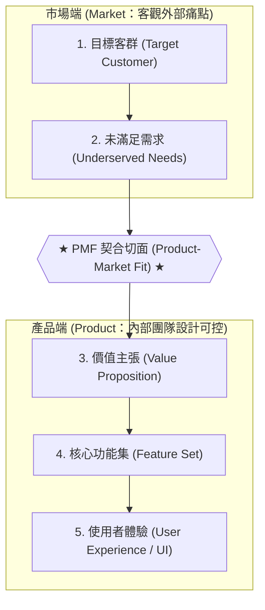
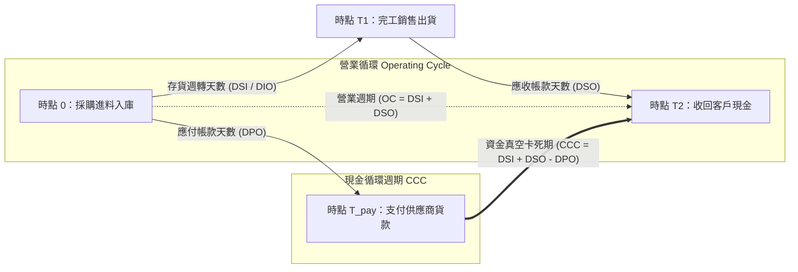

---
{"dg-publish":true,"permalink":"/04/10/02/module-2/m2-1/","tags":["PMBA","精實創業","產品與服務創新","MVP","假說驗證","PMF","白板推導"],"dg-note-properties":{"類別":"課程筆記","課程名稱":"創業與企業財務策略_心智圖導航","模組編號":"Module 2","模組名稱":"產品創新與精實驗證","章節編號":"M2-1","主題":"精實產品開發與服務創新驗證 (Lean Product Development & Service Innovation)","對應週次":"Week 5","狀態":"🟢 已完成","tags":["PMBA","精實創業","產品與服務創新","MVP","假說驗證","PMF","白板推導"]}}
---


# 🚀 M2-1 精實產品開發與服務創新驗證：從價值假說到市場適配

> **導讀與對接**：  
> 本筆記為《創業與企業財務策略》第五週核心模組筆記。本篇聚焦於如何將前置確立的商業模式轉化為可測試的假說體系，透過精實產品開發（Build-Measure-Learn）極小化試錯成本，驗證產品市場適配（PMF）。
> - 上級地圖：[[04_主題選修/10_創業與企業財務策略/00_課程導航與進度/mindmap_創業與企業財務策略_心智圖導航\|全課程心智圖導航]]  
> - 進度看板：[[04_主題選修/10_創業與企業財務策略/00_課程導航與進度/progress_📊 課程與筆記進度追蹤\|📊 課程與筆記進度追蹤看板]]  
> - 前序模組對接：[[04_主題選修/10_創業與企業財務策略/02_模組筆記/Module_1_創新思維與商業模式/M1-10_七大市場力量與商業戰略價值公式\|M1-10 七大市場力量與商業戰略價值公式]] ｜ [[04_主題選修/10_創業與企業財務策略/02_模組筆記/Module_1_創新思維與商業模式/M1-9_商業模式畫布架構與價值主張設計\|M1-9 商業模式畫布架構與價值主張設計]]

---

## 🏛️ 一、 核心理論本質：傳統研發流程 vs. 精實假說驗證

### 1. 傳統瀑布式研發 vs. 精實假設驗證之範式轉移
在創業管理學界與實務投資中，哈佛商學院統計指出高達 **75% 的新創公司最終走向失敗**。深入剖析其底層死因，往往非技術不足，而是創業者深陷傳統成熟企業的「瀑布式研發（Waterfall Model）」思維：耗費數月甚至數年閉門造車、撰寫厚達數十頁的商業計畫書、投入大量固定資本（CapEx）建立量產產線，最終推出市場才驚覺「產品完美無瑕，但根本無人買單」。

精實產品開發（Lean Product Development）徹底顛覆此一線性邏輯，確立「假設驅動（Hypothesis-Driven）」的核心範式：承認在創新初期，商業模式畫布（BMC）上的每一個板塊都只是創辦人未經證實的「假說（Hypotheses）」。企業的唯一任務，是以最低成本、最快速度打造最小可行產品（MVP），推向真實市場進行「驗證式學習（Validated Learning）」。

| 比較維度 | 傳統瀑布式研發 (Waterfall Method) | 精實假說驗證 (Lean Hypothesis Method) |
| :--- | :--- | :--- |
| **底層哲學** | 預設需求已知，著重「執行既定規格與時程」 | 承認需求未知，著重「探索痛點與假說檢驗」 |
| **研發路徑** | 線性階段推進：調研 ➔ 規格 ➔ 研發 ➔ 測試 ➔ 量產 | 敏捷閉環迭代：構想 ➔ 假說 ➔ MVP ➔ 測量 ➔ 學習 |
| **顧客參與時機** | 產品開發完成上市後，才首次接觸真實顧客 | 開發第一天即走出辦公室，顧客深度參與驗證 |
| **資本投入特徵** | 前期沉沒成本高昂，固定資產（PPE）與存貨積壓重 | 輕資產低成本試錯，以營運指標（Runway）保護現金 |
| **失敗成本與應對** | 失敗即面臨破產清算或巨額資產減損（Write-down） | 快速失敗 (Fail Cheap)，以軸轉 (Pivot) 重整旗鼓 |
| **代表性案例** | 奇異 (GE Durathon) 電池斥資上億工廠終成閒置 | 藍河科技 (Blue River) 十週農田訪談催生除草機神話 |

---

### 2. ASCII 假說驗證循環鏈 (Hypothesis Testing Loop)

精實產品開發的核心引擎為永不停歇的敏捷驗證迴圈。創業者必須將主觀信念拆解為「價值假說」與「成長假說」，透過嚴謹實驗獲取定量與定性數據：

```text
【1. 假說形成 (Hypothesis Formulation)】
  - 價值假說：目標客群是否面臨非解決不可的真實劇痛？
  - 成長假說：顧客是否會自發性留存、付費並向外口碑推薦？
       │
       ▼ (定義關鍵可衡量指標與反證條件)
【2. 實驗設計 (Experiment Design)】
  - 設定清晰的「最小成功門檻 (Minimum Success Criteria)」
  - 排除認知偏誤，設計防禦偽需求的證偽實驗
       │
       ▼ (以極小化資源打造低保真驗證載體)
【3. MVP 測試 (MVP Prototyping & Testing)】
  - 鎖定極度渴望解方的早期接納者 (Early Adopters)
  - 拒絕過度工程化，專注核心價值主張的實測交付
       │
       ▼ (追蹤真實行為與付費數據，排除虛榮指標)
【4. 數據回饋 (Data Measurement & Validated Learning)】
  - 核心指標：Sean Ellis 測試、Cohort 留存率、CAC 回本期
  - 質化訪談：深入挖掘使用者未被滿足的底層摩擦阻力
       │
       ▼ (依據客觀實證啟動戰略決策)
        │
   +----+----------------------------------+
   ▼                                       ▼
【軸轉 Pivot】                      【堅持與規模化 Persevere & Scale】
(願景不變，修正客群、產品功能或定價模式) (達成 PMF，注入資本建立規模與銷售通路)
```

---

## ⚡ 二、 MVP（最簡可行產品）矩陣與實踐類型解構

### 1. MVP 的本質定義與迷思破除
Eric Ries 在《精實創業》中明確定義：**最簡可行產品（Minimum Viable Product, MVP）是新創團隊以「最少資源與時間投入」，能夠完整啟動「建構—測量—學習（Build-Measure-Learn）」閉環的產品版本。**

新創團隊常犯兩大極端錯誤：
1. **殘缺品誤區**：將 MVP 誤解為「偷工減料、粗製濫造的瑕疵品」，導致顧客因極差體驗而流失，誤判市場無需求；
2. **完美主義誤區**：非得等到所有次要功能開發齊全才肯上市，錯失先發優勢與寶貴的現金跑道（Runway）。

### 2. 四大 MVP 實踐類型與對抗競爭對手的防禦壁壘

| MVP 實踐類型 | 本質定義與運作機制 | 適用業務情境 | 核心驗證假說焦點 | 競爭對手無法模仿的驗證關鍵 (Barrier) | 經典產業案例 |
| :--- | :--- | :--- | :--- | :--- | :--- |
| **1. 門面型<br>(Smoke Screen / Landing Page)** | 產品尚未實際開發，僅建立著陸頁、概念影片或群募文案，測試潛在顧客的點擊、註冊或預付意願。 | 概念驗證初期、純軟體 SaaS、數位平台、高研發成本硬體。 | **支付意願與需求真實性**：顧客是否願意留下信用卡或 Email 等待產品上線？ | **先發顧客洞察與預期心理**：以極低成本鎖定第一批高黏著早期支持者名單。 | **Dropbox**<br>創辦人 Drew Houston 僅憑一支 3 分鐘操作示範影片，一夜吸引 7.5 萬名註冊候補名單。 |
| **2. 綠野仙蹤型<br>(Wizard of Oz / Flintstoning)** | 前端介面看似具備高度自動化與 AI 演算法，實則後端全由人工在幕後手動執行與處理。 | 服務型平台、電商撮合、演算法新創、高度複雜物流系統。 | **核心價值主張的可行性**：顧客是否滿意該服務的端到端交付成果？ | **隱形營運能耐與需求試探**：在未投入百萬開發自動化系統前，精準掌握真實作業複雜度。 | **Zappos**<br>創辦人 Nick Swinmurn 親赴實體鞋店拍照上架，接單後自掏腰包買鞋寄出，驗證線上買鞋需求。 |
| **3. 禮賓型<br>(Concierge MVP)** | 完全放棄任何軟體介面偽裝，直接由創辦人提供 1 對 1 的頂級人工專屬服務，貼身解決客戶痛點。 | 高客單價服務、B2B 企業方案、理財諮詢、個人化飲食健康。 | **深層痛點與服務流程最佳化**：顧客在解決問題的流程中最在意哪些環節？ | **極致親密客情與非結構化反饋**：能直接觀察客戶微表情與未言說的隱性摩擦，建立深厚信任。 | **Wealthfront / Foodora 早期**<br>早期創辦人親自為客戶手動配置投資組合或手工外送餐點，摸透真實服務障礙。 |
| **4. 單一功能原型<br>(Single-Feature Prototype)** | 剝離所有周邊繁雜輔助功能，僅將「最核心、能解決致命痛點的單一功能」做到極致流暢。 | 硬體科技新創、生產力工具、深度技術突破（Deep Tech）。 | **核心效能能否帶來 10x 體驗提升**：單一功能是否足以驅動顧客改變既有行為習慣？ | **專利技術壁壘與專注力**：集中有限資源打穿單點，避免分散研發火力。 | **藍河科技 (Blue River)**<br>僅組裝一台掛在拖拉機後方的極簡噴藥機，現場實證節省 90% 除草劑即達成驗證。 |

---

## 📈 三、 課堂白板推導專題：PMF 量化檢驗與單位經濟學

### 1. PMF 的本質定義與動態平衡
在 Class 5 課堂上，教授深入剖析了矽谷創投教父 Marc Andreessen 的經典定義：**Product-Market Fit（PMF，產品市場適配）是指企業處在一個具備足夠規模的良好市場中，且其產品能夠完全且恰當地滿足該市場的真實需求。**

> **教授課堂金句**：  
> 「**最佳的產品設計師不只是公司內部的工程師，更是你的顧客！** 創業最難的不是看見利潤在哪裡，而是不知道成功機率有多高。但許多新創死於太早把所有技術一次倒出——**PMF 講求的是『正好滿足（Fit Perfectly）』的戰略節奏！**」

#### 戰略節奏管理：NVIDIA（輝達）的產品世代推出哲學
教授以輝達的 GPU 算力架構為例：NVIDIA 擁有超越當前世代數年的前沿架構（從 Blackwell 到 Rubin、Rubin Ultra 到 2028 年新系統），但在商業化落地時，黃仁勳嚴格控制產品釋放步調：
* **若 $P \gg M$（產品技術遠超市場生態）**：過早推出將面臨下游客戶基礎設施未成熟（散熱、供電、光通訊未到位）、生產成本過高而叫好不叫座，甚至過早暴露架構讓競爭對手模仿反制；
* **精準 PMF 節奏**：配合雲端服務巨頭（CSP）資本支出進程、台積電先進封裝（CoWoS）產能及資料中心綠能承載力，每年推出「正好滿足並微幅領先」市場需求的產品，既鎖定定價特權，又極大化商業毛利率。

---

### 2. Dan Olsen PMF 金字塔模型（The Lean Product Pyramid）
課堂引入 Dan Olsen 提出的 PMF 金字塔結構，強調 PMF 是一套由下而上、層層對齊的五層結構：



| 金字塔層級 | 核心定義與任務 | 歸屬維度 |
| :--- | :--- | :---: |
| **5. 使用者體驗 (UX / UI)** | 顧客直接感知與操作之互動介面 | 產品端 (Product) |
| **4. 核心功能集 (Feature Set)** | 實現價值主張的最小功能組合 (MVP) | 產品端 (Product) |
| **3. 價值主張 (Value Proposition)** | 具體承諾如何解決痛點並超越競品 | 產品端 (Product) |
| **【PMF 契合切面】** | **產品功能價值與市場痛點產生無縫扣合** | **適配點 (Fit)** |
| **2. 未滿足需求 (Underserved Needs)** | 目標客群尚未被妥善解決的真實劇痛 | 市場端 (Market) |
| **1. 目標客群 (Target Customer)** | 具體 STP 市場區隔與使用者畫像 (Persona) | 市場端 (Market) |
- **底層（市場端 Market，層級 1~2）**：客觀存在於外部市場，不以創業者的意志為轉移；
- **頂層（產品端 Product，層級 3~5）**：新創團隊內部可控制與設計的要素；
- **PMF 的發生點**：當頂層的產品價值與功能集，與底層的市場痛點產生「無縫扣合」時，PMF 正式宣告達成。

---

### 3. PMF 三大科學量化檢驗標準

#### (1) Sean Ellis 40% 檢驗指標 (The 40% Rule)
由成長駭客之父 Sean Ellis 提出，透過針對既有活躍使用者的關鍵提問進行量化測量：
$$\text{Sean Ellis 指標} = \frac{\text{回答「非常失望 (Very Disappointed)」的使用者數}}{\text{有效受訪使用者總數}} \ge 40\%$$

| 比例區間 | PMF 狀態判定 | 經理人戰略決策方針 |
| :---: | :--- | :--- |
| **$< 40\%$** | **尚未達成 PMF (Pre-PMF)** | **嚴禁大規模投放行銷預算**！應持續優化核心功能、進行顧客深度質化訪談，或啟動產品軸轉 (Pivot)。 |
| **$\ge 40\%$** | **成功跨越 PMF (Post-PMF)** | **綠燈啟動規模化 (Scale)**！產品展現出強烈的自發牽引力，應大舉注資於通路佈建、團隊擴編與獲客加速。 |

#### (2) Cohort 留存曲線平坦化 (Retention Curve Flattening)
觀察同梯次用戶（Cohort）在第 1 天、第 7 天、第 30 天、第 90 天的持續使用率。若留存率隨時間流逝不斷向下跌落至 0，代表漏斗破洞；若曲線在歷經初期自然滑落後，能在某一水平位置**「趨於水平平坦（Flattened Long Tail）」**，即為 PMF 的最有力鐵證！

#### (3) 單位經濟學黃金律與回本週期 (Unit Economics & Payback)
$$\frac{\text{LTV (顧客終身價值)}}{\text{CAC (獲客成本)}} \ge 3 \qquad \text{且} \qquad \text{CAC Payback Period (獲客成本回本期)} \le 12 \text{ 個月}$$

---

### 4. 課堂白板推導專題：ROIC 競爭矩陣與營運資金管理（NWC / CCC）

在下半堂課堂現場，教授在白板上親自推導了評估企業產品策略與營運模式的財務架構：

#### (1) 投入資本（Invested Capital）之三大構成要素
企業投入新產品開發或開拓第二成長曲線時，總投入資本主要來自三大支柱：

$$\text{投入資本 (Invested Capital)} = \text{固定資本 (PPE)} + \text{淨營運資本 (NWC)} + \text{無形資產 (Intangible Assets)}$$

1. **固定資產 / 固定資本（PPE）**：不動產、廠房、先進製程設備與測試機台；
2. **淨營運資本（Net Working Capital, NWC）**：維持企業日常產銷運營所必需墊付之短期流動資金；
3. **無形資產（Intangibles）**：技術專利權、營業秘密、軟體著作權與商標價值。

#### (2) 淨營運資本 (NWC) 與現金循環週期 (CCC) 之數理傳導
教授特別告誡全班 PMBA 學員：「**新創初期燒錢最兇殘的黑洞，就在於淨營運資本（NWC）與現金循環週期（CCC）的失控！**」

$$\text{淨營運資本 (NWC)} = \text{應收帳款 (AR)} + \text{存貨 (Inventory)} - \text{應付帳款 (AP)}$$
$$\text{現金循環週期 (CCC)} = \text{存貨週轉天數 (DSI)} + \text{應收帳款天數 (DSO)} - \text{應付帳款天數 (DPO)}$$



```text
  【採購原物料入庫】             【產品完工銷售出貨】            【客戶收到發票並付款】
         o                              o                              o
         |------ 存貨週轉天數 (DSI) ----|                              |
         |                              |------ 應收帳款天數 (DSO) ----|
         |                              |                              |
         |-- 應付帳款天數 (DPO) --|     |                              |
         |                        |     |                              |
  【採購進料】             【支付供應商】|                              |
         o                        o     |                              |
                                  |==== 現金循環週期 (CCC = DSI + DSO - DPO) ====|
                                   (資金真空卡死期：需自備營運資金 NWC 墊款)
```

* **先付後收型（CCC > 0，製造業與 EMS 代工常態）**：  
  例如存貨天數 20 天，應收帳款天數 40 天，應付帳款天數 30 天：
  $$\text{CCC} = 20 + 40 - 30 = +30 \text{ 天}$$
  企業有整整 30 天處於「現金流出但營收尚未入帳」的真空期，台語俗稱**「中椗了」**。若無充沛的 NWC 營運週轉金，極易引發「帳面獲利、手中無現金」的黑字倒閉危機！
* **先收後付型（CCC < 0，零售通路與超商巨頭特徵）**：  
  以**統一超（7-Eleven）**為代表：終端消費者在門市消費皆以現金或電子支付「即時入帳」（DSO $\approx 0$），而門市存貨快速週轉，對供應商貨款則長達 30~60 天付款期（DPO 大）。其 CCC 呈現**顯著負值**！意味著統一超帳上常年沉澱著供應商的巨額無息營運資金（Float），在銀行持續賺取利息或轉投資展店，形成極強財務槓桿。

#### (3) ROIC vs. 資產週轉率二維競爭矩陣（差異化 vs. 低成本）
教授依據 2025 年最新財報數據，將指標性企業定位於二維矩陣中，揭示不同產品戰略下的財務結構特徵：
* **縱軸**：投入資本報酬率（ROIC）或營業利益率（彰顯**「差異化能力與定價特權」**）
* **橫軸**：資產週轉率（Sales / Total Assets，彰顯**「低成本營運與規模效率」**）

| 競爭象限 | 財務特徵 | 代表性標桿企業 | 核心競爭策略與產品特質 |
| :--- | :--- | :--- | :--- |
| **高 ROIC ✕ 低中週轉<br>(極致差異化象限)** | 高營業毛利、強定價權、重研發或強品牌，不靠薄利多銷。 | **台積電**、**大立光**、**聯發科**、**晶華酒店**、**奇鋐** | 具備壟斷性技術或頂級品牌，能將高研發投入轉化為超額營業利益率（NOPAT）。 |
| **中 ROIC ✕ 極高週轉<br>(低成本規模營運象限)** | 營業毛利率微薄，但資產週轉如飛，靠規模經濟與極致供應鏈效率勝出。 | **鴻海 (Foxconn)**、**廣達 (Quanta)**、**統一超**、**台塑化** | 透過高存貨週轉與供應鏈排程將資產利用率推向極致，一塊錢資產創造數倍營收。 |
| **中間平衡型象限** | 兼具區域品牌知名度與穩定通路營運，利潤與週轉率維持穩健。 | **中華電信**、**葡萄王** | 防禦型公用事業或成熟保健品牌，現金流充沛，提供穩定股利配發。 |

---

## 🧭 四、 產品與服務創新維度：破壞式創新 vs. 持續性創新

### 1. Clayton Christensen 破壞式創新戰略姿態對比
哈佛商學院克里斯汀生（Clayton Christensen）教授提出經典的「破壞式創新（Disruptive Innovation）」理論，精準解釋為何資源雄厚的大型在位者往往被看似弱小的新創企業擊敗：

| 創新維度 | 持續性創新 (Sustaining Innovation) | 破壞式創新 (Disruptive Innovation) |
| :--- | :--- | :--- |
| **目標市場** | 現有主流市場中要求最高、利潤最豐厚的高階顧客。 | 原先被過度服務的低階利基客群，或完全未消費的非主流市場。 |
| **產品特性** | 沿著既有性能軌跡持續升級，追求更高規格、更強性能。 | 初期性能通常低於主流標準，但具備**便宜、簡潔、便利、體積小**等新屬性。 |
| **新創者姿態** | **切忌正面衝突**！在位者握有充沛資本與研發資源，正面迎戰必敗。 | **尋找巨頭盲區進攻**！以低成本解決邊緣客群痛點，建立初步根據地。 |
| **在位者反應** | 全力防禦、動員資源跟進，展開激烈的技術軍備競賽。 | 輕視忽視、主動放棄低毛利低階市場，往更高階利潤市場退縮。 |
| **終局演進路徑** | 產品性能過剩（Overshoot），超越多數一般消費者的實際需求。 | 透過敏捷迭代快速提升性能，最終由下而上顛覆主流市場，吞噬在位巨頭。 |
| **經典商業實證** | 傳統機械硬碟不斷提升磁錄密度、旗艦智慧型手機微幅升級鏡頭規格。 | **PC 顛覆大型主機**、**數位相機顛覆柯達膠卷**、**ARM 晶片顛覆 x86 移動端**。 |

---

### 2. Philip Kotler 五個產品層次模型在產品設計之落地
行銷大師科特勒（Kotler）指出，產品絕非單純的有形實體，而是由核心利益向外包裹的五層同心圓結構：

| 產品層級 | 概念核心定義 | 課堂經典案例拆解 (化妝品 / 洗衣機 / 工業晶片) | 經理人產品創新設計策略 |
| :--- | :--- | :--- | :--- |
| **1. 核心產品<br>(Core Benefit)** | 顧客購買該產品所追求的**最根本利益或想要解決的終極痛點**。 | • 化妝品：追求「美麗、自信與情感認同」，而非化學顏料。<br>• 洗衣機：追求「衣物清潔與省時省力」。<br>• 工業晶片：追求「算力效率與低功耗運算」。 | 緊扣顧客痛點本質，避免將產品外在形式誤當作顧客的核心追求。 |
| **2. 基本產品<br>(Basic Product)** | 將核心利益具體化為最起碼的有形實體結構或功能規格。 | • 洗衣機之旋轉馬達、清洗槽與排水管。<br>• 晶圓封裝由圓形走向面板級（FOPLP）方形載板。 | 滿足產品運作之底線門檻，是進入該產業的必要入場券。 |
| **3. 期望產品<br>(Expected Product)** | 顧客在購買時，習慣上認定「理所當然應具備」的屬性與條件。 | • 洗衣機必須具備低噪音、基本脫水功能與防漏設計。<br>• 飯店客房必須提供乾淨床單、獨立衛浴與 Wi-Fi。 | 若無法達到期望水準將引發極度不滿，但單純滿足此層無法創造差異化。 |
| **4. 擴增產品<br>(Augmented Product)** | 超越顧客預期、能將自身與競爭同業鮮明區隔的額外服務與附加價值。 | • 洗脫烘一體、智慧聯網遠端預約、全機三年免費到府保固。<br>• 蘋果提供 AppleCare+ 意外損壞保障與 Genius Bar 專人支援。 | **創造超額利潤與溢價的核心層次**！教授指出，每往外包裝一層優質體驗，就能向顧客多收取 10%~20% 溢價。 |
| **5. 潛在產品<br>(Potential Product)** | 該產品在未來可能經歷的所有演化、轉型與全新功能延展。 | • 結合 AI 影像辨識衣物材質與髒污程度，自動投放精準洗劑並動態調節水溫；連線智慧家居電網自動在離峰低電價時段運轉。 | 鎖定未來科技趨勢與生活型態變遷，鋪陳企業的第二成長曲線（Second S-Curve）。 |

---

### 3. 服務四大特性與 7Ps 服務行銷組合
在現代商業中，單純的硬體產品已不足以維繫護城河，企業紛紛走向「產品＋服務化（Product + Service = Servitization / Productice）」：

#### (1) 服務四大本質特性與營運挑戰
1. **不可觸知性（Intangibility）**：服務在購買前無法被看見或觸摸，顧客評估風險高。➔ **因應策略**：建立實體佐證（Physical Evidence），如專業認證標章、精緻門市裝潢與具象化案例。
2. **不可分割性（Inseparability）**：服務的生產與消費同時發生，服務人員直接代表品牌。➔ **因應策略**：落實標準化作業程序（SOP），加強內部員工培訓與授權。
3. **易變性 / 異質性（Variability）**：服務品質取決於提供者之情緒、技巧與當下情境，一致性難以掌控。➔ **因應策略**：導入自動化數位系統，建立雙向顧客評價機制。
4. **易逝性（Perishability）**：服務產能無法預先儲存（如飯店空房、飛機空位一旦過期價值即歸零）。➔ **因應策略**：採用動態差別定價（如 FunNow 即時預訂、離峰時段折扣）調節供需平衡。

#### (2) 服務行銷 7Ps 組合擴展
傳統 4Ps（Product, Price, Place, Promotion）已無法涵蓋現代高互動服務體驗，必須延伸納入關鍵 3P：
* **人員 (People)**：直接接觸顧客的第一線服務同仁，其專業度與同理心決定品牌溫度；
* **流程 (Process)**：顧客從接觸、體驗、結帳到售後的所有標準化交互流程；
* **實體佐證 (Physical Evidence)**：門市環境、設備陳列、數位介面 UI/UX 及專業憑證等視覺實體化線索。

---

## 📚 五、 案例深度對標與雙向鏈結網絡

### 1. 課堂逐字稿實證案例深度評析

#### 案例一：NVIDIA（輝達）—— PMF 推出節奏與生態系協同管理
* **決策情境**：在生成式 AI 爆發潮中，NVIDIA 手握 Blackwell、Rubin、Rubin Ultra 等次世代 GPU 藍圖，面臨「究竟何時該推向市場」的戰略抉擇。
* **教授現場評析**：  
  如果一項劃時代技術推出時，其下游生態系（CSP 資料中心液冷散熱、電網供電、光模組傳輸）尚未成熟，產品將落入空轉。黃仁勳精準拿捏「Fit Perfectly」的藝術，以每年節奏性發布匹配台積電 CoWoS 產能與雲端巨頭資本支出，既避免給競爭者喘息空間，又確保每代產品皆以超高毛利率達成完美的 PMF。

#### 案例二：統一超商（7-Eleven）—— 負 CCC 現金流戰略與產品組合深度延展
* **財務機制**：統一超門市每日湧入數百萬消費者以現金與電子支付結帳，應收帳款天數趨近於 0；存貨快速周轉，應付帳款則享有 30~45 天信用期，創造出**顯著小於 0 的現金循環週期（CCC < 0）**。
* **產品組合策略**：統一超透過產品組合的「寬度（鮮食、日用、咖啡、代收票券）」與「深度（自有品牌 Kirkland Signature / 7-SELECT 延伸）」，將門市坪效極大化，成為先收後付型高週轉零售霸主。

#### 案例三：台積電 vs. 鴻海 —— 產品創新路徑之財務結構分化
* **台積電**：鎖定極致差異化，以領先全球的 2 奈米 / 3 奈米製程與 CoWoS 先進封裝建立定價特權，雖每年投入數百億美元 CapEx，但享有高 NOPAT 與高 ROIC，位列差異化高利潤象限；
* **鴻海**：專注低成本規模營運，雖代工毛利率偏低（毛利率 6%~8%），但憑藉無人能敵的供應鏈整合能耐與全球組裝彈性，維持極高資產週轉率，在一塊錢資產上撬動最大的營收規模。

#### 案例四：美光（Micron）與 SK 海力士 —— HBM 漲價溢價與資本市場股權貨幣化
* **美光財報啟示**：美光受惠於高頻寬記憶體（HBM）供不應求，最新財報毛利率衝上 80% 高水準。價格上升有效稀釋固定折舊成本，展現出產品規格升級帶來的超額利差。
* **海力士在美 ADR 戰略**：為打破「南韓折價（Korea Discount）」，海力士大舉赴美發行 ADR，不僅壓低權益資金成本，更將股權成功「貨幣化（Monetization）」，以便於全球 AI 算力生態系中進行大規模策略聯盟與跨國 M&A 併購。

---

### 2. 跨模組雙向鏈結網絡

#### 概念庫對接 (98_商業概念庫)
- [[lean-startup_精實創業]]
- [[MVP最小可行產品|mvp_最簡可行產品]]
- [[PMF產品市場適配|pmf_產品市場適配]]
- **顧客探索 (Customer Discovery)**
- **肖恩·埃利斯測試 (Sean Ellis 40% Test)**
- **顧客留存曲線 (Cohort Retention Curve)**
- [[unit-economics-model_單位經濟模型|unit-economics_單位經濟學]]
- [[return-on-invested-capital_資本投入報酬率|roic_投入資本報酬率]]
- [[cycle_淨營業循環週期|ccc-cash-conversion-cycle_現金循環週期]]
- [[net-working-capital_淨營運資金|net-working-capital_淨營運資本]]
- **服務行銷組合 (7Ps Service Marketing)**
- [[disruptive-innovation_破壞式創新]]
- **科特勒五大產品層次 (Kotler Product Levels)**

#### 導航、時事與個案庫串聯
- ◀️ 上級心智圖：[[mindmap_創業與企業財務策略_心智圖導航|全課程心智圖導航]]
- 📊 進度看板：[[04_主題選修/10_創業與企業財務策略/00_課程導航與進度/progress_📊 課程與筆記進度追蹤|📊 課程與筆記進度追蹤看板]]
- 💡 前序基礎：[[04_主題選修/10_創業與企業財務策略/02_模組筆記/Module_1_創新思維與商業模式/M1-10_七大市場力量與商業戰略價值公式|M1-10 七大市場力量與商業戰略價值公式]]
- 💡 商模對接：[[04_主題選修/10_創業與企業財務策略/02_模組筆記/Module_1_創新思維與商業模式/M1-9_商業模式畫布架構與價值主張設計|M1-9 商業模式畫布架構與價值主張設計]]
- 🌐 時事收納：[[macro_資本市場與創投總經時事|資本市場與創投總經時事庫]]
- 🏢 個案庫對接：[[cases_新創與企業融資案例庫#^SK海力士|新創與企業融資案例庫 (美光與 SK 海力士 HBM 估值)]] ｜ [[cases_新創與企業融資案例庫|新創與企業融資案例庫 (企業財務分化)]]
