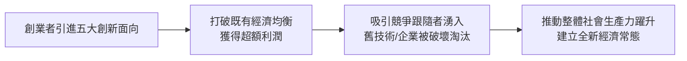
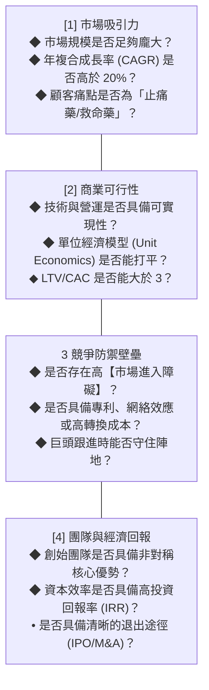
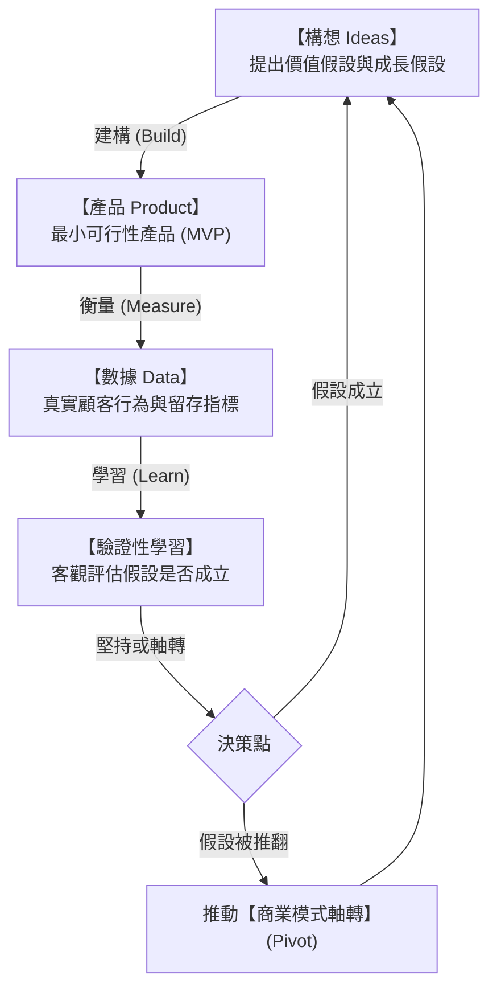
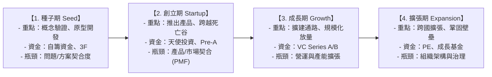

---
{"dg-publish":true,"permalink":"/04/10/w01/","dg-note-properties":{}}
---

# W01_創業概論
- **課程**：[[04_主題選修/10_創業與企業財務策略/_創業與企業財務策略 MOC\|創業與企業財務策略]]
- **後續接續**：[[04_主題選修/10_創業與企業財務策略/W02_創業構想與商業計畫\|W02_創業構想與商業計畫]]
- **標籤**：#PMBA #主題選修 #創業管理 #創業概論 #創業精神 #創業者特質 #商業機會 #精實創業

---

## 🗺️ 單元心智圖架構

> 📌 **原始檔維護**：[開啟 Xmind 編輯原始檔](<file:///g:/我的雲端硬碟/PMBA/PMBA_Note/04_主題選修/10_創業與企業財務策略/附件/L1_0908_創業概論.xmind>)

---

## 💡 核心摘要
1. **創業不是浪漫的冒險，而是高度計算的風險管理**：卓越創業者並非盲目下注的賭徒，而是具備敏銳洞察力的「風險架構師」；其核心能力在於以最低的資本曝險，系統性消除市場、技術與財務上的重大不確定性。
2. **機會辨識優先於資源佔有**：哈佛商學院 Stevenson 教授指出，[[98_商業概念庫/創業精神\|創業精神]] 的本質是在資源不受既有條件限制下追求商業機會。在創業初期，創業者整合與重新定義資源的「機智（Resourcefulness）」，遠比坐擁多少既有「資源（Resources）」更具決定性。
3. **新創存活的關鍵在於快速試錯與迭代**：新創企業處於極端不確定性中，傳統的大規模前期規劃往往是走向深淵的捷徑；唯有貫徹 [[98_商業概念庫/精實創業\|精實創業]] 循環，以最快速度推出 [[98_商業概念庫/最小可行性產品\|最小可行性產品]]（MVP）並隨反饋果斷推動 [[98_商業概念庫/商業模式軸轉\|商業模式軸轉]]，方能跨越死亡之谷。
4. **每一項商業決策最終都是財務決策**：無論是營運擴張、技術研發還是通路開拓，都會直接反映在自由現金流與資本結構上。新創企業必須嚴密監控現金跑道（Runway）與燒錢率，在達成真正的產品市場契合前，嚴防過早擴張帶來的致命崩盤。

---

## 📚 核心觀念與理論框架

### 創業的本質與創業精神

#### 熊彼得論創業與創造性破壞
奧地利經濟學大師約瑟夫·熊彼得（Joseph Schumpeter）奠定了現代創新創業理論的基石。熊彼得強調，資本主義經濟增長的核心引擎並非靜態的價格均衡，而是源源不絕的 [[98_商業概念庫/創造性破壞\|創造性破壞]]：

- **熊彼得創新五大面向**：
  1. **產品創新**：開發市場尚未熟知的新產品或新規格。
  2. **技術製程創新**：導入全新且未經驗證的高效生產方法。
  3. **市場創新**：開拓尚未被涉足的全新地理或細分市場。
  4. **供應來源創新**：掌握關鍵原物料或零組件的新型供應鏈。
  5. **組織形式創新**：打破既有行業壟斷，或建立全新的產業平台架構。

#### 創業精神的核心定義
哈佛商學院霍華德·史蒂文森（Howard Stevenson）教授為 [[98_商業概念庫/創業精神\|創業精神]] 提出了享譽學界的權威定義：
> 「創業精神是在資源不受既有條件限制下，追求商業機會的歷程（The pursuit of opportunity beyond resources controlled）。」

- **創業導向思維（Entrepreneurial Focus）**：由外部的「商業機會」驅動，強調速度、敏捷承諾與彈性網絡；追求「不求所有，但求所用」。
- **行政管理導向思維（Administrative Focus）**：由內部的「既有資源」驅動，強調層級審批、流程合規與資產排他性控制。

#### 創業者特質剖析
成功創業者通常展現出一組顯著的 [[98_商業概念庫/創業者特質\|創業者特質]]：
- **內部控制軌（Internal Locus of Control）**：深信個人決策與行動是決定事業成敗的終極力量，拒絕將挫敗歸咎於外在運氣或環境。
- **高 [[98_商業概念庫/成就動機\|成就動機]]（Need for Achievement, nAch）**：依據麥克利蘭理論，創業者受克服高難度挑戰與追求卓越的內在心理驅動，偏好中等風險並渴望即時客觀的績效反饋。
- **高 [[98_商業概念庫/模糊容忍度\|模糊容忍度]]（Tolerance for Ambiguity）**：在缺乏充分數據、前景混沌不清的極端迷霧中，依然具備高度心理舒適感並敢於拍板推進決策。
- **計算後的 [[98_商業概念庫/創業風險\|創業風險]] 承擔**：善於將不可預測的未知風險，透過架構拆解轉化為可管理的有限曝險。

---

### 創業機會辨識與評估

#### 商業機會的四大來源
卓越的 [[98_商業概念庫/商業機會辨識\|商業機會辨識]] 往往起源於對總體環境與產業微觀變革的深刻洞察：
1. **[[98_商業概念庫/市場痛點\|市場痛點]] 與未滿足需求**：現有市場解決方案過於繁瑣、價格昂貴、體驗惡劣，顧客正忍受痛苦或使用極其低效的替代手段。
2. **產業與市場結構變革**：價值鏈去中介化、數位平台興起或供應鏈重大重組帶來的格局真空。
3. **法規政策鬆綁或標準強制**：政府法規開放（如金融科技監理沙盒、遠距醫療鬆綁）或 ESG 環保標準強制推行釋放出的全新剛性需求。
4. **新技術與科學突破**：底層技術（如生成式 AI、新材料、基因編輯）跨越實用化門檻，賦予重塑所有傳統產業的歷史機遇。

#### 機會評估四大維度
並非所有構想都值得投入資源，創始團隊必須透過四大維度檢驗商業機會：
1. **市場吸引力**：市場規模是否足夠龐大？年複合成長率（CAGR）是否高於 20%？顧客痛點是否屬於不可或缺的「救命藥」？
2. **商業可行性**：技術與營運是否具備可實現性？單位經濟模型（Unit Economics）是否能打平？顧客終身價值與獲客成本比例（LTV/CAC）是否能大於 3？
3. **競爭防禦壁壘**：是否能建立足夠高的 [[98_商業概念庫/市場進入障礙\|市場進入障礙]]？是否具備專利、網絡效應或高轉換成本，以防止行業巨頭跟進模仿？
4. **團隊與經濟回報**：創始團隊是否具備非對稱核心優勢？資本效率是否具備高內部報酬率（IRR）並具備清晰的退出途徑（IPO 或 M&A）？

### 傳統創業 vs. 精實創業思維

傳統創業模式與現代精實思維在面對不確定性時，展現出截然不同的哲學：

| 分析維度 | 傳統大規劃創業模式 (Traditional) | 精實創業模式 (Lean Startup) |
| :--- | :--- | :--- |
| **策略核心** | 依據主觀假設撰寫厚重的商業計畫書。 | 運用商業模式畫布（BMC）提出待驗證的假設。 |
| **新產品開發** | 瀑布式開發，封閉研發數年後一次性盛大發布。 | 敏捷迭代，以最快速度推出 [[98_商業概念庫/最小可行性產品\|最小可行性產品]]（MVP）。 |
| **客戶互動** | 憑空猜測顧客需求，上市後才開始面對市場。 | 貫徹 [[98_商業概念庫/客戶開發\|客戶開發]]，第一天就「走出辦公室」與顧客對話。 |
| **失敗應對** | 產品失敗即意味著巨額資本損失與公司清算。 | 將失敗視為學習，透過數據迅速推動 [[98_商業概念庫/商業模式軸轉\|商業模式軸轉]]。 |
| **資源消耗** | 前期重資本投入，追求功能面面俱到。 | 嚴控燒錢率，追求極大化「單位時間的學習速度」。 |

#### 精實創業核心循環（Build-Measure-Learn）

[[98_商業概念庫/精實創業\|精實創業]] 的核心在於驅動一個高速旋轉的驗證迴路：

- **[[98_商業概念庫/最小可行性產品\|最小可行性產品]]（MVP）**：以最少資源驗證核心痛點的實驗載體，切忌將其誤解為粗製濫造的次級品，其本質在於實現核心 [[98_商業概念庫/價值主張\|價值主張]]。
- **[[98_商業概念庫/商業模式軸轉\|商業模式軸轉]]（Pivot）**：在核心願景不變的前提下，策略性改變目標客群、定價模式或核心功能，是基於市場真實數據的主動應變。

---

### 新創企業生命週期與資源配置

#### 創業生命週期五大階段與瓶頸
新創企業在 [[98_商業概念庫/創業生命週期\|創業生命週期]] 中的演進歷程呈現典型的 S 曲線，並橫亙著致命的「死亡之谷」：

#### 創業資源整合：自籌資金 vs. 外部融資
- **[[98_商業概念庫/自籌資金\|自籌資金]]（Bootstrapping）與 [[98_商業概念庫/資源拼湊\|資源拼湊]]（Bricolage）**：
  - 在種子與創立初期，創業者應極限壓縮固定成本，透過預收客戶款項、借用設備與資源拼湊「就地取材」，維持極低的燒錢率。
  - 優勢：確保創始團隊擁有 100% 的決策自主權與股權，避免過早稀釋昂貴股權。
- **外部創投資本（VC）的切入時機**：
  - 創投機構的本質是「追求全壘打式的極致回報率（$E[R] = \sum p_i \times R_i$）」，透過投資多個專案分散高失敗率風險。
  - 但對於創業者而言，自身只有一家公司，失敗率是 100% 或 0%。因此，**唯有當 [[98_商業概念庫/商業模式驗證\|商業模式驗證]] 成功、達成明確的 PMF 且具備可複製的成長引擎時**，引入外部資本才是加速規模化的明智之舉。

---

## ⚠️ 實務應用與經理人思維

### 創業者常見的盲點：「自嗨型發明」誤當成「真實市場需求」
1. **拿著錘子找釘子的技術陷阱**：
   - 許多技術背景的創業者，往往對自身的技術發明陷入過度自信的狂熱，花費數年時間與數千萬元研發出極其精密的產品，上市後才震驚地發現市場根本不需要這項功能。
   - 卓越經理人必須牢記：**「顧客買的不是產品本身，而是問題的解決方案。」** 缺乏強烈市場痛點支撐的發明，只是一場代價昂貴的自嗨。

### 追求完美產品導致錯失市場窗口：MVP 的真諦
1. **分析癱瘓與過度工程化**：
   - 創業者常因害怕被批評「產品不夠完美」而一再推遲發布日期，試圖將所有想像中的功能一次性做齊。
   - 實務代價：市場窗口稍縱即逝，漫長的閉門造車不僅快速燒光現金，更可能在上市時發現競爭者早已佔據心智階梯。MVP 的精髓在於快速獲取真實市場的反饋數據，以迭代速度戰勝靜態完美。

### 創始團隊的角色互補與股權成熟機制（Vesting）
1. **拒絕平均主義的股權陷阱**：
   - 許多 [[98_商業概念庫/創始團隊\|創始團隊]] 為了表面和諧，採取 50/50 或 33/33/33 的均分股權結構。一旦未來在重大策略方向上產生分歧，公司治理將陷入徹底癱瘓。創始團隊必須具備技能互補（Hacker, Hustler, Hipster），且必須確立一位擁有最終裁決權的核心領袖。
2. **必須在第一天建立 [[98_商業概念庫/股權成熟機制\|股權成熟機制]]**：
   - 所有合夥人的股權必須綁定「4 年成熟期 + 1 年懸崖期（Cliff）」。若有合夥人在一年內拆夥離職，一股都無法帶走；如此方能防範中途退出的合夥人帶走大量「死股」，徹底斷絕後續融資與團隊生存的生路。
