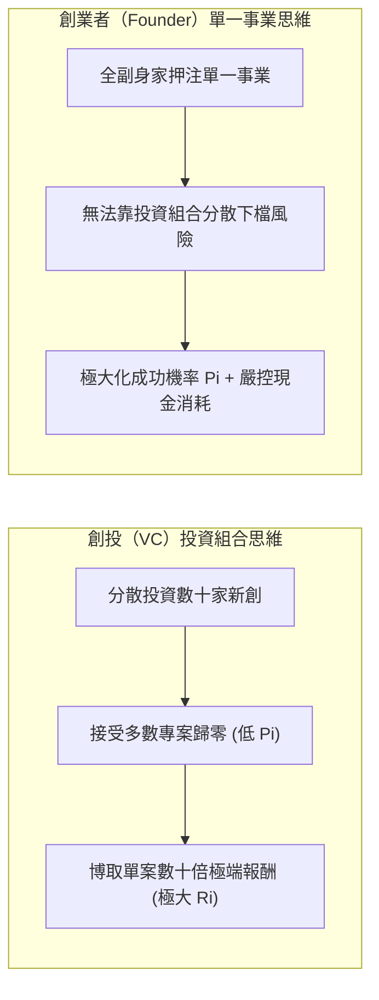
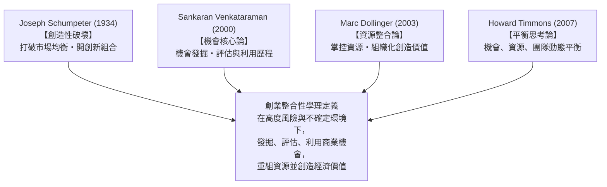
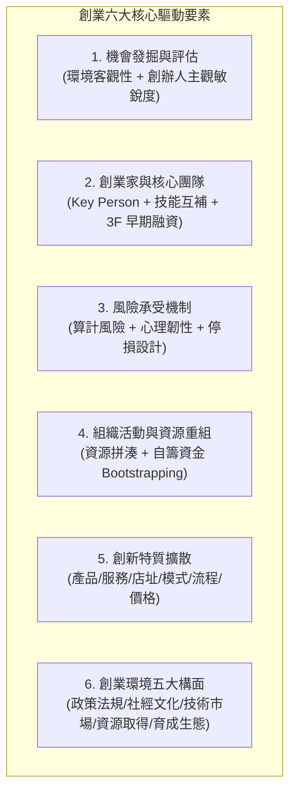
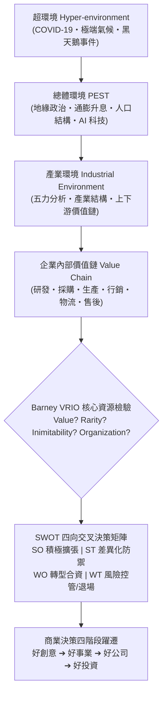
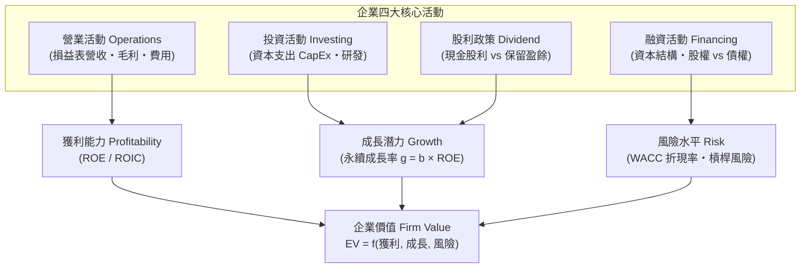
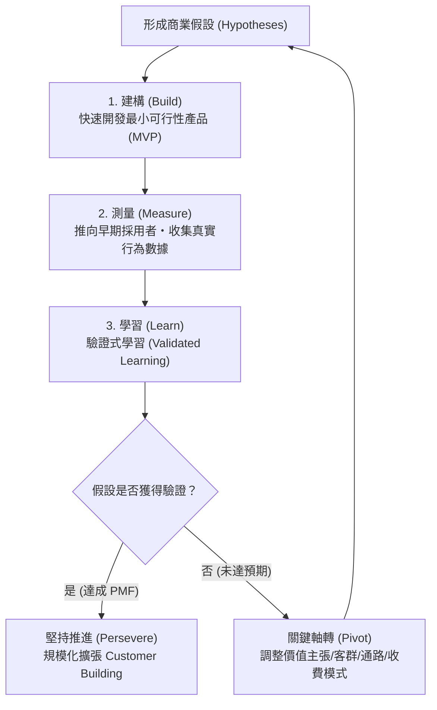

---
{"dg-publish":true,"permalink":"/04/10/w01/","dg-note-properties":{}}
---

# W01_創業概論
- **課程**：[[04_主題選修/10_創業與企業財務策略/_創業與企業財務策略 MOC\|創業與企業財務策略]]
- **後續接續**：[[04_主題選修/10_創業與企業財務策略/W02_創業構想與商業計畫\|W02_創業構想與商業計畫]]
- **標籤**：#PMBA #主題選修 #創業管理 #創業概論 #創業精神 #精實創業 #課堂實務案例

---

## 💡 核心摘要

1. **創業本質是突破資源桎梏的算計冒險**：依據 Stevenson 與 Schumpeter 經典理論，[[98_商業概念庫/創業精神\|創業精神]] 的核心在於「在資源不受既有條件限制下追求商業機會」，透過 [[98_商業概念庫/創造性破壞\|創造性破壞]] 打破既有市場均衡；卓越創業者絕非盲目下注的賭徒，而是具備敏銳 [[98_商業概念庫/商業機會辨識\|商業機會辨識]] 能耐與嚴密風險架構能力的決策者。
2. **三創演進與企業生命週期的全景視野**：創業旅程經歷「創意（Idea，發現 [[98_商業概念庫/市場痛點\|市場痛點]]） $\rightarrow$ 創新（Innovation，設計可行 [[98_商業概念庫/商業模式\|商業模式]]） $\rightarrow$ 創業（Entrepreneurship，組織落地承擔風險）」三部曲；在企業生命週期中，貫穿「0 到 1 創業探索 $\rightarrow$ 1 到 N 興業擴張 $\rightarrow$ N 到大 N 展業生態系」的長期跨度。
3. **商業決策的底層終局皆為財務決策**：企業四大核心活動（營業、投資、融資、股利政策）最終匯聚於「企業價值三角」（獲利、成長、風險）。任何策略佈局均會即時傳導至 [[98_商業概念庫/自由現金流量\|自由現金流量]]、資本結構與折現率，創業者必須嚴密控管資金耗竭速度與資本配置效率。
4. **精實創業與創投期望值的非對稱博弈**：創投（VC）依靠投資組合追求肥尾分佈中的極端超額報酬（$\sum P_i R_i$），而新創事業只有一次生命，無法依賴分散風險。創業者必須貫徹 [[98_商業概念庫/精實創業\|精實創業]] 的「建構-測量-學習（Build-Measure-Learn）」循環，以 [[98_商業概念庫/最小可行性產品\|最小可行性產品]]（MVP）快速推動 [[98_商業概念庫/商業模式驗證\|商業模式驗證]]，並在必要時果斷執行 [[98_商業概念庫/商業模式軸轉\|商業模式軸轉]]。
5. **創始團隊互補性高於靜態產品構想**：產品會迭代甚至失敗，但具備高 [[98_商業概念庫/模糊容忍度\|模糊容忍度]] 與強大 [[98_商業概念庫/成就動機\|成就動機]] 的 [[98_商業概念庫/創始團隊\|創始團隊]] 才能持續因應變局；早期融資依賴 3F（Family, Friends, Fools），唯有一群專業互補且具備 [[98_商業概念庫/股權成熟機制\|股權成熟機制]] 的對的人，才能跨越死亡之谷走得長遠。

---

## 🎙️ 教授課堂實戰觀點與案例深度剖析（逐字稿精萃）

### 一、【破除迷思與實務警語】

1. **「開公司」極其簡單，難的是「長期營運與永續生存」**：
   - 教授直言，形式上設立一家公司毫無門檻：找會計師跑流程、驗資申報即可；甚至過去製造業工廠為了通過工業局查驗，向同業暫借幾台三軸、五軸車床擺拍，查驗通過隔天就把昂貴機台搬走歸還。
   - 真正的挑戰在於存續：**台灣企業平均壽命僅約 10.06 年**（納入大型企業平均後的統計數值），而**美國上市公司平均壽命亦僅 29.5 年**。設立登記只是起點，能否跨越景氣循環建立永續現金流才是真功夫。
2. **創投評估順位：團隊特質（Key Person）遠重於初期產品**：
   - 許多初次創業者過度執著於技術與產品細節，自認解決了市場痛點，卻忽視了競爭對手的反撲。
   - 創投業者閱案無數，深知**產品必然會迭代（Iterate）、甚至可能被市場全盤推翻，但優秀且互補的團隊具備強大調適力，能夠因應數據反饋果斷 Pivot（軸轉）**。正如商管名言：「一個人走得快，但一群對的人才走得遠。」
3. **期望值公式（$E(R) = \sum P_i R_i$）下的非對稱認知博弈**：
   - **創投（VC）視角**：管理大型投資組合，深知新創失敗率極高（$P_i$ 低），因此極度看重成功時的倍數回報（$R_i$ 高達數十倍甚至百倍），以少數獨角獸拉抬全基金績效。
   - **創業者視角**：無法靠投資組合分散風險，對創辦人而言「失敗率就是 100% 或 0%」。因此創業者絕不能沈迷於虛幻的高額預期收益，而應竭盡所能提升單次行動的成功機率 $P_i$，嚴控每一分資金的消耗速率。
4. **高利率與通膨環境下，「躺賺 5%」對創業的機會成本衝擊**：
   - 2022 年聯準會暴力升息 11 次將基準利率推升至 5% 以上，30 年期美債殖利率突破 5.2%，日本長天期公債亦攀升。
   - 當無風險資產可提供 5% 穩定報酬時，手握 1,000 萬資金的投資人選擇將大幅提高創業的機會成本（創業前兩年往往持續虧損）。高利率環境直接促使全球 VC 募資緊縮與 IPO 案件量驟降，倒逼新創企業回歸真實造血能力。
5. **創業者年齡的迷思與「永遠沒有準備好的一天」**：
   - Bill Gates（19 歲）、Steve Jobs（21 歲）、黃仁勳（30 歲）青年創業，但張忠謀創立台積電時已 55 歲（具備德州儀器與工研院之深厚資源）。
   - 年輕創業者具備「Nothing to lose」的衝勁與抗壓性；熟齡創業者則具備產業人脈、資源整合與思慮成熟度。但無論幾歲，市場瞬息萬變，**「創業永遠沒有 100% 準備好的完美時刻」**，等待只會錯失機會窗口。

---

### 二、【課堂深度案例剖析】

#### 案例 1：教授自身「36 歲創業・17 年實戰」告白
- **背景與決策歷程**：教授自商管碩士畢業後，先在台北知名廣告公司歷練 2 年行銷實務，隨後進入製造業大型企業歷練 8 年營運與跨國商務。累積 10 年紮實產業經驗與人脈後，於 36 歲正式創立公司，實體營運長達 17 年（2006～2023 年），歷經 2008 金融海嘯與產業變遷，最終因 COVID-19 疫情後全球供應鏈架構劇變及客戶合約到期，圓滿結束營運並轉入學界專任。
- **盲點與心法啟示**：
  - 30 歲以前創業者往往受限於視野與人脈，難以精準看透商業本質；35 歲後思慮成熟、資源網絡成型，創業勝率大幅提升。
  - 創業初期的啟動資金往往高度依賴創辦人個人積蓄與周遭信任網絡，唯有建立清晰的利潤分配與合約機制，才能因應長期經營挑戰。

#### 案例 2：台積電 vs 聯發科——財務策略、租稅優惠與資本支出實證
- **台積電（資本密集型典範）**：
  - **資本支出（CapEx）規模**：2023 年資本支出約 400 億美元，2024 年攀升至 500 多億美元（約新台幣 1.5 兆元，相當於全台灣政府中央總預算 3 兆元的一半！），預估 2027～2028 年可能擴張至 1,000 億美元。龐大支出是為了鎖定未來 3～5 年先進製程的複合成長動能。
  - **費用結構與納稅**：研發費用長年維持營收之 7%～8%（張忠謀奠定之內部紀律）；管理費用約 11%，推銷費用極低（純純 B2B 商業模式）。台積電一家企業即貢獻全台灣企業營利事業所得稅的 20% 以上。
  - **股利政策與成長公式**：股利發放率約 30%～35%（股息殖利率約 3% 左右，不適合純領股息之存股族），保留高達 65%～70% 盈餘進行再投資（$b = 0.7$），搭配高達 30%～40% 的 ROE，支撐了年複合成長率 25%～35% 的強勁動能（$g = b \times ROE$）。
- **聯發科（知識密集型典範）**：
  - **研發費用率與產創條例**：聯發科研發費用率高達 25% 以上，精準符合台灣《產業創新條例》第 10 條之 2（台版晶片法案）前瞻研發費用佔比達 25% 之門檻，享受巨額租稅研發投資抵減。
  - **NVIDIA 認購聯發科零票息可轉債（ECB）**：NVIDIA 投資認購聯發科發行之海外可轉債（35 億美元規模），票面利率為 0%（Zero Coupon）。投資人不收取任何固定利息，完全著眼於未來將債券轉換為聯發科股權的資本利得與股價溢價，展現高科技巨頭間深度的資本與策略結盟。

#### 案例 3：四大 CSP 資本競逐與甲骨文（Oracle）CDS 信用利差擴大
- **背景**：微軟（Microsoft）、Google（Alphabet）、亞馬遜（Amazon）、Meta 等四大 CSP（雲端服務供應商）今年資本支出合計達 8,000 億美元，明年預估衝上 1.3 兆美元，全面搶建 AI 運算中心與 GPU 算力集群。
- **財務風險指標**：
  - 各大巨頭本業現金流強勁（Amazon 來自電商與 AWS、Google 來自廣告搜尋、微軟來自企業軟體），能以本業自由現金流支應資本支出。
  - 反觀甲骨文（Oracle），因前期資本支出暴增導致**自由現金流量（FCF）轉為負值**，財務槓桿急劇拉升，引發其 CDS（Credit Default Swap，信用違約交換）利差顯著擴大。市場投資人要求更高的信用風險溢價，直接推升其資本成本（WACC），壓抑公司估值評價。

#### 案例 4：台灣傳產「二代接班」的結構性衝突與人口衝擊
- **世代策略理念衝突**：第一代創業者多依賴經驗法則與實體製造代工，追求穩定生產；第二代留洋或具備新思維，主張導入 AI 智慧製造、數位轉型與建構平台模式，兩代間在組織權力與資源分配上常陷入僵局。
- **人口結構少子化衝擊**：教授分享其友人經營之重型吊車起重工程公司，前三代家族男丁興旺、親自跑工地現場管理；第四代僅育有一女，面臨無人願意承接高風險、勞力密集之重工產業。這反映台灣中小企業在缺乏現代化公司治理與專業經理人機制下，面臨嚴峻的家族傳承斷層。

#### 案例 5：生技創投風向轉折與「專利斷崖（Patent Cliff）」
- **風向逆轉**：中信證券創投過往長達數年將 50% 資金重押生技醫療新創（追求後期獲利爆發力）。
- **關鍵轉向原因**：輝瑞（Pfizer）等國際跨國大藥廠在 2027～2028 年將面臨上百項主力重磅藥品的專利到期（Patent Cliff），加上全球各國政府強力推行藥價管制，大幅削弱生技新創被大藥廠高價併購的誘因；創投資金迅速從生技賽道轉向生成式 AI、先進半導體與邊緣運算生態系。

#### 案例 6：課堂學長姐商業計畫實戰（自煮生鮮平台 & 專櫃鍋具第二曲線）
- **智櫃 AI 零售平台（都會生鮮管家）**：修課學員針對雙薪家庭下班無法買菜煮飯的 [[98_商業概念庫/市場痛點\|市場痛點]]，結合生鮮供應鏈與智慧取貨櫃，導入 AI Agent 自動推薦配菜食譜，系統化推算 TAM（總潛在市場）$\rightarrow$ SAM（可服務市場）$\rightarrow$ SOM（可獲得市場），精準解決人力短缺問題。
- **百貨專櫃鍋具之平台化躍遷**：已有 20～30 個百貨專櫃實體通路的學長姐團隊，透過課程架構將傳統硬體銷售升級為「廚藝社群與私廚料理平台」，建立訂閱制與會員生態系，成功開闢企業第二成長曲線。

---

### 三、【課堂互動與關鍵問答】

- **Q1：期末商業計畫書（BP）發表是個人還是分組？評分標準為何？**
  - **教授答覆**：
    - 全班共分為 8 組，每組以 6 人為原則，必須涵蓋跨領域專業（如技術研發、財務規劃、行銷業務、營運管理），推選出 CEO、CTO、CFO、COO 等角色。
    - 每組報告時間共 40 分鐘（30 分鐘正式 Pitch 路演 + 10 分鐘投資人 Q&A 答辯），**全組每位成員皆必須上台輪流報告特定章節**（如創業動機、市場分析、商業模式、財務預測、股權規劃與 ESG）。
    - 評分機制採三方加權：**授課教師評分 50% + 創投業師評分 30% + 全體學員互評 20%**（透過 Google 表單互評，排除自身組別，評估原創性、商業可行性與邏輯嚴謹度）。
- **Q2：創投業師參與的實質效益為何？**
  - **教授答覆**：邀請中信證券創投總經理等具有數十年實戰經驗之機構投資人親臨現場，以專業 VC 視角逐一指出各組商業模式的死穴、財務預估的盲點與市場可行性，讓同學體驗真實資本市場的嚴酷檢驗。
- **Q3：這門課程的商業計畫書（BP）能否直接對接碩士學位論文？**
  - **教授答覆**：完全可以。教授曾指導多篇政大、台大商管碩士論文以「創業計畫書」為題（如《微型健身房創業商業計畫書》）。完成本課程的 BP 實作，即已完成論文核心骨幹：
    $$\text{研究背景動機} \rightarrow \text{文獻與理論框架} \rightarrow \text{產業與競爭分析} \rightarrow \text{商業模式與行銷營運} \rightarrow \text{財務預測與公司治理}$$

---

## 📚 核心觀念與理論架構（完整涵蓋投影片內容）

### 一、創業本質與四大奠基學理

創業並非單一事件，而是在高度不確定性下發掘機會、整合資源並創造價值的動態歷程。

1. **學術奠基四大視角**：
   - **Joseph Schumpeter（1934）[[98_商業概念庫/創造性破壞\|創造性破壞]]**：創新是打破經濟體系既有均衡的原動力。創業者引入「新產品、新製程、新市場、新原料來源、新組織型態」等五大新組合，推動產業洗牌。
   - **Sankaran Venkataraman（2000）機會核心論**：界定創業研究的核心在於探討「商業機會如何產生、如何被特定個人發現、以及如何被評估與利用」。
   - **Marc Dollinger（2003）資源整合論**：強調創業是在風險與不確定環境中，透過資源重組（Resource Recombination）建立經濟組織以獲取價值。
   - **Howard Timmons & Stephen Spinelli（2007）平衡思考論**：強調創業成功取決於「商業機會（Opportunity）、創業團隊（Team）、創業資源（Resources）」三者的動態平衡引導。
2. **三創演進脈絡**：
   - **創意（Idea）**：源於對 [[98_商業概念庫/市場痛點\|市場痛點]] 與未滿足需求（Unmet Needs）的原創性洞察。
   - **創新（Innovation）**：將抽象構想轉化為具備商業可行性與可重複獲利的 [[98_商業概念庫/商業模式\|商業模式]]。
   - **創業（Entrepreneurship）**：將創新成果組織化、公司化，實體承擔下檔風險並推向市場。
3. **企業生命週期三部曲**：
   - **創業階段（0 $\rightarrow$ 1）**：從零開始探索商業模式、驗證市場假設，追求 Product-Market Fit。
   - **興業階段（1 $\rightarrow$ N）**：建立標準化營運流程，擴大規模化量產與市場滲透。
   - **展業階段（N $\rightarrow$ 大 N）**：建構跨產業商業生態系（Ecosystem），開闢第二、第三成長曲線。

---

### 二、創業六大核心要素深度拆解

1. **機會發掘、評估與利用**：
   - 商業機會兼具「外部環境客觀存在性」與「創業者主觀洞察敏銳度」。
   - 評估三大維度：市場空間規模（TAM/SAM/SOM）、[[98_商業概念庫/市場進入障礙\|市場進入障礙]] 與可持續毛利率空間。
2. **創業家與核心團隊**：
   - 核心靈魂人物（Key Person）與跨領域專長互補（技術、財務、業務、營運）。
   - 早期天使資金仰賴 **3F 網絡**：家人（Family）、朋友（Friends）、天使投資人/傻瓜（Fools）。
3. **風險承受與控管機制**：
   - 承擔「算計過的風險（Calculated Risk）」，區分可控風險、不可控風險與致命風險。
4. **組織活動與資源重組**：
   - 善用 [[98_商業概念庫/自籌資金\|自籌資金]]（Bootstrapping）與 [[98_商業概念庫/資源拼湊\|資源拼湊]]（Bricolage），不求資源所有權，只求資源使用權。
5. **創新特質的六大維度**：
   - 創新不限於研發發明，涵蓋：**產品創新、服務創新、店址/通路創新、模式創新、流程創新、價格/收費創新**。
6. **創業環境五大構面**：
   - **政策法規**（租稅抵減、新創法規沙盒）、**社經文化**（高齡化、少子化、單身消費）、**技術與市場**（生成式 AI、物聯網）、**資源取得**（創投資金池、銀行低利貸款）、**育成輔導**（加速器、產學研聚落）。

---

### 三、課堂白板推導專題一：企業競爭策略全景分析框架

1. **多層次環境掃描體系**：
   - **超環境（Hyper-environment）**：超越常規總體範疇之全球系統性衝擊（如 COVID-19 世紀疫情、地緣衝突、極端氣候災難）。
   - **總體環境（PEST 分析）**：政治/地緣政治（P，當前烏卡時代影響最鉅）、經濟/通膨利率（E）、社會/人口結構（S）、科技技術（T）。
   - **產業環境**：產業組織結構、市場集中度與 [[98_商業概念庫/五力分析\|五力分析]] 競爭態勢。
2. **內部價值鏈與 VRIO 核心能耐檢驗（Porter $\times$ Barney）**：
   - **Michael Porter 企業價值鏈**：企劃 $\rightarrow$ 研發 $\rightarrow$ 採購 $\rightarrow$ 生產製造 $\rightarrow$ 行銷銷售 $\rightarrow$ 物流運籌 $\rightarrow$ 售後服務。
   - **Barney VRIO 核心資源架構**：
     - **價值性（Value）**：能否掌握市場機會或抵禦競爭威脅？
     - **稀有性（Rarity）**：是否僅為極少數競爭同業所掌控（如金車威士忌的宜蘭雪山優質水源）？
     - **不可模仿性（Inimitability）**：競爭同業是否難以複製（如台積電先進製程與獨家設備訂單）？
     - **組織性（Organization）**：組織架構與管理系統能否充分發揮該資源之潛力？
3. **SWOT 四向交叉決策矩陣**：
   - **SO 策略（Maxi-Max，增長型）**：內部具備優勢且外部充滿機會 $\rightarrow$ 採取積極成長、擴大資本支出與快速滲透策略。
   - **ST 策略（Maxi-Mini，多元防禦型）**：內部具備優勢但外部面臨威脅 $\rightarrow$ 採取核心能力差異化、技術壁壘防禦策略。
   - **WO 策略（Mini-Max，轉機型）**：內部面臨劣勢但外部充滿商機 $\rightarrow$ 尋求外部策略聯盟、合資公司（JV）或外包轉型。
   - **WT 策略（Mini-Mini，生存收縮型）**：內部處於劣勢且外部遭遇嚴重威脅 $\rightarrow$ 嚴格執行風險控制、業務緊縮、出售非核心資產或評估退場成本（Exit Costs）。
4. **商業決策四階段躍遷路徑**：
   - **階段一（創意期）**：這是一個好點子嗎？（Good Idea $\rightarrow$ 驗證痛點存在）
   - **階段二（新創期）**：這是一門好事業嗎？（Good Business $\rightarrow$ 確立商業模式與單位經濟）
   - **階段三（成長期）**：這是一家好公司嗎？（Good Company $\rightarrow$ 完善公司治理、流程標準化與 IPO 上市）
   - **階段四（成熟期）**：這是一筆好投資嗎？（Good Investment $\rightarrow$ 創造穩定現金流與資本市場超額回報）

---

### 四、課堂白板推導專題二：財務決策、永續成長率與企業價值三角

1. **企業四大基本活動與法定受償順序**：
   - 企業四大活動：營業活動（核心造血）、投資活動（投資未來）、融資活動（調配資本結構）、股利政策（利潤分配）。
   - **現金流法定受償順序**：
     $$\text{營業毛利（付給供應商）} \rightarrow \text{營業利益（付給員工薪資）} \rightarrow \text{稅前淨利（付給政府營所稅）} \rightarrow \text{債權人利息} \rightarrow \text{股東剩餘請求權（最後受償者）}$$
2. **獲利指標對比**：
   - **[[98_商業概念庫/股東權益報酬率\|股東權益報酬率]]（ROE）**：純粹衡量股東出資的回報率（$\text{稅後淨利} / \text{股東權益}$）。
   - **投入資本報酬率（ROIC）**：衡量企業全體投入資本（含股東權益與有息負債）的營運效率，更能反映實質經營綜效。
3. **永續成長率（Sustainable Growth Rate）數學推導**：
   $$g = b \times ROE = (1 - d) \times ROE$$
   - $g$：在不依賴外部股權融資下的最高可持續成長率。
   - $b$：再投資比率（Retention Ratio，保留盈餘佔稅後淨利之比例）。
   - $d$：股利發放率（Dividend Payout Ratio，發放股利佔稅後淨利之比例，$b = 1 - d$）。
   - **實證意涵**：台積電維持約 $70\%$ 再投資比率與近 $40\%$ 之 ROE，數學上即奠定了 $28\%$ 左右的年複合成長動能。
4. **企業價值（Firm Value）三角決定模型**：
   $$\text{企業價值 } EV = f(\text{獲利能力 } Profitability, \text{成長潛力 } Growth, \text{風險水平 } Risk)$$
   - **支柱一（獲利）**：由 ROE / ROIC 水平決定。
   - **支柱二（成長）**：由永續成長率 $g$ 與資本支出規模驅動。
   - **支柱三（風險）**：由加權平均資本成本（WACC）與折現率決定，受資本結構與總體利率環境牽動。

---

### 五、課堂白板推導專題三：創業家精神之風險耐受度與創投期望值

1. **人格特質風險耐受度分佈（常態分配 vs 肥尾分佈）**：
   - **一般經理人/受雇者**：風險耐受度呈現**常態分配（Normal Distribution）**，鐘型曲線瘦尾，高度趨避風險，追求確定性與穩定現金流。
   - **創業家特質**：呈現**肥尾分佈（Fat Tail Distribution）**，具備極高的 [[98_商業概念庫/模糊容忍度\|模糊容忍度]] 與冒險承擔力，願意承擔非對稱下檔風險以博取極端成功回報。
2. **創投期望值決策模型**：
   $$E(R) = \sum_{i=1}^{n} (P_i \times R_i)$$
   - $P_i$：第 $i$ 個專案成功之機率。
   - $R_i$：第 $i$ 個專案成功時之投資報酬率。
   - **核心啟示**：創投依賴大數法則與投資組合分散風險；創業者必須專注提升單一專案的 $P_i$ 並嚴格控管現金燃燒率（Burn Rate）。

---

### 六、數位時代新商機浪潮與五大科技引擎

1. **五大新興經濟型態**：
   - **宅經濟（Stay-at-Home Economy）**：外送平台、居家辦公、線上娛樂與雲端協作。
   - **單身經濟（Solo Economy）**：一人食、小包裝家電、陪伴式寵物經濟與客製化服務。
   - **共享經濟（Sharing Economy）**：閒置資產存取權、共享出行與雲端算力租賃。
   - **銀髮經濟（Silver Economy）**：高齡智慧照護、遠距醫療、退隱資產管理與健康生活。
   - **碳經濟與負碳模式（Carbon / Green Economy）**：淨零碳排、碳權交易、ESG 綠色供應鏈審查。
2. **五大科技驅動引擎**：
   - **超自動化（Hyperautomation）**：AI $\times$ RPA 端到端流程自動化。
   - **遠距支援（Remote Enablement）**：分散式架構與沉浸式虛擬協作。
   - **生成式 AI 與大型語言模型（LLM & GenAI）**：企業知識庫重構與 AI Agent 自動化。
   - **智慧科技與物聯網（Smart Tech & IoT）**：邊緣運算與實體設備智慧聯網。
   - **先進半導體與光電（Semiconductor & Silicon Photonics）**：CPO 共同封裝光學與極紫外光（EUV）先進製程。

---

### 七、精實創業方法論（Lean Startup）

1. **傳統線性開發 vs 精實假設驗證**：
   - **傳統線性模式**：市場調研 $\rightarrow$ 耗時撰寫冗長企劃 $\rightarrow$ 一次性大規模研發 $\rightarrow$ 量產上市（週期漫長，一旦市場不買單即全盤皆輸）。
   - **精實創業模式**：以商業假設為核心，以敏捷迭代小步快跑，極小化驗證成本。
2. **精實三位一體核心**：
   - **[[98_商業概念庫/最小可行性產品\|最小可行性產品]]（MVP）**：具備核心 [[98_商業概念庫/價值主張\|價值主張]] 的最簡化產品原型，專為驗證核心市場假設而設計。
   - **產品市場適配（Product-Market Fit, PMF）**：MVP 獲得目標客群真實且持續的付費意願，形成自然口碑與複購。
   - **[[98_商業概念庫/商業模式軸轉\|商業模式軸轉]]（Pivot）**：在願景不變前提下，依驗證數據果斷修正產品定位、收費模式、目標客群或通路策略。
3. **客戶開發四步旅程（Customer Development）**：
   - **顧客發掘（Customer Discovery）**：走出辦公室，訪談潛在顧客，確認痛點真實存在。
   - **顧客驗證（Customer Validation）**：推出 MVP，測試商業模式是否可重複銷售。
   - **顧客創造（Customer Creation）**：驗證成功後，啟動行銷引擎擴大市場需求。
   - **公司建立（Company Building）**：由臨時性探索團隊轉型為正規可規模化營運組織。

---

### 八、創業評量、三大資本密集度與七大風險矩陣

1. **產業資本密集度三大分類**：
   - **勞力密集型**：重視「料、工、費」控管與人員出勤週轉效率（傳統代工、餐飲服務）。
   - **知識密集型**：重視「研發費用佔比」與智慧財產權佈局（IC 設計、軟體 SaaS）。
   - **資本密集型**：重視「巨額資本支出（CapEx）」與產能利用率（晶圓代工、面板鋼鐵）。
2. **創業七大潛在風險矩陣**：
   - **投資風險**：主觀自嗨，投入無真實市場需求的虛構賽道。
   - **資金風險**：未預留 6～12 個月週轉金，現金流在達成 PMF 前斷裂。
   - **管理風險**：技術背景創辦人缺乏團隊領導、組織授權與溝通協調能耐。
   - **競爭風險**：既有產業巨頭憑藉龐大資源與通路強勢模仿反撲。
   - **人才風險**：創始團隊股權分配不均、權責不明引發拆夥危機。
   - **財務風險**：大客戶倒帳或應收帳款週轉天數過長導致營運黑字倒閉。
   - **法規風險**：專利侵權、勞基法合規漏洞或行業特許執照監管風險。

---

## ⚠️ 實務應用與經理人思維

1. **以「精實實驗」取代「完美計畫」**：
   - 經理人在推動新專案或內部創業時，應摒棄動輒數百萬、歷時數季的瀑布式開發；改以 MVP 在數週內推向市場早期採用者，以真實下單與行為數據替代主觀內部會議辯論。
2. **時刻錨定「企業價值三角」檢視決策**：
   - 任何策略提案（降價促銷、擴建產線、策略併購）均須經過財務三問：
     - *這項決策能否提升長期 ROE / ROIC？*（獲利性）
     - *這項決策能否驅動永續成長率 $g$？*（成長性）
     - *這項決策會增加多少財務槓桿與 WACC 資本成本？*（風險性）
3. **動態配置資本結構與善用外部資源**：
   - 新創初期切忌過早舉債，應以股權融資與自籌資金為主；成長期與成熟期則應善用可轉債（ECB）與銀行低利授信，極大化資本使用效率。
4. **健全創始團隊激勵與公司治理機制**：
   - 創業初期即應白紙黑字訂定 [[98_商業概念庫/股權成熟機制\|股權成熟機制]]（Vesting Schedule，如四年按月成熟加一年懸崖期），防止核心成員過早離職帶走大量股權，確保團隊長期利益一致。
