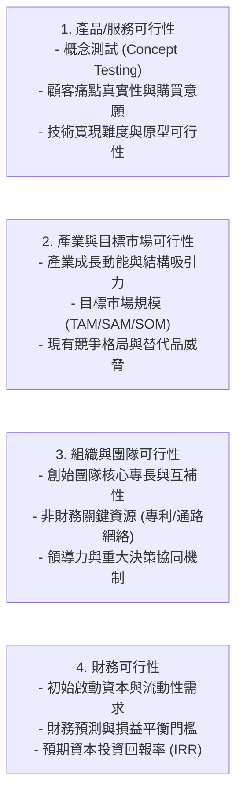
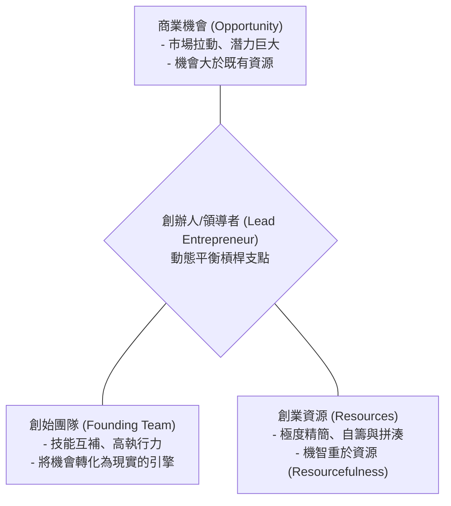
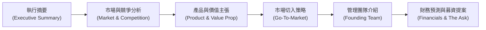
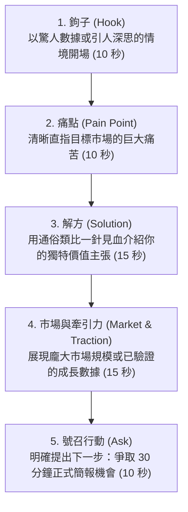
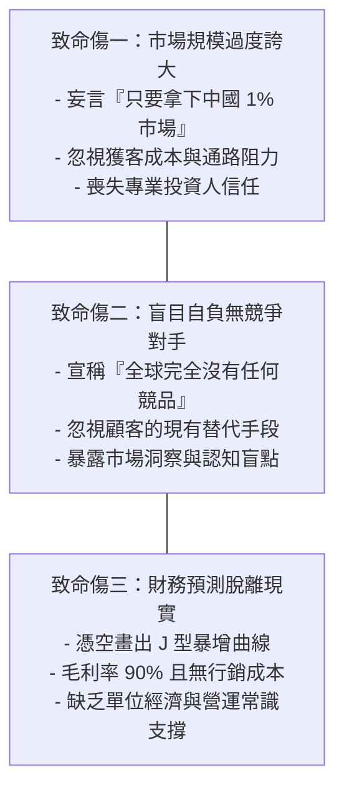

---
{"dg-publish":true,"permalink":"/04/10/w02/","dg-note-properties":{}}
---

# W02_創業構想與商業計畫
- **課程**：[[04_主題選修/10_創業與企業財務策略/_創業與企業財務策略 MOC\|創業與企業財務策略]]
- **前置章節**：[[04_主題選修/10_創業與企業財務策略/W01_創業概論\|W01_創業概論]]
- **後續接續**：[[W03_創新創業與策略思維\|W03_創新創業與策略思維]]
- **標籤**：#PMBA #主題選修 #創業管理 #創業構想 #商業計畫書 #提蒙斯模型 #電梯簡報 #投資人視角

---

## 🗺️ 單元心智圖架構

> 📌 **原始檔維護**：[開啟 Xmind 編輯原始檔](<file:///g:/我的雲端硬碟/PMBA/PMBA_Note/04_主題選修/10_創業與企業財務策略/附件/L02_創業構想與商業計畫.xmind>)

---

## 💡 核心摘要
1. **好構想不等於好商機**：點子（Idea）滿天飛且毫無成本，但唯有能精準擊中未滿足的市場痛點、具備清晰顧客付費意願，且能在合理單位經濟下跑通獲利模型的構想，才能轉化為值得追求的商業機會。
2. **商業計畫書的讀者是投資人而非自己**：創業者常陷入自嗨型技術細節，BP 的核心使命是向外部利害關係人（特別是機構投資人）進行結構化價值溝通，降低資訊不對稱與認知風險，而非自我陶醉的規格手冊。
3. **執行摘要決定計畫書的生死（黃金兩頁原則）**：專業創投每日面臨海量案子，平均僅花 3 分 44 秒瀏覽一份提案；若無法在執行摘要前兩頁清晰交代痛點、解方、競爭壁壘與團隊亮點，整份計畫將直接被丟棄。
4. **計畫書的本質是動態假設檢驗而非保證成功**：商業計畫書不是刻在石板上的教條，而是新創團隊在極端不確定性中，對市場、產品、營運與財務假設進行科學檢驗的行動清單，必須隨市場反饋持續迭代。
5. **早期投資的核心在於「投人重於投事」**：產品和商業模式在市場碰撞中幾乎必定經歷軸轉；創始團隊的能力互補性、抗壓韌性、適應力與歷史戰功（Track Record），是投資人評估早期項目最核心的依歸。

---

## 📚 核心觀念與理論框架

### 創業構想形成與商機篩選

#### 構想 vs. 商機的本質差異
在創業初期，創業者腦海中往往湧現無數創意點子，但卓越的 [[98_商業概念庫/創業機會辨識\|創業機會辨識]] 能夠冷靜區分「構想（Idea）」與「商業機會（Opportunity）」的本質鴻溝：
- **創業構想（Idea）**：源自個人的主觀靈感、技術熱情或生活偶發經驗。構想通常是未經驗證的假設，無法保證市場存在足夠規模的真實需求，更無法保證顧客願意為此付費。
- **商業機會（Opportunity）**：具備市場吸引力（Attractiveness）、持久性（Durability）、及時性（Timeliness），且緊密錨定於能為終端使用者創造非對稱價值的產品或服務。

| 比較維度 | 創業構想 (Idea) | 商業機會 (Opportunity) |
| :--- | :--- | :--- |
| **驅動來源** | 創辦人自身喜好或「我有這項技術」。 | 市場真實痛點與未被滿足的剛性需求。 |
| **顧客驗證** | 停留在口頭問卷或假設「大家應該會買」。 | 具備實質付費意願、預購訂單或登陸頁數據。 |
| **經濟模型** | 缺乏具體的獲客成本與單位利潤分析。 | 單位經濟模型（Unit Economics）清晰，LTV/CAC > 3。 |
| **時間窗口** | 靜態存在，隨時可以被提出。 | 具備動態的機會之窗（Window of Opportunity）。 |

#### 商業可行性分析四大維度
在正式投入大量資源撰寫厚重的商業計畫書之前，團隊必須先透過系統化的 [[98_商業概念庫/商業可行性分析\|商業可行性分析]] 進行壓力測試，以極低成本在紙面上排除潛在致命缺陷（Fatal Flaws）：

---

### 經典創業模型：提蒙斯創業模型

#### 提蒙斯動態平衡三要素
美國巴布森學院著名創業學大師傑弗里·提蒙斯（Jeffry Timmons）提出的 [[98_商業概念庫/提蒙斯創業模型\|提蒙斯創業模型]] 指出，創業成功的本質在於三大要素的動態匹配與持續平衡：

1. **商業機會（Opportunity）**：機會是創業旅程的起點與核心拉動力。在健康的新創模型中，機會的規模遠大於當前團隊所掌握的資源，這正是創業挑戰的根源。
2. **創始團隊（Founding Team）**：團隊是將機會轉化為實際商業價值的核心執行引擎。團隊必須具備高度的專業互補性與靈敏適應力。
3. **創業資源（Resources）**：新創初期資源永遠極度匱乏。提蒙斯模型強調「機智重於資源（Resourcefulness over Resources）」，創業者應透過精實思維與資源拼湊，以最小資源撬動最大效益。
4. **創辦人作為平衡槓桿（Lead Entrepreneur）**：創辦人如同雜耍演員，必須在充滿高度不確定性的環境中，動態調整機會、團隊與資源的配置比重。

#### 企業成長進程的三部曲
提蒙斯模型在企業生命週期的演進中展現不同的核心任務：
- **創業（0 到 1）**：核心在於「辨識機會與組織資源」，透過驗證確立 PMF。
- **興業（1 到 n）**：核心在於「建立制度與穩健營運」，將單點成功轉化為可複製的商業運作。
- **展業（n 到 N）**：核心在於「資本賦能與規模擴張」，推動跨市場放量與建立長期防禦壁壘。

---

### 商業計畫書標準架構與核心模組

一份標準的 [[98_商業概念庫/商業計畫書\|商業計畫書]]（Business Plan, BP）是新創企業向資本市場展現專業度與商業可行性的綜合藍圖：

#### 執行摘要：黃金兩頁原則
- [[98_商業概念庫/執行摘要\|執行摘要]] 是全份計畫書中閱讀率最高、決定生死存亡的章節。
- **黃金兩頁原則**：篇幅嚴格限制在 2 頁以內，必須精煉涵蓋五大核心要件：
  1. **市場痛點與機會（The Problem & Opportunity）**：顧客面臨的急迫難題。
  2. **產品與 [[98_商業概念庫/價值主張\|價值主張]]（Solution & Value Proposition）**：獨特且不可替代的解方。
  3. **市場規模與牽引力（Market Size & Traction）**：初期營運亮點與數據指標。
  4. **競爭優勢與壁壘（Unfair Advantage & Moat）**：巨頭難以輕易跨越的護城河。
  5. **財務預期與募資需求（Financial Highlights & The Ask）**：融資金額與退出回報。

#### 市場與競爭分析
1. **TAM / SAM / SOM 市場規模三層估算**：
   - [[98_商業概念庫/總體潛在市場\|總體潛在市場]]（TAM）：全球或全行業的理論最高市場容量。
   - [[98_商業概念庫/服務可達市場\|服務可達市場]]（SAM）：受限於目前地理、規格與通路，企業實際能服務的市場。
   - [[98_商業概念庫/目標市場選擇\|目標市場選擇]]（SOM）：企業在 1~3 年內初期鎖定並具體能拿下的市場份額。
   - 估算方法必須以「由下而上（Bottom-up）」為主，「由上而下（Top-down）」為輔，避免不切實際的幻想推論。
2. **[[98_商業概念庫/競爭矩陣\|競爭矩陣]]（Competitive Matrix）**：
   - 透過二維四象限圖或特徵對比清單，客觀展示自身在核心顧客價值維度上的獨特優勢，切忌刻意隱瞞強大競品的存在。

#### 營運與行銷推廣計畫
- **[[98_商業概念庫/市場切入策略\|市場切入策略]]（Go-To-Market, GTM）**：明確描繪如何獲取首批種子客戶（Early Adopters）、定價策略、銷售管道與轉換漏斗，展示具備可規模化獲客能力的商業落地路徑。

#### 管理團隊介紹
- 投資人極度看重 [[98_商業概念庫/創始團隊\|創始團隊]] 的背景契合度。必須清晰展現團隊成員在技術、營運與市場上的互補性（Hacker, Hustler, Hipster），並強調過往的成功軌跡（Track Record）。

#### 財務預測與募資提案
1. **3~5 年 [[98_商業概念庫/財務預測\|財務預測]]**：
   - 建立驅動型財務模型（Driver-based Model），包含損益表、現金流量表與資產負債表。
   - 提供保守（Base）、樂觀（Bull）、悲觀（Bear）三情境預測。
2. **[[98_商業概念庫/損益平衡分析\|損益平衡分析]]（Break-even Analysis）**：
   - 嚴格區分固定成本與變動成本，計算出達到損益平衡點（BEP）所需的營收與銷售量：
     $$Q^* = \frac{FC}{P - VC} = \frac{FC}{CM}$$
3. **[[98_商業概念庫/資金用途規劃\|資金用途規劃]]（Use of Proceeds）與 [[98_商業概念庫/現金跑道\|現金跑道]]（Cash Runway）**：
   - 明確說明募集資本在研發、行銷、人力等維度的分配比例，確保資金能支撐 18~24 個月的現金跑道，並與明確的營運里程碑掛鉤。
4. **[[98_商業概念庫/退場策略\|退場策略]]（Exit Strategy）**：
   - 為投資人規劃清晰的資本回收路徑（併購 M&A、IPO 或次級市場轉讓），展現預期投資回報率。

---

### 商業簡報與溝通技巧

#### 電梯簡報黃金架構
[[98_商業概念庫/電梯簡報\|電梯簡報]]（Elevator Pitch）要求創業者在 30 至 60 秒內激發對方的強烈興趣，其黃金五步架構如下：

#### 投資人募資簡報標準邏輯
一份標準的 [[98_商業概念庫/募資簡報\|募資簡報]]（Pitch Deck）通常控制在 10~12 頁，遵循嚴謹的敘事說服邏輯：
1. **封面（Cover & Vision）**：一句話講清楚你是誰與宏大願景。
2. **痛點（The Problem）**：現狀有多糟糕、顧客有多痛苦。
3. **解方（The Solution）**：你的產品如何完美解決問題。
4. **市場規模（Market Size）**：TAM、SAM、SOM 的客觀推算。
5. **產品與技術（Product & Technology）**：產品實體展示與智財權防禦壁壘。
6. **商業模式（Business Model）**：如何賺錢、定價策略與單位經濟。
7. **市場切入策略（Go-To-Market）**：如何以低成本高效獲客。
8. **競爭分析（Competition）**：競爭矩陣與不可替代的非對稱優勢。
9. **管理團隊（Team）**：為什麼是這個團隊能贏得這場戰役。
10. **財務預測與牽引力（Financials & Traction）**：關鍵營運數據與 3 年預估。
11. **募資需求與資金用途（The Ask & Use of Proceeds）**：募資金額、資金分配與對應里程碑。
12. **結尾與願景（Vision & Contact）**：重申核心價值，引導後續 Q&A。

---

## ⚠️ 實務應用與經理人思維

### 商業計畫書常見致命傷

1. **市場規模過度誇大（1% 幻覺）**：
   - 許多初創團隊習慣以宏觀產業數據自欺欺人，宣稱「這個行業有萬億規模，我們只要拿 1% 就發財了」。
   - 經理人思維：專業投資人重視的是「由下而上（Bottom-up）」的單位經濟推導。沒有通路、沒有獲客策略的 1%，在實務上等於 0%。
2. **無競爭對手盲目自負**：
   - 創業者常宣稱「我們這項技術世界第一，市場上沒有任何對手」。
   - 經理人思維：如果一個領域真的完全沒有競爭者，通常代表市場根本不存在。顧客永遠有現成的「替代手段」（包括維持現狀不買）。坦誠分析競品並凸顯自身非對稱防禦優勢，才是成熟經理人的表現。
3. **財務預測脫離現實**：
   - 預測報表中營收呈現毫無阻力的 J 型曲線上揚，費用卻平緩不變。
   - 經理人思維：每一分營收的增長都伴隨著獲客成本（CAC）、伺服器頻寬與人力擴張。投資人審查財務模型是在檢驗創始人的商業運作邏輯，而非相信那個精確的數字。

### 靜態文件陷阱：BP 是假說清單而非刻在石板上的教條
1. **結合精實創業的敏捷思維**：
   - 商業計畫書的撰寫過程，本質是創始團隊對事業假說進行系統性梳理的「思想演習」。
   - 在實際運作中，團隊必須秉持 [[98_商業概念庫/精實創業\|精實創業]] 原則，將 BP 視為一份動態的「待驗證假設清單」。一旦真實市場數據與計畫書衝突，必須果斷調整策略甚至推動軸轉，切忌為了死守計畫書而把公司帶入深淵。

### 投資人評估的核心：「投人重於投事」
1. **為什麼團隊是早期投資的最關鍵指標**：
   - 統計顯示，創投在審視 Pitch Deck 時，花費時間最長的往往是團隊介紹頁。
   - 商業計畫書中的產品設計、定價模型與通路策略，在進入真實市場後幾乎有 80% 以上會被推翻或重構；但一個具備深厚行業認知、高度技能互補、極強執行力與抗挫折韌性的創始團隊，能夠在無數次失敗中迅速學習並找到生路。
2. **經理人自我修煉**：
   - 在尋求融資與推進事業時，創業者最應打磨的不是華麗的投影片特效，而是展現自身作為「機會尋求者、風險承擔者與資源整合者」的領袖特質與誠信底色。
