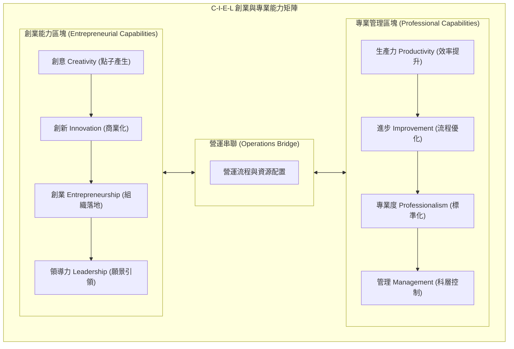
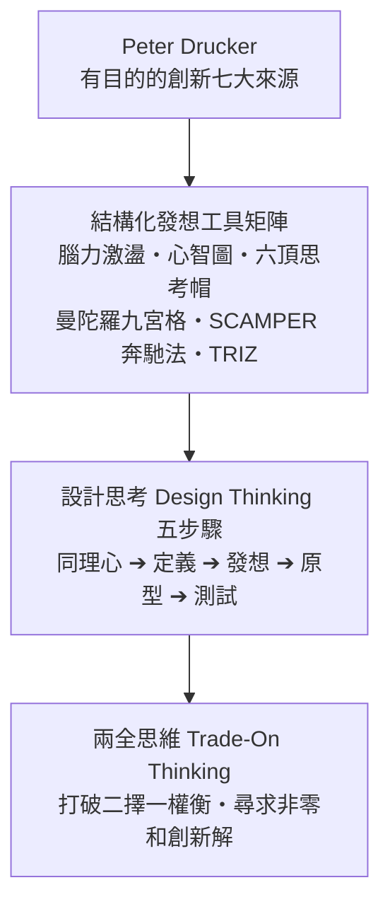
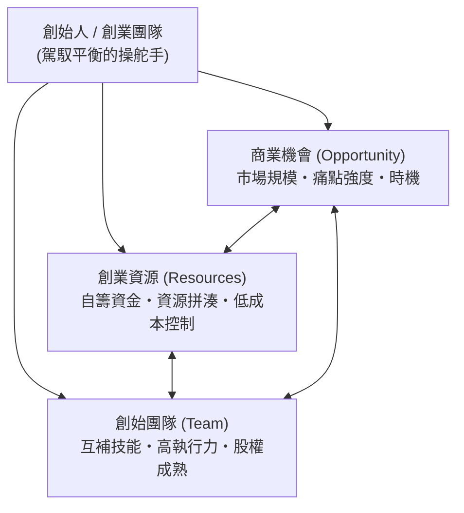
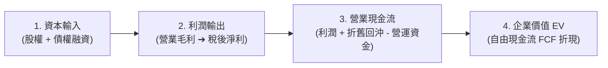
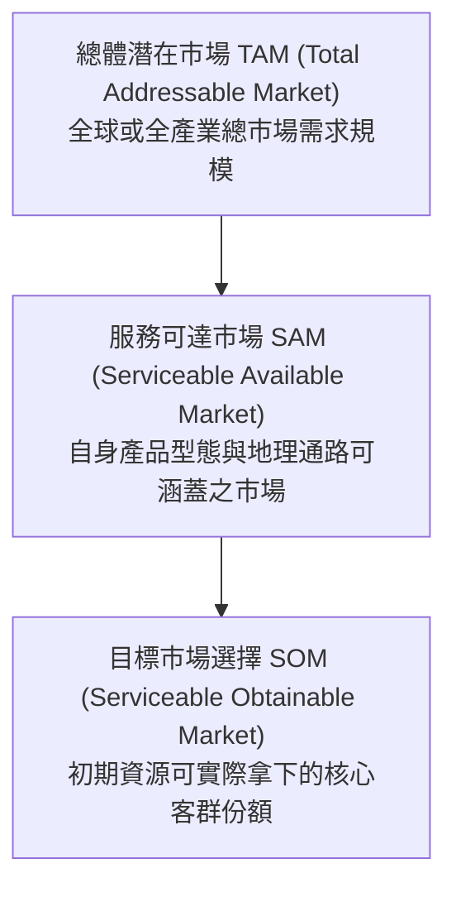

---
{"dg-publish":true,"permalink":"/04/10/w02/","dg-note-properties":{}}
---

# W02_創業構想與商業計畫
- **課程**：[[04_主題選修/10_創業與企業財務策略/_創業與企業財務策略 MOC\|創業與企業財務策略]]
- **前置章節**：[[04_主題選修/10_創業與企業財務策略/W01_創業概論\|W01_創業概論]]
- **後續接續**：[[W03_創新創業與策略思維\|W03_創新創業與策略思維]]
- **標籤**：#PMBA #主題選修 #創業管理 #創業構想 #商業計畫書 #提蒙斯模型 #電梯簡報 #投資人視角 #課堂實務案例

---

## 🗺️ 本週架構心智圖

> 📌 **原始檔維護**：[開啟 Xmind 編輯原始檔](<file:///g:/我的雲端硬碟/PMBA/PMBA_Note/04_主題選修/10_創業與企業財務策略/附件/L02_創業構想與商業計畫.xmind>)

---

## 💡 核心摘要

1. **構想滿天飛，商機在於「痛點、付費意願與單位經濟」**：好的創意（Idea）毫無成本，唯有能精準擊中未滿足的 [[98_商業概念庫/市場痛點\|市場痛點]]、具備清晰顧客付費意願，且能在可持續的單位經濟下跑通獲利模型的構想，才能經由 [[98_商業概念庫/商業可行性分析\|商業可行性分析]] 轉化為值得追求的 [[98_商業概念庫/創業機會辨識\|創業機會辨識]]。
2. **商業計畫書是向投資人進行「結構化風險驗證」的溝通載體**：[[98_商業概念庫/商業計畫書\|商業計畫書]]（BP）絕非創業者自嗨的技術規格手冊，其核心使命是消除外部投資人的資訊不對稱。專業創投平均僅花 **3 分 44 秒** 瀏覽一份 BP，因此前置的 [[98_商業概念庫/執行摘要\|執行摘要]]（黃金兩頁）與 [[98_商業概念庫/創始團隊\|創始團隊]] 背景直接決定提案的生死。
3. **拒絕自嗨式幻想，貫徹 TAM $\rightarrow$ SAM $\rightarrow$ SOM 嚴密市場估算**：嚴禁在 BP 中聲稱「只要吃下 1% 大市場就能獲利」的自上而下（Top-down）空想；必須採取自下而上（Bottom-up）的漏斗推導，清晰界定 [[98_商業概念庫/總體潛在市場\|總體潛在市場]]（TAM）、[[98_商業概念庫/服務可達市場\|服務可達市場]]（SAM）與最具備初期造血能力的 [[98_商業概念庫/目標市場選擇\|目標市場選擇]]（SOM）。
4. **資本輸入到企業價值的四階傳導與折舊回沖機制**：企業營運遵循「資本輸入 $\rightarrow$ 利潤輸出 $\rightarrow$ 營業現金流 $\rightarrow$ 企業價值」的傳導路徑。新創初期忍受負現金流進行概念驗證（POC）；成熟期資本支出（CapEx）放緩後，前期龐大固定資產折舊回沖將釋放強勁的 [[98_商業概念庫/自由現金流量\|自由現金流量]]，驅動股價與估值重估。
5. **動態平衡機會、團隊與資源，備妥 6 個月現金跑道**：依據 [[98_商業概念庫/提蒙斯創業模型\|提蒙斯創業模型]]，創業者是駕馭機會、團隊與資源動態平衡的操舵手。在總體高利率與高通膨週期下，企業必須做好 [[98_商業概念庫/資金用途規劃\|資金用途規劃]] 與 [[98_商業概念庫/損益平衡分析\|損益平衡分析]]，常態性維持至少 6 個月以上的 [[98_商業概念庫/現金跑道\|現金跑道]]（Cash Runway），並及早規劃合適的 [[98_商業概念庫/退場策略\|退場策略]]。

---

## 🎙️ 教授課堂實戰觀點與案例深度剖析（逐字稿精萃）

### 一、【破除迷思與實務警語】

1. **創投審查商業計畫書的「3 分 44 秒殘酷法則」與「黃金兩頁原則」**：
   - 教授引述統計數據指出，創始團隊往往耗費 3 到 6 個月心血撰寫厚達數十頁的商業計畫書，但**機構投資人（VC）平均僅花費 3 分 44 秒即決定是否繼續深入評估或直接丟棄**。
   - 創投業者在極短時間內最優先掃描的並非繁複的產品功能細節，而是：
     1. **[[98_商業概念庫/執行摘要\|執行摘要]]（Executive Summary）**：能否在 2 頁內講清楚痛點、解方、商業模式與募資需求。
     2. **[[98_商業概念庫/創始團隊\|創始團隊]]（Founding Team）**：核心人物（Key Person）是否有行業實戰經驗與互補技能？
   - **實務心法**：產品隨時可以在市場反饋下迭代或 Pivot（軸轉），但唯有對的團隊才能帶領公司在危機中轉型。
2. **破除「只要拿下 1% 中國/全球市場就能發財」的自嗨空想**：
   - 課堂上教授嚴厲吐槽初次創業者最常犯的「Top-down 數字遊戲」：宣稱某產業全球產值達數兆美元，「我們只要拿下 1% 甚至 0.1%，一年就有數十億營收」。
   - 這種論述在專業投資人眼中屬於缺乏落地思考的自嗨。創業者必須展現由下而上（Bottom-up）的 [[98_商業概念庫/市場切入策略\|市場切入策略]]（GTM Strategy）：從單店、單一垂直利基市場的單位經濟模型（Unit Economics）出發，精確推算獲客成本（CAC）、顧客終身價值（LTV）與實際可觸達的 SOM。
3. **現金流量表的「折舊回沖機制」與成熟期「現金牛效應」**：
   - 課堂互動中，學員常困惑「為何企業資本支出停止擴張後，現金流量表會湧現巨額正現金流？」
   - 教授以台積電與重工業為例深度拆解：企業在高速擴張期投入巨額資本支出（CapEx）購置不動產、廠房與設備（PP&E），會計上依耐用年限逐期提列折舊（Depreciation）。當企業邁入成熟期（如 2029 年後建廠節奏放緩），現金支出大幅下降，但前期龐大折舊作為「非現金費用」重新加回營業現金流，釋放出極其龐大的自由現金流量（Free Cash Flow），成為發放高額現金股利或實施庫藏股（Share Repurchase）的來源。
4. **融資工具對發行者 vs. 投資人的非對稱風險剖析**：
   - **發行者（企業創辦人）視角**：債權融資具備法定義務，負債比率過高會大幅提高破產與清算風險（高風險）；股權融資無固定還本付息壓力，對企業營運而言屬於低財務風險。
   - **投資人（資本市場）視角**：債權人具備法律契約請求權，破產時享有優先受償權（低風險）；股東僅享有剩餘財產請求權（Residual Claim），若公司清算可能一無所有（高風險）。
5. **創投年化報酬率幾何平均公式與投後估值（Post-money）速算法**：
   - 創投評估出場績效的幾何平均年化回報率公式：
     $$\text{ROI} = \left( \frac{\text{賣出估值}}{\text{投入價格}} \right)^{\frac{1}{n}} - 1$$
   - **投後估值（Post-money Valuation）速算公式**：
     $$\text{Post-money 估值} = \frac{\text{投資金額}}{\text{取得股權比例}}$$
     $$\text{Pre-money 估值} = \text{Post-money 估值} - \text{投資金額}$$
     *(例：創投出資 1,000 萬元取得 20% 股權 $\rightarrow$ 投後估值為 5,000 萬元，投前估值即為 4,000 萬元)*。
6. **營運週轉金的「六個月生存底線」與通膨升息週期警訊**：
   - 創業初期必須備妥至少 6 個月以上的營運週轉金與開辦準備金。COVID-19 疫情期間，許多餐飲與服務業僅準備 3 個月週轉金，一旦遭遇外部黑天鵝封控即面臨黑字倒閉。
   - 當前處於高利率與高通膨的總體環境，資金取得成本劇增，估值擴張受到壓制，新創團隊必須更加注重自我造血能力與現金消耗速率（Burn Rate）。
7. **行銷演進史（1.0 到 7.0 認知心智行銷）與 C-I-E-L 創業能力矩陣**：
   - 行銷演進：1.0 產品導向 $\rightarrow$ 2.0 顧客導向 $\rightarrow$ 3.0 人本導向 $\rightarrow$ 4.0 社群數位 $\rightarrow$ 5.0 大數據科技 $\rightarrow$ 6.0 沉浸式體驗（VR/AR/Metaverse） $\rightarrow$ 7.0 認知心智與生成式 AI。
   - **C-I-E-L 創業能力矩陣**：
     - **上半部（創業能力區塊）**：創意（Creativity, C） $\rightarrow$ 創新（Innovation, I） $\rightarrow$ 創業（Entrepreneurship, E） $\rightarrow$ 領導力（Leadership, L）。
     - **下半部（專業管理區塊）**：生產力（Productivity, P） $\rightarrow$ 進步（Improvement, I） $\rightarrow$ 專業度（Professionalism, P） $\rightarrow$ 管理（Management, M）。
     - 台灣企業長年擅長下半部的供應鏈管理與製造管理財，但在開創第二成長曲線時，更需強化上半部的創業精神與領導能耐。

---

### 二、【課堂深度案例剖析】

#### 案例 1：鴻海（2317）Gordon 股利折現模型（DDM）實戰測算
- **背景情境**：課堂上探討如何將成熟企業的股利政策與成長預期，轉換為資本市場的內在價值評價。
- **參數設定與數學推導**：
  - **公式**：$P_0 = \frac{D_1}{r_e - g}$
  - **歷史配息與成長率**：鴻海過去十年平均股利複合成長率 $g = 5.0\%$，2026 年配發 7.172 元，預估 2027 年次期現金股利 $D_1 = 7.172 \times (1 + 5\%) = 7.53$ 元。
  - **權益成本（Cost of Equity）**：依 CAPM 模型估算，鴻海 $r_e$ 落於 $6.5\% \sim 10\%$，課堂取基準值 $8.0\%$。
  - **基準合理估值**：
    $$P_0 = \frac{7.53}{8.0\% - 5.0\%} = \frac{7.53}{3.0\%} = 251.0 \text{ 元}$$
    *(對比課堂當日收盤價約 207 元，具備逾 20% 之安全邊際)*。
  - **成長情境敏感度分析**：若 AI 伺服器機櫃與代工垂直整合帶動市場給予更高評價，使折現利差收窄至 $2.5\%$（例如 $r_e = 7.5\%, g = 5.0\%$），目標價格推導為：
    $$P_0 = \frac{7.53}{2.5\%} = 301.2 \text{ 元}$$
- **教授點評**：任何商業計畫書中的財務預測，本質上都是在向投資人證明未來的股利分配能力與自由現金流折現價值。

#### 案例 2：Airbnb 從氣墊床到千億旅宿帝國（資源重組與網路效應）
- **背景情境**：創辦人 Brian Chesky 與 Joe Gebbia 為分擔舊金山昂貴房租，在客廳擺放三張充氣床墊並提供自製早餐，向參加設計展會找不到飯店的旅客收費。
- **商業模式突破**：
  - **輕資產營運（Asset-light）**：不持有任何實體客房，透過雙邊線上平台聚合全球閒置房源。
  - **[[98_商業概念庫/網絡效應\|網絡效應]] 護城河**：更多房東加入帶來豐富房源，吸引更多旅客預訂，進而吸引更多房東進駐，形成自我強化的雙邊飛輪。
  - **「Do things that don't scale」商管真諦**：早期未盲目花錢買廣告，創辦人親自飛赴紐約，帶著專業相機逐戶為房東免費拍攝高畫質房源照片，大幅提升點擊率與訂房轉化率，成為實現 PMF（產品市場適配）的關鍵樞紐。
- **財務韌性**：2020 年遭遇疫情全球旅遊停擺危機，果斷發行 20 億美元債券與認股權證融資，隨後在年底逆勢 IPO，市值突破 1,000 億美元。

#### 案例 3：精實轉向（Pivot）經典實證：藍河科技與奇異能源
- **藍河科技（Blue River Technology）**：
  - 初期設想：研發高爾夫球場專用自動割草機器人。
  - 驗證挫敗與轉向：團隊走出辦公室進行 10 週、超過 100 位客戶訪談，發現高爾夫球場維護主管對自動割草機反應冷淡。團隊果斷執行 [[98_商業概念庫/商業模式軸轉\|商業模式軸轉]]（Pivot），將機器視覺技術轉向農田「免化學藥劑精準除草機」，大幅降低 90% 除草劑使用量，迅速獲得 300 萬美元創投融資，最終以 3.05 億美元被農業巨頭 John Deere 高價併購。
- **奇異能源儲存（GE Durathon Battery）**：
  - 原定計畫：斥資建立龐大電池工廠，鎖定資料中心（Data Center）備用電源市場。
  - 精實驗證發現：深入客戶後發現資料中心對新電池技術極度保守且轉換成本極高；團隊果斷剔除原市場假設，轉向電力公司電網調度與開發中國家通訊基地台，成功挽救數億美元投資。

#### 案例 4：學長姐期末創業計畫書（BP）實作精萃
- **車宿露營預訂平台（Camper Booking Platform）**：
  - **痛點捕捉**：台灣露營風潮興起，但車宿場地、改裝車輛租賃、活動門票資訊高度碎片化，預約流程繁瑣且合法性模糊。
  - **商業設計**：打造一站式整合預約平台，結合生活風格社群與認證機制，推算全台 200 萬露營人口之 TAM/SAM/SOM，設計 10% 雙邊交易抽成模式。
- **Nurse AI 跨院智慧排班引擎**：
  - **痛點捕捉**：台灣醫療體系護理人力嚴重短缺，護理長每月耗費數十小時人工協調三班輪替，常因突發請假造成人力缺口與過勞。
  - **技術解方**：導入生成式 AI 與約束最佳化演算法（Constraint Programming），自動生成兼顧法規與個人偏好的智慧班表，提供跨院支援媒合機制。

#### 案例 5：聯發科本益比（P/E 73 倍）與自由現金流為負之估值矛盾
- **現象觀察**：聯發科單季自由現金流量出現負值（每股自由現金流約負 10 元），但市場本益比卻高達 73 倍，外資券商目標價持續上調至 5,000～7,000 元。
- **底層邏輯**：資本市場當前對先進科技股的定價，並非單純反映歷史財報現金流，而是對 2027～2028 年 AI 世代策略聯盟（如與 Google 合作 TPU 客製化晶片、與 NVIDIA 合作車用智慧座艙）之長期複合成長折現。

---

### 三、【課堂互動與關鍵問答】

- **Q1：雨雙同學提問：現金流量表中，資本支出（CapEx）為什麼會有回流為正的現象？**
  - **教授答覆**：
    - 嚴格而言，購置資產當期的資本支出（CapEx）必然為現金流出；但**在現金流量表中，前期已發生的資本支出會轉化為固定資產，並在後續各期提列折舊與攤銷（D&A）**。
    - 折舊在損益表上列為費用（減少帳面利潤），但並未產生實質現金流出；因此在編製現金流量表時，必須將折舊額「非現金回沖」加回營業淨現金流。當企業進入成熟期停止大規模建廠時，折舊回沖金額將大幅超過當期新增的資本支出，使自由現金流（$\text{FCF} = \text{營業現金流} - \text{CapEx}$）呈現巨額正流入。
- **Q2：創投（VC）在審核 BP 時，為什麼認為產品隨時可改、團隊才是決定性關鍵？**
  - **教授答覆**：
    - 市場競爭環境高度動態，任何初始產品構想在推向市場接觸真實用戶後，超過 80% 需要調整功能、定價或通路。
    - 平庸的團隊即使拿到卓越的產品點子，也會在執行與競爭中搞砸；但卓越的創始團隊（具備高執行力、韌性與市場敏銳度）能在產品受挫時迅速 Pivot 找到新生機。因此創投實務上「投人（Key Person）重於投項目」。
- **Q3：期末商業計畫書（BP）路演的團隊分工與評審標準為何？**
  - **教授答覆**：
    - 每組 7 人為原則，必須體現跨職能互補分工（CEO 策略願景、CFO 財務預測與股權、CTO 技術產品、COO 營運行銷）。
    - 評分採三方加權：**授課教授 50% + 中信證券創投總經理業師 30% + 全體學員互評 20%**。業師將以真金白銀的投資人視角，嚴格檢視商業可行性、單位經濟與防禦壁壘。

---

## 📚 核心觀念與理論架構（完整涵蓋教材投影片內容）

### 一、創意思考與結構化發想工具庫

1. **Peter Drucker 有目的的創新七大來源**：
   - 01. **意料之外的事件（Unexpected Occurrences）**：未預期的成功或失敗中蘊含新商機。
   - 02. **不一致的情況（Incongruities）**：現實狀況與主觀預期之間的落差。
   - 03. **程序上的需要（Process Needs）**：既有作業流程瓶頸或不便之處的改善。
   - 04. **產業與市場結構的改變（Industry & Market Changes）**：外部法規或競爭版圖重構。
   - 05. **人口統計的變化（Demographic Changes）**：少子化、高齡化與家戶結構轉變。
   - 06. **認知的變化（Changes in Perception）**：消費者對健康、永續生活型態價值觀轉向。
   - 07. **新知識（New Knowledge）**：科學突破、新材料與新技術的商業應用。
2. **結構化發想工具矩陣**：
   - **腦力激盪法（Alex Osborn）**：暫緩評判、鼓勵狂野想法、追求數量、結合改善。
   - **心智圖法（Tony Buzan）**：中央關鍵詞、放射性思考（Radiant Thinking）、圖像色彩連結。
   - **六頂思考帽（Edward de Bono）**：白帽（客觀事實）、紅帽（直覺情感）、黑帽（風險批判）、黃帽（樂觀價值）、綠帽（創意探索）、藍帽（流程統籌）。
   - **曼陀羅九宮格思考法**：核心主題置中，向外開展 8 項關聯，採放射性與螺旋狀思考。
   - **奔馳法 SCAMPER（七大檢核切入點）**：
     - **S 替代（Substitute）**：更換材料、流程或零組件。
     - **C 合併（Combine）**：結合不同服務或功能。
     - **A 調適（Adapt）**：借鑑其他領域之成功做法。
     - **M 修改（Modify）**：放大、縮小或改變屬性特質。
     - **P 他用（Put to other uses）**：開拓次級市場或延伸使用情境。
     - **E 消除（Eliminate）**：簡化不必要功能，去蕪存菁。
     - **R 重組（Rearrange）**：反轉順序、顛倒視角尋找新解。
   - **TRIZ 創造性問題解決理論**：區分技術矛盾（優化參數 A 導致參數 B 惡化）與物理矛盾（同一參數具有相反需求），尋求徹底消除矛盾而非折衷妥協。
3. **設計思考 Design Thinking 五步驟**：
   - **1. 同理心（Empathize）** $\rightarrow$ **2. 定義問題（Define）** $\rightarrow$ **3. 創意發想（Ideate）** $\rightarrow$ **4. 製作原型（Prototype）** $\rightarrow$ **5. 測試驗證（Test）**。
4. **兩全思維（Trade-On Thinking）**：
   - 拒絕在成本與品質、速度與客製化之間單向妥協（Trade-off），尋求創造性的雙贏解方。

---

### 二、創業構想形成與商機篩選（兩階段可行性評估）

1. **價值轉化三階跳**：
   - **創意（Idea）**：點子階段，檢驗原創性與獨特性。
   - **創新（Innovation）**：商品階段，檢驗商品化可行性與顧客價值承諾。
   - **創業（Entrepreneurship）**：模式階段，檢驗公司化運作、長期獲利與永續生存能力。
2. **創業構想發展八步驟**：
   - **步驟 1：市場掃描**（顧客輪廓、競爭對手、產業趨勢）。
   - **步驟 2：定義業務**（產品服務範疇、核心商業機會點）。
   - **步驟 3：市場與產品定位**（STP 分析、利基點與 [[98_商業概念庫/價值主張\|價值主張]]）。
   - **步驟 4：決定經營模式與組織型態**（獨資、合夥、有限公司、股份有限公司）。
   - **步驟 5：思考如何執行**（資金來源、技術取得、團隊互補、行銷通路）。
   - **步驟 6：可行性分析與風險評估**（全面檢驗商業構想是否站得住腳）。
   - **步驟 7：撰寫經營計畫書（BP）**（結構化梳理營運策略與財務預測）。
   - **步驟 8：資金募集與股權規劃**（融資輪次設計與股權結構分配）。
3. **兩階段可行性評估檢核表**：
   - **初步評估 8 大關鍵檢視**：
     1. 是否符合專長且具競爭優勢？ 2. 市場空間與規模是否可行？ 3. 技術與量產是否就緒？ 4. 面對同儕競爭是否可行？ 5. 獲利模式與定價是否可行？ 6. 潛在風險是否在承受範圍內？ 7. 資金、人脈、團隊資源是否足夠？ 8. 創辦團隊是否願意長期（5～10 年）全心投入？
   - **再次評估 5 大構面深入審視**：
     - **消費者構面**：是否切中強烈痛點？市場成長潛力能否長期養活企業？
     - **科技技術構面**：關鍵技術是否完全掌握？原料採購與量產規模是否可行？
     - **法律法規構面**：智慧財產權是否侵權？環保、公共衛生、產業監管是否有疑慮？
     - **通路構面**：現有通路能否覆蓋？對通路合作夥伴是否有足夠讓利吸引力？
     - **財務資金構面**：啟動與營運週轉金是否充足？募資方案與損益平衡時間點是否合理？

---

### 三、提蒙斯創業模型與新創（Startup）本質定義

1. **四大經典學理模式比較**：
   - **[[98_商業概念庫/提蒙斯創業模型\|提蒙斯創業模型]]（Timmons Model）**：創業是由「機會、資源、團隊」三大要素所驅動的動態平衡過程，創始人扮演動態調配資源與引導團隊捕捉機會的操舵手。
   - **Bruyat & Julien 模式**：聚焦「創業者個人特質」與「新創事業體創造」之間的雙向動態互動能耐。
   - **Dollinger 模式（資源基礎觀點 RBV）**：創業由創業成員（Individuals）、環境（Environment）、組織（Organization）與資源能耐（Resources & Capabilities）四大構面共同交互作用。
   - **劉常勇與謝如梅整合模式**：整合創業家/團隊、創業機會、創業資源、創業環境與創業績效五大構面。
2. **新創企業（Startup）本質定義**：
   - **核心定義**：由創業家創立，旨在尋求、發展和驗證「可擴展、可重複商業模式」的暫時性組織（對比成熟企業在已知模式下執行營運）。
   - **四大核心特徵**：巨大高成長潛力、極度高風險與不確定性、追求技術與模式創新突破、高度依賴外部融資輪次推進。
   - **台灣代表性新創個案**：AmazingTalker（線上語言學習媒合）、CuboAi（AI 智慧寶寶攝影機）、CyCraft（奧義智慧，AI 資安防禦）、Dcard（年輕世代社群）、FunNow（即時休閒娛樂預訂）。

---

### 四、課堂白板推導專題一：從資本輸入到企業價值的傳導鏈

1. **四階價值傳導路徑**：
   - **步驟 1：資本輸入（Capital Input）**：資產負債表籌集權益與債權資金。
   - **步驟 2：利潤輸出（Profit Output）**：透過商業營運轉化為營業毛利與稅後淨利。
   - **步驟 3：營業現金流（Cash Flow）**：淨利加上折舊攤銷回沖，扣除營運資金變動與資本支出，形成 [[98_商業概念庫/自由現金流量\|自由現金流量]]（FCF）。
   - **步驟 4：企業價值（Enterprise Value）**：將未來各期自由現金流以 WACC 折現，形成企業內在價值（EV）。
2. **商業模式畫布（BMC）與財務三表映射連動**：
   - **價值主張與顧客端（VP, CS, CH, CR）** $\rightarrow$ 對應損益表營收（Sales Revenue）。
   - **關鍵資源與合作夥伴（KR, KA, KP）** $\rightarrow$ 對應資產負債表資產與負債（Assets, Liabilities）。
   - **成本結構與營收流（Cost Stream, Revenue Stream）** $\rightarrow$ 對應現金流量表（Operating & Investing Cash Flows）。

---

### 五、課堂白板推導專題二：企業生命週期（CLC）之投資與融資矩陣

| 企業生命週期階段 | 投資活動演進重點 | 融資工具配置策略 | 資本結構特性 | 財務衡量焦點 |
| :--- | :--- | :--- | :--- | :--- |
| **新創導入期 (Startup)** | 概念驗證 (POC)、產品原型測試 | 3F 早期融資、天使基金、股權 + 認股權證 | 純股權為主，無舉債能力 | 燒錢率 (Burn Rate)、現金跑道 |
| **高速成長期 (High Growth)** | 商業模式確立 (BMC)、產品研發 (PD/RD) | 創投資本 (VC) A/B 輪、政府專案補助 | 股權為主，少量設備租賃 | 營收成長率、PMF 指標、CAC/LTV |
| **穩定成長期 (Stable Growth)** | 市場份額擴張、通路與行銷佈局 | 創投 C 輪、銀行授信借款、私募股權 (PE) | 股權 + 銀行擔保借款 | 毛利率、營業利益率、ROA |
| **成熟繁榮期 (Maturity)** | 大規模資本支出 (CapEx)、規模經濟 | 首次公開發行 (IPO)、海外可轉債 (ECB)、公司債 | 債權比重拉升，資本結構最適化 | 投入資本報酬率 (ROIC)、自由現金流 |
| **衰退轉型期 (Decline)** | 設備更新放緩、評估策略併購 (M&A) | 債務重組、資產活化、收縮融資 | 高負債比率，面臨去槓桿壓力 | 股東權益報酬率 (ROE)、現金股利發放率 |

- **企業資本結構四大分類**：
  1. **技術資本密集型（如台積電）**：資本支出極高，但負債比率維持在 30% 左右之健康水平。
  2. **金融槓桿型（如金控銀行）**：負債比率高達 90% 以上（存款即為負債），但資本支出極低。
  3. **基礎建設重資產型（如台灣高鐵）**：資本支出與負債比率雙高（負債比 60%～70%）。
  4. **輕資產服務型（如軟體 SaaS、管顧業）**：資本支出與負債比率雙低，高度依賴人力資本。

---

### 六、課堂白板推導專題三：Gordon 股利折現模型與鴻海（2317）估值測算

$$P_0 = \frac{D_1}{r_e - g}$$

- **參數意義**：$P_0$ 為每股合理價值，$D_1$ 為次期預估現金股利，$r_e$ 為股權資本成本（Cost of Equity），$g$ 為股利長期年複合成長率。
- **鴻海（2317）測算數據**：
  - 基準情境：$D_1 = 7.53$ 元，$r_e = 8.0\%, g = 5.0\% \rightarrow P_0 = 7.53 / 3.0\% = 251.0$ 元。
  - 樂觀成長情境：AI 伺服器帶動利差縮小至 $2.5\% \rightarrow P_0 = 7.53 / 2.5\% = 301.2$ 元。
- **WACC 折現率實務區間**：成熟低風險企業約 $6\% \sim 8\%$，中度風險企業約 $10\%$，高風險新創事業折現率常需拉高至 $12\% \sim 14\%$ 以上。

---

### 七、商業計畫書（BP）標準架構與市場規模估算

1. **商業計畫書標準十大核心模組**：
   1. **[[98_商業概念庫/執行摘要\|執行摘要]]（Executive Summary）**：濃縮痛點、解方、競爭優勢、財務預測與募資額度（黃金 2 頁）。
   2. **公司介紹與願景使命**：創立緣起、組織架構、核心價值觀。
   3. **市場痛點與問題界定**：目標客戶面臨的未滿足需求與痛點深度分析。
   4. **產品、技術與服務解方**：核心產品架構、智慧財產權壁壘與產品藍圖。
   5. **市場規模評估（TAM / SAM / SOM）**：自下而上（Bottom-up）嚴密推算可獲得市場。
   6. **產業環境與競爭分析**：五力分析、[[98_商業概念庫/競爭矩陣\|競爭矩陣]]（標竿對比自身優勢）。
   7. **行銷與市場切入策略（GTM）**：目標客群定位（STP）、行銷 4P/4C、獲客路徑。
   8. **營運管理與里程碑規劃**：生產流程、供應鏈管理、階段性發展時間表。
   9. **財務預測與資金用途**：三年損益表預估、[[98_商業概念庫/損益平衡分析\|損益平衡分析]]、[[98_商業概念庫/資金用途規劃\|資金用途規劃]] 與現金跑道。
   10. **股權結構與退場機制**：創始團隊股權分配、融資輪次設計與 IPO / 併購 [[98_商業概念庫/退場策略\|退場策略]]。
2. **市場規模估算方法（TAM $\rightarrow$ SAM $\rightarrow$ SOM）**：
   - **TAM（總體潛在市場）**：假定市場無競爭對手且滲透率 100% 時之整體產值規模。
   - **SAM（服務可達市場）**：受限於自身產品定位、語言、法規與通路限制下可服務之市場。
   - **SOM（目標市場選擇）**：新創初期 1～3 年內，在現有資本與人力下實際能吃下的市場份額。

---

### 八、電梯簡報（Elevator Pitch）與募資簡報（Pitch Deck）架構

1. **電梯簡報（Elevator Pitch）黃金公式（30 秒～2 分鐘）**：
   $$\text{我們為【目標客群】，解決【關鍵痛點】；透過提供【核心產品/解方】，創造【獨特價值】；不同於【主要競爭對手】，我們具備【不可替代的競爭壁壘】。}$$
2. **標準募資簡報（Pitch Deck）10～12 頁架構**：
   - Slide 1: 封面與一句話價值主張
   - Slide 2: 市場痛點與迫切問題
   - Slide 3: 解決方案與產品亮點
   - Slide 4: 市場規模（TAM/SAM/SOM）
   - Slide 5: 商業模式與收費機制
   - Slide 6: 底層技術與智慧財產權壁壘
   - Slide 7: 競爭分析與定位矩陣
   - Slide 8: 行銷獲客與 GTM 策略
   - Slide 9: 創始團隊背景與專業互補
   - Slide 10: 財務預測與關鍵營運里程碑
   - Slide 11: 募資金額、資金用途規劃與投資條款
   - Slide 12: 結尾致謝與聯絡資訊

---

### 九、創意保護四大智慧財產權機制

1. **專利權（Patent）**：發明專利（技術突破）、新型專利（結構改良）、設計專利（外觀造型），具備法定排他壟斷權。
2. **商標權（Trademark）**：保護品牌名稱、LOGO 標誌與商業識別度，防止同業仿冒混淆。
3. **著作權（Copyright）**：軟體原始碼、操作手冊、原創文案與影音內容之自動創作保護。
4. **營業秘密（Trade Secret）**：未公開、具商業經濟價值且採取合理保密措施之配方、客戶名單與製程參數。

---

## ⚠️ 實務應用與經理人思維

1. **以「投資人審查視角」反向雕琢商業計畫書**：
   - 經理人在撰寫 BP 或專案提案時，切忌將篇幅浪費在自我陶醉的技術細節；必須將 70% 的心力放在**執行摘要、市場痛點、商業模式獲利邏輯與團隊執行力**。
2. **建立「動態平衡」的資源配置心態**：
   - 謹記提蒙斯模型：機會、團隊與資源三者永遠處於動態失衡狀態。優秀經理人不是等待所有資源到位才行動，而是以有限的自籌資金（Bootstrapping）小步試錯，以里程碑成果換取下一輪融資。
3. **嚴守財務紀律與安全邊際**：
   - 無論商業願景多麼宏大，任何新創事業的終點都是現金流。經理人必須隨時監控現金跑道（維持 6 個月以上水位），精確計算損益平衡點，並將每一筆資本支出與長期自由現金流折現緊密掛鉤。
