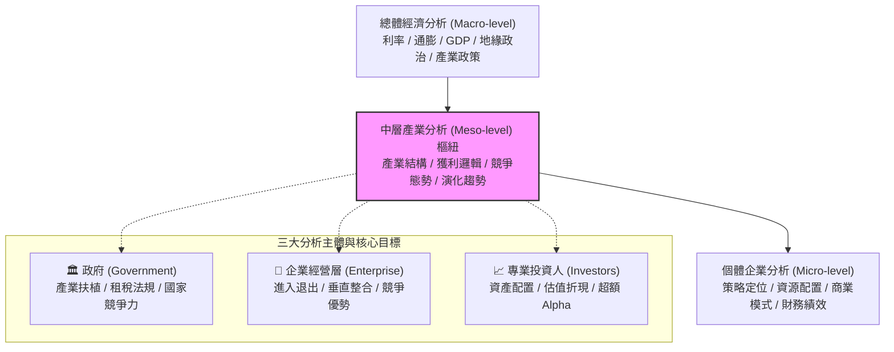
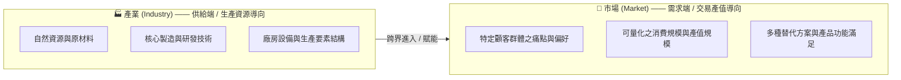
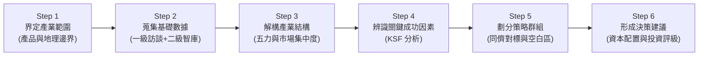

---
{"dg-publish":true,"permalink":"/04/12/02/module-1/m1-1/","tags":["PMBA","產業分析","模組一","中層分析","產業定義","策略分析"],"dg-note-properties":{"aliases":["中層分析","產業分析本質","Meso-level Analysis","產業定義與步驟"],"tags":["PMBA","產業分析","模組一","中層分析","產業定義","策略分析"],"created":"2026-10-02","status":"completed","parent":"[[04_主題選修/12_產業分析與投資策略/00_課程導航與進度/progress_📊 課程與筆記進度追蹤]]"}}
---

# M1-1 [[98_商業概念庫/industry-analysis_產業分析\|industry-analysis_產業分析]]本質與中層定位

> **導航索引**：[[04_主題選修/12_產業分析與投資策略/00_課程導航與進度/progress_📊 課程與筆記進度追蹤\|進度看板]] ｜ [[04_主題選修/12_產業分析與投資策略/00_課程導航與進度/mindmap_產業分析與投資策略_心智圖導航\|全課程心智圖]] ｜ [[04_主題選修/12_產業分析與投資策略/02_模組筆記/Module_1_總論與架構/M1_模組架構心智圖\|本模組心智圖]]  
> **商管核心價值**：[[98_商業概念庫/industry-analysis_產業分析\|industry-analysis_產業分析]]是介於「總體宏觀經濟（Macro）」與「[[98_商業概念庫/enterprise_企業\|enterprise_企業]]微觀個體（Micro）」之間的中層分析（Meso-level Analysis）。其本質在於提升決策品質，幫助高階經理人與投資人穿透總體迷霧，將外部競爭結構轉化為科學化的資本配置與策略護城河。

---

## 一、視覺化知識脈絡圖 (Mermaid Context)

---

## 二、核心理論解構與課堂精華

### 2.1 [[industry-analysis_產業分析]]的本質：中層分析（Meso-level Analysis）
在傳統經濟學與管理學的分工中，常常出現**「宏觀過度抽象、微觀過度片面」**的斷層：
* **總體經濟學（Macro）**：聚焦於 GDP 成長率、央行貨幣政策、通膨與利率傳導，但無法解釋為何在同一個總體[[decline-stage_衰退期|shuai-tui-qi_衰退期]]中，晶圓代工與高階 AI 伺服器依然能賺取超額暴利。
* **個體管理學（Micro）**：過度聚焦於單一[[enterprise_企業]]的領導力、行銷話術或組織文化，卻忽視了如果[[industry-structure_產業結構]]本身缺乏進入障礙，再優秀的團隊也難逃削價競爭的紅海宿命。
* **中層分析（Meso）的樞紐地位**：
  * [[industry-analysis_產業分析]]係針對**特定產業的結構、競爭態勢、獲利邏輯與演化路徑**進行系統性研究。
  * 核心假設根植於**結構決定論（Structure Determines Performance）**：[[industry-structure_產業結構]]決定了廠商的策略選擇空間，進而決定了該產業整體利潤池（Profit Pool）的天花板。

---

### 2.2 三大分析主體與視角差異
課堂講義明確區分了三種不同主體運用[[industry-analysis_產業分析]]的目的與價值取向：

| 分析主體 | 決策核心訴求 | [[industry-analysis_產業分析]]之具體應用 | 關鍵評估指標 |
| :--- | :--- | :--- | :--- |
| **🏛️ 政府機構 (Government)** | 國家競爭力、就業與產業升級 | • 擬定重點扶植產業（如半導體、AI機器人） • 租稅優惠、研發補貼與法規鬆綁 • 引導資源由低附加價值向高附加價值轉移 | 附加價值率、出口產值、就業人口乘數、產業自主率 |
| **🏢 [[enterprise_企業]]經營層 (Management)** | 建立並維持持久競爭優勢 (Sustainable CA) | • 評估新賽道進入與退出時機 • 自製 vs 外購（垂直整合決策） • 差異化定位與多角化布局，極大化[[enterprise-value_企業價值]] | [[operating-income-rate_營業利益率]]、資本報酬率 (ROIC)、市場佔有率 (Share)、護城河深度 |
| **📈 專業投資人 (Investors)** | 獲取[[alpha-excess-return_超額報酬|chao-e-return_超額報酬]] (Alpha) 與控制下跌風險 | • 評估產業成長持續性與週期轉折 • 辨識獲利品質（真成長 vs 短期[[inventory_存貨|cun-huo_存貨]]虛胖） • 建立跨產業資產配置與選股決策 | [[shareholder-equity-return-rate_股東權益報酬率|gu-dong-equity-return-rate_股東權益報酬率]] (ROE)、現金流折現 (DCF)、PEG 估值、Beta 風險值 |

---

### 2.3 產業（Industry）與市場（Market）之本質辨析與邊界挑戰

#### (1) 供給面「產業」vs 需求面「市場」之核心本質界定
在第三週（Class 3）課堂深入討論中，老師特別釐清了高階分析師最常混淆的兩大基本概念——**「何時談產業？何時談市場？」**：

| 比較構面 | 產業 (Industry) | 市場 (Market) |
| :--- | :--- | :--- |
| **定義視角** | **供給面 (Supply Side)**、生產與資源導向 | **需求面 (Demand Side)**、消費者與交易導向 |
| **劃分基礎** | [[enterprise_企業]]所投入的原物料、技術製程、核心專利與生產要素結構之相似性 | 具有相同消費需求、購買力、能估算交易總產值的顧客群體聚集地 |
| **分析核心** | 廠商結構、成本優勢、產能規模、技術壁壘 | 顧客痛點、支付意願 (WTP)、市場容納量 ([[TAM]]/[[SAM]]/[[SOM]]) |
| **典型邊界** | 半導體製造業、電子組裝業、石化煉油業、生物製藥業 | 台灣新車市場 (年約 40 萬輛)、個人抗老美妝市場、[[enterprise_企業]]資安市場 |
| **管理啟示** | 決定[[enterprise_企業]]的**成本結構與技術護城河** | 決定[[enterprise_企業]]的**營收規模天花板與成長空間** |

#### (2) 跨產業跨界進入同一個消費市場之實戰範例
課堂中指出，不同產業的廠商完全可以跨界切入同一塊消費市場，傳統行業邊界已徹底打破：
- **鴻海 (2317) 跨界進軍汽車市場**：
  - *產業屬性*：鴻海本質是全球營收排名前 25 大的「電子專業代工製造業（EMS）」，擅長模組化垂直整合與極致成本控制。
  - *跨界市場*：台灣新車市場一年規模約 40 萬輛，全球新車市場達 8,000 萬輛。鴻海攜手裕隆（華創車電）組建 MIH 平台與鴻華先進，以電子代工產業之核心能耐跨入「電動車新車消費市場」，直接與傳統百年汽車製造產業交火。
- **蘋果 (Apple) 跨產業經營同一消費客群**：
  - 蘋果跨足了高階智慧硬體製造業、數位串流內容影視業（Apple TV+）、金融支付服務業（Apple Pay）與雲端雲端儲存產業（iCloud），跨越四大截然不同的產業供給體系，但鎖定的都是同一群高忠誠度、高終身價值（LTV）的數位終端消費市場。

#### (3) 學術定義 vs 官方統計分類
- **Michael Porter（1980）的經典學術定義**：
  > 「產業係指一群生產具有高度替代性產品或服務的廠商所構成的集合（A group of firms producing close substitute products）。」
  - 此定義從**需求面（Demand Side）**出發，強調顧客在面對價格變動時的跨品牌/跨產品轉換彈性。
- **官方統計分類（如我國「行業標準分類」、美國 NAICS、GICS 分類標準）**：
  - 主要從**供給面（Supply Side）**與生產製程出發，依據原物料投入、生產技術與設備特性的相似性進行編碼歸類。

#### (4) 產業競爭視角的演進：替代性（Competition）轉向互補性（Complementarity）
課堂逐字稿中特別指出，傳統波特框架高度聚焦於「替代品（Substitutes）」，本質上是「非友即敵、零和爭奪」的競爭導向思維：
- **傳統競爭思維（Substitution）**：預設顧客需求餅是固定的，「有你便無我」（如高鐵開通替代國內航線）。
- **現代生態思維（Complementarity）**：現代產業邊界高度模糊，廠商之間往往「亦敵亦友（Co-opetition）」。[[complementary-goods_互補品]]（如作業系統與應用軟體、晶圓製造與先進封裝、電動車與充電椿網絡）的存在能實質拉高整體顧客支付意願（Willingness to Pay），共同將產業利潤池做大。因此，在界定產業邊界時，除了盤點競爭者，更須將「[[complementary-goods_互補品]]生態圈」納入邊界界定範圍（詳見後續價值網分析）。

#### (5) [[market-segmentation_市場區隔|market-qu-ge_市場區隔]]（Market Segmentation）維度深剖：消費者市場 vs. 組織市場
產業邊界的界定亦取決於目標顧客的市場屬性，課堂明確區分了兩大截然不同的市場類型：
- **消費者市場（Consumer Market / B2C）**：
  - 面向個人終端消費者（如 Apple 銷售 iPhone、統一超與全家販售日常用品）。
  - 核心特徵：採購決策受感性與品牌偏好驅動、交易頻次高、單筆金額小、顧客分散、價格彈性受促銷與替代品直接牽引。
- **組織市場／工業市場（Organizational / Industrial / Business Market / B2B）**：
  - 面向[[enterprise_企業]]、政府或製造商（如[[tsmc_台積電|tai-ji-dian_台積電]]向[[nvidia_輝達|hui-da_輝達]]與蘋果交付晶圓、ASML 向晶圓廠提供光刻機）。
  - 核心特徵：
    1. **派生需求（Derived Demand）**：B2B 的需求並非自發產生，而是被終端 B2C 消費需求所驅動（終端手機/AI 伺服器賣得好，晶圓需求才會爆發）。
    2. **專業多元決策單位（DMU）**：採購涉及技術、財務、供應鏈與法務多重審查，決策週期長。
    3. **高轉換成本與強客製化**：產品往往具備極高的資產專屬性（Asset Specificity），一旦導入難以輕易更換，形成堅固的客戶黏著度。

#### (6) 現代產業邊界動態模糊化之五大挑戰
課堂中特別提醒，高階經理人切忌被傳統行業編碼綁死，當前產業環境正經歷劇烈重構：
1. **新業別跨界崛起**：生成式 AI 算力中心、液冷散熱模組、人形機器人產業跨越傳統電腦與機械邊界。
2. **多種經營模式並存**：如實體超商、電商平台、外送雲端超市同時在生活日用品市場競爭。
3. **產業相互滲透（Convergence）**：零售業金融化（統一超之 OPEN 錢包、全家全盈支付）、美妝店醫療化（寶雅開展醫美藥品陳列）。
4. **分工體系劇烈重整**：半導體由 IDM 垂直整合，裂變為 Fabless + Foundry + OSAT，近期又因先進封裝（CoWoS）出現系統級垂直再整合。
5. **市場空間動態重組**：大[[enterprise_企業]]透過 CVC（[[enterprise_企業]]創投）與戰略性併購跨界掠奪市場。

---

#### (7) GICS 全球行業分類標準（Global Industry Classification Standard）與實戰應用（Class 4 深度解析）
進行專業[[industry-analysis_產業分析]]或學位論文研究時，分析範圍必須明確界定於特定的標準化分類體系中，避免分析範圍過於龐大而失焦。在 Class 4 課堂上，老師特別以標普與 MSCI 共同制定的 **GICS 四級分類架構** 為範例：
* **GICS 四層級分類體系**：
  $$\text{11 大經濟板塊 (Sectors)} \xrightarrow{\text{細分}} \text{25 產業群組 (Industry Groups)} \xrightarrow{\text{細分}} \text{74 產業 (Industries)} \xrightarrow{\text{細分}} \text{163 子產業 (Sub-industries)}$$
* **實戰案例：全球社群媒體龍頭（Meta Platforms）之 GICS 歸類路徑**：
  1. **板塊（Sector）**：`通訊服務（Communication Services，代碼 50）`
  2. **產業群組（Industry Group）**：`媒體與娛樂（Media and Entertainment，代碼 500020）`
  3. **產業（Industry）**：`互動媒體服務與家庭娛樂（Interactive Media & Services and Home Entertainment）`
  4. **子產業（Sub-industry）**：`互動媒體與服務（Interactive Media & Services）`（成分股涵蓋 Meta、Alphabet/YouTube、Snap、Pinterest、騰訊等）。
* **研究方法與權威資訊來源階層**：
  * **第一級來源（First-party Data）**：公開發行[[company_公司]]法定年報（美國 SEC 10-K、外國[[company_公司]] 20-F）、季報、法說會財測與逐字稿。
  * **第二級/第三方智庫（Third-party Industry Intelligence）**：
    - *台灣經濟研究院產業資料庫*：每月定期深度趨勢報告（無人機、HPC 半導體）。
    - *台灣趨勢研究*：涵蓋餐飲、運動、住宿、生技醫療、化妝品零售。
    - *KPMG 產業研報*：涵蓋私募股權、TMT 科技媒體、消費零售、基礎建設。
    - *未來流通研究所*：專精於零售通路、電商物流、餐飲連鎖規模統計。
    - *國際終端智庫*：Bloomberg、LSEG (Refinitiv)、Gartner。

### 2.4 產業分類的多維度架構

講義 Unit 3 提煉出四個核心分類構面，作為分析產業屬性時的必備工具：

### 產業分類四大維度矩陣

| 分類構面 | 核心內涵與代表範例 |
| :--- | :--- |
| **1. 環境特性構面** | • **生命週期**：萌芽期 / [[growth-stage_成長期|cheng-zhang-qi_成長期]] / [[maturity-stage_成熟期|cheng-shu-qi_成熟期]] / [[decline-stage_衰退期|shuai-tui-qi_衰退期]] • **市場結構**：完全競爭 / 獨占性競爭 / 寡占 / 完全獨占 • **開放程度**：政府高度管制型（電信/金融）vs 自由競爭型 |
| **2. 資源要素構面** | • **勞力密集型**：紡織成衣、製鞋（受工資與人口紅利牽引） • **資本密集型**：晶圓製造、鋼鐵、石化（固定資產與 CapEx） • **技術密集型**：先進製程、精密機械（專利池與良率 Know-how） • **知識密集型**：IC 設計、生技研發、[[enterprise_企業]]軟體（智財[[asset-2_無形資產|wu-xing-asset_無形資產]]） |
| **3. [[value-chain_價值鏈|value-lian_價值鏈]]定位構面** | • **上游**：Raw Materials / IP / 核心設備 • **中游**：零組件加工 / 晶圓製造 / 模組封裝 • **下游**：品牌通路 / 系統組裝 / 終端服務平台 |
| **4. 市場地理範疇** | • **在地型 (Local)**：預拌混凝土、傳統小吃 • **全國型 (National)**：大型量販、區域電信 • **全球型 (Global)**：半導體晶圓、消費性電子、民航客機 |

#### 深入推導：市場結構光譜（Market Structure Spectrum）量化對照
在「環境特性構面」中，市場結構決定了廠商的定價特權與超額利潤空間。課堂講義深入展開了四大典型結構之量化判定標準：

| 市場結構類型 | 廠商數量 | [[product-differentiation_產品差異化|product-cha-yi-hua_產品差異化]]程度 | 前四大廠商集中度 ($CR_4$) | 進出障礙與定價權 | 超額利潤 (Economic Rent) | 實務代表產業 |
| :--- | :--- | :--- | :--- | :--- | :--- | :--- |
| **完全競爭 (Perfect Competition)** | 眾多廠商 | 完全相同 *(Homogeneous)* | $CR_4 < 3\%$ | 進出毫無障礙；廠商為**價格接受者 (Price Taker)** | 長期無超額利潤 ($P = MC = AC$) | 大宗農產品、散裝原物料 |
| **獨占性競爭 (Monopolistic Comp.)** | 相當多 | 具差異化 *(Differentiated)* | $CR_4 < 40\%$ | 進出容易；對價格具備**局部影響力** (依賴品牌與行銷) | 短期有超額利潤，長期隨新進入者抹平 | 餐飲連鎖、美妝服飾、生活零售 |
| **寡占市場 (Oligopoly)** | 少數巨頭 *(相互依存)* | 同質或差異化 | • **低度寡占**：$CR_4 = 40\% \sim 60\%$ (競爭激烈) • **高度寡占**：$CR_4 = 60\% \sim 100\%$ (容易默契勾結) | 進出障礙極高；定價需高度考量**對手策略反制** (賽局博弈) | 長期享有可觀超額利潤 | 晶圓代工、面板、記憶體、電信服務 |
| **完全獨占 (Monopoly)** | 單一廠商 *(100% 市占)* | 獨特且無替代品 | $CR_1 = 100\%$ | 進出障礙極高 (特許執照、專利、自然獨占)；**完全控制價格** | 長期坐享獨占暴利 (受政府法規監管) | 自來水、電力電網、專利原廠新藥 |

---

### 2.5 [[industry-analysis_產業分析]]標準執行六大步驟

1. **清晰界定市場規模與邊界**：
   * 明確定義 [[TAM]]（總潛在市場）、[[SAM]]（可服務市場）與 [[SOM]]（可獲取市場），嚴防將全市場規模混同為自身[[enterprise_企業]]的成長天花板。
2. **蒐集產業基礎資料**：
   * 交叉運用**次級資料**（券商研究報告、公開資訊觀測站、IEK/MIC/Gartner 報告）與**初級資料**（產業上下游專家訪談、法說會 QA）。
3. **分析[[industry-structure_產業結構]]**：
   * 計算[[market-concentration_市場集中度|market-ji-zhong-du_市場集中度]]指標（如前四大廠商集中度 $CR_4$、赫芬達爾指數 $\text{HHI}$），運用五力模型剖析利潤池流向。
4. **辨識關鍵成功因素（Key Success Factors, KSF）**：
   * 找出決定該產業內廠商生死存亡的關鍵變數（如半導體的「製程良率與產能利用率」、便利超商的「店點密度與物流鮮食能力」）。
5. **劃分策略群組（Strategic Group Mapping）**：
   * 選取兩個互不相關的核心策略維度（如價格定位 vs 產品線寬度），繪製策略群組地圖，發掘競爭空白區（White Space）。
6. **形成策略意涵與投資建議**：
   * 產出高階經理人之[[resource-allocation_資源配置|zi-yuan-pei-zhi_資源配置]]計畫，或投資機構之 Target Price 評價與投資報告。

---

## 三、實戰[[enterprise_企業]]案例與對標檢驗

### 案例 1：晶圓代工（Foundry）產業屬性解構
* **分類定位**：資本密集 ＋ 技術密集 ＋ 全球型市場。
* **中層分析檢驗**：
  * 產業集中度極高（[[tsmc_台積電|tai-ji-dian_台積電]]先進製程市占逾 85%），進入門檻動輒需要數百億美元[[capital-expenditure_資本支出|capital-zhi-chu_資本支出]]（朱格拉週期驅動），使既有領先者享有強大結構性定價特權。
  * 若僅從個體微觀看[[enterprise_企業]]營運，容易忽略當前摩爾定律物理極限與地緣政治設廠補貼對 WACC 的墊高影響。

### 案例 2：傳統食品加工 vs. 高階生技製藥
* **對比檢驗**：
  * 食品加工屬於[[maturity-stage_成熟期|cheng-shu-qi_成熟期]]、勞力/原料密集、在地/全國型市場，其 KSF 在於通路控制與食品安全品牌信賴。
  * 生技新藥研發屬於知識密集、長週期、高不確定性市場，產品若未通過 FDA 三期臨床試驗即無價值，其[[industry-analysis_產業分析]]的重點在於專利保護期（Patent Cliff）與法規監管體制（體制理論）。

---

## 四、高階經理人與投資人雙重視角

### 🏢 經理人行動清單 (CEO / CSO Checklist)
1. **重新審視產業邊界**：本[[company_公司]]當前界定的競爭對手是否仍停留在同業公會名冊？是否有非典型科技巨頭正在跨界侵蝕本業？
2. **檢視市場空間三層級**：新產品立項時，是否盲目以「全球 [[TAM]] 有數兆美元」向董事會畫大餅？我們的真實 [[SOM]] 究竟有多少？
3. **對標產業 KSF**：[[company_公司]]過去三年投入的核心研發與[[capital-expenditure_資本支出|capital-zhi-chu_資本支出]]，是否百分之百命中該產業當前的關鍵成功因素？

### 📈 投資人分析維度 (Institutional Investor Lens)
1. **區分 Alpha 與 Beta**：標的[[company_公司]]過去兩年的營收暴增，究竟是來自全產業供需失衡的景氣循環紅利（Beta），還是來自其[[industry-structure_產業結構]]地位提升所創造的超額超額定價權（Alpha）？
2. **邊界重塑的價值毀滅預警**：密切追蹤技術替代品進展，提防成熟產業遭遇跨界顛覆引發估值乘數永久性腰斬。

---

## 五、PMBA 碩士論文無縫對接指南 (Thesis Mapping)

| 論文章節 | 本篇理論與工具之實戰對接指引 |
| :--- | :--- |
| **第一章 緒論** | • **研究背景與動機**：引述六大總體趨勢，說明為何選擇該產業進行 Meso-level 探討。 • **研究目的與問題**：界定欲解答的[[industry-structure_產業結構]]問題或轉型瓶頸。 • **研究範疇與限制**：明確畫定產業的產品市場邊界與地理區域，避免失焦。 |
| **第三章 研究方法** | • **分析架構設計**：完整採用本篇的「[[industry-analysis_產業分析]]標準六步驟」作為論文的整體研究方法論與資料分析架構流程圖。 |

---

## 六、雙向鏈結與資料來源索引

### 🔗 關聯筆記
• **[[M1-7_產業市場空間與策略群組|M1-7 產業市場空間與策略群組]]**：需求端價值要素、市場空間 [[TAM]]/[[SAM]]/[[SOM]]、策略群組地圖 SGM 與移動障礙。
* 上層看板：[[04_主題選修/12_產業分析與投資策略/00_課程導航與進度/progress_📊 課程與筆記進度追蹤]] ｜ [[M1_模組架構心智圖]]
* 接續主題：[[M1-2_三大景氣循環與資本評價邏輯|M1-2 三大景氣循環與資本評價邏輯]]
* 實務底稿：[[macro_總體經濟與課前時事]] ｜ [[cases_企業與產業案例庫]]

### 📚 官方教材與課堂定位
* **講義參照**：[Class 1_產業分析概論_Cool.pdf](https://drive.google.com/file/d/1PCgu2s_lojPXYuaiPzTcgiYPyxlH_Hjz/view?usp=drivesdk)（P.4 核心主體、P.12-14 分析目的、P.15-22 意義分類與步驟）
* **輔助講義**：[Class 1_產業分析概論_Line.pdf](https://drive.google.com/file/d/1NpOS_SId56yf2KBWkqOOGRLfqiVihKuT/view?usp=drivesdk)（P.2-3 核心洞察、P.8-9 架構目的）
* **錄音逐字稿**：Class 1 現場錄音逐字稿 Part 1（中層分析定位與國際化架構討論）
