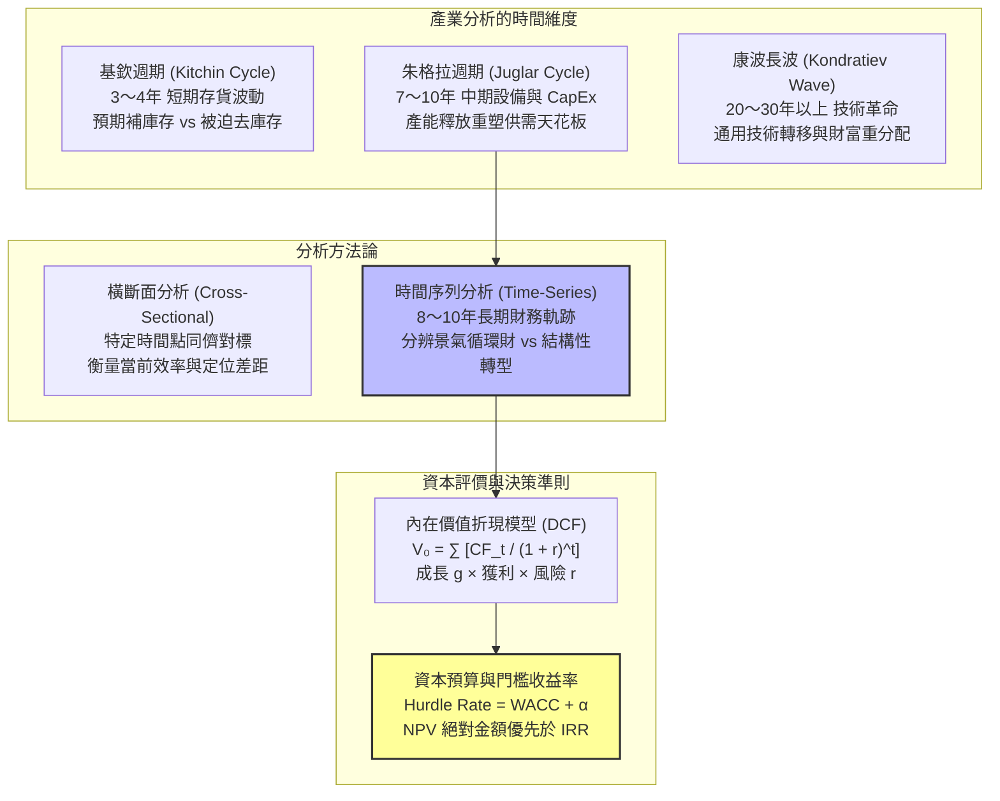
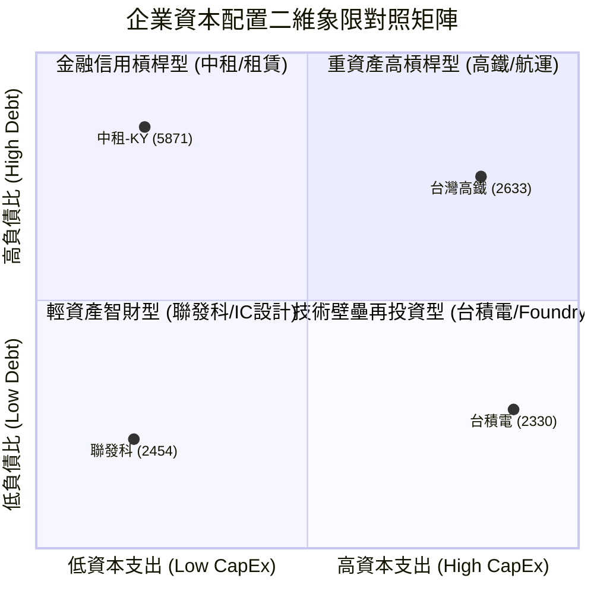
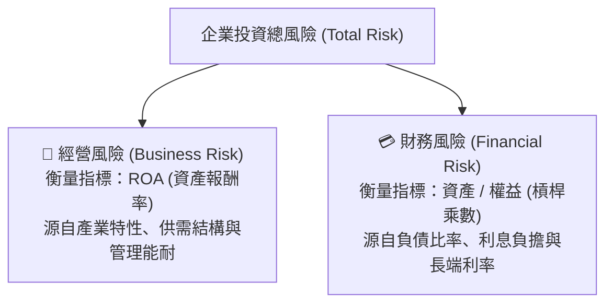

---
{"dg-publish":true,"permalink":"/04/12/02/module-1/m1-2/","tags":["PMBA",[["產業分析"]],"板書推導","景氣循環","資本評價","估值模型","廣達案例"],"dg-note-properties":{"aliases":["景氣循環","資本評價","門檻收益率","Hurdle Rate","DCF","時間序列分析"],"tags":["PMBA",[["產業分析"]],"板書推導","景氣循環","資本評價","估值模型","廣達案例"],"created":"2026-10-02","status":"completed","parent":"[[04_主題選修/12_產業分析與投資策略/00_課程導航與進度/📊 課程與筆記進度追蹤]]"}}
---


# M1-2 三大景氣循環與資本評價邏輯

> **導航索引**：[[04_主題選修/12_產業分析與投資策略/00_課程導航與進度/📊 課程與筆記進度追蹤\|進度看板]] ｜ [[04_主題選修/12_產業分析與投資策略/00_課程導航與進度/產業分析與投資策略_心智圖導航\|全課程心智圖]] ｜ [[04_主題選修/12_產業分析與投資策略/02_模組筆記/Module_1_總論與架構/M1_模組架構心智圖\|本模組心智圖]]  
> **商管核心價值**：[[98_商業概念庫/產業分析\|產業分析]]的終極檢驗在於[[98_商業概念庫/資本市場\|資本市場]]定價與資本配置。高階經理人與投資人必須學會錨定三大景氣循環的時間刻度，以 8～10 年的時間序列穿透週期迷霧；並熟練運用 DCF 與門檻收益率（Hurdle Rate），破除「IRR 迷思」，確保每分[[98_商業概念庫/資本支出\|資本支出]]都在實質創造股東價值。

---

## 一、視覺化知識脈絡圖 (Mermaid Context)



---

## 二、課堂白板推導專題：三大景氣循環與時間尺度

### 2.1 [[98_商業概念庫/產業分析\|產業分析]]必須錨定的三大景氣循環
在 Class 1 課堂現場，老師於白板即席推導了總體經濟三大波動週期，並嚴肅指出：
> **「進行產業研究或學位論文撰寫時，觀察區間至少要拉 4 至 5 年，更完整的[[98_商業概念庫/產業分析\|產業分析]]週期應取 8 至 10 年。」**

其學理根源與實務判讀對應如下：

### 三大景氣循環特徵與資本評價對照表

| 週期類型 | 平均跨度 | 驅動機制 (Driving Force) | 商業實務判讀要領 |
| :--- | :--- | :--- | :--- |
| **1. 基欽週期<br>(Kitchin)** | 3 ～ 4 年<br>(36～40個月) | • 廠商的「預期補庫存」與「被迫去庫存」<br>• 供應鏈長鞭效應 (Bullwhip Effect) | • 切忌把缺料供需失衡的短期「暴利」（如航運、驅動IC）誤判為長期成長。 |
| **2. 朱格拉週期<br>(Juglar)** | 7 ～ 10 年<br>(平均 8～10年) | • [[98_商業概念庫/企業\|企業]]重大設備更新與技術升級<br>• 重大產能擴建（晶圓廠/船隊約需 2～3 年） | • 密切追蹤龍頭 CapEx 高峰。<br>• [[98_商業概念庫/資本支出\|資本支出]]創歷史新高 2～3 年後，往往伴隨供給過剩與[[98_商業概念庫/折舊\|折舊]]吞噬毛利。 |
| **3. 康波長週期<br>(Kondratiev)** | 20 ～ 30 年以上 | • 重大通用技術革新 (General Purpose Technology)<br>• 電力、網際網路、生成式 AI、人口變遷 | • 決定大時代產業板塊的生與死，如當前 AI 算力基礎設施長波擴張。 |

---

### 2.2 橫斷面分析 vs. 時間序列分析：以廣達（2382）為例

#### (1) 理論維度對比
* **橫斷面分析（Cross-Sectional / 垂直分析）**：
  * 在同一個特定時間點（如 2025 年），比較同業同儕（如電子代工六哥）的營收規模、[[98_商業概念庫/毛利率\|毛利率]]與 ROE。
  * 目的：評估各家在現有[[98_商業概念庫/產業結構\|產業結構]]中的相對競爭力與營運效率。
* **時間序列分析（Time-Series / 水平分析）**：
  * 拉長至 **8 至 10 年（涵蓋一個完整的朱格拉週期）** 追蹤單一[[98_商業概念庫/企業\|企業]]的財務比率軌跡。
  * 目的：觀察長期趨勢（Trend）與週期轉折，辨別是「搭上產業順風車」還是「[[98_商業概念庫/商業模式\|商業模式]]發生質變」。

#### (2) 實戰個案深剖：廣達（2382）的 10 年蛻變
課堂中特別以此案說明為何高階經理人不能只看單一年度報表：

### 廣達 (Quanta) 跨週期 ROE 與策略轉型對照表

| 年度區間 | ROE 表現 | 策略群組定位與營運重心 | 分析師判讀陷阱與啟發 |
| :--- | :--- | :--- | :--- |
| **2015～2016** | 約 10%～11% | • 傳統 NB / PC 代工[[98_商業概念庫/成熟期\|成熟期]]，低毛利紅海競爭 | • 若僅看當時數據，會誤認為是平庸的代工廠。 |
| **2020～2021** | 約 13%～15% | • 受惠 Covid-19 遠距辦公、Chromebook 爆發需求 | • 屬於典型「基欽週期[[98_商業概念庫/存貨\|存貨]]紅利」，若未及時轉型，疫情後將被打回原形。 |
| **2024～2025** | 突破 31.18%<br>*(EPS 19.45元)* | • 提早佈局 CSP 雲端巨頭高階白牌 AI 伺服器<br>• 具備系統級水冷散熱與機櫃整合能力 | • 10 年時間序列證明：廣達跳脫了純 PC 代工群組，完成成熟[[98_商業概念庫/企業\|企業]]的「雙軌轉型」。 |

---

## 三、白板推導專題：[[98_商業概念庫/資本市場\|資本市場]]定價與門檻收益率 (Hurdle Rate)

[[98_商業概念庫/產業分析\|產業分析]]的終點在於**「[[98_商業概念庫/資本市場\|資本市場]]的科學化定價」**與**「[[98_商業概念庫/企業\|企業]]內部[[98_商業概念庫/資本預算\|資本預算]]審核」**。課堂白板現場推導了兩大核心數理架構：

### 3.1 [[98_商業概念庫/內在價值\|內在價值]]折現模型（Discounted Cash Flow, DCF）

$$V_0 = \sum_{t=1}^{n} \frac{\text{CF}_t}{(1 + r)^t} + \frac{\text{TV}_n}{(1 + r)^n}$$

白板上拆解了影響產業與[[98_商業概念庫/企業\|企業]][[98_商業概念庫/內在價值\|內在價值]]的關鍵三大因子：
1. **成長因子（Growth, $g$）**：
   * 產業市場空間（[[98_商業概念庫/TAM\|TAM]]/[[98_商業概念庫/SAM\|SAM]]）與[[98_商業概念庫/企業\|企業]]自由現金流（FCF）的未來複合年增長率。
2. **獲利因子（Profitability）**：
   * [[98_商業概念庫/毛利率\|毛利率]]、[[98_商業概念庫/營業利益率\|營業利益率]]與資本投入回報率（ROIC / ROE）的維持韌性。
3. **風險折現因子（Risk & Discount Rate, $r$）**：
   * 反映產業的系統性風險（$\beta$）與加權平均資本成本（WACC）。
   * **關鍵洞察**：高風險、長展期、高度政策敏感的產業（如生技新藥、重資產航運），其折現率 $r$ 必須大幅提高，將極端壓縮當前資產估值乘數（Valuation Compression）。

---

### 3.2 [[98_商業概念庫/資本預算\|資本預算]]決策：打破 IRR 迷思與門檻收益率檢驗

課堂上老師特別警告高階經理人與企劃主管：**「千萬不要被 IRR（[[98_商業概念庫/內部報酬率\|內部報酬率]]）牽著鼻子走！」**

#### (1) NPV 絕對金額優先原則
* 專案 A：投資 1,000 萬，IRR = 30%，創造淨現值 $\text{NPV} = 300\text{ 萬}$。
* 專案 B：投資 10 億，IRR = 15%，創造淨現值 $\text{NPV} = 1.5\text{ 億}$。
* **管理決策**：能為股東創造最大絕對財富的是專案 B，而非 IRR 高達 30% 但規模極小的專案 A。

#### (2) 門檻收益率公式推導

$$\text{Hurdle Rate} = \text{WACC} + \alpha$$

* $\text{WACC}$：[[98_商業概念庫/企業\|企業]]的加權平均資本成本（股權成本與稅後債權成本之加權）。
* $\alpha$：產業特定風險貼水（Specific Risk Premium），涵蓋技術失敗風險、[[98_商業概念庫/地緣政治風險\|地緣政治風險]]與景氣反轉風險。
* **決策判讀準則**：
  $$\begin{cases} 
  \text{IRR} \ge \text{Hurdle Rate} & \implies \text{核准專案（創造經濟附加價值 EVA > 0）} \\ 
  \text{IRR} < \text{Hurdle Rate} & \implies \text{嚴格否決（實質摧毀股東價值，哪怕 IRR > 銀行利息）} 
  \end{cases}$$

> 💡 **課堂金句**：很多經理人常說「現在銀行定存只有 2%，我這個案子 IRR 有 6% 為什麼不能做？」——如果[[98_商業概念庫/公司\|公司]]的 WACC 是 7%，加上專案風險貼水 $\alpha = 2\%$，門檻收益率就是 9%。做 6% 的案子就是拿股東的資本去補貼市場，實質上在虧損！

---

### 3.3 課堂白板推導專題：資本配置二維象限（CapEx [[98_商業概念庫/資本支出\|資本支出]] × [[98_商業概念庫/財務槓桿\|財務槓桿]]負債比）

第二週課堂現場，老師於白板繪製了高階經理人檢驗[[98_商業概念庫/企業\|企業]]資本架構的關鍵工具——**「資本配置二維象限矩陣」**：
- **橫軸**：資本密集度／年度[[98_商業概念庫/資本支出\|資本支出]]規模（**CapEx / 固定資產投入**：高 vs. 低）
- **縱軸**：[[98_商業概念庫/財務槓桿\|財務槓桿]]／[[98_商業概念庫/資本結構\|資本結構]]（**[[98_商業概念庫/負債比率\|負債比率]] Debt Ratio**：高 vs. 低）



| 象限分區 | 資本配置型態 | 核心財務特徵與運作邏輯 | 代表[[98_商業概念庫/企業\|企業]] | 高階經理人決策與投資防禦重點 |
| :--- | :--- | :--- | :--- | :--- |
| **第一象限** | **重資產高槓桿型**<br>*(高 CapEx × 高負債)* | 依賴龐大地軌、廠房或船隊，固定資產[[98_商業概念庫/折舊\|折舊]]極高；主要靠長期借貸與發債支撐投資。 | **台灣高鐵 (2633)**<br>長榮海運、塑化大廠 | • 對**長端利率極端敏感**：升息會使利息費用暴增。<br>• 需確保運營現金流遠大於[[98_商業概念庫/利息保障倍數\|利息保障倍數]]，嚴防[[98_商業概念庫/財務槓桿\|財務槓桿]]斷裂。 |
| **第二象限** | **金融信用槓桿型**<br>*(低 CapEx × 高負債)* | 實體廠房設備極少，但[[98_商業概念庫/資產負債表\|資產負債表]]極為龐大；以信用借貸進行高槓桿利差[[98_商業概念庫/套利\|套利]]。 | **中租-KY (5871)**<br>租賃業、商業銀行 | • 表面[[98_商業概念庫/毛利率\|毛利率]]極高，但生命線在於**「信用資產評級」與「呆帳損失率」**。<br>• 總經下行時需嚴控壞帳提存，防範[[98_商業概念庫/流動性\|流動性]]擠兌。 |
| **第三象限** | **輕資產智財型**<br>*(低 CapEx × 低負債)* | [[98_商業概念庫/資本支出\|資本支出]]少，研發投入直接費用化；主要資產為無形專利與研發人才庫（[[98_商業概念庫/無形資產\|無形資產]]）。 | **聯發科 (2454)**<br>IC設計群、[[98_商業概念庫/企業\|企業]]軟體 | • 具備極高資產週轉率與自由現金流轉換率（FCF）。<br>• 需密切防範**技術演化 S 曲線被顛覆**之人才與 IP 流失風險。 |
| **第四象限** | **技術壁壘再投資型**<br>*(高 CapEx × 低負債)* | 每年動輒數百億美元 CapEx 構築先進製程摩天大樓，但負債比嚴控在 25%~30% 以下。 | **[[98_商業概念庫/台積電\|台積電]] (2330)** | • **自體造血循環極致化**：完全依賴自身強大的[[98_商業概念庫/營業利益\|營業利益]]再投資，不依賴高槓桿借貸。<br>• 在朱格拉[[98_商業概念庫/資本支出\|資本支出]]週期中擁有最強抗震護城河。 |

---

### 3.4 產業資本投入之斜率與截距模型（固定資本投入 vs [[98_商業概念庫/營業收入\|營業收入]]）

白板現場進一步以微積分與幾何模型推導了[[98_商業概念庫/企業\|企業]][[98_商業概念庫/營運槓桿\|營運槓桿]]（Operating Leverage）的本質差異：

```text
營業收入 (Sales Revenue, Y)
       ▲
       │          / 公司 A：勞力／知識密集型（高斜率，低截距，無固定資產沉沒包袱）
       │         /
       │        / 
       │       /       ----------------- 產業平均水準 (Industry Average)
       │      /       /
       │     /       / 
       │    /       /  公司 B：資本密集型（平緩斜率，高截距，需龐大營收跨過損益平衡點）
       │   /       /
       │  /       /
截距 A │ /       /
 (低)  ├/_______/_______________________
截距 B │       /
 (高)  ├──────/─────────────────────────► 長期固定資本投入 (Fixed Capital, X)
       0
```

1. **截距（Intercept ── 固定資產沉沒門檻）**：
   - 代表[[98_商業概念庫/企業\|企業]]開始營運前，必須投入的初始固定資本沉沒門檻（廠房、無塵室、重機具設備）。
   - **[[98_商業概念庫/公司\|公司]] B（資本密集）**：截距極大。若無百億以上[[98_商業概念庫/資本支出\|資本支出]]，連進入賽道的資格都沒有。
   - **[[98_商業概念庫/公司\|公司]] A（勞力／知識密集）**：截距極小。初期不需自建重資產，進入門檻相對較低。
2. **斜率（Slope ── 營收邊際產出效率）**：
   - 代表每增加一單位的長期資本投入，所能轉化產生的[[98_商業概念庫/營業收入\|營業收入]]（$\Delta 	ext{Sales} / \Delta 	ext{CapEx}$）。
   - **[[98_商業概念庫/公司\|公司]] A（高斜率）**：邊際資本效率極高，有訂單才招募人力或購買雲端算力，營運彈性高。
   - **[[98_商業概念庫/公司\|公司]] B（平緩斜率）**：營收必須達到龐大臨界規模（MES，最低效率規模），[[98_商業概念庫/折舊\|折舊]]費用才能被攤薄；一旦跨過[[98_商業概念庫/損益平衡點\|損益平衡點]]，[[98_商業概念庫/營業利益率\|營業利益率]]將爆發，但景氣下行時則面臨巨額[[98_商業概念庫/折舊\|折舊]]吞噬獲利的慘境。

---

### 3.5 杜邦公式雙重風險拆解與經濟附加價值（EVA）之資本[[98_商業概念庫/機會成本\|機會成本]]檢驗

在第三週（Class 3）課堂深入探討中，老師將資本配置與評價邏輯推進至管理會計與[[98_商業概念庫/公司\|公司]]理財的最高層次——**「[[98_商業概念庫/企業\|企業]]何時才算真正賺錢？如何以資本[[98_商業概念庫/機會成本\|機會成本]]衡量投資決策？」**

#### (1) 杜邦公式的風險哲學：[[98_商業概念庫/經營風險\|經營風險]]（Business Risk）vs. [[98_商業概念庫/財務風險\|財務風險]]（Financial Risk）
傳統分析師常僅將杜邦分析法視為財務拆解工具，但課堂白板推導揭示其背後的**「產業雙重風險模型」**：

$$ROE = ROA 	imes 	ext{[[98_商業概念庫/財務槓桿\|財務槓桿]] (Financial Leverage)} = \left(rac{	ext{淨利}}{	ext{營收}} 	imes rac{	ext{營收}}{	ext{資產}}
ight) 	imes rac{	ext{資產}}{	ext{權益}}$$



- **[[98_商業概念庫/經營風險\|經營風險]]（ROA）**：反映[[98_商業概念庫/企業\|企業]]在不考慮[[98_商業概念庫/資本結構\|資本結構]]融資手段的情況下，純粹運用產業資產創造收益的能力。高科技製造業或生技研發業通常承擔極高的[[98_商業概念庫/經營風險\|經營風險]]。
- **[[98_商業概念庫/財務風險\|財務風險]]（Equity Multiplier）**：反映[[98_商業概念庫/企業\|企業]]透過向債權人舉債放大利潤的程度。若[[98_商業概念庫/企業\|企業]][[98_商業概念庫/經營風險\|經營風險]]已高（如重資產景氣循環股），再疊加高[[98_商業概念庫/財務槓桿\|財務槓桿]]，一旦遭遇景氣下行（如 2008 年航運或 2022 年半導體去庫存），極易引發[[98_商業概念庫/流動性\|流動性]]斷裂。

#### (2) 經濟附加價值（EVA）與資本[[98_商業概念庫/機會成本\|機會成本]]（Opportunity Cost）
課堂強烈強調：**「會計帳面有淨利（Net Income），絕不代表[[98_商業概念庫/企業\|企業]]在為股東創造財富！」**

$$	ext{EVA} = (	ext{ROIC} - 	ext{WACC}) 	imes 	ext{投入資本 (Invested Capital)}$$

| 衡量指標 | 財務意涵 | 課堂實戰判讀標準 |
| :--- | :--- | :--- |
| **投入資本報酬率 (ROIC)** | [[98_商業概念庫/企業\|企業]]投入生產性資本所產生的稅後實質營運回報率 | 代表[[98_商業概念庫/企業\|企業]]從產業主業中實際賺取的資本效率。 |
| **加權平均資本成本 (WACC)** | 股權與債權投資人所要求的綜合最低門檻收益率 | **[[98_商業概念庫/企業\|企業]]動用社會與股東資本的「[[98_商業概念庫/機會成本\|機會成本]]（Opportunity Cost）」**。 |
| **超額利潤率 (ROIC - WACC)** | 經濟租（Economic Rent）之衡量基準 | • **ROIC > WACC**：[[98_商業概念庫/企業\|企業]]創造正經濟價值（EVA > 0）。<br>• **ROIC < WACC**：**實質摧毀股東資本（EVA < 0）**！ |

> 💡 **課堂經典金句**：
> 「如果一家[[98_商業概念庫/公司\|公司]]的 WACC 是 10%，而它的 ROIC 只有 9%，代表它的[[98_商業概念庫/超額報酬\|超額報酬]]是 $-1\%$。這家[[98_商業概念庫/公司\|公司]]每多做一次投資，都在毀滅股東財富！與其苦苦擴廠，倒不如把帳上現金拿去買 0050 或[[98_商業概念庫/台積電\|台積電]]！」

#### (3) 投入資本（Invested Capital）計算難題與[[98_商業概念庫/商譽\|商譽]]（Goodwill）減損測試
- **投入資本之拆分挑戰**：在實務財報中，投入資本難以直接讀取，尤其牽涉研發資本化、租賃負債以及**[[98_商業概念庫/無形資產\|無形資產]]（Intangible Assets）**。
- **[[98_商業概念庫/商譽\|商譽]]的本質**：[[98_商業概念庫/商譽\|商譽]]是併購時溢價支付的產物，平時在[[98_商業概念庫/資產負債表\|資產負債表]]上只是歷史數字，**只有在再次發動資產變現或被併購時才具可驗證價值**。因此會計準則要求每年必須嚴格執行**[[98_商業概念庫/商譽\|商譽]]減損測試（Goodwill Impairment Test）**，一旦產業前景惡化，巨額減損將瞬間擊垮當期獲利。

#### (4) [[98_商業概念庫/企業\|企業]]投資的兩大分類：策略型 vs. 財務型投資
- **策略型投資（Strategic Investment）**：旨在強化本業護城河、掌握關鍵專利技術、跨足上下游垂直整合（如[[98_商業概念庫/台積電\|台積電]]投資 ASML、鴻海投資鴻華先進）。著眼於長線策略綜效（Synergy）。
- **財務型投資（Financial Investment）**：以閒置[[98_商業概念庫/營運資金\|營運資金]]追求金融市場收益（如上市櫃建商買進[[98_商業概念庫/台積電\|台積電]]股票、壽險[[98_商業概念庫/公司\|公司]]配置高評級海外[[98_商業概念庫/公司\|公司]]債），必須承受二級市場之[[98_商業概念庫/流動性\|流動性]]與市值波動風險。

---

## 四、實戰[[98_商業概念庫/企業\|企業]]案例與財報對標

### 代工六哥在朱格拉週期中的資本配置對比 (2025 實績)

| [[98_商業概念庫/公司\|公司]]名稱 | 營收規模 (億) | [[98_商業概念庫/毛利率\|毛利率]] | 營益率 | 稅後 ROE | 週期定位與轉型成效 |
| :--- | :--- | :--- | :--- | :--- | :--- |
| **廣達 (2382)** | 21,237 | 6.98% | 4.12% | **31.18%** | 提早 5 年卡位 AI 伺服器，受惠北美 CSP 雲端 CapEx 擴張大浪潮。 |
| **緯創 (3231)** | 21,865 | 6.13% | 3.59% | **26.26%** | 果斷處分印度低毛利 iPhone 代工廠，全力聚焦 GPU 運算板。 |
| **鴻海 (2317)** | 81,031 | 6.15% | 3.20% | **11.25%** | 8 兆級巨無霸，垂直整合供應鏈完整，但整體資產龐大稀釋了短期 ROE。 |
| **英業達 (2356)**| 6,912 | 5.31% | 1.84% | **12.65%** | 伺服器主機板基本盤穩固，積極跨足自研邊緣 AI 晶片。 |
| **和碩 (4938)** | 11,172 | 3.80% | 1.04% | **7.42%** | 消費性電子（手機/遊戲機）比重高，受終端去庫存拖累，轉型車電中。 |
| **仁寶 (2324)** | 4,396 | 4.92% | 1.25% | **5.20%** | PC 代工比重偏高，目前正積極提升非 PC（醫療/車電/雲端）營收佔比。 |

---

## 五、高階經理人與投資人雙重視角

### 🏢 經理人行動清單 (CEO / CFO Checklist)
1. **核算專案真實 Hurdle Rate**：要求財務部在審批重大[[98_商業概念庫/資本支出\|資本支出]]時，嚴禁單獨呈報 IRR，必須明確標定當前 WACC 與專屬風險貼水 $\alpha$。
2. **避開[[98_商業概念庫/產能擴張\|產能擴張]]頂點陷阱**：在朱格拉週期的狂熱頂點（同業都在瘋狂建廠擴產時），應保守評估產能開出後 2～3 年的[[98_商業概念庫/折舊\|折舊]]壓力。
3. **評估轉型投資的持續期**：[[98_商業概念庫/企業\|企業]]推動第二成長曲線（如廣達轉型白牌伺服器）通常需要 6～8 年的研發深耕，需有長線資本耐力。

### 📈 投資人分析維度 (Institutional Investor Lens)
1. **時間序列濾鏡檢驗**：在買進任何「高成長爆發股」前，務必拉出 8～10 年歷史財報，觀察該[[98_商業概念庫/公司\|公司]]在上一輪朱格拉[[98_商業概念庫/衰退期\|衰退期]]時的防禦表現。
2. **警惕高估值乘數擴張（Multiple Expansion）的幻覺**：在低利率時期享有 40 倍[[98_商業概念庫/本益比\|本益比]]的成長股，一旦總體進入升息高利率長波，DCF 折現率上升將導致[[98_商業概念庫/本益比\|本益比]]腰斬。

---

## 六、PMBA 碩士論文無縫對接指南 (Thesis Mapping)

| 論文章節 | 本篇理論與工具之實戰對接指引 |
| :--- | :--- |
| **第二章 文獻探討** | • 引用景氣循環理論（Kitchin, Juglar, Kondratiev）作為產業具有週期性特徵之理論基石。<br/>• 引用[[98_商業概念庫/企業\|企業]]評價理論（DCF 模型）與[[98_商業概念庫/資本預算\|資本預算]]門檻收益率假說。 |
| **第四章 實證分析** | • **時間序列分析設計**：強烈建議論文實證資料長度取 8～10 年（如 2015～2025），橫跨一整個景氣循環，實證檢驗個案[[98_商業概念庫/公司\|公司]]的 ROE 驅動因子變化。 |
| **第五章 投資策略** | • 建立個案[[98_商業概念庫/公司\|公司]]之 DCF 財務模型，明確設定 WACC 與[[98_商業概念庫/情境分析\|情境分析]]（Scenario Analysis），推導合理股價區間。 |

---

## 七、雙向鏈結與資料來源索引

### 🔗 關聯筆記
* 上層看板：[[04_主題選修/12_產業分析與投資策略/00_課程導航與進度/📊 課程與筆記進度追蹤\|04_主題選修/12_產業分析與投資策略/00_課程導航與進度/📊 課程與筆記進度追蹤]] ｜ [[04_主題選修/12_產業分析與投資策略/02_模組筆記/Module_1_總論與架構/M1_模組架構心智圖\|M1_模組架構心智圖]]
* 前置主題：[[04_主題選修/12_產業分析與投資策略/02_模組筆記/Module_1_總論與架構/M1-1_產業分析本質與中層定位\|M1-1 產業分析本質與中層定位]]
* 接續主題：[[04_主題選修/12_產業分析與投資策略/02_模組筆記/Module_1_總論與架構/M1-3_產業獲利結構差異與十大經典理論\|M1-3 產業獲利結構差異與十大經典理論]]
* 實務底稿：[[04_主題選修/12_產業分析與投資策略/01_總體與個案/總體經濟與課前時事\|總體經濟與課前時事]] ｜ [[04_主題選修/12_產業分析與投資策略/01_總體與個案/企業與產業案例庫\|企業與產業案例庫]]

### 📚 官方教材與課堂定位
* **板書推導**：[LINE_NOTE_260911_1.jpg](https://drive.google.com/file/d/1LOr3J8_SskcpHlJerAyBLISMhmJ-lANN/view?usp=drivesdk)（三大景氣循環、DCF 因子、IRR vs Hurdle Rate 公式）
* **講義參照**：[Class 1_產業分析概論_Line.pdf](https://drive.google.com/file/d/1NpOS_SId56yf2KBWkqOOGRLfqiVihKuT/view?usp=drivesdk)（P.4-7 代工六哥數據對標、P.23 六大總體趨勢）
* **錄音逐字稿**：Class 1 現場錄音逐字稿 Part 1（廣達 10 年時間序列個案口述講解）
