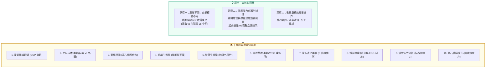

---
{"dg-publish":true,"permalink":"/04/12/02/module-1/m1-3/","tags":["PMBA","產業分析","獲利結構","產業理論","SCP","商業模式","企業案例"],"dg-note-properties":{"aliases":["獲利驅動因子","十大經典理論","SCP典範","Category Killer","品類殺手"],"tags":["PMBA","產業分析","獲利結構","產業理論","SCP","商業模式","企業案例"],"created":"2026-10-02","status":"completed","parent":"[[04_主題選修/12_產業分析與投資策略/00_課程導航與進度/progress_📊 課程與筆記進度追蹤]]"}}
---

# M1-3 產業獲利結構差異與十大經典理論

> **導航索引**：[[04_主題選修/12_產業分析與投資策略/00_課程導航與進度/progress_📊 課程與筆記進度追蹤\|進度看板]] ｜ [[04_主題選修/12_產業分析與投資策略/00_課程導航與進度/mindmap_產業分析與投資策略_心智圖導航\|全課程心智圖]] ｜ [[04_主題選修/12_產業分析與投資策略/02_模組筆記/Module_1_總論與架構/M1_模組架構心智圖\|本模組心智圖]]  
> **商管核心價值**：產業別本身就是決定[[98_商業概念庫/enterprise_企業\|enterprise_企業]]獲利結構的最核心自變數。不能以單一財務指標（如只看[[98_商業概念庫/gross-margin-rate_毛利率\|gross-margin-rate_毛利率]]）評價所有[[98_商業概念庫/enterprise_企業\|enterprise_企業]]。本篇解構三大核心洞察與十大經典學術理論支柱，助您掌握跨產業與同產業內的獲利驅動因子（Profit Drivers），精準匹配策略分析工具。

---

## 一、視覺化知識脈絡圖 (Mermaid Context)

---

## 二、課堂三大核心洞察：獲利邏輯解構

### 2.1 洞察一：跨產業獲利驅動因子（Profit Drivers）截然不同
許多初階分析師或非商管背景主管常犯的直覺錯誤，就是**「盲目崇拜高毛利」**。在第一堂課中，老師以三大標竿[[enterprise_企業]]的 2025 預估財報數據，震撼展示了結構性[[huo-li-neng-li_獲利能力]]的巨大差異：

### 標竿[[enterprise_企業]]獲利驅動模型對照表 (鴻海 vs [[tai-ji-dian_台積電]] vs 中租-KY)

| 指標項目 | 電子代工龍頭：鴻海 (2317) | 先進晶圓代工：[[tai-ji-dian_台積電]] (2330) | 金融租賃巨頭：中租-KY (5871) |
| :--- | :--- | :--- | :--- |
| **[[ying-ye-shou-ru_營業收入]] (億)** | 81,031 億 *(8.1兆)* | 38,091 億 *(3.8兆)* | 976 億 |
| **[[gross-margin-rate_毛利率]]** | 6.15% *(代工毛三到四)* | 59.90% *(極致技術寡占)* | 65.90% *(看似暴利)* |
| **[[operating-expenses_營業費用]]率** | 2.95% *(極致費用管控)* | 9.07% *(大規模研發)* | 39.30% *(龐大徵信業務團隊)* |
| **[[operating-income-rate_營業利益率]]** | 3.20% | 50.80% *(半數營收轉利潤)* | 27.90% |
| **[[operating-income_營業利益]] (億)** | 2,592 億 *(絕對利潤驚人)* | 19,361 億 | 272 億 |
| **每股稅後盈餘 (EPS)** | 13.61 元 | 66.26 元 | 11.24 元 |
| **[[shareholder-equity_股東權益]] (億)** | 17,728 億 | 54,196 億 | 1,824 億 |
| **核心獲利驅動機制 (Key Driver)** | **【營收規模與採購定價權】** • 靠龐大營收基數乘上微薄利潤率。 • 一年創造逾 2,500 億[[operating-income_營業利益]]。 | **【技術寡占與結構性毛利】** • 全球無可替代的先進製程定價權。 • 支撐數百億美元 CapEx 護城河。 | **【利差管理與呆帳[[risk-kong-zhi_風險控制]]】** • 表面毛利最高，但死穴在於「信用資產品質」與「呆帳損失率」。 |

> 📌 **管理意涵**：產業別本身就是決定財務結構的強大自變數。評估鴻海不能苛求其有 30% 毛利；評估中租不能只看毛利，必須盯緊其壞帳提存率與利差空間。

---

### 2.2 洞察二：同產業內部，不同定位存在巨大獲利鴻溝

#### 案例 A：實體零售通路對標（統一超 vs 全家 vs 寶雅）
即使處於同一內需實體零售大行業內，因策略群組與品類選擇不同，績效天差地別：

| [[company_公司]]名稱 | 2025 營收 | [[gross-margin-rate_毛利率]] | 營益率 | 稅後 EPS | ROE | 策略群組定位與商管解構 |
| :--- | :--- | :--- | :--- | :--- | :--- | :--- |
| **統一超 (2912)** | 3,507 億 | 34.40% | 3.97% | 10.78 元 | 25.41% | **網絡經濟與規模門檻**：近 7,000 家門市建立極高物流與鮮食配送效率，形成現金流機器。 |
| **全家 (5903)** | 1,100 億 | 36.40% | 1.69% | 7.60 元 | 16.18% | **數位[[innovation_創新]]但受規模制約**：App 會員黏著度高，但在實體店數劣勢下，每店分攤的物流與管銷費用沉重。 |
| **寶雅 (5904)** | 253 億 | **45.20%** | **15.30%** | **29.54 元** | **41.18%** | **品類殺手 (Category Killer)**：避開超商鮮食紅海，聚焦高毛利美妝生活雜貨，專櫃級坪效創造驚人 ROE。 |

#### 案例 B：電子代工六哥 AI 轉型績效分化
* **廣達 (ROE 31.18%)**、**緯創 (ROE 26.26%)**：果斷進行策略群組跨越，前者卡位白牌 AI 伺服器整機，後者專注高技術門檻 GPU 運算板。
* **和碩 (ROE 7.42%)**、**仁寶 (ROE 5.20%)**：受傳統消費性電子與筆電紅海拖累，轉型效益尚未完全釋放。

---

### 2.3 洞察三：動態重構的現代產業邊界
當代分析師嚴禁落入「刻舟求劍」的行業框架，五大邊界重塑力量正在加速進行：
1. **跨界崛起**：算力基礎設施（如光通訊 CPO、液冷散熱）從傳統電子零組件躍升為戰略主賽道。
2. **多模式並存**：如保險業中，傳統業務員大軍與純數位保險科技並行競爭。
3. **產業滲透（Convergence）**：零售＋金融（零售通路變成金融支付閘道口）。
4. **分工重組**：[[tai-ji-dian_台積電]]以 CoWoS 先進封裝跨足下游封測領域，重新定義晶圓代工範疇。
5. **市場空間整合**：大[[enterprise_企業]]藉由 CVC 與跨國收購重新劃定市場空間。

---

## 三、十大經典[[industry-analysis_產業分析]]理論精要矩陣

課堂盤點了商管學界百年來的十大學術支柱，實務應用應掌握其精髓與適用情境：

### 3.1 理論精解與商業決策應用

#### 1. [[industrial-organization-theory_產業組織理論]]（Industrial Organization - SCP 典範）
- **核心主張**：市場結構（Structure）決定廠商行為（Conduct），進而決定市場績效（Performance）。
- **三大經濟學派典範對決矩陣（第二週深化專題）**：
  在產業經濟組織領域中，究竟是「結構決定一切」還是「市場效率至上」？課堂深層解構了三大學派近百年的思維交鋒：

| 學派名稱 | 核心代表人物 | 因果傳導鏈與推導邏輯 | 核心哲學與對「高集中度」的看法 | 政策與反托拉斯主張 | 商業與投資實務啟發 |
| :--- | :--- | :--- | :--- | :--- | :--- |
| **哈佛學派 (Harvard School)** | Edward Mason Joe S. Bain *(1930s~1950s)* | **由上而下 (Top-Down)** $$	ext{Structure} 	o 	ext{Conduct} 	o 	ext{Performance}$$ | • **結構決定論**：高[[market-ji-zhong-du_市場集中度]]必然導致廠商串謀、掠奪性定價與超額壟斷利潤。 • 進入障礙是市場失靈的罪魁禍首。 | **積極干預**：主張嚴格的反托拉斯法（Antitrust），拆分壟斷巨頭，降低進入障礙。 | 傳統波特[[five-forces-analysis_五力分析]]的理論起點。分析產業必須先鎖定外部結構與進入壁壘。 |
| **芝加哥學派 (Chicago School)** | George Stigler Harold Demsetz *(1960s~1970s)* | **由下而上 (Bottom-Up)** $$	ext{Efficiency} 	o 	ext{Conduct} 	o 	ext{Structure}$$ | • **效率假說 (Efficiency Hypothesis)**：高集中度不是壟斷的罪證，而是最優[[enterprise_企業]]憑藉卓越效率勝出的**「自然結果」**。 • 只要進出自由，市場會自我調節。 | **自由放任 (Laissez-faire)**：反對政府隨意干預市場競爭；只要未形成法定壟斷，效率應被獎勵。 | 不能僅憑高集中度就斷定市場停滯；需辨析巨頭（如[[tai-ji-dian_台積電]]）是否具備無可替代的極致生產效率。 |
| **奧地利學派 (Austrian School)** | Joseph Schumpeter Friedrich Hayek | **動態演化論 (Dynamic)** $$	ext{Innovation} 	o 	ext{Performance} 	o 	ext{New Structure}$$ | • **[[chuang-zao-xing-po-huai_創造性破壞]] (Creative Destruction)**：市場非靜態均衡，而是動態發現過程。 • 破壞式[[innovation_創新]]會顛覆舊有壟斷結構。 | **保護產權與專利**：鼓勵[[enterprise_企業]]家精神（Entrepreneurship）與研發冒險，保護[[innovation_創新]]租金。 | 即使面對強大壟斷結構，若新創透過範式轉移（如 DeepSeek 顛覆舊 AI 算力架構），將迅速重塑結構。 |

- **決定市場結構的八大基礎條件（Basic Conditions）**：
  哈佛學派在推導 SCP 之前，強調市場結構並非憑空產生，而是由以下兩大維度的基礎條件所塑造：
  1. **需求面條件 (Demand Side)**：
     - **需求價格彈性 (Elasticity)**：決定顧客對價格變動的敏感度與[[threat-of-substitutes_替代品威脅]]深度。
     - **市場成長率 (Growth Rate)**：[[gao-su-cheng-zhang-qi_高速成長期]]廠商容易共存；成熟停滯期則演變為零和搶市。
     - **購買模式 (Buying Habits)**：客戶是一次性大額採購（B2B 集中採購）還是高頻零星零售。
     - **替代需求可得性**：市場上是否存在同功能之異業解決方案。
  2. **供給面條件 (Supply Side)**：
     - **規模經濟 (Economies of Scale)**：最低效率規模（MES）決定了能存活之最小廠商體積。
     - **範疇經濟 (Economies of Scope)**：多品類、多產線共享技術或通路的協同降本效益。
     - **生產技術門檻與專利池**：決定新進廠商跨過學習曲線的代價。
     - **關鍵原物料稀缺性**：影響產業垂直整合（Make-or-Buy）之交易成本。

- **市場結構（Structure）五大實務分析維度與檢核表**：
  在第三週（Class 3）課堂深入研討中，老師特別提醒：分析師做[[industry-analysis_產業分析]]時，絕不能抽象地說「這個市場很國際化、競爭很激烈」，而必須逐一拆解市場結構的五大具體維度：

| 市場結構核心維度 | 實務分析內涵與觀測重點 | 課堂實戰案例與管理意涵 |
| :--- | :--- | :--- |
| **1. 買方與賣方的數量** | 衡量[[market-ji-zhong-du_市場集中度]] ($CR_4$、HHI) 與定價權分佈。買方集中度高形成強大議價壓迫；賣方寡占則享有超額定價利差。 | **實體超商 333 獲利結構**：台灣超商由統一超與全家雙雄寡占，[[gross-margin-rate_毛利率]]約 3 成、門市租金約 3 成、進貨成本約 3 成，此結構深植於雙雄雙寡占的結構特性。 |
| **2. 廠商進入障礙** | 包含最低效率規模 (MES)、專利池、法規特許執照、品牌重置成本與既有實體通路排他性。 | **快消零售 vs. 生技製藥**：聯合利華靠規模經濟與通路排他築起高牆；而生技藥廠則依賴 ANDA 查驗登記與專利期保護。 |
| **3. 產品的差異性** | 產品為同質化標準品 (Commodity) 還是具備高度心理/功能差異化。 | **大宗原物料 vs. 奢華精品**：同質化產品只能陷於價格割喉戰；高差異化精品[[gross-margin-rate_毛利率]]可達 70%~80%。 |
| **4. 垂直整合程度** | [[enterprise_企業]]自製 (In-house) 與外購 (Outsourcing) 之邊界，即[[value-lian_價值鏈]]整合跨度。 | **[[tai-ji-dian_台積電]]先進封裝**：[[tai-ji-dian_台積電]]以 CoWoS 向上跨入先進封測領域，重新定義晶圓製造與封裝的產業邊界。 |
| **5. 多角化程度** | 廠商跨足相關或非相關事業的廣度，決定了範疇經濟與風險分散能力。 | **電子代工龍頭鴻海**：從模具連接器跨足整機代工、半導體封測，再跨足電動車與伺服器製造。 |

- **[[kua-guo-enterprise_跨國企業]]國際化策略與市場結構矩陣（全球整合 vs. 當地回應）**：
  課堂深入探討了[[enterprise_企業]]在市場結構下的「國際化」層次，指出經理人切忌籠統使用「國際化」一詞，應嚴格區分四大策略組織模式：
  1. **國際型[[enterprise_企業]]（International Firm）**：
     - *策略特徵*：以母國成功的核心產品或[[business-model_商業模式]]向全球市場直接複製，僅在當地進行微幅適應性調整。
     - *代表案例*：**麥當勞 (McDonald's)**。全球掛上金色拱門標誌主賣大麥克漢堡，僅在中國市場微調加入早餐豆漿或特定在地沾醬。
  2. **[[quan-qiu-hua_全球化]][[enterprise_企業]]（Global Firm）**：
     - *策略特徵*：追求全球極致效率與規模經濟，在全球版圖上依據「各地區要素稟賦的獨特專長」進行深度跨國分工整合。
     - *代表案例*：**全球半導體產業鏈**。關鍵化學原料與光阻液來自日本、高頻寬記憶體（HBM）來自韓國、先進製程製造與 CoWoS 封裝組裝重兵佈局於台灣。
  3. **多國型[[enterprise_企業]]（Multidomestic Firm）**：面對高當地回應壓力，產品與行銷高度因地制宜，各國子[[company_公司]]高度自主運作。
  4. **跨國型[[enterprise_企業]]（Transnational Firm）**：同時追求全球規模綜效與極致在地回應（如大型綜合跨國藥廠）。

#### 2. 交易成本理論（Transaction Cost Economics - Coase, Williamson）
* **核心主張**：市場交易存在搜尋、簽約與履約成本。當**資產專屬性（Asset Specificity）**高、交易頻率高、環境不確定性大時，[[enterprise_企業]]應選擇「內部化（自製/垂直整合）」以防被對手敲竹槓（Hold-up）。
* **實例**：[[tai-ji-dian_台積電]]對於關鍵原料與設備採取深度[[strategy-lian-meng_策略聯盟]]，而非隨意在現貨市場採購。

#### 3. 賽局理論（Game Theory - Nash Equilibrium）
* **核心主張**：寡占市場中，廠商的最適策略取決於對手的預期反應（策略互賴 Strategic Interdependence）。
* **實例**：分析面板、記憶體產業在景氣低谷時的「囚徒困境」產能軍備競賽。

#### 4. 組織生態學（Organizational Ecology - Hannan, Freeman）
* **核心主張**：組織受環境承載力約束，環境天擇（Selection）決定了不同族群密度下的組織生存率。
* **實例**：解析新興產業（如早期電動車、生成式 AI 新創）從百家爭鳴到殘酷洗牌整併的死亡率演變。

#### 5. 聚落生態學（Cluster Ecology - Porter）
* **核心主張**：地理空間鄰近性帶來專門人才庫、供應鏈配套綜效與隱性知識（Tacit Knowledge）外溢。
* **實例**：新竹科學園區、矽谷形成全球無可替代的高科技[[innovation_創新]]生態系。

#### 6. [[zi-yuan-ji-chu-theory_資源基礎理論]]（Resource-Based View - Barney, VRIO 框架）
* **核心主張**：持久競爭優勢不單源於外在結構，更源於[[enterprise_企業]]內部擁有的**價值性（Value）、稀少性（Rarity）、難以模仿性（Inimitability）與組織配合力（Organization）**核心資源。
* **實例**：[[tai-ji-dian_台積電]]的龐大專利池、製造良率工程師文化與極致執行力。

#### 7. 技術演化理論（Technological Evolution - S 曲線與主導設計）
* **核心主張**：技術性能突破遵循 S 曲線，新舊技術在交替期存在「主導設計（Dominant Design）」爭奪戰。
* **實例**：傳統燃油車引擎性能已達物理天花板，正被純電與智慧座艙新 S 曲線全面顛覆。

#### 8. 體制理論（Institutional Theory - DiMaggio, Powell）
* **核心主張**：[[organization-xing-wei_組織行為]]深受外部法律規範、專業標準與社會文化期待塑造，產生「制度同構（Isomorphism）」。
* **實例**：跨國供應鏈全面被迫符合 ESG、淨零碳排與 RE100 規範。

#### 9. 波特[[five-forces-analysis_五力分析]]（Porter's Five Forces）
* **核心主張**：[[existing-competitors_現有競爭者]]、[[potential-entrants_潛在進入者]]、替代品、買方、供應商五大力量共同決定產業的長期平均利潤率。
* **實例**：以量化評分繪製五力雷達圖，剖析產業利潤池被何者侵蝕。
  - 🔗 **模組專題深度延伸**：本理論之完整驅動因子拆解、CR4/HHI 量化公式、五力雷達圖打分模型與反制策略，請詳見專題筆記：[[M1-5_波特五力分析與量化架構|M1-5 波特五力分析與量化架構]]。

#### 10. 鑽石結構模式（Porter's Diamond Model）
* **核心主張**：國家競爭優勢取決於生產要素、需求條件、相關與支援產業、[[enterprise_企業]]策略與競爭結構四大構面。
* **實例**：解析台灣半導體產業在全球建立的國家級鑽石競爭力。

---

## 四、高階經理人與投資人雙重視角

### 🏢 經理人行動清單 (CEO / CSO Checklist)
1. **辨識自身關鍵獲利因子**：本[[company_公司]]的獲利驅動模型究竟是像鴻海靠營收週轉、像[[tai-ji-dian_台積電]]靠技術寡占毛利，還是像中租靠利差風險？
2. **切入品類殺手（Category Killer）利基**：中小[[enterprise_企業]]若無法與巨頭打總量通路戰，應學習寶雅在垂直深細分品類建立無可撼動的坪效壁壘。
3. **警惕資產專屬性敲竹槓**：審視關鍵零組件是否受制於單一獨家供應商，及早布局自製研發或第二供應商。

### 📈 投資人分析維度 (Institutional Investor Lens)
1. **反直覺選股思維**：[[gross-margin-rate_毛利率]] 6% 的[[company_公司]]（如鴻海）不代表不具投資價值；[[gross-margin-rate_毛利率]] 65% 的[[company_公司]]（如中租）若資產壞帳失控，股價腰斬風險更高。
2. **動態理論工具箱切換**：分析寡占市場用賽局理論；分析高科技供應鏈用聚落生態學與 RBV；分析政策管制產業用體制理論。

---

## 五、PMBA 碩士論文無縫對接指南 (Thesis Mapping)

| 論文章節 | 本篇理論與工具之實戰對接指引 |
| :--- | :--- |
| **第二章 文獻探討** | • 本篇十大學派為碩士論文文獻探討的「理論武器庫」。 • 論文應從中精選 2～3 個核心理論深度推導（如以 SCP 典範結合 RBV 資源基礎觀點，探討[[industry-structure_產業結構]]如何被[[enterprise_企業]][[he-xin-neng-li_核心能力]]重塑）。 |
| **第四章 實證個案** | • 採用本篇實體通路（統一超 vs 寶雅）或代工六哥之對標架構，建立同業同儕（Peer Group）財務比率橫向比較矩陣。 |

---

## 六、雙向鏈結與資料來源索引

### 🔗 關聯筆記
* 上層看板：[[04_主題選修/12_產業分析與投資策略/00_課程導航與進度/progress_📊 課程與筆記進度追蹤]] ｜ [[M1_模組架構心智圖]]
* 前置主題：[[M1-2_三大景氣循環與資本評價邏輯|M1-2 三大景氣循環與資本評價邏輯]]
* 接續主題：[[M1-4_台灣產業發展歷程與決策工具箱|M1-4 台灣產業發展歷程與決策工具箱]]
* 實務底稿：[[macro_總體經濟與課前時事]] ｜ [[cases_企業與產業案例庫]]

### 📚 官方教材與課堂定位
* **講義參照**：[Class 1_產業分析概論_Cool.pdf](https://drive.google.com/file/d/1PCgu2s_lojPXYuaiPzTcgiYPyxlH_Hjz/view?usp=drivesdk)（P.5-11 三大洞察、P.24-37 十大分析理論）
* **輔助講義**：[Class 1_產業分析概論_Line.pdf](https://drive.google.com/file/d/1NpOS_SId56yf2KBWkqOOGRLfqiVihKuT/view?usp=drivesdk)（P.4 獲利關鍵、P.5-7 通路與六哥財報）
* **錄音逐字稿**：Class 1 現場錄音逐字稿 Part 1 & 2（哈佛、芝加哥、奧地利學派對決剖析）
