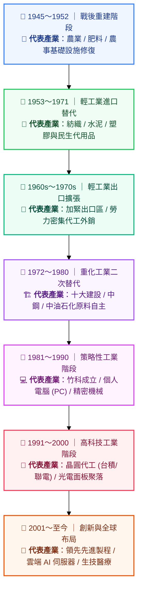
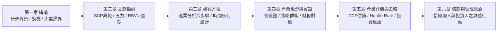

---
{"dg-publish":true,"permalink":"/04/12/02/module-1/m1-4/","tags":["PMBA","產業分析","台灣經驗","決策工具箱","策略聯盟","碩士論文"],"dg-note-properties":{"aliases":["台灣產業發展歷程","策略聯盟","經理人工具箱","論文對接指南"],"tags":["PMBA","產業分析","台灣經驗","決策工具箱","策略聯盟","碩士論文"],"created":"2026-10-02","status":"completed","parent":"[[04_主題選修/12_產業分析與投資策略/00_課程導航與進度/progress_📊 課程與筆記進度追蹤]]"}}
---

# M1-4 台灣產業[[98_商業概念庫/發展\|發展]]歷程與決策工具箱

> **導航索引**：[[04_主題選修/12_產業分析與投資策略/00_課程導航與進度/progress_📊 課程與筆記進度追蹤\|進度看板]] ｜ [[04_主題選修/12_產業分析與投資策略/00_課程導航與進度/mindmap_產業分析與投資策略_心智圖導航\|全課程心智圖]] ｜ [[04_主題選修/12_產業分析與投資策略/02_模組筆記/Module_1_總論與架構/M1_模組架構心智圖\|本模組心智圖]]  
> **商管核心價值**：台灣產業之所以能在全球地緣政治與景氣風暴中屹立不搖，核心密碼在於獨創的「互補性[[98_商業概念庫/策略聯盟\|策略聯盟]]」彈性網絡。本篇梳理台灣戰後七大升級階段，提煉高階經理人專案立項的七大檢核問句，並完整繪製 PMBA 碩士學位論文（20～50 頁）與本課程的無縫對接藍圖。

---

## 一、視覺化知識脈絡圖 (Mermaid Context)

---

## 二、台灣產業[[98_商業概念庫/發展\|發展]]歷程與歷史經驗借鑑

講義第 40 頁梳理了台灣從二戰後的百廢待舉，一路蛻變為全球先進高科技製造中樞的七大升級浪潮：

### 2.1 戰後七大轉型階段深剖

### 台灣戰後產業[[98_商業概念庫/發展\|發展]]七大演化階段總覽表

| 階段序號與時期 | 核心推動策略 | 代表產業聚落與龍頭廠商 | 經濟結構質變與政策意涵 |
| :--- | :--- | :--- | :--- |
| **1. 產業重建階段** *(1945–1952)* | • 基礎農業加工與公共修復 | • 台糖、台肥、台紙 | • 恢復民生基本秩序，累積初始資本。 |
| **2. 輕工業進口替代** *(1953–1971)* | • 高關稅保護本土民生工業 • 限制外匯流出 | • 遠東紡織、台泥、台塑 | • 生產原依賴進口的民生物資，嚴格節省外匯儲備。 |
| **3. 輕工業出口擴張** *(1960s–1970s)* | • 成立高雄加工出口區 (EPZ) • 「客廳即工廠」勞力密集外銷 | • 成衣紡織、製鞋、金屬五金 | • 善用充沛優質勞動力切入國際分工，賺取外匯帶動經濟起飛。 |
| **4. 重化工業二次替代** *(1972–1980)* | • 推動「十大建設」 • 國家級重資產基礎設施投資 | • 中鋼 (鋼鐵)、中油體系 (石化) • 台灣造船 | • 上游關鍵原物料自主化，降低國際能源危機對島內工業的衝擊。 |
| **5. 策略性工業階段** *(1981–1990)* | • 1980 成立新竹科學工業園區 • 引進國外高階技術團隊與海歸人才 | • 宏碁 (Acer)、華碩 (ASUS) • 鴻海 (精密模具與連接器) | • 告別勞力密集，邁向技術與資本密集之個人電腦與零組件時代。 |
| **6. 高科技工業階段** *(1991–2000)* | • [[98_商業概念庫/發展\|發展]]半導體專業晶圓代工模式 • 兩兆雙星計畫 (半導體/光電) | • [[98_商業概念庫/台積電\|台積電]] (TSMC)、聯電 (UMC) • 友達、奇美電 (面板聚落) | • [[98_商業概念庫/開創\|開創]]純晶圓代工[[98_商業概念庫/商業模式\|商業模式]]，催生全球 Fabless + Foundry 垂直分工體系。 |
| **7. [[98_商業概念庫/創新\|創新]]與全球布局** *(2001–至今)* | • 埃米製程與先進封裝 CoWoS • AI 伺服器機櫃系統級整合能力 | • [[98_商業概念庫/台積電\|台積電]]、聯發科、廣達、緯創 • 離岸風電、智慧醫療 CDMO | • 晉升全球科技供應鏈戰略咽喉，跨足全球運籌布局（美、日、德）。 |

---

### 2.2 台灣產業的核心護城河：互補性[[98_商業概念庫/策略聯盟\|策略聯盟]]

課堂上老師特別點出一個深刻的商管觀察：
> **「歐美日本往往傾向[[98_商業概念庫/發展\|發展]]超大型、垂直一體化（Vertical Integration）的龐大財閥（如三星、Intel）；但台灣廠商受限於內需市場與資本規模，卻走出了截然不同、抗震韌性世界第一的[[98_商業概念庫/商業模式\|商業模式]]——互補性[[98_商業概念庫/策略聯盟\|策略聯盟]]。」**

* **專業化極致分工**：
  * IC 設計（聯發科、聯詠）專注演算法與架構[[98_商業概念庫/創新\|創新]]。
  * 晶圓代工（[[98_商業概念庫/台積電\|台積電]]、聯電）專注製程物理極限與良率控制。
  * 先進封測（日月光）專注異質整合與封裝。
  * 伺服器整機（廣達、緯創、鴻海）專注系統級水冷散熱與電源管理。
* **[[98_商業概念庫/策略聯盟\|策略聯盟]]的動態競合（Co-opetition）**：
  * 各[[98_商業概念庫/企業\|企業]]彼此股權獨立，但在研發藍圖（Roadmap）上緊密對接，形成緊湊的「同生共死」生態鏈。
  * 這種架構大幅降低了單一[[98_商業概念庫/企業\|企業]]的資產重置風險（Asset Specificity Risk），在全球供應鏈遭遇斷鏈風暴時，展現極高彈性調整速度。

---

## 三、高階經理人決策工具箱

### 3.1 產業投資與專案立項七大檢核問句 (The 7-Question Framework)

當高階經理人準備在董事會提出重大[[98_商業概念庫/資本支出\|資本支出]]（CapEx）、新市場進入或併購案時，必須嚴格逐項減核：

### 📋 高階經理人產業投資立項七大檢核問句

| 題號與檢核維度 | 核心提問內容 | 深入審查重點與實務啟發 |
| :--- | :--- | :--- |
| **Q1. 邊界範疇** | 本專案所處的產業邊界是否清晰？主要替代品究竟是誰？ | 釐清是否有潛在跨界殺手正在改變顧客的支付意願？ |
| **Q2. 獲利邏輯** | 標的[[98_商業概念庫/企業\|企業]]是靠營收規模、技術毛利，還是靠高資產週轉率賺錢？ | 對標鴻海、[[98_商業概念庫/台積電\|台積電]]或中租模式，確認其核心獲利驅動因子是否穩固？ |
| **Q3. 利潤池分配** | 依據[[98_商業概念庫/五力分析\|五力分析]]，產業上下游利潤是否正被強勢環節所侵蝕？ | 例如健保署壓抑製藥毛利，或上游晶片原廠拿走伺服器大部分利潤？ |
| **Q4. 週期錨定** | 產業目前處於基欽[[98_商業概念庫/存貨\|存貨]]週期的補庫存還是去庫存階段？ | 切忌在朱格拉[[98_商業概念庫/資本支出\|資本支出]]高峰期盲目追高擴產，承擔未來 3 年[[98_商業概念庫/折舊\|折舊]]惡夢。 |
| **Q5. 護城河檢驗** | [[98_商業概念庫/企業\|企業]]的 ROE 領先是否具有 VRIO 防禦性，抑或只是景氣循環財？ | 以 8～10 年時間序列檢視，當景氣反轉時該優勢是否依然存在？ |
| **Q6. 門檻收益率** | 投資案的預期 IRR 是否實質跨過[[98_商業概念庫/公司\|公司]]的門檻收益率？ | 嚴格檢驗：IRR 是否大於 WACC + α (風險貼水)？避免摧毀股東價值。 |
| **Q7. 典範轉移** | 未來 3～5 年內是否存在新技術顛覆者或政策法規的結構性衝擊？ | 如歐盟 CBAM 碳關稅、AI 邊緣化、地緣政治供應鏈強迫搬遷？ |

---

### 3.2 核心商管術語速查表 (Glossary)

* **中層分析 (Meso-level Analysis)**：介於總體宏觀經濟與微觀[[98_商業概念庫/企業\|企業]]個體之間的[[98_商業概念庫/產業結構\|產業結構]]分析樞紐。
* **SCP 典範 (Structure-Conduct-Performance)**：哈佛學派提出之產業組織架構，主張[[98_商業概念庫/產業結構\|產業結構]]決定廠商行為，行為決定市場績效。
* **門檻收益率 (Hurdle Rate)**：[[98_商業概念庫/公司\|公司]]核准[[98_商業概念庫/資本支出\|資本支出]]專案的最低及格報酬率，公式為 $\text{Hurdle Rate} = \text{WACC} + \alpha$。
* **品類殺手 (Category Killer)**：聚焦於單一細分商品類別、具備極深產品線與極高坪效的利基專賣零售巨頭（如寶雅）。
* **互補性[[98_商業概念庫/策略聯盟\|策略聯盟]] (Complementary Strategic Alliance)**：跨[[98_商業概念庫/企業\|企業]]間不以併購為前提，透過資源互補與專業分工所建立之網絡協同機制。

---

## 四、PMBA 碩士學位論文無縫對接完整藍圖

第一堂課中，老師特別指導期末小組報告與碩士學位論文（標準規格約 20～50 頁）之架構映射：

| 論文章節與建議標題 | 建議頁數 | 核心寫作內容與本模組工具映射指引 |
| :--- | :---: | :--- |
| **第一章 緒論 (Introduction)** | 3～5 頁 | • **研究背景與動機**：引述六大總體趨勢（如 AI 轉型、碳關稅），點出該產業面臨的十字路口。 • **研究目的與問題**：清楚定義欲解決之核心策略或投資定價問題。 • **研究範圍與邊界**：運用 Porter 定義畫定分析之產品與地理範疇。 |
| **第二章 文獻探討 (Literature Review)** | 5～8 頁 | • **理論模型回顧**：精選本模組「十大經典理論」中的 2～3 個作為理論基石（如 SCP 結構理論 ＋ 交易成本 TCE ＋ RBV 資源基礎觀點）。 • **分析工具回顧**：五力模型、策略群組地圖、景氣循環理論。 |
| **第三章 研究方法 (Methodology)** | 3～5 頁 | • **分析流程架構**：直接引用「[[98_商業概念庫/產業分析\|產業分析]]標準六步驟」繪製論文研究流程圖。 • **研究樣本與資料來源**：說明一級專家訪談對象與二級資料庫（TEJ、公開資訊觀測站、IEK）。 • **分析指標設定**：定義財務對標比率（[[98_商業概念庫/毛利率\|毛利率]]、營益率、ROE 杜邦拆解）。 |
| **第四章 產業現況、競爭結構與實證** | 8～15 頁 | • **產業價值體系拆解**：繪製上中下游[[98_商業概念庫/價值鏈\|價值鏈]]與利潤池分布。 • **五力量化評估**：繪製產業五力雷達圖，剖析競爭強度。 • **策略群組地圖 (SGM)**：以二維維度劃分同儕群組並找出空白區。 • **8～10 年時間序列財務對標**：比較龍頭[[98_商業概念庫/企業\|企業]]與追隨者之長期 ROE 軌跡。 |
| **第五章 產業價值評估與未來投資策略** | 5～8 頁 | • **景氣週期判讀**：分析目前處於朱格拉或基欽週期的哪一階段。 • **[[98_商業概念庫/企業\|企業]]估值實證**：建立個案[[98_商業概念庫/公司\|公司]]之 DCF 現金流折現模型與[[98_商業概念庫/情境分析\|情境分析]]。 • **[[98_商業概念庫/資本預算\|資本預算]]檢驗**：計算標的[[98_商業概念庫/公司\|公司]]之 WACC 與門檻收益率，評估其資本配置效率。 |
| **第六章 結論與管理意涵 (Conclusions)** | 2～4 頁 | • **研究核心發現**：摘要產業競爭結構的關鍵變化。 • **給經理人之策略建言**：自製 vs 外購、策略群組升級路徑。 • **給投資人之資產配置建言**：買進評級、目標價與下檔風險提示。 |

---

## 五、雙向鏈結與資料來源索引

### 🔗 關聯筆記
* 上層看板：[[04_主題選修/12_產業分析與投資策略/00_課程導航與進度/progress_📊 課程與筆記進度追蹤\|04_主題選修/12_產業分析與投資策略/00_課程導航與進度/progress_📊 課程與筆記進度追蹤]] ｜ [[04_主題選修/12_產業分析與投資策略/02_模組筆記/Module_1_總論與架構/M1_模組架構心智圖\|M1_模組架構心智圖]]
* 前置主題：[[04_主題選修/12_產業分析與投資策略/02_模組筆記/Module_1_總論與架構/M1-1_產業分析本質與中層定位\|M1-1 產業分析本質與中層定位]] ｜ [[04_主題選修/12_產業分析與投資策略/02_模組筆記/Module_1_總論與架構/M1-2_三大景氣循環與資本評價邏輯\|M1-2 三大景氣循環與資本評價邏輯]] ｜ [[04_主題選修/12_產業分析與投資策略/02_模組筆記/Module_1_總論與架構/M1-3_產業獲利結構差異與十大經典理論\|M1-3 產業獲利結構差異與十大經典理論]]
* 實務底稿：[[04_主題選修/12_產業分析與投資策略/01_總體與個案/macro_總體經濟與課前時事\|macro_總體經濟與課前時事]] ｜ [[04_主題選修/12_產業分析與投資策略/01_總體與個案/cases_企業與產業案例庫\|cases_企業與產業案例庫]]

### 📚 官方教材與課堂定位
* **講義參照**：[Class 1_產業分析概論_Cool.pdf](https://drive.google.com/file/d/1PCgu2s_lojPXYuaiPzTcgiYPyxlH_Hjz/view?usp=drivesdk)（P.40 台灣產業[[98_商業概念庫/發展\|發展]]歷程）
* **輔助講義**：[Class 1_產業分析概論_Line.pdf](https://drive.google.com/file/d/1NpOS_SId56yf2KBWkqOOGRLfqiVihKuT/view?usp=drivesdk)（P.40 七大階段與策略性工業）
* **課綱參照**：[課程大綱.txt](https://drive.google.com/file/d/11S7N7IrDRpda6Bk2pdtsQfp6hUJQOTy_/view?usp=drivesdk)（W15 期末[[98_商業概念庫/產業分析\|產業分析]]與投資報告規範）
