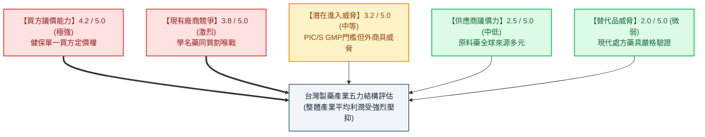
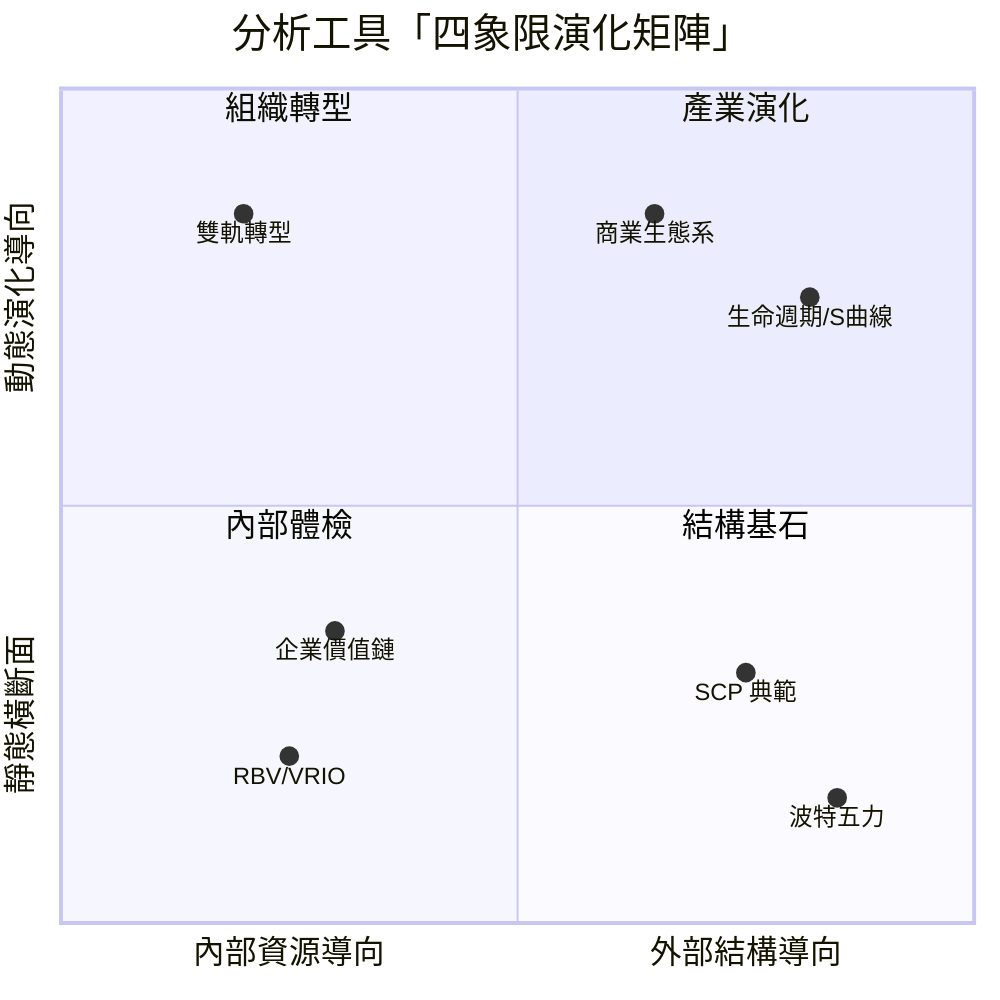

---
{"dg-publish":true,"permalink":"/04/12/02/module-1/m1-5/","tags":["PMBA","產業分析","五力分析","競爭策略","產業結構","進入障礙","集中度","雷達圖"],"dg-note-properties":{"aliases":["波特五力分析","五力模型","Five Forces","五力雷達圖","HHI指數","市場集中度","可競爭市場"],"tags":["PMBA","產業分析","五力分析","競爭策略","產業結構","進入障礙","集中度","雷達圖"],"created":"2026-10-02","status":"completed","parent":"[[04_主題選修/12_產業分析與投資策略/00_課程導航與進度/progress_📊 課程與筆記進度追蹤]]"}}
---


# M1-5 波特[[98_商業概念庫/五力分析\|五力分析]]與量化架構

> **導航索引**：[[04_主題選修/12_產業分析與投資策略/00_課程導航與進度/progress_📊 課程與筆記進度追蹤\|進度看板]] ｜ [[04_主題選修/12_產業分析與投資策略/00_課程導航與進度/mindmap_產業分析與投資策略_心智圖導航\|全課程心智圖]] ｜ [[04_主題選修/12_產業分析與投資策略/02_模組筆記/Module_1_總論與架構/M1_模組架構心智圖\|本模組心智圖]]  
> **商管核心價值**：[[98_商業概念庫/五力分析\|五力分析]]（Porter's Five Forces）是微觀產業競爭分析的黃金標準。影響產業長期獲利天花板的，不是短期的景氣循環，而是五大結構性力量的綜合強度。本篇深入拆解五力深層驅動機理、推導集中度（$CR_4$ / $\text{HHI}$）等量化指標與五力雷達圖評估模型，並結合課堂白板推導工具四象限演化矩陣，為高階經理人提供反制[[98_商業概念庫/產業結構\|產業結構]]壓迫的戰略路徑。

---

## 一、視覺化知識脈絡圖 (Mermaid Context)



---

## 二、波特五力核心架構與深層驅動因子詳解

麥可·波特（Michael Porter, 1979, 2008）強調，**產業的吸引力與獲利結構絕非隨機分佈，而是由五種基本競爭力量的合力所決定**。五力越強大，產業平均投資報酬率（ROIC）越被壓縮；反之，若五力皆弱，產業便享有可觀的結構性超額利潤。

### 2.1 力道一：[[潛在進入者]]的威脅（Threat of New Entrants）
- **核心衝擊**：新進者往往攜帶充沛資本、新產能與擴張市占的強烈企圖心進入市場，必然導致供給增加、價格受壓、既有廠商防禦成本（廣告/研發）激增。
- **決定進入威脅的六大壁壘（Entry Barriers）**：
  1. **規模經濟（Economies of Scale）**：既有者具備龐大產能分攤固定成本；新進者若小規模進入將面臨單位成本劣勢，大規模進入則引發產能過剩與強烈報復。
  2. **資本需求門檻（Capital Requirements）**：進入賽道所需的初始不可逆投資規模（如晶圓廠數百億美元、先進封裝設備）。
  3. **顧客轉換成本（Customer Switching Costs）**：客戶更換供應商時所需承擔的財務、技術、人員重新培訓與數據遷移代價（如[[企業]]更換 ERP 系統）。
  4. **通路取得排他性（Access to Distribution Channels）**：既有業者透過長期合約綁定或貨架進場費（Slotting Fees）鎖死黃金銷售通路（如可口可樂、聯合利華壟斷超商貨架）。
  5. **專屬性成本優勢（Cost Advantages Independent of Size）**：與規模無關的先發優勢，包含專利保護、獨家原料來源、地理最優區位、累積的學習曲線（Learning Curve）。
  6. **政府法規與產業政策（Government Policy）**：特許執照管制、環境法規、安規認證（如藥證審查 FDA、電信特許執照）。
- **進階經濟學概念：可競爭市場（Contestable Market - Baumol）**：
  - 課堂特別點出，即使市場呈現「高度集中甚至單一獨占」，只要**進出障礙接近於零（無[[沉沒成本]]，進入者可隨時 Hit-and-Run）**，既有獨占者亦不敢開出壟斷暴利，必須維持競爭性定價以防外部資本隨時切入[[套利]]。

- **進入障礙實證案例：快消零售龍頭聯合利華 (Unilever)**：
  在第三週（Class 3）課堂討論中，學員深入拆解民生快消與個人護理用品產業：
  1. **專有低成本產品設計與配方**：大廠掌握專利化學複方與高良率量產技術。
  2. **跨國規模經濟 (Scale Economies)**：上百億美元全球原物料集中採購壓低 BOM 表成本。
  3. **品牌重置成本 (Brand Replacement Cost)**：建立消費者「洗髮乳、沐浴乳、清潔劑」的[[心智佔有率]]需要長達數十年的巨額廣告費用，新創難以在短時間內洗掉既有品牌信任。
  4. **實體通路黃金貨架排他取得權**：既有巨頭透過高額進場費與搭售合約，鎖死大型連鎖超市與便利超商最顯眼的視線平視貨架，新品牌根本無處上架。

- **[[五力分析]]的「內外雙向視角（Two-Way Perspective）」**：
  課堂深入揭示多數經理人運用五力時的盲點——**「看五力，必須同時站在產業內與產業外雙重視角審視」**：
  - **產業內既有者視角**：關注的是自身的**「定價話語權（Pricing Power）」**與防禦外部干擾的能力。
  - **產業外[[潛在進入者]]視角**：關注的是該產業的**「超額[[獲利能力]]（Profitability）」**。當一個產業享有超常暴利，即使進入門檻高，也會成為吸引外部充沛資本（如科技巨頭跨界、私募股權基金）發動破壞性掠奪的「血腥誘餌」；唯有透過持續拉高技術或重置壁壘，才能將誘惑轉化為真正的威懾。

---

### 2.2 力道二：替代品的威脅（Threat of Substitutes）
- **定義與盲點**：替代品來自**「不同產業」**，但能夠滿足顧客**「相同核心需求」**的產品或服務（例如：台灣高鐵替代國內民航航線；遠端視訊 Zoom 替代商務出差飛行）。
- **替代品的三大威脅驅動機制**：
  1. **相對性價比突破（Relative Price-Performance Ratio）**：當替代品在價格或性能上突破臨界點（如平價電動車電池成本下降），將加速滲透。
  2. **極低的轉換成本**：消費者轉向替代方案無須承擔重大心理或金錢負擔。
  3. **設定產業「價格天花板」（Price Ceiling）**：
     - 📌 **課堂洞察**：替代品是產業利潤最兇殘的「隱形殺手」。它悄然限制了產業既有廠商的提價空間，一旦既有產品漲價，顧客便大規模外流至替代品賽道。

- **替代品動態技術演變實證案例**：
  - **通訊產業的替代演進**：從傳統電信國際電話被 Skype/MSN 替代，到 Skype 被行動即時通訊（LINE/WhatsApp）與視訊會議（Zoom/Teams）全面覆蓋。
  - **蘋果庫克（Tim Cook）的世紀預警**：身為全球智慧型手機龍頭 CEO，庫克曾公開指出「未來的人可能不再使用智慧型手機」，因為穿戴裝置（智慧眼鏡、空間運算 Vision Pro、神經介面）隨時可能演化為終端替代品。為防禦此致命替代，蘋果寧可提早自我顛覆，重金佈局智慧穿戴生態系。

---

### 2.3 力道三 & 四：買方與供應商的議價力量（Bargaining Power）

議價力量的本質在於**「誰依賴誰更多」**，體現於上下游對剩餘利潤的爭奪：

| 力量構面 | 強勢特徵與觸發條件 | 對本產業利潤池的擠壓機制 | 實務代表案例 |
| :--- | :--- | :--- | :--- |
| **買方的[[議價能力]]<br>(Power of Buyers)** | 1. **買方集中度極高**：少數大客戶貢獻絕大部分營收。<br>2. **產品標準化無差異**：買方隨時可轉單（低轉換成本）。<br>3. **價格極度敏感**：採購成本佔買方總成本比重極高。<br>4. **具備向後整合威脅 (Backward Integration)**：買方有能力自行生產。<br>5. **資訊完全透明**：買方徹底掌握市場成本底牌。 | 買方透過**壓低採購價格**、要求更嚴格付款天期、無償要求客製化服務，將產業毛利洗劫一空。 | • **台灣健保署**：全台唯一買方，掌控藥價核定權，造成本地學名藥利潤極微。<br>• **Apple 對零組件廠**：掌握龐大訂單，隨時扶植第二供應商砍價。 |
| **供應商的[[議價能力]]<br>(Power of Suppliers)** | 1. **供應商集中度 > 買方產業集中度**：由少數寡占原廠主宰。<br>2. **產品具備極高專屬性或專利**：無合適替代品。<br>3. **轉換供應商代價極高**：重新驗證需耗時 1~2 年。<br>4. **具備向前整合威脅 (Forward Integration)**：供應商有能力直接跨入下游。<br>5. **買方產業非主要營收來源**：不重視該客戶。 | 供應商透過**強制提價**、配額配給（如缺料配貨）、降低交貨品質，將成本全數轉嫁給產業廠商。 | • **ASML**：全球唯一下世代 EUV 光刻機供應商，對晶圓廠擁有絕對定價權。<br>• **NVIDIA**：高階 AI GPU 供不應求，伺服器代工廠無議價空間。 |

---

### 2.4 力道五：產業內既有競爭強度（Competitive Rivalry）
- **核心衝擊**：業內競爭是利潤的最直接毀滅者。競爭越激烈，價格戰越頻繁，管銷與行銷費用佔比飆高，整體產業 ROE 劇烈下挫。
- **導致白熱化競爭的五大結構性誘因**：
  1. **勢均力敵的競爭者群（Numerous or Equally Balanced Competitors）**：無具備絕對威懾力的龍頭，易引發爭奪市場領導權之混戰。
  2. **產業成長陷入停滯（Slow Industry Growth）**：增量市場消失，演變為你死我活的「零和遊戲（Zero-Sum Game）」，唯有搶奪對手市占方能生存。
  3. **高固定成本或龐大庫存資產（High Fixed Costs or Storage Costs）**：為了分攤高額[[折舊]]費用，廠商在景氣轉弱時有強烈誘因「降價求售、填補產能利用率」（如晶圓成熟製程、石化、海運搶單）。
  4. **產品商品化（Commoditization）與缺乏差異化**：產品失去品牌溢價，顧客僅以價格為單一決策標準。
  5. **高退出障礙（High Exit Barriers）**：
     - 📌 **重大實務概念**：專屬固定資產難以轉售變現、清算解僱賠償金額龐大、政府政治力阻撓關廠。虧損廠商因「死不起」而長期死守市場，殘留產能使全行業長期承受價格折磨（如德國福斯汽車難以關廠、鋼鐵水泥舊產能）。

---

### 2.5 群組層級[[五力分析]]（Group-level Five Forces：五力的非均質分佈）
在 Class 4 課堂上，老師特別延伸了波特[[五力分析]]的應用邊界：**「五力在產業內部並非均質分佈，不同策略群組面對的五力強度與議價結構截然不同！」**
* **全產業五力 vs 群組五力**：
  * 全[[產業分析]]：只能衡量產業平均報酬率（Industry Average ROIC）。
  * 策略群組分析：深入解釋為何同一產業內，特定群組能長期享有顯著超越產業平均的超額利潤（Economic Rents）。
* **群組五力結構差異對比表**：
  | 五力維度 | 策略群組 A（高專利 / 旗艦品牌 / 樞紐航網） | 策略群組 B（平價學名藥 / 白牌組裝 / 點對點 LCC） | 策略意涵與差異化機制 |
  | :--- | :--- | :--- | :--- |
  | **買方議價力** | **極低**：產品具高度專利或強大品牌溢價，買方缺乏替代選擇。 | **極高**：標準化規格，買方（如健保署、大型通路）掌控核價權。 | 群組 A 享有定價特權；群組 B 需嚴控[[毛利率]]與週轉率。 |
  | **[[替代品威脅]]** | **低**：具備臨床實證、專屬生態系或龐大航網時間帶壁壘。 | **高**：極易被跨產業低價方案或互補方案侵蝕份額。 | 群組 A 擁有寬廣價格安全邊際；群組 B 受限於嚴苛價格天花板。 |
  | **進入者威脅** | **極低（高移動障礙）**：巨額研發 CapEx、專利池與登機門 Slots 排他性。 | **高（低移動障礙）**：資本門檻相對親民，新資本隨時切入模仿。 | 群組 A 構築強固「移動障礙（Mobility Barriers）」阻絕外部滲透。 |
  | **業內競爭度** | **寡占默契競合**：少數巨頭勢均力敵，競爭多聚焦於技術升級與[[品牌形象]]。 | **割喉價格紅海**：廠商眾多同質性高，產能過剩即爆發價格戰。 | 詳見 [[M1-7_產業市場空間與策略群組|M1-7 產業市場空間與策略群組]] 之實證對標。 |

## 三、市場結構量化指標體系

高階商管分析嚴禁停留在質性描述，必須透過客觀量化指標將市場結構落實為決策數據。

### 3.1 產業集中度指標（Concentration Ratio, $CR_n$）
$$CR_n = \sum_{i=1}^{n} S_i \quad (S_i 	ext{ 為第 } i 	ext{ 大廠商之市場占有率})$$
- **常用指標**：$CR_4$（前四大廠商市占總和）與 $CR_8$（前八大市占總和）。
- **判讀準則**：
  - $CR_4 > 60\%$：高度寡占市場，巨頭具備協同定價能力。
  - $40\% \le CR_4 \le 60\%$：低度寡占市場，同業競爭激烈。
  - $CR_4 < 40\%$：獨占性競爭或完全競爭市場。

### 3.2 赫芬達爾—赫希曼指數（Herfindahl-Hirschman Index, $	ext{HHI}$）
$$HHI = \sum_{i=1}^{N} (S_i 	imes 100)^2$$
*(式中 $S_i$ 為廠商市占率百分比，如 30% 則以 30 代入，$HHI$ 理論值介於 0 至 10,000 之間)*

- **$	ext{HHI}$ 優於 $CR_4$ 的關鍵原因**：透過平方加權，$	ext{HHI}$ 對龍頭廠商的**「超級規模優勢」與「規模分佈差距」**極度敏感。
  - *實例對比*：
    - 市場甲：四家廠商市占分別為 25%, 25%, 25%, 25% ➔ $CR_4 = 100\%$, $HHI = 25^2 	imes 4 = 2,500$。
    - 市場乙：四家廠商市占分別為 70%, 10%, 10%, 10% ➔ $CR_4 = 100\%$, $HHI = 70^2 + 10^2 	imes 3 = 5,200$。
    - 顯然市場乙呈現極端單一霸權壟斷，$	ext{HHI}$ 成功揭示了兩者競爭質量的巨幅差距。
- **美國司法部（DOJ）與聯邦貿易委員會（FTC）反托拉斯法審查標準**：
  - $	ext{HHI} < 1,500$：低度集中市場（Unconcentrated）。
  - $1,500 \le 	ext{HHI} \le 2,500$：中度集中市場（Moderately Concentrated）。
  - $	ext{HHI} > 2,500$：高度集中市場（Highly Concentrated）。若併購案使 $	ext{HHI}$ 上升超過 100～200 點，主管機關將直接啟動反托拉斯反洗錢與併購否決調查。

### 3.3 [[五力分析]]實務量化檢核清單 (KPI Checklist)

| 五力維度 | 核心量化觀測指標 | 數據來源與評估方式 | 警戒訊號 (Red Flag) |
| :--- | :--- | :--- | :--- |
| **供應商議價力** | • 供應商 $CR_5$ 集中度<br>• 關鍵零組件採購集中度 %<br>• 採購合約轉換成本 ($) | 財報附註之主要進貨供應商名單、BOM 表 | 單一供應商採購佔比 $> 30\%$，缺乏備選第二來源 (Second Source)。 |
| **買方議價力** | • 前五大客戶營收貢獻度 %<br>• 銷貨賒帳天數 (DSO)<br>• [[毛利率]]受客戶審計壓降幅 % | 財報營收集中度揭露、合約毛利折讓條款 | 單一客戶佔營收 $> 25\%$，[[應收帳款]]天數逐年拉長。 |
| **[[潛在進入者]]** | • 資本密集度 (CapEx / Sales %)<br>• [[研發費用率]] (R&D / Sales %)<br>• 專利有效存量與訴訟防禦勝率 | 年報[[現金流量表]]、智慧財產局專利資料庫 | 該產業[[毛利率]] $> 35\%$ 但 CapEx 佔比 $< 3\%$，易招致跨界資本掠奪。 |
| **[[替代品威脅]]** | • 替代方案滲透率 (Penetration Rate)<br>• 相對性價比曲線 (Price/Performance)<br>• 跨品類顧客流失率 % | 智庫報告 (IDC/Gartner)、產業公會統計 | 異業新技術性能每年以 $> 30\%$ 速度提升，且終端價格持續走跌。 |
| **業內競爭程度** | • 產業前四大集中度 ($CR_4$)<br>• 行銷廣告費用率 (SG&A %)<br>• 產能利用率波動度 vs [[毛利率]]降幅 | 財報[[損益表]][[營業費用]]、券商產業研究報告 | 產能利用率降至 $70\%$ 以下引發大規模割喉降價戰。 |

---

### 3.4 從五力量化推導關鍵成功因素（KSF）的五大標準步驟
在 Class 4 課堂現場，老師強調：**進行[[五力分析]]的終極商業目的，除了產業投資評價之外，核心在於提煉出該產業的「關鍵成功因素（Key Success Factors, KSF）」**。
KSF 說明了外在[[產業結構]]連接到[[企業]]實質競爭優勢的關鍵紐帶，具備三大核心特質：
1. 包含該產業生存與獲利的決定性要素。
2. 足以在市場中形成實質異質價值與差異化。
3. 能夠承受外在總體環境變動與競爭對手的強烈反擊。

#### 提煉產業 KSF 的五大標準化執行步驟：
```
Step 1: 全面要素盤點 ➔ 從外部環境、SCP 典範與五力架構中，篩選出 25 項關鍵競爭要素
Step 2: 權重配置賦予 ➔ 透過專家德爾菲法 (Delphi Method) 或產學問卷調查，給予各要素重要性權重
Step 3: 競爭激烈度評分 ➔ 依據市場量化指標 (CR4/HHI/轉換成本)，對各要素競爭烈度評給客觀分數 (1~5分)
Step 4: 加權計量評估 ➔ 計算各要素之加權總分 (權重 × 競爭評分)
Step 5: 優先順序提煉 ➔ 依加權分數排序，最終精煉出決定該產業勝負的「前 9 項關鍵 KSF」
```
* **實戰案例（先進製程晶圓製造）**：
  * 經五步推導，晶圓代工之最核心 KSF 為「極致先進製程研發能力與製造良率（Yield Rate）」。
  * 對應至[[企業]]內部核心資產：必須具備高素質人力資源（24 小時輪班待命之工程師部隊）、巨額 EUV 光刻設備投資、以及數萬件製程配方專利池（專屬性資產）。

## 四、五力雷達圖量化評估矩陣 (The Radar Framework)

課堂強調，波特五力若僅停留在「強/中/弱」定性文字，對高階投資與立項決策價值有限。標準 PMBA 作法是**「五力雷達圖評分化」**，以 1～5 分量化評估，數值越高代表力量越強、對利潤壓迫越大：

### 4.1 台灣製藥產業五力雷達圖實證案例（課堂深入解析）

在 Class 2 中，老師展示了台灣製藥與生技產業研究報告之雷達圖打分模型：


| 五力維度 | 評分 (1~5) | 結構性成因與課堂商業洞察 | 策略意涵與突圍方向 |
| :--- | :---: | :--- | :--- |
| **[[買方議價能力]]** | **4.2 分**<br>*(極端強勢)* | **單一買方體制（Single Payer Monopsony）**：台灣醫療市場由健保署掌控全額預算與藥價核定權，定期啟動藥價調查砍價，學名藥廠幾乎完全喪失定價權。 | 避開健保內需紅海，拓展海外自費市場、高階保健品或直營下游連鎖藥局（如大樹藥局）。 |
| **現有競爭強度** | **3.8 分**<br>*(激烈對抗)* | 國內合格藥廠上百家，多數集中於低技術門檻之傳統學名藥，產品同質性高，陷入公立醫院招標割喉價格戰。 | 透過併購推動行業整併，關閉落後產能，提高[[市場集中度]]。 |
| **潛在進入威脅** | **3.2 分**<br>*(中度壁壘)* | PIC/S GMP 廠房法規與查驗登記（ANDA）具備一定時間與資本門檻，但跨國大藥廠具備隨時切入專利期滿學名藥之實力。 | 建立配方專利池與特殊劑型技術壁壘。 |
| **供應商議價力** | **2.5 分**<br>*(中低強度)* | 原料藥（API）與化學賦形劑來源遍布印度、中國與歐美，供應商選擇多元，無單一壟斷原廠。 | 建立多元供應鏈採購策略，控制進貨成本。 |
| **[[替代品威脅]]** | **2.0 分**<br>*(相對微弱)* | 現代醫學藥品具備嚴格生體可用率（BA/BE）驗證，中醫藥或自然療法難以在急性重大適應症上直接替代處方西藥。 | 鎖定特定疾病適應症深耕，確立療效替代防禦。 |

---

## 五、理論爭議、動態盲點與四大反制戰略

### 5.1 五力架構的四大理論盲點與學術批判
在運用[[五力分析]]時，高階經理人必須清楚其內在限制，切忌盲目崇拜：
1. **靜態橫斷面缺陷（Static Blind Spot）**：[[五力分析]]提供的是當前[[產業結構]]的「快照（Snapshot）」，無法捕捉技術變革、政策鬆綁帶來的動態結構演變。
2. **零和博弈偏誤（Zero-Sum Fallacy）**：波特假設產業利潤池是固定的，五力彼此廝殺爭奪剩餘價值；忽略了[[企業]]可透過**「[[互補品]]（Complementors）與[[策略聯盟]]」**把餅做大（正和博弈）。
3. **同質化廠商假設（Firm Homogeneity Assumption）**：五力模型假設產業內廠商面對相同的結構約束；然而**資源基礎觀點（RBV）**證明，同產業內部因[[企業]]核心資源與能耐（VRIO）不同，[[獲利能力]]存在巨大鴻溝（如[[台積電]]遠超聯電、寶雅遠超同業）。
4. **缺乏執行戰略導引**：五力告訴經理人「哪裡危險」，卻沒有具體指引[[企業]]「如何從內部構建核心能耐」予以反制。

### 5.2 [[企業]]反制五力壓迫的四大戰略路徑

```text
┌────────────────────────────────────────────────────────┐
│             企業反制五力結構之四大戰略路徑             │
├──────────────────────────┬─────────────────────────────┤
│ 1. 防禦定位 (Positioning)│ 將企業定位在五力壓迫最微弱的 │
│                          │ 利基賽道，避開正面交火。    │
├──────────────────────────┼─────────────────────────────┤
│ 2. 重塑規則 (Reshaping)  │ 主動透過技術專利、自建通路、 │
│                          │ 提高轉換成本，扭轉五力結構。 │
├──────────────────────────┼─────────────────────────────┤
│ 3. 利用變革 (Exploiting) │ 順應新技術或法規轉折，在進入 │
│                          │ 壁壘瓦解時搶先佔據制高點。   │
├──────────────────────────┼─────────────────────────────┤
│ 4. 生態共生 (Ecosystem)  │ 從單打獨鬥轉向價值網合作，   │
│                          │ 扶植互補品，做大利潤池。     │
└──────────────────────────┴─────────────────────────────┘
```

1. **防禦性定位（Strategic Positioning）**：
   - 不與五力強大的巨頭硬碰硬，尋找[[產業結構]]邊界的「競爭空白區（White Space）」。例如：寶雅避開統一超與全家的生鮮日用品紅海，聚焦於個人美妝與高坪效生活雜貨，[[開創]]高達 41% ROE 之品類殺手模式。
2. **重塑[[產業結構]]（Reshaping the Structure）**：
   - 透過戰略動作反制五力：
     - *反制買方/供方*：推動垂直整合（如[[台積電]]自研 CoWoS 先進封裝，跨越封測邊界）。
     - *反制同業競爭*：以大規模併購（M&A）提升產業集中度（如保瑞藥業持續收購跨國藥廠生產線）。
     - *拉高轉換成本*：打造專屬生態系（如蘋果 iOS 與閉門生態）。
3. **預見並利用結構變更（Exploiting Industry Change）**：
   - 結構變遷是最佳進攻時機。當重大通用技術降臨（如生成式 AI、雲端運算），廣達果斷將資源由傳統低毛利 NB 代工移出，搶先重押 CSP 白牌 AI 伺服器，直接完成產業跨越。
4. **價值網生態共生（Building Ecosystem）**：
   - 導入 Brandenburger 價值網理念，主動扶植外部[[互補品]]，由單向議價對抗轉化為「互利共生聯盟」。

---

## 六、課堂白板專題：[[產業分析]]工具「四象限演化矩陣」

在 Class 2 課堂後半，老師於白板繪製了戰略管理學界各大主流分析工具的**「四象限演化地圖」**，揭示經理人在不同情境下的選用依據：

- **橫軸**：分析視角導向（**外部競爭結構導向** vs. **內部資源能耐導向**）
- **縱軸**：時間分析向度（**靜態橫斷面剖析** vs. **動態演化與轉型**）

| 時間向度 ＼ 分析視角 | **內部資源能耐導向 (Internal)** | **外部競爭結構導向 (External)** |
| :--- | :--- | :--- |
| **動態演化導向**<br>*(Dynamic)* | **【第二象限：動態組織能耐】**<br>• 雙軌轉型 (Dual Transformation)<br>• 動態能力 (Dynamic Capabilities)<br>• 資源重組與組織敏捷化 | **【第一象限：動態產業演化】**<br>• 產業生命週期 (PLC) / S 曲線<br>• 破壞性[[創新]]理論<br>• 商業生態系 (Business Ecosystem) |
| **靜態橫斷面**<br>*(Static)* | **【第三象限：[[企業]]內部體檢】**<br>• [[資源基礎理論]] (RBV / VRIO)<br>• [[企業價值]]鏈 (Value Chain)<br>• 核心競爭力盤點 | **【第四象限：[[產業結構]]基石】**<br>• **波特[[五力分析]] (Five Forces)**<br>• SCP 產業組織典範<br>• [[市場集中度]] ($CR_4$ / $HHI$) |



### 矩陣意涵與工具鏈協同指引：
1. **第四象限（靜態 × 外部結構）──「[[產業結構]]基石」**：
   - **核心工具**：**波特[[五力分析]]**、**SCP 典範**、[[市場集中度]]（$CR_4$ / $	ext{HHI}$）。
   - **適用時機**：評估新賽道進入時機、辨識整體產業長期投資報酬率天花板。
2. **第三象限（靜態 × 內部資源）──「[[企業]]核心能耐」**：
   - **核心工具**：**資源基礎觀點（RBV）**、**VRIO 模型**、[[企業價值]]鏈。
   - **適用時機**：診斷自身[[企業]]是否具備抗衡外部五力壓迫的獨特專屬資源。
3. **第一象限（動態 × 外部演化）──「產業板塊重組」**：
   - **核心工具**：**產業生命週期（PLC）**、**技術演化 S 曲線**、**商業生態系網絡**。
   - **適用時機**：掌握技術典範轉移、預判替代品崛起與跨界生態顛覆。
4. **第二象限（動態 × 內部轉型）──「[[企業]]第二成長曲線」**：
   - **核心工具**：**成熟[[企業]]雙軌轉型（Dual Transformation）**、動態能耐（Dynamic Capabilities）。
   - **適用時機**：主動重構內部[[資源配置]]，擺脫既有成熟業務紅海包袱。

---

## 七、高階經理人與投資人實戰決策工具箱

### 7.1 產業五力結構診斷七大關鍵檢核問句 (The Five-Forces Checklist)

> [!check] 📋 高階經理人五力結構診斷檢核表
> 
> - [ ] **Q1. 進入防禦**：本產業的最低效率規模（MES）與初始資本門檻是否足夠高，能有效阻擋外部充沛資本的侵入？
> - [ ] **Q2. 替代天花板**：市場外是否存在性能快速逼近、性價比更優的異業替代品？它們是否已鎖死了我方產品的價格上限？
> - [ ] **Q3. 買方鉗制**：前五大客戶營收集中度是否超過 40%？我方是否面臨客戶自研向後整合的實質威脅？
> - [ ] **Q4. 供應鏈勒索**：關鍵核心專利原料是否被少數寡占原廠所垄斷？更換供應商的驗證與停線代價是否無法承受？
> - [ ] **Q5. 退出陷阱**：產業內是否存在巨額專用資產沉沒所引發的高退出障礙？虧損同業是否正在發動絕望的割喉價格戰？
> - [ ] **Q6. 集中度檢驗**：該賽道的 $	ext{HHI}$ 指數是否大於 2,500？我方是否有[[機會]]透過併購推動行業整合以改善競爭結構？
> - [ ] **Q7. 生態重塑**：面對五力壓迫，我方是否能透過構建[[互補品]]生態圈或自製水冷機櫃系統，從單一組件殺出重圍？

---

### 7.2 核心商管術語速查庫 (Glossary)

- **波特[[五力分析]]（Porter's Five Forces）**：由 Michael Porter 於 1979 年提出，以現有同業競爭、[[潛在進入者]]、替代品、買方議價力、供應商議價力評估產業長期平均資本回報率。
- **可競爭市場（Contestable Market）**：William Baumol 提出之理論，指進出無重大[[沉沒成本]]之市場，即使當前只有一家壟斷廠商，亦受[[潛在進入者]]威懾而必須採取競爭性定價。
- **退出障礙（Exit Barriers）**：阻止[[企業]]撤出無利可圖市場的經濟、戰略或情感壁壘（如重資產設備專屬性、工會大量資遣費補償、政府管制）。
- **赫芬達爾—赫希曼指數（HHI）**：衡量產業集中度之金標準，為所有廠商市占率平方之總和，對龍頭規模極端敏感，受反托拉斯監管機構廣泛採納。
- **單一買方（Monopsony）**：市場中僅存在單一採購者（如台灣健保署之於處方藥廠），對賣方價格具備絕對強制力。
- **向後整合（Backward Integration）**：下游買方[[企業]]向[[價值鏈]]上游跨足，自行生產所需零組件或原物料之策略動作。

---

## 八、課堂對標與關聯知識體系

### 🔗 關聯模組與延伸閱讀
- 前篇基礎定位：[[M1-1_產業分析本質與中層定位|M1-1 產業分析本質與中層定位]]
- 資本配置與評價：[[M1-2_三大景氣循環與資本評價邏輯|M1-2 三大景氣循環與資本評價邏輯]]
- 產業組織與學派對決：[[M1-3_產業獲利結構差異與十大經典理論|M1-3 產業獲利結構差異與十大經典理論]]
- 下篇進階分析：[[M1-6_產業分析模式與九大分析工具矩陣|M1-6 產業分析模式與市場集中度]]
- 實戰個案對標：[[cases_企業與產業案例庫#台灣製藥|台灣製藥單一買方實證]] ｜ [[cases_企業與產業案例庫#福斯|福斯汽車高退出障礙]]

### 📚 官方教材與課堂定位
- 授課主題：國立臺灣大學 PMBA「產業組織與[[五力分析]]（Industry Organization & Five-Forces Analysis）」
- 官方講義參照：Class 2 講義（產業組織與[[五力分析]]）Unit 1 ~ Unit 8
- 課堂白板推導：白板板書（2026/09/19：資本配置二維象限、固定資本投入截距斜率模型、分析工具四象限演化矩陣）
