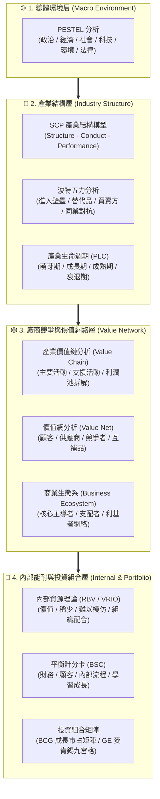
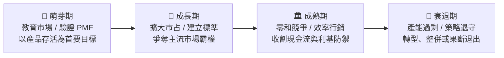
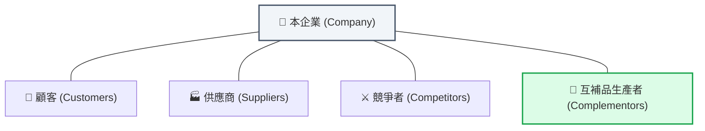
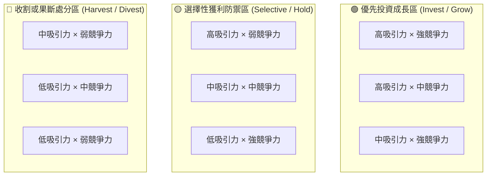
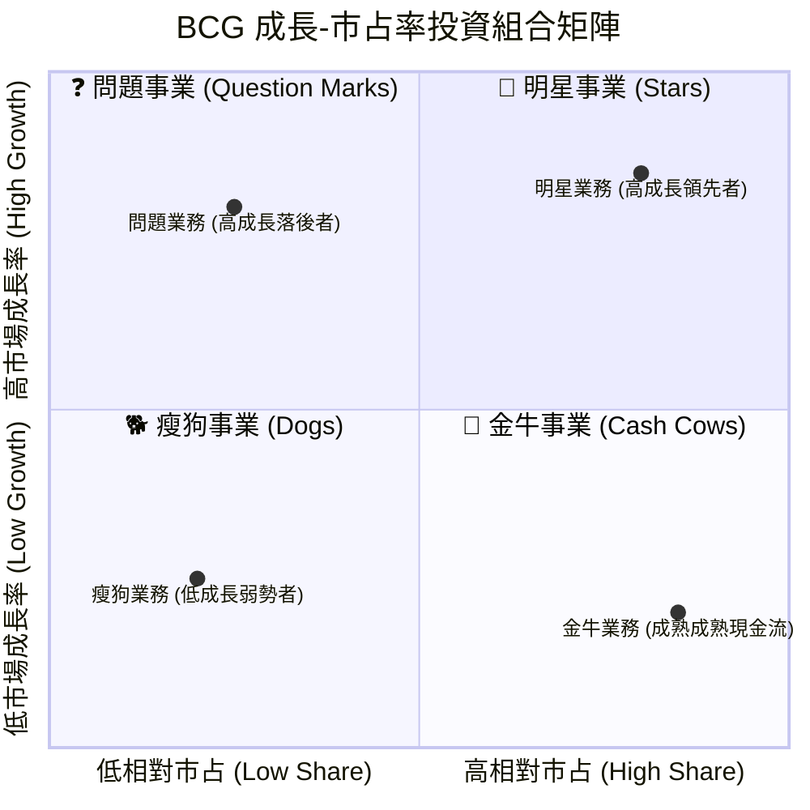
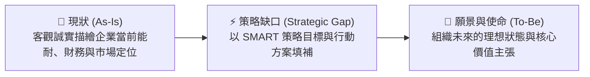
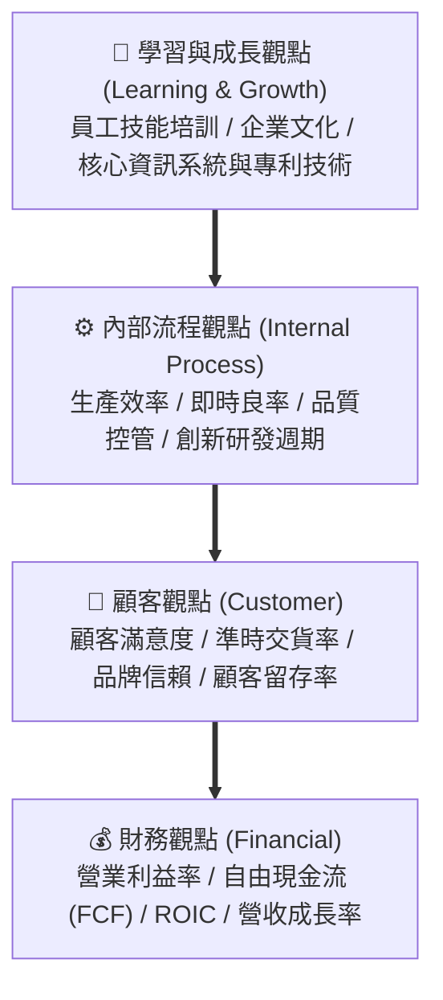
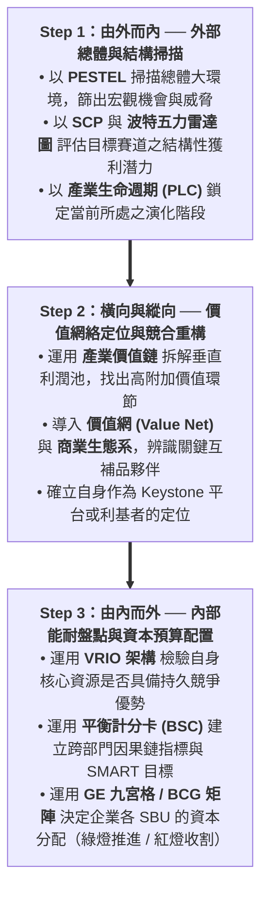

---
{"dg-publish":true,"permalink":"/04/12/02/module-1/m1-6/","tags":["PMBA","產業分析","模組一","分析模式","策略矩陣","價值鏈","價值網","商業生態系","平衡計分卡","VRIO"],"dg-note-properties":{"aliases":["產業分析模式","九大產業分析工具","策略工具矩陣","PESTEL","PLC","價值網","商業生態系","GE矩陣","BCG矩陣","BSC","VRIO"],"tags":["PMBA","產業分析","模組一","分析模式","策略矩陣","價值鏈","價值網","商業生態系","平衡計分卡","VRIO"],"created":"2026-10-02","status":"completed","parent":"[[04_主題選修/12_產業分析與投資策略/00_課程導航與進度/progress_📊 課程與筆記進度追蹤]]"}}
---


# M1-6 [[98_商業概念庫/產業分析\|產業分析]]模式與九大分析工具矩陣

> **導航索引**：[[04_主題選修/12_產業分析與投資策略/00_課程導航與進度/progress_📊 課程與筆記進度追蹤\|進度看板]] ｜ [[04_主題選修/12_產業分析與投資策略/00_課程導航與進度/mindmap_產業分析與投資策略_心智圖導航\|全課程心智圖]] ｜ [[04_主題選修/12_產業分析與投資策略/02_模組筆記/Module_1_總論與架構/M1_模組架構心智圖\|本模組心智圖]]  
> **商管核心價值**：工欲善其事，必先利其器。[[98_商業概念庫/產業分析\|產業分析]]從非單一工具的盲目套用，而是依據決策層級（總體、結構、價值網、內部能耐、投資組合）與時間向度（靜態橫斷面 vs. 動態演化），靈活搭配最適分析模式。本篇全景解構產業界九大經典分析工具、[[98_商業概念庫/創新\|創新]][[98_商業概念庫/創業\|創業]]策略思維（BSC、VRIO、動態能力），並提供高階經理人整合決策指南。

---

## 一、視覺化知識脈絡圖 (Mermaid Context)



---

## 二、[[產業分析]]模式演化系譜與核心目的

### 2.1 [[產業分析]]的核心目的
[[產業分析]]（Industry Analysis）是[[企業]]擬定[[競爭策略]]與投資機構進行資本配置之前不可或缺的基礎工程，其核心目的在於：
1. **穿透巨觀迷霧**：系統性解構總體環境趨勢與法規限制，界定外在[[機會]]與威脅邊界。
2. **掌握結構性定價特權**：評估產業長期平均資本回報率，辨識整體利潤池（Profit Pool）的天花板。
3. **定位價值網絡節點**：明確[[企業]]在垂直鏈條（Value Chain）與水平生態系（Ecosystem）中的相對位置與分工角色。
4. **指導資本配置與策略選擇**：為新事業進入/退出、M&A 併購整合、研發投資與[[產品組合]]優化提供量化決策依據。

### 2.2 [[產業分析]]之四大分析層次矩陣
學術與實務界之分析模式，本質上沿著**「分析空間範疇（外部總體 $
ightarrow$ [[企業]]內部）」**與**「時間維度（靜態 $
ightarrow$ 動態）」**開展為四大層次：

| 分析層次 | 核心分析單位 | 關注核心問題 | 典型分析模式 | 主要輸出成果 |
| :--- | :--- | :--- | :--- | :--- |
| **1. 總體環境層** | 國家、區域、總體經濟 | 外部有哪些非[[企業]]所能控制的巨觀結構力量正在改變遊戲規則？ | **PESTEL 分析** | [[機會]]與威脅清單、總經變革早期預警訊號 |
| **2. [[產業結構]]層** | 產業別、市場賽道 | 該產業長期的平均資本報酬率如何？利潤被哪一股力量侵蝕？ | **SCP 模型**<br>**波特[[五力分析]]**<br>**產業生命週期 (PLC)** | [[市場集中度]] ($CR_4$/HHI)、五力雷達圖、所處生命週期階段策略方針 |
| **3. 價值網絡層** | 價值體系、競合夥伴 | 價值是如何在上下游創造與傳遞的？誰是關鍵互補夥伴？ | **產業[[價值鏈]] ([[VC]])**<br>**價值網 (Value Net)**<br>**商業生態系 (Ecosystem)** | 產業垂直分工圖、利潤池分佈、[[互補品]]協同戰略、生態主導者地位 |
| **4. 內部與組合層** | [[企業]]個體、事業單位 (SBU) | [[企業]]自身是否具備抗衡外力的獨特資源？跨事業資源如何配置？ | **VRIO 架構**<br>**[[平衡計分卡]] (BSC)**<br>**BCG 矩陣 / GE 矩陣** | [[核心能力]]護城河、SBU [[資源配置]]紅黃綠燈、策略行動因果地圖 |

---

## 三、九大經典[[產業分析]]模式全解構

### 3.1 模式一：PESTEL [[總體環境分析]]

#### (1) 理論緣起與本質
源自 Francis Aguilar（1967）提出的 ETPS 環境掃描架構，後續擴充為六大構面。屬於**「總體環境掃描」**工具，分析單位為國家或總體區域，主要用以界定產業所面對的外部[[機會]]與威脅。

#### (2) 六大構面檢核要項
- **政治 (Political)**：政局穩定度、政府產業補貼、貿易政策與地緣政治關稅壁壘。
- **經濟 (Economic)**：GDP 成長率、利率與匯率走勢、通膨黏滯性、景氣循環階段、消費者購買力。
- **社會 (Social)**：人口結構與高齡少子化、生活型態與消費習慣變遷、ESG 與永續意識。
- **科技 (Technological)**：破壞性技術[[創新]]（如 GenAI）、技術擴散速度、智財專利活動。
- **環境 (Environmental)**：極端氣候、碳關稅（CBAM）、碳中和目標、資源循環回收。
- **法律 (Legal)**：反壟斷法規、勞動法令、智財保護、特許執照與個人資安監管。

#### (3) 產業實例應用：全球電動汽車（Electric Vehicle, EV）產業
| PESTEL 構面 | 電動車產業具體環境驅動因子 | 策略意涵與衝擊 |
| :--- | :--- | :--- |
| **政治 (P)** | 各國政府購車補貼退坡、歐美訂定燃油車禁售時程表、美歐對中國電動車加徵高額關稅。 | 政策推力轉向地緣貿易壁壘，車廠需全球分散設廠。 |
| **經濟 (E)** | 電池關鍵金屬（鋰、鈷、鎳）價格波動；高利率環境墊高購車信貸成本；規模經濟促使平價車款浮現。 | 考驗車廠供應鏈成本控制與垂直整合能力。 |
| **社會 (S)** | 環保意識普及但消費者普遍存在「里程焦慮（Range Anxiety）」與充電便利性疑慮。 | 加速普及型快充網絡建設成為銷量成長瓶頸。 |
| **科技 (T)** | 800V 高壓快充平台、碳化矽 (SiC) 功率模組、固態電池研發競賽、高階自動駕駛與座艙晶片演進。 | 技術典範未完全收斂，車廠面臨巨額研發 CapEx 壓力。 |
| **環境 (E)** | 運輸部門淨零碳排硬性指標、動力電池全生命週期碳足跡與回收規範。 | 綠色供應鏈審查成為外銷歐美的強制准入門檻。 |
| **法律 (L)** | 各國碳排放裁罰標準日趨嚴苛；L3/L4 自動駕駛責任歸屬與自駕事故法規尚待健全。 | 法規不確定性構成自動駕駛全面商業化之最大瓶頸。 |

---

### 3.2 模式二：SCP [[產業結構]]分析模型

#### (1) 理論緣起與本質
源自產業組織經濟學（Industrial Organization），由哈佛學派 Edward Mason 與 Joe Bain 於 1930~1950 年代奠定。主張：**基本條件 $
ightarrow$ 市場結構 (Structure) $
ightarrow$ 廠商行為 (Conduct) $
ightarrow$ 市場績效 (Performance)**。

#### (2) 三大學派核心思維交鋒
1. **哈佛學派（Top-Down）**：結構決定論。高集中度導致壟斷與勾結，主張政府反托拉斯拆分。
2. **芝加哥學派（Bottom-Up）**：效率假說。高集中度是最優[[企業]]憑藉效率勝出的自然結果，市場具備自我調節能力。
3. **奧地利學派（Dynamic）**：[[熊彼得]][[創造性破壞]]。[[企業]]家[[創新]]行為會打破舊有壟斷平衡，自發生成新[[產業結構]]。

#### (3) 市場結構五大實務要項
- **買方與賣方數量**：寡占市場中，廠商行為高度互賴（如台灣超商雙雄 333 結構）。
- **廠商進入障礙**：資本沉沒門檻、專利池、特許牌照。
- **產品差異性**：同質化大宗原物料 vs. 高溢價精品。
- **垂直整合程度**：[[價值鏈]]自製與外購邊界（如[[台積電]]跨足 CoWoS 封裝）。
- **多角化程度**：跨產業範疇經濟佈局（如鴻海跨入車電與低軌衛星）。

---

### 3.3 模式三：波特[[五力分析]]與量化雷達圖

#### (1) 理論緣起與本質
Michael Porter 於 1979 年提出，評估產業長期平均資本回報率之結構性工具。五力強度越高，整體產業利潤池遭受壓縮越嚴重。

#### (2) 五力內外雙向視角（Two-Way Perspective）
- **對內視角（既有者）**：關注自身定價話語權（Pricing Power）與防禦能力。
- **對外視角（潛在者）**：關注該行業超額[[獲利能力]]（Profitability）。超高毛利反成吸引外部資本掠奪的「血腥誘餌」。

#### (3) 實務打分量化雷達圖：台灣製藥產業案例
在 Class 2/3 中，透過 1~5 分量化評估五力壓迫（分數越高壓迫越大）：
- **買方議價力 (4.2 分 / 極強)**：健保單一買方定價權（Monopsony），定期砍藥價。
- **現有同業競爭 (3.8 分 / 激烈)**：合格藥廠百家爭鳴，同質學名藥公立醫院招標割喉戰。
- **[[潛在進入者]] (3.2 分 / 中等)**：PIC/S GMP 廠房與 ANDA 審查有門檻，但跨國藥廠具威脅。
- **供應商議價力 (2.5 分 / 中低)**：全球 API 原料藥多元供應，無單一寡占。
- **[[替代品威脅]] (2.0 分 / 微弱)**：現代醫學處方藥具嚴格 BA/BE 生體相容驗證，難以被中藥或民俗療法直接替代。

---

### 3.4 模式四：產業生命週期（Industry Life Cycle, PLC）

#### (1) 理論緣起與本質
描繪產業經歷**萌芽期 (Introduction) $
ightarrow$ [[成長期]] (Growth) $
ightarrow$ [[成熟期]] (Maturity) $
ightarrow$ [[衰退期]] (Decline)**的演進過程。各階段之市場成長率、競爭強度與[[獲利能力]]存在系統性規律。

#### (2) 跨階段各[[企業]]職能策略重點對照表


| 生命週期階段 | 行銷策略重點 (Marketing) | 研發策略重點 (R&D) | 生產與營運重點 (Operations) | 競爭失利之退守策略 |
| :--- | :--- | :--- | :--- | :--- |
| **🌱 萌芽期**<br>*(Introduction)* | • 引介產品特性、教育顧客<br>• 追求 **Product/Market Fit (PMF)**<br>• 以產品能存活為首要目標 | • [[探索]]技術可行性<br>• 快速迭代產品原型 (MVP)<br>• 積極佈局基礎專利 | • 小批量試產<br>• 彈性生產工藝<br>• 容忍較高試錯不良率 | 快速轉向其他潛在新需求或尋求被大廠收購技術。 |
| **🚀 [[成長期]]**<br>*(Growth)* | • 全力爭奪市場佔有率 (Share)<br>• [[品牌形象]]塑造與大規模通路鋪貨<br>• 百家爭鳴，競爭白熱化 | • 確立**主導設計 (Dominant Design)**<br>• 性能改良升級與差異化功能開展 | • 產能大幅擴建，追求規模經濟<br>• 建立穩固零組件供應鏈體系 | **退守專門利基市場**（Niche），或轉為主流供應鏈之關鍵零組件代工。 |
| **🏛️ [[成熟期]]**<br>*(Maturity)* | • 精準有效行銷（特定時機投入資源）<br>• 維護既有客戶忠誠度<br>• 呈現零和搶奪市場份額 | • 製程技術改良以降低單位成本<br>• 延長[[產品生命週期]]之小幅微[[創新]] | • 產能利用率極致化<br>• 嚴格管銷與費用控管<br>• 自動化導入以壓縮邊際成本 | 透過產業併購（M&A）收編弱小同業，消滅多餘產能，維持定價權。 |
| **🍂 [[衰退期]]**<br>*(Decline)* | • 削減非核心廣告促銷開支<br>• 聚焦於價格不敏感的死忠殘留客群 | • 全面停止重大資本研發投資<br>• 研發資源轉移至新興接班賽道 | • 關閉低效益落後廠房<br>• 縮編產能，盡可能將[[存貨]]變現 | 果斷處分資產（Divestment），或以收割策略（Harvesting）榨乾最後現金流。 |

---

#### (3) 技術演化 S 曲線三階段與產業標準爭奪戰（Class 4 深度深化）
在 Class 4 課堂上，老師特別強調技術生命週期往往呈現經典的 S 曲線（S-curve），並經歷三大[[發展]]階段：
1. **浮動期（Fluid Phase）**：
   - 技術路徑多元、產品規格百家爭鳴，市場充斥高度不確定性（如早期電動車規格、早期生成式 AI 模型）。
   - 此時廠商競爭聚焦於「產品[[創新]]與功能[[探索]]」。
2. **變遷期（Transitional Phase）**：
   - 產業中出現兼具性能與量產可行性的「主導設計（Dominant Design）」，技術多樣性開始快速收斂。
   - 競爭重心由「產品[[創新]]」急遽轉向「製程優化與成本控制」。
3. **專業期（Specific Phase）**：
   - 主導設計正式確立為「產業公認標準（Industry Standard）」，市場步入高度專業分工與規格鎖定。
   - **掌控產業標準者掌握「利潤咽喉」**：誰能定義產業標準（如高通之 CDMA 通訊專利、[[台積電]]之 CoWoS 先進封裝標準、NVIDIA 之 [[CUDA]] 架構），誰就擁有絕對定價特權與超額經濟租金，將整個產業上下游轉化為其生態系附庸。

### 3.5 模式五：產業[[價值鏈]]分析（Industry Value Chain）

#### (1) 理論緣起與本質
Michael Porter（1985）於《Competitive Advantage》提出。將[[企業]]運作解構為創造價值的離散活動集合。從中觀層面看，單一[[企業]]的[[價值鏈]]鑲嵌在整個**「產業垂直價值體系（Value System）」**中（上游原料 $
ightarrow$ 零組件 $
ightarrow$ 製造組裝 $
ightarrow$ 通路 $
ightarrow$ 買方）。

#### (2) [[企業]]內部[[價值鏈]]架構
- **主要活動 (Primary Activities)**：內部物流 (Inbound) $
ightarrow$ 生產作業 (Operations) $
ightarrow$ 外部物流 (Outbound) $
ightarrow$ 行銷與銷售 (Marketing & Sales) $
ightarrow$ 售後服務 (Service)。
- **支援活動 (Support Activities)**：[[企業]]基礎設施 (Infrastructure)、[[人力資源管理]] (HRM)、技術研發 (Technology)、物料採購 (Procurement)。

#### (3) 產業[[價值鏈]]之「利潤池（Profit Pool）」拆解
- 課堂指出，在產業垂直鏈條中，**利潤並非均勻分佈**。
- **個人電腦 (PC) 產業經典案例**：
  - 微軟（作業系統）與英特爾（CPU）盤踞[[價值鏈]]核心，兩者瓜分了 PC 全產業逾 80% 的利潤池；
  - 終端組裝代工廠（如仁寶、和碩）雖然營收龐大，但因位於毛三到四的加工節點，利潤池佔比極微。

---

### 3.6 模式六：價值網分析（Value Net Framework）

#### (1) 理論緣起與本質
Adam Brandenburger 與 Barry Nalebuff（1996）於《Co-opetition（競合策略）》提出，以賽局理論（Game Theory）為基石，打破傳統波特五力將所有角色視為對立者的偏誤，確立「亦敵亦友、做大利潤池」的正和思維。



#### (2) 價值網四大節點與對稱邏輯
- **垂直維度（交易對象）**：**顧客（Customers）**與**供應商（Suppliers）**，共同分配買賣交易之剩餘價值。
- **水平維度（外部影響者）**：
  - **競爭者（Competitors）**：讓顧客認為「擁有你的產品，對我的產品評價降低」之第三方；
  - **[[互補品]]業者（Complementors）**：讓顧客認為「擁有你的產品，使我的產品變得更有價值」之夥伴（如 Intel 與 Microsoft、硬體伺服器與水冷散熱模組）。

#### (3) PARTS 賽局戰略操作工具
[[企業]]主動重構賽局架構之五大槓桿：
- **P (Players 參與者)**：主動引入互補夥伴或扶植第二供應商。
- **A (Added Values 附加價值)**：提升自身的不可替代性，限制對手的附加價值。
- **R (Rules 遊戲規則)**：透過合約條款（如最惠國待遇條款 MFN）改變定價博弈。
- **T (Tactics 戰術與認知)**：管理對手預期，釋放戰略訊號（Signaling）。
- **S (Scope 遊戲範疇)**：將賽道由單一市場連結至跨國或多邊市場。

---

### 3.7 模式七：商業生態系分析（Business Ecosystem）

#### (1) 理論緣起與本質
James Moore（1993）借用生物學概念，主張現代商業競爭已不再是「單一[[企業]]打單一[[企業]]」，也不是「單一供應鏈對單一供應鏈」，而是**「商業生態系對商業生態系（Ecosystem vs. Ecosystem）」**。

#### (2) 生態系三大關鍵角色定位
1. **核心主導者 (Keystone)**：
   - 掌握核心平台、底層架構、作業系統或關鍵製造標準（如 Apple iOS、[[台積電]] OIP 開放[[創新]]平台）。
   - *獲利法則*：不追求通吃所有利潤，而是透過共享 API、提供開發工具包與技術認證，賦能廣大生態夥伴，自身抽取穩定的平台分潤。
2. **實體支配者 (Dominator / Physical Dominator)**：
   - 意圖直接掌控、擁有並吞噬生態系中所有高附加價值節點，榨乾合作夥伴利潤。往往引發生態系夥伴反叛或出逃。
3. **利基者 (Niche Players)**：
   - 佔據特定應用、特殊零組件或專屬服務的眾多專業業者。依附於 Keystone 提供的平台架構蓬勃生長。

---

### 3.8 模式八：GE 多因子矩陣（GE/McKinsey 9-Box Matrix）

#### (1) 理論緣起與本質
由奇異[[公司]]（GE）委託麥肯錫（McKinsey）於 1970 年代初開發，用於改善 BCG 矩陣過度簡化（僅看成長率與市占率）之缺陷。採用**「產業吸引力（Industry Attractiveness）」**與**「[[企業]]競爭力（Business Competitive Strength）」**雙軸九宮格。



#### (2) 評估維度與決策矩陣
- **縱軸：產業吸引力 (Market Attractiveness)**：市場規模、歷史成長率、利潤率、五力競爭結構、法規障礙、進入門檻（綜合加權評分）。
- **橫軸：[[企業]]競爭力 (Competitive Strength)**：市場佔有率、[[品牌忠誠度]]、通路掌控力、製程良率、成本結構、專利研發實力。
- **三大決策分區**：
  - **綠燈區（左上三格）── 全力投資 (Invest/Grow)**：投注核心[[資本支出]]，擴建產能，鞏固市場龍頭地位。
  - **黃燈區（對角三格）── 選擇性獲利 (Selectivity/Earnings)**：細分市場，精準投資高利潤細分賽道，維持現金流防禦。
  - **紅燈區（右下三格）── 收割或處分 (Harvest/Divest)**：停止[[資本支出]]，嚴控成本榨取剩餘現金，或尋求包裹出售。

---

### 3.9 模式九：BCG 成長市占矩陣（BCG Matrix）

#### (1) 理論緣起與本質
波士頓顧問集團（BCG）創辦人 Bruce Henderson 於 1968 年提出，基於**「經驗曲線效應（Experience Curve）」**與**「[[產品生命週期]]」**，以**「市場成長率」**與**「相對市場占有率」**劃分[[企業]] SBU 投資組合。



#### (2) 四大象限之現金流自洽循環
1. **❓ 問題事業 (Question Marks)**：高成長、低市占。需要龐大現金投入以追趕龍頭；若決策得宜可轉為明星，失利則墮入瘦狗。
2. **🌟 明星事業 (Stars)**：高成長、高市占。創造龐大營收，但亦需自身投入巨額現金維持防禦，淨現金流大致平衡。
3. **🐄 金牛事業 (Cash Cows)**：低成長、高市占。市場成熟且地位穩固，研發與擴產開支極低，為全[[公司]]最核心的**「現金流乳牛」**。
4. **🐕 瘦狗事業 (Dogs)**：低成長、低市占。陷於價格苦戰，無法創造實質經濟價值，應採取收割或清算退出。

> 💡 **[[企業]]內部現金流健康循環路徑**：
> 金牛事業產生的充沛現金流 $\implies$ 灌注支援問題事業進行技術突圍 $\implies$ 轉化為明星事業 $\implies$ 隨產業成熟自然過渡為下一代金牛事業。

---

## 四、[[創新]][[創業]]策略思維與組織能耐工具箱

在第三週課程（Class 3 講義與課堂白板）中，老師特別將分析視野從「外部工具」拉回「[[企業]]內部策略思維與執行力」：

### 4.1 [[企業]]願景、使命與策略缺口（As-Is To-Be 架構）



- **三個核心提問**：我們現在在哪裡（As-Is）？我們想到哪裡去（To-Be）？如何從現在走到未來（策略路徑）？
- **SMART 原則**：策略目標設定必須明確具體（Specific）、可衡量（Measurable）、可達成（Achievable）、具策略關聯（Relevant）、訂有時限（Time-bound）。

---

### 4.2 [[平衡計分卡]]（Balanced Scorecard, BSC）策略邏輯

Kaplan 與 Norton 提出，解決傳統績效過度偏廢「歷史財務指標」的缺陷。強調**驅動競爭優勢的四大基石：效率、品質、[[創新]]、顧客回應**。



- **因果邏輯鏈**：唯有投資優秀的人才與組織學習（學習成長），才能打造高效無瑕疵的營運與研發流程（內部流程）；進而提供極致的產品與服務以贏得顧客讚譽（顧客）；最終自然轉化為卓越的股東資本回報（財務）。

---

### 4.3 [[資源基礎理論]]（RBV）與 VRIO [[核心能力]]檢核矩陣

持久性競爭優勢（Sustained Competitive Advantage）根植於[[企業]]內部擁有的異質性獨特資源：

| VRIO 檢驗維度 | 核心管理提問 | 檢驗結果與競爭優勢意涵 | 代表性實戰範例 |
| :---: | :--- | :--- | :--- |
| **V (Value)**<br>價值性 | 該資源能否協助[[企業]]把握市場[[機會]]或化解外部威脅？ | • **No** ➔ **競爭劣勢 (Competitive Disadvantage)**<br>• **Yes** ➔ 具備競爭均勢 (Parity)，進入下一關。 | 一般通用標準化零組件設備。 |
| **R (Rarity)**<br>稀少性 | 該資源是否僅由少數或極少數[[企業]]所獨家掌控？ | • **No** ➔ **競爭均勢 (Competitive Parity)**<br>• **Yes** ➔ 享有暫時性優勢，進入下一關。 | 業界普遍採購的高階機台。 |
| **I (Inimitability)**<br>難以模仿 | 缺乏該資源的競爭對手，是否面臨巨大的複製成本障礙？ | • **No** ➔ **暫時性競爭優勢 (Temporary CA)**<br>• **Yes** ➔ 具持久優勢潛力，進入組織檢驗。 | 專利配方、深厚工程師默會知識 (Tacit Knowledge)。 |
| **O (Organization)**<br>組織配合 | [[企業]]的組織架構、激勵制度與管理流程是否已準備好充分發揮該資源？ | • **No** ➔ **未實現之優勢潛力 (Unrealized Advantage)**<br>• **Yes** ➔ **持久性競爭優勢 (Sustained Competitive Advantage)**！ | **[[台積電]]先進製程**：先進專利池 ＋ 極致良率工程師文化 ＋ OIP 開放[[創新]]平台。 |

---

### 4.4 動態能力三構面（Dynamic Capabilities）與動態競爭

David Teece 提出的動態能力理論，說明在高速變遷的環境中，[[企業]]如何主動重組資源架構以擺脫「核心能耐反成核心包袱（Core Rigidities）」的陷阱：
1. **偵測能力 (Sensing)**：敏銳辨識技術典範轉移、非典型對手跨界與總經景氣轉折點。
2. **掌握能力 (Seizing)**：果斷進行重大[[資本預算]]配置，承擔風險，搶先佈局主流產能。
3. **轉化/重組能力 (Transforming / Reconfiguring)**：打破內部組織藩籬，淘汰落後產能，推動雙軌轉型（如廣達由 PC 代工果斷轉型 CSP AI 伺服器整機）。

---

### 4.5 課堂白板推導專題：競爭優勢三維曲線（斜率、高度、平坦度）

在 Class 3 現場白板（`LINE_NOTE_260923_2.jpg`）上，老師深入以微積分幾何概念推導了[[企業]]在[[市場區隔]]與定位時的三維曲線模型：

```text
價值度 / 定價空間 (Value / Price, Y)
       ▲
       │        / 曲線 A：集中行銷 / 個人化行銷（高斜率，高附加價值）
       │       /
       │      / ▲ 高度 (Height)：代表該市場可容納之總產值規模 (TAM)
       │     /  │
       │    /   ▼
       │   /------------------ 曲線 B：大眾行銷 / 規模經濟（平坦度高，依靠廣大市場容納量）
       │  /
       │ /
       └───────────────────────────────► 市場涵蓋廣度 / 客戶規模 (Market Breadth, X)
                 ◄── 平坦度 (Flatness) ──►
```

1. **斜率（Slope ── 價值度與技術含金量）**：
   - 代表每擴張一個單位客戶所能創造的邊際附加價值。
   - **高斜率**：個人化行銷、精品或高階技術解決方案（如客製化晶片、品類殺手寶雅），以高毛利取勝。
2. **高度（Height ── 市場空間與規模）**：
   - 代表該賽道的可服務總規模（[[TAM]]/[[SAM]]）。若市場高度太低，即使斜率再陡峭，也無法支撐大型[[跨國企業]]（如鴻海需要 10 兆規模的賽道，小眾市場無法滿足其食量）。
3. **平坦度（Flatness ── 競爭優勢與規模經濟防禦）**：
   - 代表在大眾標準化市場中，[[企業]]透過極致成本控制與供應鏈效率所維持的持久護城河。

---

## 五、九大分析工具綜合比較與經理人整合決策矩陣

### 5.1 九大[[產業分析]]模式多維度綜合對照大表

| 分析模式 | 分析層次 | 理論基礎 | 核心分析構面 | 主要輸出成果 | 致命盲點與限制 | 最適決策時機 |
| :--- | :--- | :--- | :--- | :--- | :--- | :--- |
| **1. PESTEL** | 總體環境層 | 巨觀環境經濟學 | 政治、經濟、社會、科技、環境、法律 | 外部[[機會]]與威脅矩陣 | 缺乏微觀競爭動態，容易流於資料堆砌 | 進入新跨國市場前、總經戰略規劃 |
| **2. SCP 模型** | [[產業結構]]層 | 產業組織經濟學 | 基本條件、結構、行為、績效 | [[市場集中度]]、產業因果鏈 | 假定產業同質，忽略[[企業]]內部資源差異 | 反壟斷審查、產業政策研析 |
| **3. 波特五力** | [[產業結構]]層 | 產業經濟學 | 進入者、替代品、買方、供方、同業競爭 | 五力雷達圖、長期回報率預測 | 靜態橫斷面缺陷，忽略[[互補品]]生態協同 | 評估新賽道獲利潛力、辨識利潤殺手 |
| **4. 生命週期 (PLC)** | 產業演化層 | 演化經濟學 | 萌芽、成長、成熟、衰退四階段 | 跨階段職能策略矩陣 | 階段轉換時間難預測，可能遭遇逆成長 | 調整各部門[[資源配置]]、規劃退出時機 |
| **5. 產業[[價值鏈]]** | 垂直鏈條層 | [[價值鏈]]管理理論 | 主要活動 5 項、支援活動 4 項 | 垂直利潤池分佈圖、成本動因 | 偏向內部實體流程，難以應對平台網絡 | 拆解成本結構、垂直整合 (Make/Buy) |
| **6. 價值網 (Value Net)** | 價值網絡層 | 賽局理論 | 顧客、供應商、競爭者、[[互補品]]、PARTS | 正和博弈戰略、[[互補品]]協同方案 | 博弈參與者繁雜時運算推演難度極高 | 多邊市場協同、構建跨產業[[策略聯盟]] |
| **7. 商業生態系** | 商業網絡層 | 生態學理論 | 核心主導者、支配者、利基者 | 平台規則、API 共享、網絡效應 | 平台主導者可能濫用特權剝削利基夥伴 | 數位平台營運、構建軟硬整合生態圈 |
| **8. GE 矩陣** | 投資組合層 | [[策略管理]]理論 | 產業吸引力 (縱軸) × [[企業]]實力 (橫軸) | 九宮格紅黃綠燈[[資源配置]]決策 | 評估指標權重設定主觀，缺乏動態反饋 | 多角化集團[[資本預算]]配置、SBU 體檢 |
| **9. BCG 矩陣** | 投資組合層 | 經驗曲線理論 | 市場成長率 (縱軸) × 相對市占 (橫軸) | 明星、金牛、問題、瘦狗現金流循環 | 忽視產業間協同綜效，以市占衡量過簡 | 跨事業單位現金流調配、處分瘦狗業務 |

---

### 5.2 經理人「三步工具鏈整合決策指引」

在商管實戰中，嚴禁將九種模式孤立使用，標準 PMBA 建議採取三步協同法：



---

### 5.3 期末小組專案報告實戰對接（[[商業計畫書]]四大模組）

課堂特別提供《Class 2-3 [[創業]]計畫書編撰說明》作為期末專案指引，一份高品質的[[產業分析]]與投資報告應無縫對接四大核心模組（共 16 項要點）：
1. **基礎與願景 (The Foundation)**：經營與投資計畫摘要、[[公司]]簡介、事業願景、產品特性。
2. **市場與策略 (Market & Strategy)**：**產業與市場分析（五力與生命週期）**、經營策略與模式（SWOT 與價值網絡）、經營效益、行銷計畫。
3. **執行與營運 (Execution & Operations)**：技術與 R&D 專利路徑、生產製造計畫、重要時程里程碑。
4. **財務與證明 (Financials & Proof)**：財務預估（損益/現金流/敏感度）、募資條件說明、風險評估與客觀佐證資料。

---

### 5.4 策略群組分析（SGM）在工具鏈中的樞紐定位：銜接五力與 VRIO
第四週正式引進的「策略群組分析（Strategic Group Mapping, SGM）」，是解決傳統產業組織分析「過度宏觀、缺乏微觀廠商顆粒度」的最佳中層樞紐工具：
* **[[五力分析]] ➔ SGM ➔ VRIO 的三層穿透架構**：
  1. **第一層（產業外在結構：[[五力分析]]）**：評估整體產業平均 ROIC 天花板，辨識產業利潤池總量。
  2. **第二層（產業內部結構：策略群組分析 SGM）**：跨越「廠商同質化」假設，依據競爭變數將廠商聚類為不同群組，評估「移動障礙（Mobility Barriers）」與群組利潤差距（詳見 [[M1-7_產業市場空間與策略群組|M1-7 產業市場空間與策略群組]]）。
  3. **第三層（[[企業]]個體資源：VRIO 框架）**：檢視[[企業]]自身核心資產（價值性、稀少性、難模仿性、組織能力），評估能否在特定策略群組中築起持久護城河，或具備足夠資源跨越移動障礙。

## 六、雙向鏈結與資料來源索引

### 🔗 關聯筆記
* 上層看板：[[04_主題選修/12_產業分析與投資策略/00_課程導航與進度/progress_📊 課程與筆記進度追蹤]] ｜ [[M1_模組架構心智圖]]
* 前置基礎：[[M1-1_產業分析本質與中層定位|M1-1 產業分析本質與中層定位]] ｜ [[M1-3_產業獲利結構差異與十大經典理論|M1-3 產業獲利結構差異與十大經典理論]] ｜ [[M1-5_波特五力分析與量化架構|M1-5 波特五力分析與量化架構]]
* 實務底稿：[[macro_總體經濟與課前時事]] ｜ [[cases_企業與產業案例庫]]

### 📚 官方教材與課堂定位
* **專題報告**：[Class 3-0_產業分析模式綜合報告.pdf](https://drive.google.com/file/d/1-pkIxjN56cL9JldE3NsT6AbT3UtVBwtH/view?usp=drivesdk)（九大分析模式綜合研究全覽）
* **授課講義**：[Class 3_創新創業策略思維_Line.pdf](https://drive.google.com/file/d/1VGZIXYrEHYIYaqQglFYBHBIjRW4RVdtU/view?usp=drivesdk)（Unit 1~5 策略思維、環境分析、內部能力、動態競爭）
* **課堂板書**：[LINE_NOTE_260923_2.jpg](https://drive.google.com/file/d/1vS-2j8yxMN6uFUnjEi3-q2KR_-rU6pMw/view?usp=drivesdk)（VRIO、STP、生命週期、斜率高度平坦度模型）
* **課堂逐字稿**：Class 3 錄音逐字稿 Part 1 & Part 2（總經指標背離、亞馬遜估值、EVA與杜邦推導、市場結構五要素與國際化分析）
