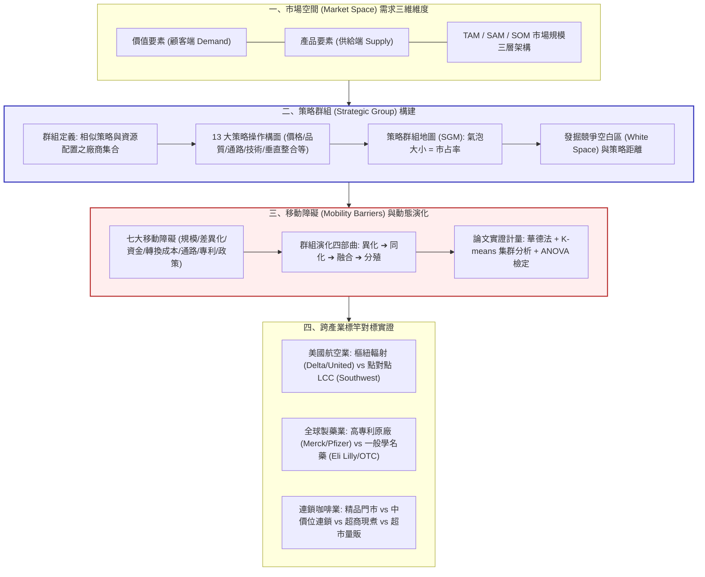
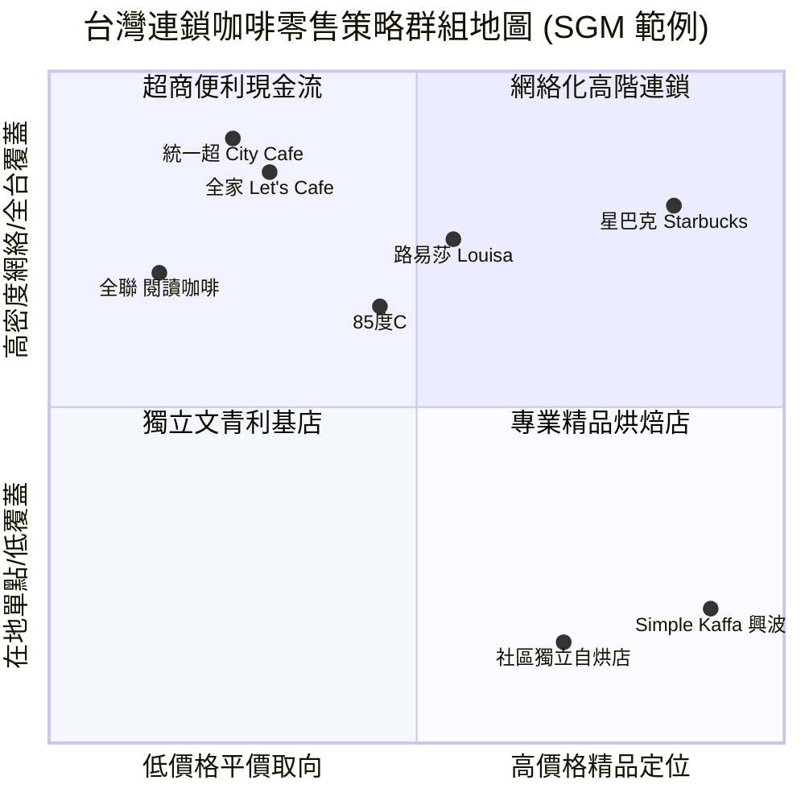

---
{"dg-publish":true,"permalink":"/04/12/02/module-1/m1-7/","tags":["PMBA","產業分析","模組一","策略群組","市場空間","移動障礙","集群分析"],"dg-note-properties":{"aliases":["產業市場空間","策略群組","策略群組地圖","移動障礙","TAM-SAM-SOM","SGM","Mobility Barriers"],"tags":["PMBA","產業分析","模組一","策略群組","市場空間","移動障礙","集群分析"],"created":"2026-10-02","status":"completed","parent":"[[04_主題選修/12_產業分析與投資策略/00_課程導航與進度/progress_📊 課程與筆記進度追蹤]]"}}
---


# M1-7 產業市場空間與策略群組

導航索引：[[04_主題選修/12_產業分析與投資策略/00_課程導航與進度/progress_📊 課程與筆記進度追蹤\|進度看板]] ｜ [[04_主題選修/12_產業分析與投資策略/00_課程導航與進度/mindmap_產業分析與投資策略_心智圖導航\|全課程心智圖]] ｜ [[04_主題選修/12_產業分析與投資策略/02_模組筆記/Module_1_總論與架構/M1_模組架構心智圖\|本模組心智圖]]  
商管核心價值：在同一個產業內，廠商絕非質地均勻的同質個體。單純依賴全產業層級的[[98_商業概念庫/five-forces-analysis_五力分析\|five-forces-analysis_五力分析]]，常會掩蓋內部不同群體間巨大的獲利鴻溝。本篇聚焦於「產業內微觀分析」，建構由需求端價值要素出發的三維「市場空間（Market Space）」，掌握策略群組地圖（Strategic Group Map, SGM）之繪製標準與發掘「競爭空白區（White Space）」；並深入剖析群組間的「七大移動障礙（Mobility Barriers）」與演化階段，提供銜接碩士學位論文實證研究之雙階段集群統計驗證路徑。

---

## 一、視覺化知識脈絡圖 (Mermaid Context)



---

## 二、核心理論底層：從[[98_商業概念庫/industry-structure_產業結構\|industry-structure_產業結構]]走向群組異質性

### 2.1 策略群組之學術定義與演進
傳統[[98_商業概念庫/industrial-organization-theory_產業組織理論\|industrial-organization-theory_產業組織理論]]（哈佛學派 SCP 典範）預設同產業廠商具備同質性，認為[[98_商業概念庫/industry-structure_產業結構\|industry-structure_產業結構]]決定了所有廠商的命運。然而，哈佛大學與商管學界後續實證研究發現：**即使處於完全相同的五力環境，廠商間的 ROIC 與 ROE 依然存在長期且穩固的巨大差距**。
* **經典定義（Porter, 1980; Harrigan, 1985）**：  
  「策略群組（Strategic Group）是指在同一個產業當中，在某些策略構面上採用相同或相似策略的一群[[98_商業概念庫/company_公司\|company_公司]]。」
* **分群的兩大核心判準**：
  1. **產業邊界鎖定**：分群對象必須針對「同一個產業內」之廠商。
  2. **策略相似性**：分群標準是依照廠商所使用之「策略定位與[[98_商業概念庫/resource-allocation_資源配置\|zi-yuan-pei-zhi_資源配置]]之相似程度」而定，而非僅依據營業規模。

### 2.2 導致群組異質性（Heterogeneity）的四大驅動成因
講義 Unit 5 指出，同產業競爭者之所以裂變為不同策略群組，源於五大根本動力：
1. **追求不同的營運目標（Disparate Objectives）**：  
   部分[[98_商業概念庫/enterprise_企業\|enterprise_企業]]追求股東短期利潤極大化（Shareholders Value），部分追求營收規模極大化（追求市占擴張），部分著重經理人個人利益或帝國擴張，近年則越來越多[[98_商業概念庫/enterprise_企業\|enterprise_企業]]平衡[[98_商業概念庫/relations_利害關係人\|li-hai-guan-xi-ren_利害關係人]]（Stakeholders）利益與 ESG 永續。
2. **達成目標的手段與策略路徑差異**：  
   即使追求相同營益率，有些[[98_商業概念庫/enterprise_企業\|enterprise_企業]]選擇極端低成本走大量採購（如鴻海），有些選擇重資本先進研發享有技術定價權（如[[98_商業概念庫/tsmc_台積電\|tai-ji-dian_台積電]]）。
3. **對未來環境變遷與典範轉移的預期差異**：  
   面對技術變革（如 AI 伺服器爆發、純電動車滲透），不同管理團隊對未來的假設天差地別，導致事前投資方向分道揚鑣（如廣達果斷切入 CSP 白牌 AI 機櫃，仁寶初期相對保留）。
4. **[[98_商業概念庫/enterprise_企業\|enterprise_企業]]內部初始資源與核心能耐稟賦不同（VRIO 差異）**：  
   各廠商創辦歷史、技術專利池、母[[98_商業概念庫/company_公司\|company_公司]]資源奧援不同，形成特定路徑依賴（Path Dependency）。
5. **產業整體大環境的破壞式[[98_商業概念庫/innovation_創新\|innovation_創新]]（Disruptive Innovation）**：  
   外在環境產生典範轉移（Paradigm Shift），顛覆舊有競爭態勢。

### 2.3 策略群組要素的四大來源矩陣
| 構面來源 | 內涵說明 | 實戰操作變數 (Variables) | 課堂代表案例 |
| :--- | :--- | :--- | :--- |
| **1. 產品要素**<br>*(Product Factors)* | 從生產者與[[98_商業概念庫/enterprise_企業\|enterprise_企業]]供給視角出發之規格與物理特性。 | 產品規格、耐用度、技術領先性、產品線寬度。 | 蘋果旗艦 iPhone 追求頂級硬體規格 vs 小米追求性價比。 |
| **2. 顧客價值**<br>*(Customer Value)* | 從消費者與使用者需求出發之主觀體驗與利益感受。 | **Holbrook 八大價值構面**：<br>① 效率、② 卓越、③ 成功、④ 聲譽/尊敬、⑤ 樂趣、⑥ 美感、⑦ 美德、⑧ 信仰。 | 星巴克提供空間美感與尊榮感；超商咖啡提供極致時間效率與便利性。 |
| **3. 策略性資源能耐**<br>*(Strategic Capabilities)* | [[98_商業概念庫/enterprise_企業\|enterprise_企業]]內部擁有的專屬性[[98_商業概念庫/asset-2_無形資產\|wu-xing-asset_無形資產]]與動態能力。 | 個人面技能、組織面專利參數良率、管理制度面制度能耐。 | [[98_商業概念庫/tsmc_台積電\|tai-ji-dian_台積電]]工程師夜鷹突擊隊（24hr 輪班與良率調校能耐）。 |
| **4. 策略作為**<br>*(Strategic Conduct)* | [[98_商業概念庫/enterprise_企業\|enterprise_企業]]在市場中展現的 13 項具體競爭決策組合。 | 1. 專業化程度 2. 品牌認同 3. 推拉行銷 4. 通路選擇 5. 品質水準 6. 技術領導 7. 垂直整合 8. 成本地位 9. 顧客服務 10. 定價政策 11. [[98_商業概念庫/financial-leverage_財務槓桿\|finance-gang-gan_財務槓桿]] 12. 母[[98_商業概念庫/company_公司\|company_公司]]關係 13. 地緣政商關係。 | 統一超採密集店點加盟與自有低溫物流；好市多採會員年費制與極簡 SKU。 |

---

## 三、市場空間（Market Space）與策略群組地圖（SGM）繪製

### 3.1 需求導向的市場空間觀：打破「刻舟求劍」的產業邊界
課堂中老師嚴肅提醒：**「能夠滿足一項核心需求的產業，絕非只有一個！」**
* **需求與價值要素之交織**：  
  市場空間不是物理空間，而是由顧客需求所派生出的多個「價值要素」所構成的動態空間。
  * *實務案例*：滿足消費者「快速吃早餐」的需求，傳統上由美而美早餐店滿足；但現代市場空間中，超商（茶葉蛋+飯糰+鮮食）與連鎖咖啡店（路易莎三明治）透過不同價值要素強烈滲透該空間。
* **市場空間界定之 [[98_商業概念庫/TAM\|TAM]] / [[98_商業概念庫/SAM\|SAM]] / [[98_商業概念庫/SOM\|SOM]] 模型**：
  $$\text{[[98_商業概念庫/TAM\|TAM]] (Total Addressable Market)} \xrightarrow{\text{地理/技術限制}} \text{[[98_商業概念庫/SAM\|SAM]] (Serviceable Available Market)} \xrightarrow{\text{資源/市占邊界}} \text{[[98_商業概念庫/SOM\|SOM]] (Serviceable Obtainable Market)}$$
  * **[[98_商業概念庫/TAM\|TAM]]（總潛在市場）**：全體市場在毫無限制下的理論最大胃納量。
  * **[[98_商業概念庫/SAM\|SAM]]（可服務市場）**：在[[98_商業概念庫/enterprise_企業\|enterprise_企業]]自身[[98_商業概念庫/business-model_商業模式\|business-model_商業模式]]、產品規格與地理通路上能夠覆蓋的市場。
  * **[[98_商業概念庫/SOM\|SOM]]（可獲取市場）**：[[98_商業概念庫/enterprise_企業\|enterprise_企業]]在當前競爭群組中，短期（1～3年）內實際能爭取到的營收份額。經理人嚴禁以 [[98_商業概念庫/TAM\|TAM]] 作為財務預算的收入依據。

### 3.2 策略群組地圖（Strategic Group Mapping, SGM）標準繪製四步驟
策略群組地圖是高階商管最具洞察力的視覺化工具，其標準繪製流程如下：
```
Step 1: 變數篩選 ➔ 選擇兩個最關鍵且「互不相關」的核心策略變數 (X 軸與 Y 軸)
Step 2: 廠商分組 ➔ 將策略定位與商業模式相近之公司指派至同一群組
Step 3: 氣泡繪製 ➔ 以圓圈面積代表該群組在產業中的「整體市占率 (Market Share)」
Step 4: 空間剖析 ➔ 評估各群組間之「策略距離」與未被開拓的「競爭空白區 (White Space)」
```
* **座標軸選取關鍵原則**：
  1. **切忌選取高度正相關之變數**（例如：不能同時選「價格高低」與「品質高低」，因為高價格往往伴隨高規格，圖形會退化為 45 度對角線，失去分群意義）。
  2. **必須選取決定產業成敗的策略變項**（例如：航空[[98_商業概念庫/company_公司\|company_公司]]選取「航網模式（樞紐 vs 點對點）」與「機上服務層級」；零售業選取「價格定位」與「地理通路覆蓋度」）。



---

## 四、移動障礙（Mobility Barriers）與群組動態演化

### 4.1 移動障礙的本質與重要性
Michael Porter 指出：**「移動障礙之於策略群組，正如進入障礙之於整個產業。」**
* **定義**：阻止[[98_商業概念庫/enterprise_企業\|enterprise_企業]]從某一個策略群組跨越進入另一個獲利更高之策略群組的結構性壁壘。
* **經濟學意涵**：
  * **移動障礙愈高，該群組長期享有的[[98_商業概念庫/alpha-excess-return_超額報酬\|chao-e-return_超額報酬]]（Economic Rents）愈穩固**。若群組缺乏移動障礙，其他同業會迅速模仿，利潤將在短時間內被均等化。
  * **突破移動障礙的途徑**：卓越的日常營運效率（Operational Effectiveness）通常難以跨越移動障礙；唯有**顛覆性[[98_商業概念庫/business-model_商業模式\|business-model_商業模式]][[98_商業概念庫/innovation_創新\|innovation_創新]]（Business Model Innovation）**或外部重大技術突變方能突破。

### 4.2 七大移動障礙體系詳解
講義與補充講義提煉出防禦群組利益的七大護城河：
1. **規模經濟（Economies of Scale）**：在該群組特定營運模式下的最小有效規模（MES）。新跨入者若產能不足，單位成本將處於嚴重劣勢。
2. **[[98_商業概念庫/product-differentiation_產品差異化\|product-cha-yi-hua_產品差異化]]與品牌認同（Product Differentiation）**：既有群組業者長年累積的品牌專屬[[98_商業概念庫/goodwill_商譽\|shang-yu_商譽]]（Brand Equity）。跨入者必須投入巨額[[98_商業概念庫/sunk-cost_沉沒成本\|chen-mei-cost_沉沒成本]]（Sunk Costs）以克服顧客心理偏好。
3. **資金需求門檻（Capital Requirements）**：進入特定群組所需之專屬性不可逆資產投資（如晶圓廠百億 CapEx、全球機隊採購、全國低溫冷鏈物流中心）。
4. **顧客轉換成本（Customer Switching Costs）**：使用者轉移至新群組產品時產生的資料遷移、合約違約金或重新學習成本。
5. **排他性配銷通路取得（Access to Distribution Channels）**：既有群組透過排他性協議或貨架進場費鎖定經銷商。
6. **與規模無關的專屬成本優勢（Cost Advantages Independent of Size）**：技術專利池、封閉式軟體生態（如 NVIDIA [[98_商業概念庫/CUDA\|CUDA]]）、地理黃金區位、累積的學習曲線。
7. **政府法規與產業政策（Government Policy）**：特許執照審查、航權配額、金融特許門檻、碳排放指標限制。

### 4.3 策略群組的兩階段四步演化動態
補充講義深入探討群組的生命週期演進：
* **階段一：新梯隊的形成（Formation of New Echelons）**
  * **異化階段（Differentiation）**：個別先驅廠商在產業環境變動下，大膽採取與既有業者相異的[[98_商業概念庫/innovation_創新\|innovation_創新]]策略（如 Southwest 早期放棄樞紐改走純點對點航線）。
  * **同化階段（Assimilation）**：其他競爭者見其獲利豐厚，開始蜂擁仿效其策略，形成新的同質[[98_商業概念庫/enterprise_企業\|enterprise_企業]]梯隊。
* **階段二：新梯隊成為群組（Institutionalization of Strategic Groups）**
  * **融合階段（Integration）**：新梯隊內部建立起特定的默契、供應鏈規範與技術標準，並逐步築起專屬之移動障礙。
  * **分殖階段（Speciation / Colonization）**：該群組進一步細分或向外擴張，搶佔傳統群組的利潤池，正式成為產業內根深蒂固的主流策略群組。

### 4.4 實證計量研究流程：無縫銜接碩士論文
在 PMBA 碩士學位論文或高階產業顧問報告中，策略群組的劃分嚴禁憑空捏造，必須透過嚴謹的計量統計程序進行實證驗證：
```
[1. 樣本與變數確認] ➔ 收集同產業 30~50 家樣本廠商之 13 項策略指標數據
         ▼
[2. 兩階段集群分析] ➔ 第一階段：華德法 (Ward's method) 階層式集群，決定最適群組數量
                   ➔ 第二階段：K-means 非階層式集群，依歐幾里德距離重新分配樣本收斂
         ▼
[3. 多元尺度分析 (MDS)] ➔ 將多維策略變數降維，精確投射出群組間之「相對策略距離」
         ▼
[4. 變異數分析 (ANOVA)] ➔ 採用 One-Way ANOVA (或無母數 NPAR ANOVA) 
                        檢定各群組在「獲利績效 (ROE/ROIC)」與「資源構面」上之統計顯著性 (p < 0.05)
```

---

## 五、跨產業策略群組對標實證庫

### 5.1 美國國內航空業策略群組對標
講義 Page 35 剖析美國航空業在解除管制後形成的兩大極端策略群組：
* **群組 A：傳統樞紐輻射航網巨頭（Legacy Hub-and-Spoke Carriers）**
  * *代表廠商*：Delta、United Airlines、American Airlines。
  * *策略配置*：多機型混合編組（波音/空中巴士寬體與窄體機）、全球樞紐機場（如芝加哥、亞特蘭大）中轉轉機、提供多艙等頭等艙/商務艙服務、繁複的飛行常客里程計畫。
  * *移動障礙*：龐大樞紐機場登機門時間帶（Slots）排他性、跨國航空同盟（SkyTeam/Star Alliance）、高額資本與全球機隊規模。
* **群組 B：點對點低成本航空（Point-to-Point Low-Cost Carriers, LCC）**
  * *代表廠商*：Southwest Airlines（西南航空）。
  * *策略配置*：單一機型政策（全波音 737 降低維修備件與機師培訓成本）、二級輔助機場點對點直飛（避免樞紐機場高額降落費與地面延誤）、單一艙等、極致縮短地面週轉時間（Turnaround Time < 25分鐘）。本質為打破傳統航空品質與價格取捨的經典[[98_商業概念庫/value-curve_價值曲線\|價值曲線 (Value Curve)]]創新。
  * *移動障礙*：[[98_商業概念庫/enterprise_企業\|enterprise_企業]]獨特敏捷文化、極低資產單位成本優勢、長期燃油避險合約能力。

### 5.2 全球製藥產業策略群組對標
講義 Page 33 展示研發支出 vs. 價格定位之群組劃分：
* **高專利原廠藥群組（Ethical / Innovative Pharma）**：
  * *代表廠商*：Merck（默沙東）、Pfizer（輝瑞）。
  * *策略配置*：將營收之 15%~20% 投入前瞻分子靶點新藥研發、承擔三期臨床試驗龐大失敗風險、全球專利佈局與專科醫師推廣團隊。
  * *核心特徵*：高研發支出、高專利定價特權、[[98_商業概念庫/gross-margin-rate_毛利率\|gross-margin-rate_毛利率]] > 80%、享有 20 年專利壟斷期。
* **一般學名藥 / OTC 群組（Generic Drugs & OTC）**：
  * *代表廠商*：Eli Lilly（部分學名藥事業）、Forest Labs、ICN、Carter Wallace。
  * *策略配置*：專利過期後快速進行生物等效性（BE）逆向工程、主打規模化合成與極致製造成本控制、依賴健保給付與一般藥局通路。
  * *核心特徵*：低研發支出（< 5%）、[[98_商業概念庫/price-sensitivity_價格敏感度\|price-sensitivity_價格敏感度]]高、毛利受到健保等單一買方壓制。

---

## 六、高階經理人實戰決策工具箱

### 6.1 策略群組定位與跨越決策九大檢核問句 (The 9-Question Checklist)
當[[98_商業概念庫/enterprise_企業\|enterprise_企業]]經營階層評估是否應跨越既有群組、抑或防禦本群組時，應嚴格檢核：
1. **群組辨識**：我們目前身處的策略群組，核心競爭條件究竟是依賴產品要素、顧客價值，還是專屬性資產？
2. **群組利潤池**：產業內利潤池是否正向特定策略群組快速轉移？（如電子代工從純組裝向 GPU 運算板轉移）
3. **移動障礙強度**：隔絕本群組與對手的七大移動障礙中，哪一項正在被新技術削弱？
4. **跨越代價試算**：跨入高階群組所需的沉沒資本（研發/品牌重置），預期 IRR 是否實質覆蓋門檻收益率（Hurdle Rate）？
5. **同業報復能量**：若跨入目標群組，該群組既有龍頭的產能與價格報復烈度有多大？
6. **顧客轉換摩擦**：目標群組的顧客是否存在高轉換成本？我們是否具備顯著的[[98_商業概念庫/value-curve_價值曲線\|價值曲線]]突破點？
7. **空白區真偽**：策略群組地圖上看到的「競爭空白區」，究竟是潛在藍海，還是經濟學上無法生存的「死地」？
8. **群組演化階段**：目標群組目前處於異化、同化、融合還是分殖階段？我們是先發者還是後進者？
9. **退路規劃**：若跨越失敗，高額固定資產是否具備退出障礙或轉用價值？
