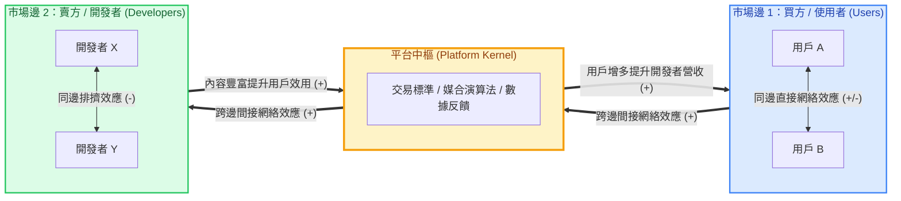

---
{"dg-publish":true,"permalink":"/04/12/02/module-1/m1-8/","tags":["PMBA","產業分析","模組一","商業生態系","平台經濟","雙邊市場","網絡效應"],"dg-note-properties":{"aliases":["商業生態系與平台網絡","商業生態系","平台網絡","雙邊市場","平台包夾","網絡效應","Keystone","Business Ecosystem"],"tags":["PMBA","產業分析","模組一","商業生態系","平台經濟","雙邊市場","網絡效應"],"created":"2026-10-08","status":"completed","parent":"[[04_主題選修/10_創業與企業財務策略/00_課程導航與進度/progress_📊 課程與筆記進度追蹤]]"}}
---


# M1-8 商業生態系與平台網絡

導航索引：[[04_主題選修/10_創業與企業財務策略/00_課程導航與進度/progress_📊 課程與筆記進度追蹤\|進度看板]] ｜ [[04_主題選修/12_產業分析與投資策略/00_課程導航與進度/mindmap_產業分析與投資策略_心智圖導航\|全課程心智圖]] ｜ [[04_主題選修/12_產業分析與投資策略/02_模組筆記/Module_1_總論與架構/M1_模組架構心智圖\|本模組心智圖]]  
商管核心價值：在傳統產業組織視角下，企業競爭被視為產業鏈上下游與五力之間的零和博弈；然而，在數位經濟與高科技時代，產業競爭已徹底從「單一企業對抗」升級為「生態系對抗（Ecosystem vs. Ecosystem）」。本篇深度解構傳統管道模式（Pipes）向平台生態系（Platforms）的典範躍遷，剖析 Keystone（主導者）、Dominator（支配者）與 Niche Players（利基者）的角色動態，推導雙邊/多邊市場跨邊網絡效應與交叉補貼定價模型，並以台積電 OIP、蘋果 iOS 與零售電商平台為標竿，建立防禦平台包夾（Platform Envelopment）與構建生態鎖定壁壘的實戰決策體系。

---

## 一、 核心理論本質：傳統管道模式 (Pipes) vs. 平台生態系 (Platforms)

### 1.1 商業組織典範轉移：線性供應鏈向非線性價值網躍遷
在產業演進的脈絡中，商業組織的運作模式經歷了根本性的結構重塑：
* **傳統管道模式（Linear Value Chains / Pipes）**：
  * **價值流向**：單向、線性（Linear）的推式（Push）或拉式（Pull）價值鏈。原物料 ➔ 零組件製造 ➔ 組裝加工 ➔ 經銷批發 ➔ 零售終端 ➔ 消費者。
  * **核心競爭優勢**：建立在「供給面規模經濟（Supply-side Economies of Scale）」之上，依賴對固定資產、排他性通路與專屬技術資產的垂直控制。
  * **價值控制點**：企業透過擁有並控制稀缺的內部資產，在線性鏈條的關鍵節點（如製造瓶頸、關鍵配銷點）收取利潤。
* **平台生態系模式（Platform Ecosystems）**：
  * **價值流向**：複雜、非線性（Non-linear）的網絡拓撲結構。平台本身通常不直接生產所有產品或服務，而是作為「中樞基石（Keystone）」，制定互動架構與治理規則，促成多邊參與者（開發者、生產者、互補品提供商、終端用戶）之間的無摩擦價值交換與協同演化。
  * **核心競爭優勢**：建立在「需求面規模經濟（Demand-side Economies of Scale / Network Effects）」之上，依賴正向反饋的網絡效應與生態系繁榮度。
  * **價值控制點**：由「擁有專屬實體資產」轉向「掌控互動界面（Interface）、數據資產與協調標準」。

### 1.2 管道模式 vs. 平台生態系全維度對比矩陣
| 比較維度 | 傳統管道模式 (Pipes) | 平台生態系模式 (Platforms / Ecosystems) | 商管策略意涵 |
| :--- | :--- | :--- | :--- |
| **價值創造機制** | 線性逐步疊加，企業內部研發與生產 | 外部多邊協同，去中心化價值共創 (Co-creation) | 企業由「內部產出極大化」轉向「外部生態賦能」 |
| **規模經濟基礎** | 供給面規模經濟（固定成本分攤、產能擴張） | 需求面規模經濟（跨邊網絡效應、使用者互聯） | 突破物理產能天花板，邊際擴張成本趨近於零 |
| **資產配置型態** | 重資產（PPE 廠房設備、專屬庫存） | 輕資產（核心軟體架構、API、數據協同系統） | 提升 ROIC 與資產周轉率，但需承擔生態治理風險 |
| **競爭互動範式** | 零和博弈（與供應商砍價、與買方爭利潤） | 正和競合（Coopetition，共同把利潤池做大） | 轉向 [[98_商業概念庫/business-ecosystem_商業生態系\|business-ecosystem_商業生態系]] 之共生共享思維 |
| **核心防禦壁壘** | 資本門檻、高退出障礙、實體專利池 | 高轉換成本、雙向網絡效應、生態系鎖定 | 形成自發性強化飛輪，阻止對手跨界滲透 |
| **典型代表企業** | 埃克森美孚、福特汽車、早期傳統零售商 | 蘋果 App Store、Google Android、台積電 OIP | 決定企業市值乘數與 P/E 估值區間之本質差異 |

### 1.3 ASCII 平台生態系價值拓撲圖 (Ecosystem Value Topology)

```
                 ┌──────────────────────────────────────────────┐
                 │       【互補品與開發者端】(Complementors)       │
                 │   獨立軟體商 (ISV) / 晶片 IP 廠 / 內容創作者   │
                 └──────────────────────┬───────────────────────┘
                                        │ (提供應用、內容、演算法)
                                        │ ▲ (取得 API/SDK、分潤收益)
                                        ▼ │
   ┌────────────────────────────────────┴────────────────────────────────────┐
   │                  【平台核心主導者】(Keystone / Platform)                  │
   │           共享架構規範 / 界面標準 (API/EDA) / 交易清算 / 信用機制           │
   └────────────────────────────────────┬────────────────────────────────────┘
                                        │ ▲ (享受多元生態、支付服務)
                                        │ │ (貢獻流量、數據資產、服務費)
                                        ▼ │
                 ┌──────────────────────────────────────────────┐
                 │         【終端使用者與買方端】(Users/Buyers)          │
                 │      消費者 / 企業終端客戶 / 應用軟體訂閱用戶      │
                 └──────────────────────────────────────────────┘
                                        ▲
                                        │ (跨邊網絡效應：用戶越多吸引開發者越多)
                                        └─────────────────────────────────────┘
```

---

## 二、 生態系成員角色定位矩陣

在 Iansiti & Levien (2004) 的商業生態系經典架構中，同一個生態系統中的參與者依據其「價值創造」與「價值擷取」策略，可劃分為三大本質截然不同的生態角色：

### 2.1 三大生態角色定義與特徵
1. **核心主導者（Keystone / 樞紐基石者）**：
   * **角色本質**：生態系的造局者與守護者。透過提供共享基礎設施、開放界面與標準化工具，有效降低全體成員的交易成本與創新門檻。
   * **價值擷取哲學**：**「創造大價值，只取小部分」**。Keystone 嚴禁掠奪生態系中所有的利潤，必須留下充沛的利潤空間給外部夥伴，以維護系統的「健全性（Health）」、「強韌度（Robustness）」與「物種多樣性（Niche Creation）」。
2. **支配者 / 吞噬者（Physical Dominator）**：
   * **角色本質**：將生態系視為私有農場的掠奪者。掌握核心中樞地位後，利用自身特權逐步向下游或橫向延伸，將高毛利利基者業務併購或以複製手段內部化。
   * **後果**：嚴重打擊外部開發者信心，導致生態系多樣性迅速枯竭，引發夥伴集體叛逃甚至招致反托拉斯法（Antitrust）主管機關重罰。
3. **利基參與者（Niche Players / 利基共生者）**：
   * **角色本質**：生態系中佔比超過 90% 的專業化獨立廠商。依託 Keystone 的平台標準與龐大用戶池，專注於自身具備 [[98_商業概念庫/VRIO架構\|VRIO]] 優勢的細分領域。
   * **生存策略**：不斷強化技術壁壘與不可替代性，並隨時防範被 Keystone「平台包夾（Platform Envelopment）」。

### 2.2 生態系三大角色定位比較矩陣
| 比較指標 | 核心主導者 (Keystone) | 支配者 (Physical Dominator) | 利基者 (Niche Players) |
| :--- | :--- | :--- | :--- |
| **核心策略目標** | 擴大生態系整體利潤池，提升系統韌性 | 佔有並控制生態系內絕大部分價值 | 依託平台生態，深耕專屬利基賽道 |
| **價值創造方式** | 開發共享平台架構、開放 API、建立安全信任環境 | 將外部成功業務收歸己有或封閉壟斷 | 提供高度差異化之專門零組件、內容或外掛 |
| **價值擷取比例** | 僅擷取總價值之 10%～30%，留 70% 給夥伴 | 企圖擷取總價值之 70%～90%，擠壓外部利潤 | 享有特定細分市場之溢價與穩定報酬 |
| **對外部夥伴態度** | 扶植、赋能、培育互補品多樣性 | 競爭、擠壓、複製並淘汰外部利基者 | 策略性依附 Keystone，但保持多平台靈活性 |
| **系統崩潰風險** | 低（若治理公正，夥伴願意共同捍衛平台） | 極高（夥伴多棲或倒戈，生態系脆弱化） | 中（受制於平台規則變更與包夾威脅） |
| **代表企業實例** | **台積電 (OIP)**、微軟 Azure、蘋果 iOS | 早期壟斷期微軟、掠奪第三方之封閉平台 | ARM、Synopsys、Unity、iOS 獨立軟體商 |

---

## 三、 課堂白板推導專題：雙邊/多邊市場網絡效應與贏家通吃邊界條件

### 3.1 網絡效應（Network Effects）的二元解構
在 [[98_商業概念庫/two-sided-market_雙邊市場\|two-sided-market_雙邊市場]] 中，網絡效應是推動平台呈幾何級數擴張的核心引擎，可嚴格區分為同邊與跨邊效應：



1. **同邊網絡效應（Direct / Same-Side Network Effects）**：
   * **正向同邊**：同邊使用者增加會直接提升其他使用者的效用（如 LINE、微信，好友越多溝通價值越高）。
   * **負向同邊**：同邊供給者增加引發同業競爭踩踏（如 Uber 司機過多導致每人接單率下降，引發價格戰）。
2. **跨邊網絡效應（Indirect / Cross-Side Network Effects）**：
   * 一邊的使用者規模增加，會顯著拉升另一邊參與者的效用（如 App Store 使用者越多，開發者預期收益越高，激勵開發更多 App；App 種類越豐富，又進一步吸引海量用戶加入，形成正反饋飛輪）。

### 3.2 交叉補貼定價模型（Cross-Subsidization Pricing Model）
平台經理人最致命的決策錯誤，就是向兩端同時收取相等的利潤。課堂白板推導出平台「雙邊非對稱定價法則」：
* **補貼端（Subsidized Side）**：
  * **特徵**：價格彈性極高、對品質要求嚴格、能為對側創造巨大跨邊正網絡效應的關鍵群體。
  * **定價原則**：**免費、甚至倒貼**（低於邊際成本定價）。例如：一般買家免手續費、女性免費入場夜店、免費閱讀入口。
* **收費利潤端（Money Side）**：
  * **特徵**：價格彈性低、對補貼端用戶具有強烈依附性與商業變現需求之群體。
  * **定價原則**：**收取高額溢價**。例如：電商賣家抽成與廣告費、招聘企業付費發布職缺、Google 廣告主按點擊付費。

### 3.3 網絡價值量化定律：梅特卡夫 vs. 里德定律推導
1. **薩諾夫定律（Sarnoff's Law，傳統廣播模式）**：
   $$V \propto N$$
   價值與受眾人數呈線性正比，缺乏用戶間互聯。
2. **梅特卡夫定律（Metcalfe's Law，雙向互聯網絡）**：
   網絡節點之間的潛在連接數為 $\frac{N(N-1)}{2}$，因此當節點數 $N$ 充分大時：
   $$V \propto N^2$$
   這解釋了為何大型社群與平台在越過關鍵多數（Critical Mass）後，其市值擴張速度遠超營業額增速。
3. **里德定律（Reed's Law，群組化社群網絡）**：
   在支持用戶自由組成次群組（Sub-groups）的網絡中，可能的子群組合為 $2^N - N - 1$：
   $$V \propto 2^N$$
   價值呈現指數級爆發，構成現代協同生態系無可匹敵的擴張力。

### 3.4 贏家通吃（Winner-Takes-All, WTA）成立的三大邊界條件
並非所有具備網絡效應的產業都能形成壟斷通吃，課堂特別強調 WTA 成立必須同時滿足以下三大嚴苛條件：
```
                   ┌───────────────────────────────────────────────┐
                   │    贏家通吃 (Winner-Takes-All) 三大邊界條件   │
                   └───────────────────────┬───────────────────────┘
                                           │
         ┌─────────────────────────────────┼─────────────────────────────────┐
         ▼                                 ▼                                 ▼
┌─────────────────┐               ┌─────────────────┐               ┌─────────────────┐
│ 1. 高多棲成本    │               │ 2. 強大跨邊網絡 │               │ 3. 低利基差異化  │
│ (High Multi-    │               │ (Strong Cross-  │               │ (Low Demand for │
│   homing Costs) │               │   side Effects) │               │ Differentiation)│
└────────┬────────┘               └────────┬────────┘               └────────┬────────┘
         │                                 │                                 │
  用戶/開發者無法                   單邊增長對對側                    大眾需求標準化，
  同時跨平台維護                    產生壓倒性吸引力                  缺乏專門分化空間
```
* **實例對照**：
  * **成立 WTA**：PC 作業系統（Windows 壟斷企業端，多棲開發與授權成本極高、軟體相容跨邊效應極強）。
  * **不成立 WTA（多強並立）**：美食外送（Uber Eats vs. Foodpanda，消費者手機同時裝兩個 App，多棲成本趨近於零；餐廳端同時掛兩家平板）。

---

## 四、 產業競合與防禦壁壘：平台包夾戰略與生態系鎖定

### 4.1 平台包夾戰略（Platform Envelopment）之機理
由 Eisenmann, Parker & Van Alstyne 提出的平台包夾理論，是大型生態系顛覆獨立利基平台最致命的戰略武器：
* **核心定義**：佔據主導地位的相鄰平台，利用**重疊的使用者群體**以及**功能互補性**，將原本獨立平台的產品功能直接整合為自身系統的免費或內建「標準組件」，從而一舉跨界吞噬該獨立平台的市場空間。
* **包夾戰略三大驅動優勢**：
  1. **共享用戶基礎（Shared User Base）**：無須付出高額獲客成本（CAC），直接將既有數億用戶導入新功能。
  2. **範疇經濟（Economies of Scope）**：共用底層雲端架構、資安驗證與計費清算系統。
  3. **交叉補貼定價摧毀**：將對手賴以生存的收費服務，打包為自身旗艦產品的「免費贈品」。
* **經典實證案例**：
  * **微軟 Teams 包夾 Slack**：微軟將 Teams 直接捆綁進企業 Office 365 訂閱中免費提供，利用企業既有 IT 採購管道，重創原本在團隊通訊領域領先的獨立獨角獸 Slack。
  * **蘋果 Apple Pay 包夾獨立電子錢包**：整合 iOS 系統底層 Secure Enclave 與 NFC 晶片權限，邊緣化第三方支付 App。

### 4.2 生態系鎖定效應（Ecosystem Lock-in）與轉換成本架構
生態系築起的護城河遠高於傳統單一產品，其鎖定機制涵蓋五大維度：
1. **數據資產專屬性（Data Asset Specificity）**：使用者在平台累積的歷史行為、演算法推薦模型與社交關係鏈無法輕易匯出轉移。
2. **多設備互聯協同（Multi-device Continuity）**：如蘋果生態系「iPhone + iPad + Mac + Apple Watch + AirPods」形成的剪貼簿同步、AirDrop 與自動切換，單一設備更換將破壞整體協同價值。
3. **互補資產沉沒投資（Complementary Sunk Investments）**：開發者為特定生態系投入的大量專屬程式碼與工程師培訓（如 iOS Swift 開發者難以零成本轉移至 Android）。
4. **專屬標準與界面控制（Proprietary Standards）**：Keystone 掌握軟硬體底層通訊協定，阻斷未授權第三方相容。

---

## 五、 案例深度對標與雙向鏈結網絡

### 5.1 台積電（TSMC）開放創新平台（Open Innovation Platform, OIP）：全球半導體製造 Keystone 之極致
台積電之所以能徹底甩開三星與英特爾，關鍵不僅在於晶圓製程物理良率，更在於其構建的 **OIP 開放創新平台生態系**：
* **生態中樞地位**：台積電堅守「純晶圓代工（Pure-play Foundry）」底線，絕不設計自有晶片，不與客戶競爭，贏得全體生態系夥伴的絕對信任。
* **OIP 價值協同機制**：
  * 整合全球四大 EDA 巨頭（Synopsys、Cadence、Siemens EDA、Ansys）與數十家矽智財（IP）巨頭（ARM、Synopsys IP 等）。
  * 推出預先驗證的「晶圓設計基礎組件（TSMC Reference Flows）」與「矽智財驗證聯盟（IP Alliance）」。
  * **成果**：IC 設計客戶（如 Apple、NVIDIA、AMD、Qualcomm）在台積電生態系內進行晶片設計，能大幅縮短光罩設計週期，實現「一次下線成功（First-pass Silicon Success）」，大幅降低流片失敗的數千萬美元風險。
* **移動障礙築起**：競爭對手即使買到相同的 ASML EUV 機台，也無法在短時間內複製台積電積累三十年、涵蓋數萬組 IP 函式庫與 EDA 深度整合的 OIP 生態網絡。

### 5.2 蘋果 iOS vs. 谷歌 Android：封閉垂直 vs. 開放水平生態系對決
| 比較維度 | 蘋果 iOS 生態系 | 谷歌 Android 生態系 |
| :--- | :--- | :--- |
| **生態治理架構** | **封閉垂直整合（Walled Garden）** | **開放水平聯盟（Open Handset Alliance）** |
| **價值鏈控制** | 掌控自研 Silicon (A/M系列)、硬體設計、操作系統與 App Store | 開源 AOSP 操作系統，結合 Google GMS 服務框架 |
| **盈利獲取機制** | 高硬體銷售毛利 ＋ 30%「蘋果稅」數位內容抽成 | 免費開放 OS 換取全球極致滲透率，靠搜尋與廣告變現 |
| **開發者體驗** | 硬體型號高度收斂，適配成本極低，用戶付費意願高 | 跨千款硬體碎片化（Fragmentation）嚴重，適配測試成本高 |
| **生態系利潤池** | 席捲全球智慧型手機產業超過 85% 的淨利潤 | 佔據全球智慧型手機超過 70% 的出貨量份額 |

### 5.3 零售與電商雙邊平台：亞馬遜（Amazon）之飛輪效應與自我包夾
* **跨邊網絡飛輪**：低價與選品吸引海量買家 ➔ 買家流量吸引第三方賣家入駐 ➔ 賣家規模擴大帶動物流中心（FBA）規模經濟 ➔ 進一步攤提固定成本並壓低價格。
* **競合爭議**：亞馬遜身兼「市場組織者（Keystone）」與「自營品牌競爭者（Amazon Basics）」，透過平台大數據洞察熱賣利基品項後跨界複製，引發傳統利基賣家被支配與包夾之劇烈抗議。

---

## 六、 高階經理人實戰決策工具箱

### 6.1 商業生態系戰略抉擇七大檢核問句 (Ecosystem Strategy Checklist)
當企業評估參與或發起商業生態系時，董事會應嚴格檢核：
1. **角色界定**：我們具備足夠的架構能耐成為 Keystone，還是應成為深耕特定價值的優質 Niche Player？
2. **網絡效應強度**：本業務的核心驅動力是真正的雙向跨邊網絡效應，還是僅僅是線性管道模式的規模經濟？
3. **補貼端識別**：哪一邊群組具有高價格彈性且能帶來巨大網絡外溢效應？我們是否錯誤向補貼端收費而扼殺了冷啟動？
4. **多棲風險評估**：目標市場的兩端參與者是否存在極低的多棲成本？我們如何透過專屬數據或會員系統築起轉換障礙？
5. **包夾威脅偵測**：與我們相鄰的大型超級平台（如 Apple、微軟、Google）是否正將我們的主力產品功能納入其下一代更新？
6. **價值分配公正性**：作為平台發起者，我們是否留下了足夠的超額利潤給外部夥伴？抑或正不自覺滑向被唾棄的 Physical Dominator？
7. **關鍵多數跨越**：在啟動階段，我們是否有足夠的資本支撐補貼，直到平台跨越關鍵多數（Critical Mass）形成自維持飛輪？

---

## 七、 雙向鏈結與延伸導航網絡

* 核心概念原子卡片：
  * [[98_商業概念庫/business-ecosystem_商業生態系\|business-ecosystem_商業生態系]]
  * [[98_商業概念庫/two-sided-market_雙邊市場\|two-sided-market_雙邊市場]]
  * [[98_商業概念庫/platform-envelopment_平台包夾\|platform-envelopment_平台包夾]]
* 模組關聯筆記：
  * [[04_主題選修/12_產業分析與投資策略/02_模組筆記/Module_1_總論與架構/M1-1_產業分析本質與中層定位\|M1-1_產業分析本質與中層定位]]（產業邊界模糊化與互補品崛起）
  * [[04_主題選修/12_產業分析與投資策略/02_模組筆記/Module_1_總論與架構/M1-5_波特五力分析與量化架構\|M1-5_波特五力分析與量化架構]]（從單向五力壓迫轉向生態共生四大路徑）
  * [[04_主題選修/12_產業分析與投資策略/02_模組筆記/Module_1_總論與架構/M1-6_產業分析模式與九大分析工具矩陣\|M1-6_產業分析模式與九大分析工具矩陣]]（商業生態系模式解構與利益池分析）
  * [[04_主題選修/12_產業分析與投資策略/02_模組筆記/Module_1_總論與架構/M1-7_產業市場空間與策略群組\|M1-7_產業市場空間與策略群組]]（價值要素空間與移動障礙護城河）
* 總經與個案延伸：
  * [[04_主題選修/12_產業分析與投資策略/01_總體與個案/macro_總體經濟與課前時事\|macro_總體經濟與課前時事]]（科技巨頭 CapEx 膨脹、股權貨幣化與生態系併購）
  * [[04_主題選修/12_產業分析與投資策略/01_總體與個案/cases_企業與產業案例庫\|cases_企業與產業案例庫]]（台積電 OIP、蘋果 iOS、廣達白牌伺服器生態系）
