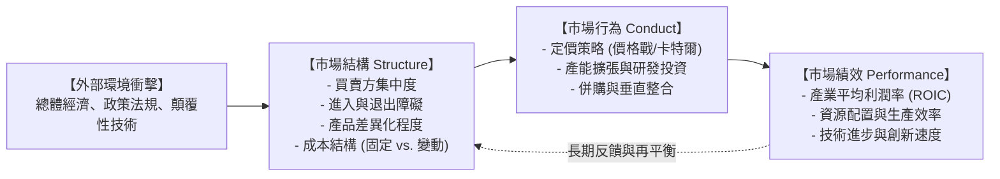
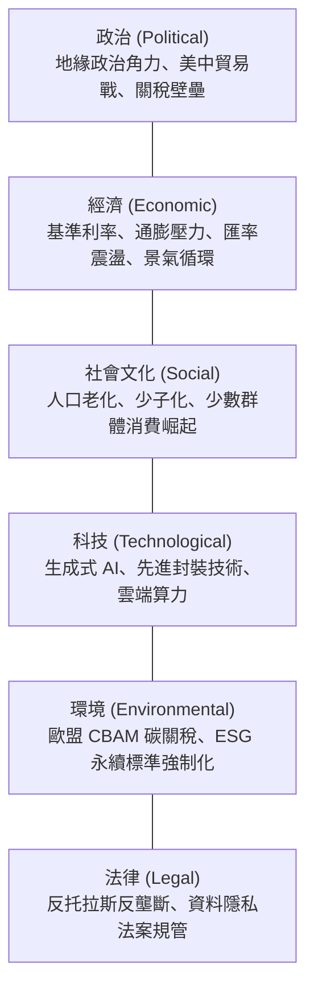
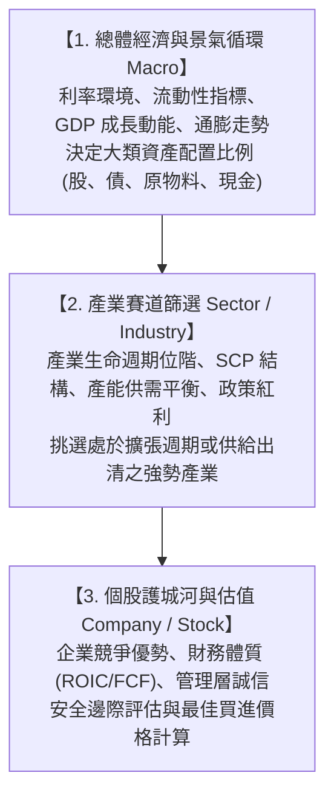
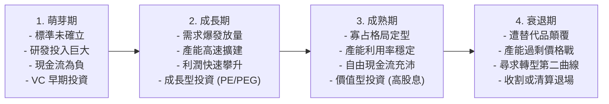

---
{"dg-publish":true,"permalink":"/04/12/w01/","dg-note-properties":{}}
---

# W01_產業分析概論與架構
- **課程**：[[04_主題選修/12_產業分析與投資策略/_產業分析與投資策略 MOC\|產業分析與投資策略]]
- **後續接續**：[[04_主題選修/12_產業分析與投資策略/W02_產業組織與五力分析\|W02_產業組織與五力分析]]
- **標籤**：#PMBA #主題選修 #產業分析 #SCP模型 #產業結構 #總體環境分析 #TopDown投資法 #產業生命週期

---

## 🗺️ 單元心智圖架構

> 🔗 **單元心智圖原始檔**：[開啟 Xmind 原始檔 (本機編輯)](附件/L01%20產業分析概論與架構.xmind) | [[L01 產業分析概論與架構.xmind|Obsidian 內部參照]]

---

## 💡 核心摘要
1. **站在風口上順勢而為（Trend is your friend）**：投資與企業策略的第一要務是精準辨識長線大趨勢；順應產業擴張大勢的平庸公司，其財務表現往往勝過逆勢苦撐的卓越企業。
2. **產業結構決定平均獲利上限**：依據經典 [[98_商業概念庫/產業組織理論\|產業組織理論]]，產業長期的平均 [[98_商業概念庫/資本投入報酬率\|資本投入報酬率]]（ROIC）並非單純取決於個別企業的經營努力，而是由 [[98_商業概念庫/市場集中度\|市場集中度]]、[[98_商業概念庫/進入障礙\|進入障礙]]、[[98_商業概念庫/退出障礙\|退出障礙]] 與 [[98_商業概念庫/替代品威脅\|替代品威脅]] 等底層 [[98_商業概念庫/產業結構\|產業結構]] 共同框定。
3. **由上而下（Top-Down）是過濾贏家的系統性漏斗**：自宏觀總體經濟與 [[98_商業概念庫/景氣循環\|景氣循環]] 出發，向下過濾出具備高景氣度與結構壁壘的黃金產業，最後聚焦於具備 [[98_商業概念庫/經濟護城河\|經濟護城河]] 的龍頭個股，能有效規避自下而上的局部近視。
4. **好公司若處於壞產業依然難以對抗重力**：誠如巴菲特名言：「當一個以好名聲著稱的經理人，遇上一個以壞名聲聞名的艱困產業，通常是產業的名聲保持不變。」產業週期的重力往往輕易壓垮個股的短期基本面。
5. **週期性產業在高峰期的低本益比陷阱（Value Trap）**：[[98_商業概念庫/週期性產業\|週期性產業]] 在景氣獲利最高峰時本益比往往極低，投資人若以此視為便宜信號盲目買入，隨後將面臨產能開出、需求崩跌與盈餘腰斬的毀滅性打擊。

---

## 📚 核心觀念與理論框架

### 產業分析本質與研究視角

#### 產業界定與研究範疇
在商業與投資研究中，**產業（Industry）**被定義為：
> 「生產具備高度替代性產品或服務之企業群體的集合。」

卓越的 [[98_商業概念庫/產業分析\|產業分析]] 旨在透過經濟學模型與質化洞察，穿透企業財報的短期雜訊，剖析決定該群體長期價值創造的核心驅動要素。

#### 投資視角 vs. 策略經理人視角
雖然兩者均依賴深入的產業洞察，但出發點與終極目標存在顯著差異：
- **策略經理人視角（內部運作與防禦）**：著眼於企業內部資源配置、價值鏈優化、市場份額極大化，以及如何透過構築專利與通路建立長期的競爭防護網。
- **投資人視角（資本效率與定價）**：著眼於發掘產業供需失衡的「週期拐點」、資本回報率（ROIC）相較資金成本（WACC）的溢價空間，藉由定價錯誤（Mispricing）獲取超越市場基準的 [[98_商業概念庫/超額報酬\|超額報酬]]（Alpha）。

---

### 經典產業組織分析模型：SCP 模型

#### 結構-行為-績效（SCP）模型內涵
由哈佛學派學者愛德華·梅森（Edward Mason）與喬·貝恩（Joe Bain）創立的 [[98_商業概念庫/結構行為績效模型\|結構行為績效模型]]，奠定了現代產業分析的理論基石。該模型闡明了一條自外部結構傳導至微觀績效的嚴密因果鏈：

1. **市場結構（Structure）**：
   - **[[98_商業概念庫/市場集中度\|市場集中度]]**：通常以 $CR_4$、$CR_8$ 或赫芬達爾指數（HHI）衡量，高集中度通常賦予領先者更強的定價默契。
   - **[[98_商業概念庫/產品差異化\|產品差異化]] 程度**：若產品同質性高，競爭必然淪為價格割喉戰；若差異化顯著，企業享有較高的品牌溢價。
   - **[[98_商業概念庫/進入障礙\|進入障礙]] 與 [[98_商業概念庫/退出障礙\|退出障礙]]**：決定新玩家湧入的難易度，以及虧損企業被迫滯留市場的時間長度。
   - **成本結構**：高固定成本、低變動成本之產業（如晶圓代工、面板、航運）具備高營運槓桿，景氣下行時降價求售壓力極大。
2. **市場行為（Conduct）**：
   - 包含定價行為（掠奪性定價、差別取價）、[[98_商業概念庫/產能擴張\|產能擴張]] 策略、研發投入規模、行銷廣告投放以及橫向併購與垂直整合。
3. **市場績效（Performance）**：
   - 體現在產業平均利潤率、[[98_商業概念庫/資本投入報酬率\|資本投入報酬率]]（ROIC）、全要素生產力提升與社會資源配置效率。
4. **外生衝擊反饋機制**：
   - 總體經濟震盪、政府反壟斷法規介入或顛覆性技術突破，會直接衝擊結構端，進而引發行為與績效的全面重塑。

---

### 總體與產業分析框架整合

#### PESTEL 分析框架
產業絕非孤立運行，而是時刻沉浸在總體宏觀環境的浪潮之中。[[98_商業概念庫/總體環境分析\|總體環境分析]] 透過 PESTEL 六大維度，系統性掃描驅動產業長期演變的根本力量：

---

### 由上而下（Top-Down）投資決策架構

#### 三層漏斗決策模型
專業機構投資人廣泛採用的 [[98_商業概念庫/由上而下投資法\|由上而下投資法]]（Top-Down），透過嚴密的層級過濾，確保資本配置於阻力最小的獲利軌道上：

#### 產業循環週期的長短維度
在產業分析中，經理人需精準區分不同長度的 [[98_商業概念庫/景氣循環\|景氣循環]]：
- **基欽存貨週期（Kitchin Cycle，約 3~4 年）**：反映廠商主動補庫存與被動去庫存的短期供需拉鋸。
- **朱格拉資本支出週期（Juglar Cycle，約 8~10 年）**：反映產業產能建設、設備更新與重大廠房投資的擴張與收縮，是決定產業中長線榮枯的核心。

---

### 產業界定與產業演化概論

#### 標準產業分類的局限與跨界融合
- 傳統統計指標（如 SIC 或 NAICS 標準產業分類）將企業按技術工藝硬性劃分，但在現代數位經濟中，[[98_商業概念庫/跨界競爭\|跨界競爭]] 與平台生態系已使產業邊界高度模糊（例如：Apple 橫跨硬體、串流影音、金融支付與健康照護）。
- 經理人切忌拘泥於官方分類，而應以「顧客需求滿足」與「價值網定位」重新界定競爭疆界。

#### 產業生命週期基本四階段
產業如同生命有機體，在 [[98_商業概念庫/產業生命週期\|產業生命週期]] 的各階段展現迥異的財務與資本特性：

---

## ⚠️ 實務應用與經理人思維

### 投資人的「由下而上（Bottom-Up）近視症」
1. **只見樹木不見森林的危險**：
   - 許多投資人過度沉迷於個別公司的優異財報，看見單季 ROE 高達 30%、毛利率創新高便衝動買進。
   - 經理人思維：若該企業所處的產業正步入嚴重的產能過剩，且高獲利是由於短期供需錯配所致（如 2021 年航運業與面板業的高峰），隨後而來的產業下行重力將迅速摧毀個股的獲利能力。

### 產業邊界的模糊化與跨界掠奪者
1. **門外的野蠻人**：
   - 傳統汽車巨頭耗費百年建立的引擎與底盤壁壘，在電動化與智慧化浪潮中，正面臨來自科技巨頭與軟體業者的致命打擊。
   - 經理人思維：必須打破「同行才是對手」的認知盲點。以平台化、生態系視角審視自身防線，時刻提防來自相鄰賽道的降維打擊。

### 週期性產業在高峰期的低本益比陷阱（Value Trap）
1. **反直覺的週期股定價法則**：
   - 在成熟的 [[98_商業概念庫/週期性產業\|週期性產業]]（如記憶體、海運、鋼鐵）中，傳統「低 P/E 買進、高 P/E 賣出」的選股邏輯會引發災難性的 [[98_商業概念庫/價值陷阱\|價值陷阱]]。
   - **實務規律**：
     - **景氣最高峰**：產品報價創天價，單季每股盈餘（EPS）極高，計算出的本益比往往只有 3~5 倍，看似極其便宜；但此時通常是產能全面開出、需求即將見頂的危險信號，買入即套在山頂。
     - **景氣最谷底**：產業大打價格戰，產能利用率低迷，多數企業陷入嚴重虧損，本益比飆升至 50 倍以上甚至為負數；但此時體質弱者退出、供給出清，反而是長線買進的最佳時機。
