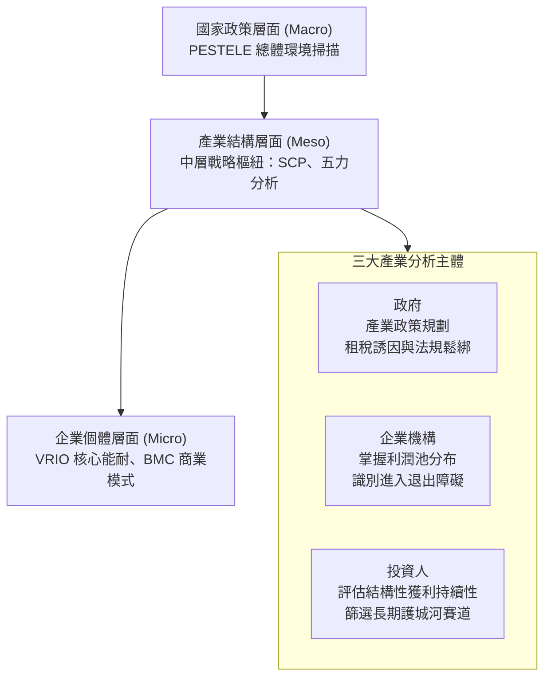

---
{"dg-publish":true,"permalink":"/04/12/w01/","dg-note-properties":{}}
---

# W01_產業分析概論與架構
- **課程**：[[04_主題選修/12_產業分析與投資策略/_產業分析與投資策略 MOC\|產業分析與投資策略]]
- **後續接續**：[[04_主題選修/12_產業分析與投資策略/W02_產業組織與五力分析\|W02_產業組織與五力分析]]
- **標籤**：#PMBA #主題選修 #產業分析 #由上而下投資 #SCP模型 #總體環境 #課堂實務案例

---

## 🗺️ 本週架構心智圖

> 📌 **原始檔維護**：[開啟 Xmind 編輯原始檔](<file:///g:/我的雲端硬碟/PMBA/PMBA_Note/04_主題選修/12_產業分析與投資策略/附件/L01 產業分析概論與架構.xmind>)

---

## 💡 核心摘要

1. **產業分析是連結宏觀與微觀的「中層戰略樞紐」**：產業分析（Meso-level Analysis）位於總體經濟分析（Macro）與企業個體分析（Micro）之間，是投資人選擇賽道、企業主制定策略、政府規劃產業政策的共同必要工具。[[98_商業概念庫/由上而下投資法\|由上而下投資法]]的標準路徑即由此出發：總經環境 → 產業結構 → 企業競爭力。

2. **不同產業的商業模式與獲利驅動因子迥異，切忌套用單一框架**：電子代工（鴻海）靠規模吞吐賺 3% 毛利；晶圓代工（台積電）靠技術寡占享近 60% 毛利；金融租賃（中租-KY）靠淨利差與資產品質控管賺取超額報酬。分析者必須識別各產業的[[關鍵成功因素\|關鍵成功因素]]（KSF）才能做出有效判斷。

3. **景氣循環週期決定分析時間軸——至少拉長 8 到 10 年**：[[98_商業概念庫/景氣循環\|景氣循環]]最短為存貨週期（基欽週期，約 3～4 年），中期為資本支出週期（朱格拉週期，約 8～10 年），長期為技術革命康波週期（20～30 年以上）。做任何產業研究或論文，觀察區間至少應涵蓋一個完整資本支出週期，才能避免將短期景氣財誤判為長期結構性護城河。

4. **由上而下的投資分析框架必須貫通三率**：影響所有金融資產與實體產業的核心變數為「利率、通膨率、匯率」，尤以利率最為關鍵——折現率上升直接壓縮資產估值（Asset Price = Cash Flow ÷ (1 + r)），是任何由上而下分析的起點。

5. **台灣產業演化歷程是世界級的互補性策略聯盟範本**：從 1945 年農業重建，歷經輕工業、重化工業、半導體聚落六階段演進，台灣不靠歐美式垂直龍斷企業，而是憑藉高度彈性的專業分工網絡形成全球不可或缺的供應鏈韌性，是鑽石模型與聚落生態學理論的真實驗證。

---

## 🎙️ 教授課堂實戰觀點與案例深度剖析（逐字稿精萃）

### 一、【破除迷思與實務警語】

1. **化工業 vs 電子業 vs AI 產業：決策週期完全不同**
   - 教授現場分析：「化工業老闆三年做一次決策，電子業老闆三天做一次決策，如果你是 AI 產業，三小時就要做一次決策了。」這並非誇飾，而是反映[[98_商業概念庫/產業生命週期\|產業生命週期]]驅動節奏的本質差異——產業不同，競爭工具與反應速度完全不同，同一套分析框架「用在化工業剛好、用在半導體就太慢」。

2. **「存貨暴利」是最危險的分析陷阱**
   - 逐字稿直言：基欽存貨週期（約 3～4 年）會造成短期供需失衡，廠商突然爆利，但「切忌將短期存貨週期造成的暴利誤判為長期結構性競爭優勢」。2021～2022 年 DRAM 超級週期、2023 年面板報復性反彈，都是典型的週期財；廣達 ROE 從 2016 年的 11% 飆升至 2025 年的 31%，必須拉長時間序列才能判斷是真正的模式升級，還是景氣財。

3. **AI 報告是你在做還是 AI 在做——GIGO 效應警告**
   - 教授明確提醒：「你現在用 AI 做報告，做出來漂亮亮，但正確嗎？可能沒什麼用途。」AI 會產生「幻覺（Hallucination）」補腦，分析者必須先具備自己的產業判斷框架，才能有效校驗 AI 輸出，而非淪為 GIGO（Garbage In, Garbage Out）。

4. **產業分析師認證（APIAA）年薪千萬的市場實況**
   - 優秀產業分析師稀缺，台灣亞太產業分析專業協進會（APIAA）開辦 100 小時認證班收費高達新台幣 9 萬元。核心考科包括：市場與技術預測、產業與競爭分析、經營分析（財報評價與投資可行性）。「只要修完本課程、加上經濟學與管理學，你就具備了報名考試的基礎。」

5. **台積電貢獻台股大盤約 8.5 點每漲一元——集中度風險的真實暴露**
   - 教授現場計算：台積電佔台股加權指數約 40%～45%，台股攻上 5 萬點還需要台積電再漲逾 200 點。「這代表台股實際上是一檔半導體集中型的超級 ETF，不是真正多元化的市場。」這本身就是[[98_商業概念庫/市場集中度\|市場集中度]]風險的活教材。

---

### 二、【課堂深度案例剖析】

#### 案例 1：電子代工六哥 AI 伺服器轉型的「同業 ROE 大發散」
- **背景情境**：教授以電子代工六家主要廠商 2025 年 ROE 做橫斷面對比，揭示同一產業內不同定位導致的結構性獲利落差。
- **實證數據（2025 年橫斷面）**：

| 廠商 | 市場定位 | ROE |
|---|---|---|
| 廣達（2382） | 早期重押白牌 AI 伺服器 | 31.2% |
| 緯創（3231） | GPU 運算板（Baseboard）供應鏈 | 26.3% |
| 鴻海（2317） | 零組件到 AI 機櫃垂直整合最強 | 營收逾 8 兆 |
| 英業達（2356） | 伺服器主機板、邊緣運算 | 12.7% |
| 和碩（4938） | 消費電子比重高，轉型中 | 7.4% |
| 仁寶（2324） | 傳統筆電佔比高，加速轉型 | 5.2% |

- **核心啟示**：「同一個電子代工產業，ROE 差距高達六倍。」這正是[[98_商業概念庫/結構行為績效模型\|結構行為績效模型]]中「行為」層面（市場定位、資本配置選擇）導致「績效」層次分化的最佳實證。

#### 案例 2：實體零售三雄——規模與定位的護城河差距
- **背景情境**：統一超（2912）、全家（5903）、寶雅（5904）同屬零售流通業，但財務結構天壤之別。

| 廠商 | 策略定位 | ROE |
|---|---|---|
| 統一超（2912） | 全通路規模 + 鮮食自製 + 物流規模經濟 | 25.4% |
| 全家（5903） | 數位會員體驗領先，規模略遜 | 16.2% |
| 寶雅（5904） | 品類殺手（Category Killer）——避開低毛利鮮食，專攻高毛利美妝生活雜貨，坪效極強 | **41.2%** |

- **教授點評**：「寶雅的 ROE 居然比台積電還高，很多人沒想到。它不做鮮食就是不做鮮食，就是策略聚焦。這就是[[護城河\|護城河]]——你選對利基市場，就不必跟人打規模戰。」

#### 案例 3：台積電估值白板推導——「無成長內在價值」計算法
- **課堂現場計算（2025 年資料）**：
  - 台積電 2025 年營業利潤：約新台幣 1.936 兆元
  - 股本：約 2,590 億（每股面額 10 元，約 259 億股）
  - 若必要報酬率 = 10%，無成長假設下每股合理價值 = (1.936 兆 ÷ 10%) ÷ 259 億股 ≈ **新台幣 747 元**
  - 課堂當日收盤約 2,400 元，代表市場給予台積電的「成長溢價」高達約 1,600 元（2,400 - 747），約佔市值的 69%。
- **教授點評**：「這 1,600 元是投資人押注台積電未來成長的賭注。如果成長率不如預期，這 1,600 元就是往下的空間。」

#### 案例 4：NVIDIA 客戶竟是競爭者——竹竿效應與五力邊界模糊
- **逐字稿精萃**：教授分析 AI 時代的競爭結構時指出，微軟、Google、Amazon 等四大 CSP 廠商今年資本支出合計超過 8,000 億美元，明年預估達 1.3 兆美元。「回答（NVIDIA）的客戶也在做晶片，自己做 XPU 或者 NPU——競爭者居然是他的客戶！」這正是波特五力架構中「潛在整合威脅」的現實版本：下游買方的向後整合（Backward Integration）直接威脅上游供應商。

#### 案例 5：AI 產業估值公式課堂推導
- **參數設定**（課堂現場）：
  - AI 產業複合成長率（CAGR） = 50%（取上下游平均）
  - AI 產業 Beta 值 ≈ 1.5
  - 黃仁勳預估 AI 未來收益 ≈ 1 兆美元
- **估值公式**：AI 產業合理規模 ≈ CAGR ÷ Beta × 收益基礎 = 50% ÷ 1.5 × 1 兆 ≈ **3.3 兆美元**
- **教授解釋**：「這就是由上而下分析的具體應用——你先估成長，再調整風險，最後折算現在值多少。不是拍腦袋說 AI 很重要就值很多錢。」

---

### 三、【課堂互動與關鍵問答】

- **Q1：為什麼做產業研究至少要拉 8 到 10 年？**
  - **教授答覆**：「存貨週期大概 4 年走上、4 年走下，加起來 8 年；而這個存貨週期又會影響到資本支出週期，大概是 8 到 10 年。如果你只看 3 年，你可能剛好看到景氣最好的時候，以為那是常態。廣達 ROE 從 11% 到 31%，你如果只看這三年，會以為它一直都是這樣——錯！」

- **Q2：期末報告產業可以重複選擇嗎？**
  - **教授答覆**：「產業可以重複，但同一個產業最多兩組，不要全部都選半導體或 AI。大家可以議論哪一些產業，搞不好你做的那個產業就是你論文的主題了，這是本課程的最大附加價值。」

- **Q3：期末報告如何轉化為碩士論文？**
  - **教授答覆**：「完全可以。期末報告做完，再補上研究方法、文獻探討、研究動機，基本上論文骨幹就完成了。過去有學姐做的是台灣商業銀行經營發展策略，結構就是：緒論 → 文獻探討（SCP、五力、RBV）→ 研究方法 → 產業現況分析 → 投資策略 → 結論。你的期末報告就是第四章。」

---

## 📚 核心觀念與理論架構（對齊教材）

### 一、產業分析的多層次定位與三大分析主體

1. **政府視角**：診斷國家產業競爭力，規劃戰略性產業扶植（如台灣產業創新條例、美國晶片法案）。
2. **企業視角**：掌握[[利潤池\|利潤池]]分布，識別[[98_商業概念庫/市場進入障礙\|市場進入障礙]]，制定垂直整合與多元化路徑。
3. **投資人視角**：評估[[98_商業概念庫/超額報酬\|超額報酬]]的結構性持續能力，控制估值風險，優化跨週期資本配置。

---

### 二、三大景氣循環週期與分析方法論

| 週期類型 | 名稱 | 時間長度 | 驅動機制 | 實務判讀要點 |
|---|---|---|---|---|
| **短週期** | 基欽週期（Kitchin Cycle）存貨週期 | 3～4 年 | 廠商預期落差的補庫存與去庫存震盪 | 切忌將存貨暴利誤判為長期競爭優勢 |
| **中週期** | 朱格拉週期（Juglar Cycle）資本支出週期 | 7～10 年 | 固定資產更新與建廠擴產，產能釋放重構供需 | 追蹤 CapEx 峰值，峰值後常伴隨供給過剩 |
| **長週期** | 康波長週期（Kondratiev Wave）技術革命週期 | 20～30 年以上 | 重大通用技術突破（電力、網際網路、AI）與人口變遷 | 評估技術典範轉移的不可逆性 |

**分析方法論雙軌**：
- **時間序列分析**（水平分析）：拉長 8～10 年追蹤財務軌跡，辨識趨勢與轉折。
- **橫斷面分析**（垂直分析）：特定時間點之同儕跨公司對標，識別超額報酬來源。

---

### 三、產業估值三因子模型

$$V_0 = \sum \frac{CF_t}{(1+r)^t}$$

- **成長因子（g）**：[[98_商業概念庫/市場集中度\|市場集中度]]、技術護城河、[[98_商業概念庫/規模經濟\|規模經濟]]決定的長期 CAGR。
- **獲利因子**：毛利率、ROIC/ROE 的可持續性。
- **風險因子（r, β）**：系統性風險（Beta）與資本成本（WACC），高風險產業折現率大幅調升、壓縮現值。

**資本預算決策準則**：
- NPV 絕對金額優先於 IRR 回報率。
- 門檻收益率（Hurdle Rate）= WACC + α（風險貼水）。
- 若 IRR < Hurdle Rate，即使高於銀行定存，本質上仍在摧毀[[98_商業概念庫/股東權益報酬率\|股東權益報酬率]]。

---

### 四、十大經典產業分析理論精解

| # | 理論 | 核心主張 | 產業分析應用 |
|---|---|---|---|
| 1 | 產業組織理論 SCP | 結構→行為→績效 | 解構寡占產業的超額定價權 |
| 2 | 交易成本理論 | 市場 vs 科層協調成本的權衡 | 自製 vs 外購決策（垂直整合邊界） |
| 3 | 賽局理論 | Nash 均衡下的策略互賴 | 寡占市場的產能競賽與價格戰動態 |
| 4 | 組織生態學 | 天擇機制與環境承載力 | 解釋新興產業的湧現與洗牌潮 |
| 5 | 聚落生態學 | 地理鄰近創造外部經濟 | 竹科、矽谷等聚落不可替代的競爭力 |
| 6 | 資源基礎理論 VRIO | 可持續優勢源自稀有、難模仿資源 | 診斷護城河（專利、製程良率、品牌） |
| 7 | 技術演化理論 | 技術進步呈 S 曲線 | 預警舊技術被新技術顛覆的臨界點 |
| 8 | 體制理論 | 組織受法規、規範與文化塑造 | 高管制產業的 ESG 合規分析 |
| 9 | 波特五力分析 | 五種競爭力決定產業利潤天花板 | 結構化量化產業吸引力（雷達圖） |
| 10 | 鑽石結構模式 | 生產要素等四鑽石決定國家競爭優勢 | 評估一國特定產業的長期競爭力 |

---

### 五、產業分類矩陣與標準分析六步驟

**產業多維分類架構**：
- **環境特性**：萌芽期 / 成長期 / 成熟期 / 衰退期；獨占 / 寡占 / 獨占性競爭 / 完全競爭
- **資源要素密集度**：勞力密集 / [[98_商業概念庫/資本支出\|資本支出]]密集 / 技術密集 / 知識密集
- **價值鏈定位**：上游（原料設備）/ 中游（模組代工）/ 下游（品牌通路服務）
- **市場地理**：在地型 / 全國型 / 全球型

**產業分析六大標準步驟**：
1. **Step 1**：界定產業範疇與邊界（明確產品市場與地理範圍）
2. **Step 2**：蒐集產業基礎數據（智庫報告、公開財報與專家訪談）
3. **Step 3**：剖析產業結構（SCP 典範與五力模型評估）
4. **Step 4**：辨識[[關鍵成功因素\|關鍵成功因素]]（KSF，提煉超額獲利的核心能耐）
5. **Step 5**：評估競爭者與劃分策略群組（繪製群組地圖，識別市場空白區）
6. **Step 6**：形成策略意涵與投資建議（轉化為經營決策或資本配置組合）

---

### 六、台灣產業發展七大演化階段

| 階段 | 年代 | 核心產業 | 關鍵政策/事件 |
|---|---|---|---|
| 1 | 1945–1952 | 農業重建（糖業、肥料） | 戰後復原 |
| 2 | 1953–1971 | 輕工業進口替代（紡織、水泥） | 節省外匯 |
| 3 | 1960s–70s | 輕工業出口擴張 | 設立加工出口區 |
| 4 | 1972–1980 | 重化工業（中鋼、中油） | 十大建設 |
| 5 | 1981–1990 | 策略性工業（PC、電子） | 竹科成立 |
| 6 | 1991–2000 | 半導體晶圓代工、光電 | 全球樞紐確立 |
| 7 | 2001–至今 | 埃米世代製程、AI、全球運籌 | AI 供應鏈核心 |

---

### 七、產業投資七大核心檢核問句

> 這是教授提煉的期末報告與投資決策必問清單：

1. 產業邊界與主要替代品是什麼？
2. 獲利邏輯靠營收規模、技術毛利還是高週轉率？
3. 五力結構下利潤池是否被某特定環節掠奪？
4. 當前處於存貨週期的補庫存還是去庫存？[[98_商業概念庫/資本支出\|資本支出]]是否見頂？
5. 企業 ROE 領先是 VRIO 防禦能耐還是[[98_商業概念庫/景氣循環\|景氣循環]]財？
6. 專案預期 IRR 是否實質跨過 Hurdle Rate（WACC + α）？
7. 未來 3～5 年是否存在新技術顛覆或總體政策法規衝擊？

---

## ⚠️ 實務應用與經理人思維

1. **選對賽道比選對個股更重要**：[[98_商業概念庫/產業生命週期\|產業生命週期]]決定了一個賽道未來 5～10 年的成長上限。即使你選到產業內最優秀的公司，若整個賽道已進入衰退期，也難以獲得超額報酬。先用由上而下框架確認賽道，再用 VRIO 選個股。

2. **用「固定成本 vs 營業收入斜率」快速識別產業資本特性**：
   - 資本密集型（半導體建廠、石化）：截距高，固定成本沉重，需追蹤[[98_商業概念庫/資本支出\|資本支出]]峰值與產能利用率。
   - 勞力或知識密集型（顧問、軟體）：截距極低，斜率陡峭，有訂單才有支出，重視人均產值與轉換成本。

3. **善用產業價值鏈資訊平台（IEK、Finmind、原大頭網站）做第一手數據核查**：AI 輸出的產業數據可能已過時或存在幻覺，第一手數據來源（經濟部統計處、台灣趨勢研究、IBIS World）不可替代。
