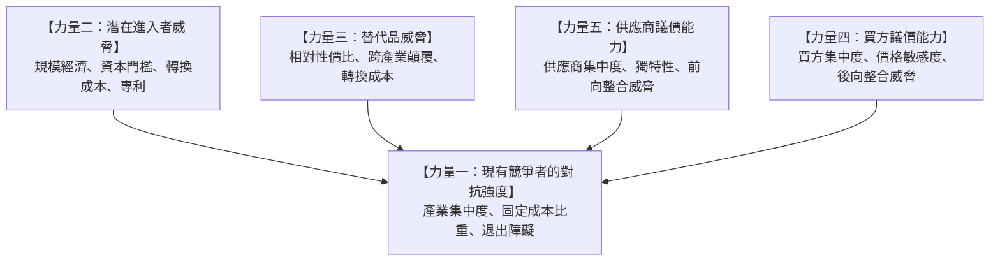
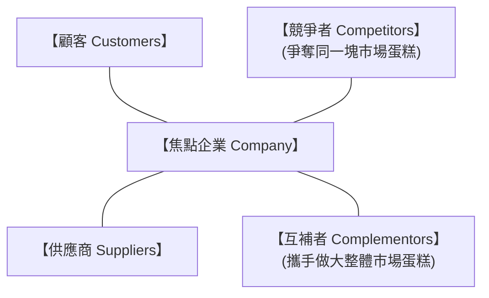
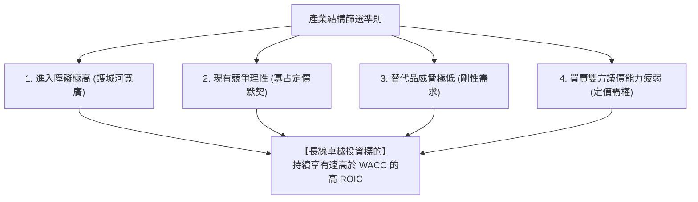

---
{"dg-publish":true,"permalink":"/04/12/w02/","dg-note-properties":{}}
---

# W02_產業組織與五力分析
- **課程**：[[04_主題選修/12_產業分析與投資策略/_產業分析與投資策略 MOC\|產業分析與投資策略]]
- **前置章節**：[[04_主題選修/12_產業分析與投資策略/W01_產業分析概論與架構\|W01_產業分析概論與架構]]
- **後續接續**：[[W03_產業分析模式\|W03_產業分析模式]]
- **標籤**：#PMBA #主題選修 #產業分析 #五力分析 #產業組織 #進入障礙 #議價能力 #經濟護城河

---

## 🗺️ 單元心智圖架構

> 🔗 **單元心智圖原始檔**：[開啟 Xmind 原始檔 (本機編輯)](附件/L02_產業組織與五力分析.xmind) | [[L02_產業組織與五力分析.xmind|Obsidian 內部參照]]

---

## 💡 核心摘要
1. **五力合力決定產業整體利潤池**：產業長期的平均獲利上限不是由個別企業的努力決定，而是由產業五種競爭力量（現有競爭者、潛在進入者、替代品、買方、供應商）的動態合力所劃定；身處五力皆強的泥淖產業，再優秀的企業也難以逃脫微利的宿命。
2. **進入障礙直接對應超額報酬（ROIC）的持久性**：高 [[98_商業概念庫/進入障礙\|進入障礙]] 能有效阻絕外部充沛資本的湧入與產能稀釋，是企業享受長線 [[98_商業概念庫/經濟護城河\|經濟護城河]]、維持高 [[98_商業概念庫/資本投入報酬率\|資本投入報酬率]] 的終極基石。
3. **第六力「互補品」的雙面刃效應**：[[98_商業概念庫/互補品\|互補品]] 能做大產業整體的市場餅，但若互補品掌握了強大的 [[98_商業概念庫/網絡效應\|網絡效應]] 與關鍵生態入口，將反客為主抽乾主產品的利潤，使主產品淪為廉價代工品。
4. **高退出障礙是血腥價格戰的隱形殺手**：當產業充斥高額 [[98_商業概念庫/專用性資產\|專用性資產]] 與沉重退出成本時，虧損企業即使瀕臨破產也無法離場，必然被迫以降價求售維繫現金流，拖累全行業集體沈淪。
5. **投資警訊：營收成長不等於利潤擴張**：投資人若只沉迷於營收的快速飆升，卻忽視供應鏈上游正在憑藉高集中度與技術壟斷大幅瓜分毛利率，往往會落入利潤被上游抽乾的成長陷阱。

---

## 📚 核心觀念與理論框架

### 波特五力分析架構本質

哈佛商學院麥可·波特（Michael Porter）開創的 [[98_商業概念庫/五力分析\|五力分析]] 模型指出：
> 「競爭不僅僅來自同業對手，產業的終極獲利潛力，是由五種基礎競爭力量的相互角力所共同決定。」

#### 力量一：現有競爭者的對抗強度
- [[98_商業概念庫/現有競爭者\|現有競爭者]] 的對抗是產業利潤最直接的侵蝕者。
- **決定對抗強度的核心結構要素**：
  1. **[[98_商業概念庫/產業集中度\|產業集中度]]**：若市場高度分散且缺乏領導者，容易爆發盲目的價格競爭；若呈現良性寡占，企業傾向維持定價默契。
  2. **成本結構與營運槓桿**：高固定成本產業（如半導體晶圓廠、面板、航空）在產能開出後，為了分攤固定折舊，降價求售壓力極大。
  3. **產能擴張幅度與週期**：若同業在繁榮期集中擴建產能，產能開出撞上景氣放緩將引發全行業價格戰。
  4. **[[98_商業概念庫/退出障礙\|退出障礙]]**：退場成本越高，殭屍企業越難被淘汰。

#### 力量二：潛在進入者的威脅
- [[98_商業概念庫/潛在進入者\|潛在進入者]] 帶來全新產能與爭奪市佔率的強烈慾望。
- **主要防禦壁壘（進入障礙）**：
  1. **[[98_商業概念庫/規模經濟\|規模經濟]]**：迫使新進者必須具備巨大產能才能在單位成本上匹敵，否則在初期必遭價格壓制。
  2. **巨額資本需求**：高科技或重工業的廠房設備研發投資，形成天然資本門檻。
  3. **顧客 [[98_商業概念庫/轉換成本\|轉換成本]]**：更換供應商所需的技術重新對接、合約罰款與人員培訓成本。
  4. **獨家分銷通路壟斷**：既有者鎖定關鍵代理商或零售貨架空間。
  5. **專利技術與政府特許執照**：法規標準與智慧財產權壁壘。

#### 力量三：替代品的威脅
- [[98_商業概念庫/替代品威脅\|替代品威脅]] 指來自不同產業、運用不同技術，但能滿足顧客相同根本需求的產品或服務。
- **評估維度**：
  1. **相對性價比（Price-Performance Ratio）**：替代品是否以顯著更低的成本提供相近或更好的效能。
  2. **跨產業顛覆**：替代品往往為產業獲利設定無形的「天花板」，壓制產業隨意漲價的能力。

#### 力量四：買方的議價能力
- [[98_商業概念庫/買方議價能力\|買方議價能力]] 決定了利潤由賣方向買方轉移的程度。
- **關鍵決定因素**：
  1. **買方集中度**：少數大客戶掌控了賣方大部分營收命脈。
  2. **買方的 [[98_商業概念庫/價格敏感度\|價格敏感度]]**：採購支出佔買方總成本比重越大，買方越傾向極限殺價。
  3. **[[98_商業概念庫/後向整合\|後向整合]] 威脅**：買方具備可信的自研或自產能力（如汽車廠威脅自製電池、科技巨頭自研晶片）。

#### 力量五：供應商的議價能力
- [[98_商業概念庫/供應商議價能力\|供應商議價能力]] 體現在上游廠商調漲供應價格與掌控關鍵零組件配額的能力。
- **關鍵決定因素**：
  1. **供應商集中度**：上游由少數巨頭寡占（如先進 GPU、特用氣體）。
  2. **產品獨特性與不可替代性**：下游缺乏合適的替代原料。
  3. **[[98_商業概念庫/前向整合\|前向整合]] 威脅**：供應商擁有跨入下游市場直接面對終端顧客的實力。

---

### 延伸第六力：互補品業者與價值網

#### 互補品概念與角色
- 在現代商業生態中，哈佛學者 Brandenburger 與 Nalebuff 提出了超越五力的第六力——[[98_商業概念庫/互補品\|互補品]]（Complementors）。
- **互補效應**：當產品 A 與產品 B 搭配使用時，顧客對產品 A 的評價大幅提升（例如：電動車與充電樁網絡、遊戲主機與獨佔大作遊戲、智慧型手機與 App 生態）。

#### 價值網分析模型
[[98_商業概念庫/價值網\|價值網]]（Value Net）將焦點企業置於多邊動態生態系中：

- **[[98_商業概念庫/網絡效應\|網絡效應]]（Network Effects）的放大器**：互補品生態越繁榮，越能觸發強大的雙邊網絡效應，形成牢不可破的生態壁壘。

---

### 產業結構對投資決策的啟示

#### 尋找「結構性寬廣護城河」產業
專業投資人在進行產業資產配置時，透過五力雷達圖量化評估產業的結構性吸引力：

#### 靜態結構 vs. 動態演化
- 五力強度並非永久不變，經理人需關注以下**動態催化劑**：
  1. **技術顛覆（Technological Shifts）**：如生成式 AI 降低軟體開發門檻，大幅削弱既有軟體的進入障礙。
  2. **監管與法規鬆綁（Deregulation）**：金融科技執照開放打破傳統銀行的壟斷格局。
  3. **地緣政治與供應鏈重組**：關稅壁壘人為拉高了進口進入障礙，重構本土供應商議價能力。

---

## ⚠️ 實務應用與經理人思維

### 經理人把「替代品」與「同業競爭者」混為一談的戰略盲點
1. **近視症陷阱**：
   - 傳統鋼筆製造商一直將目光放在其他鋼筆品牌上，卻未察覺原子筆與鍵盤輸入法才是真正的致命替代品；傳統數位相機巨頭未曾將 Nokia 或 Apple 視為對手，最終卻被智慧型手機徹底顛覆。
   - 經理人思維：必須從「顧客欲達成的任務（Jobs to be done）」出發，隨時警惕那些採用完全不同底層技術、跨界而來的潛在替代品。

### 忽視退出障礙：高額專用性資產引發的自殘式價格戰
1. **沉沒資本的詛咒**：
   - 許多重工業或重資本產業投入了大量高度 [[98_商業概念庫/專用性資產\|專用性資產]]（如專門煉油設備、特殊晶圓產線），其資產拆除變賣殘值幾乎為零。
   - 經理人思維：當景氣衰退時，企業因為退出成本過高，只要產品售價高於變動成本，便會選擇流血生產以補貼固定折舊。這種行為會將整個產業拖入長達數年的價格割喉戰。

### 五力分析的投資警訊：營收暴增下的毛利被抽乾
1. **上游供應商霸權的侵害**：
   - 許多電子製造服務商（EMS / ODM）因搭上 AI 伺服器浪潮而展現驚人的營收翻倍成長，但深入檢視其財報卻發現營業利益率長年停留在 3~4% 的微利區間。
   - 經理人思維：這正是因為關鍵核心晶片高度寡占，上游巨頭具備絕對的 [[98_商業概念庫/供應商議價能力\|供應商議價能力]]，將產業鏈中絕大部分的利潤直接截流。投資人若只看營收成長而忽視五力利潤分配，極易買在毛利承壓的起點。
