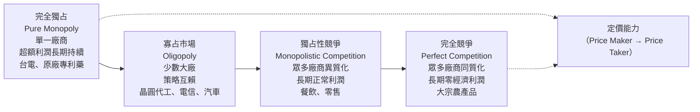
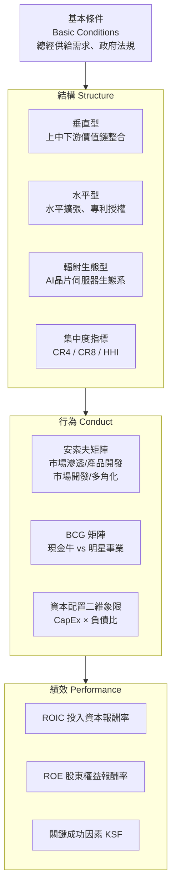
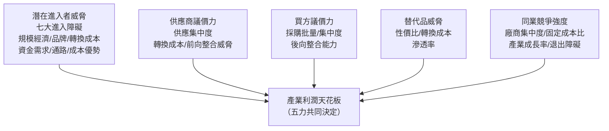

---
{"dg-publish":true,"permalink":"/04/12/w02/","dg-note-properties":{}}
---

# W02_產業組織與五力分析
- **課程**：[[04_主題選修/12_產業分析與投資策略/_產業分析與投資策略 MOC\|產業分析與投資策略]]
- **前置章節**：[[04_主題選修/12_產業分析與投資策略/W01_產業分析概論與架構\|W01_產業分析概論與架構]]
- **後續接續**：[[W03_產業分析模式\|W03_產業分析模式]]
- **標籤**：#PMBA #主題選修 #產業組織 #五力分析 #超額報酬 #護城河 #競爭優勢 #課堂實務案例

---

## 🗺️ 本週架構心智圖

> 📌 **原始檔維護**：[開啟 Xmind 編輯原始檔](<file:///g:/我的雲端硬碟/PMBA/PMBA_Note/04_主題選修/12_產業分析與投資策略/附件/L02_產業組織與五力分析.xmind>)

---

## 💡 核心摘要

1. **S-C-P 架構是解構產業超額報酬的理論主軸**：[[98_商業概念庫/結構行為績效模型\|結構行為績效模型]]（Structure-Conduct-Performance）指出，市場結構（廠商家數、集中度、進退出障礙）決定廠商的策略行為（定價、研發、垂直整合），最終決定產業整體績效（ROIC、ROE、利潤池分布）。分析者的任務是從「績效差異」反推「結構原因」。

2. **波特五力不是靜態快照，而是動態競爭系統**：[[98_商業概念庫/五力分析\|五力分析]]（潛在進入者、替代品、買方議價力、供應商議價力、同業競爭）本質是衡量一個產業的「利潤天花板」有多高。五力愈弱，廠商愈能維持[[98_商業概念庫/超額報酬\|超額報酬]]；五力愈強，利潤愈容易被競爭消耗殆盡。奧地利學派的創造性破壞警示我們：任何靜態五力分析都可能在下一波技術典範轉移中全部失效。

3. **四大市場結構決定議價能力光譜**：從完全獨占（台電、原廠專利藥）到完全競爭（大宗農產品），廠商的[[定價權\|定價權]]光譜完全不同。現實產業多處於寡占或獨占性競爭，分析者需要同時掌握[[98_商業概念庫/市場集中度\|市場集中度]]指標（CR4、HHI）與定性判斷。

4. **美國債務螺旋與長端殖利率是當前所有產業分析的宏觀底色**：2026 年美國國債年化增長 7.5%，名目 GDP 增長僅 4.3%，利息支出已出現「借新還舊」的惡性循環。長端殖利率居高不下直接壓縮所有重資產產業的資本支出意願，是當前 CapEx 決策的最重要宏觀約束。

5. **雷達圖量化五力是期末報告的核心技術**：將五力分析的五個維度量化為 1～5 分的評分系統，繪製雷達圖進行跨產業橫向對標，才能讓五力分析從「文字陳述的工具」升級為「投資決策的量化依據」。

---

## 🎙️ 教授課堂實戰觀點與案例深度剖析（逐字稿精萃）

### 一、【破除迷思與實務警語】

1. **五力分析最大的誤用：把靜態分析當成永久結論**
   - 教授開門見山點出：五力分析描述的是某一時間點的產業競爭態勢，但技術變革與商業模式創新隨時都會顛覆既有五力結構。「你用五力分析 2005 年的出租影片業，結論是進入障礙中等、競爭適中，是個不錯的投資——但 Netflix 出現了，整個產業在五年內消失。」奧地利學派的創造性破壞才是理解動態競爭的真正正確框架。

2. **產業疆界模糊是五力分析最棘手的操作困難**
   - 逐字稿警語：「現在你能定義什麼叫 AI 產業嗎？很難。AI 的生態系牽涉到算力、數據、模型、應用、基礎設施——那個邊界是非常模糊的。」這不是學術問題，而是期末報告選題的第一道難關。教授建議聚焦在產業的「某一垂直區格」而非「整個 AI 產業」。

3. **同業競爭強度：固定成本才是真正的決鬥因素**
   - 課堂深度剖析：固定成本高的產業（半導體建廠、面板廠、航空公司）在需求下滑時，廠商會寧可虧本也不停產，因為「生產成本低於停產成本」——這直接驅動殘酷的價格戰。「面板業和 DRAM 業的大好大壞週期，根本原因就在龐大的固定成本迫使廠商在不景氣時繼續開機，打到流血。」

4. **哈佛學派 vs 芝加哥學派的政策立場衝突**
   - 教授現場分析：哈佛學派（Bain & Mason）認為高集中度 = 壟斷力，應以反托拉斯法干預拆解。芝加哥學派（Stigler）反駁：高集中度 + 高利潤反映的是企業卓越的[[98_商業概念庫/規模經濟\|規模經濟]]與效率，而非壟斷剝削，政府不應過度干預。「台積電市佔全球先進製程超過 90%——它是壟斷者嗎？還是世界上最有效率的企業？這個問題兩個學派答案不同，但你的投資策略完全不一樣。」

5. **聯準會決策直接影響所有產業分析的折現率假設**
   - 逐字稿核心段落：「你看那個點陣圖——連準會的 FOMC 19 位委員對未來利率路徑的預測，就是你整個產業估值模型的分母。利率往哪走，所有重資產產業的 WACC 就往哪走，所有高成長科技股的本益比倍數就往哪走。做產業分析不看這個，就是在閉門造車。」

---

### 二、【課堂深度案例剖析】

#### 案例 1：台灣製藥與生技產業——買方壟斷的極端五力案例
- **背景情境**：教授以台灣生技製藥業的期末報告範例，示範如何將五力分析量化為雷達圖。
- **核心發現——買方議價力高達 4.2／5 分**：
  - 健保署作為台灣藥品市場的「單一支付者（Single Payer）」，對所有藥品享有最終核價權，每隔數年進行全面藥品砍價。
  - 廠商面對的是零議價空間的單一買方，完全符合[[98_商業概念庫/買方議價能力\|買方議價能力]]最強的結構特徵。
  - 教授評語：「這個產業的五力雷達圖，畫出來是嚴重傾向買方的形狀。健保署一個人就把整個產業的利潤天花板壓低了。」
- **價值鏈微笑曲線**：
  - 上游原料藥（神隆）→ 中游製劑/CDMO（保瑞、東洋）→ 下游連鎖藥局（大樹）與醫院終端
  - 教授補充：「這條鏈裡毛利最高的是哪一段？是 CDMO，因為它有技術壁壘又不受健保直接管。CDMO 就是那個微笑曲線最深的地方。」
- **產品生命週期分層**：
  - 學名藥（成熟期，高競爭、低毛利）
  - 生物相似藥/CDMO 代工（成長期，技術壁壘中等）
  - 新藥/基因療法（導入期，極高風險、極高潛力）

#### 案例 2：汽車、製鞋、電信業五力雷達圖對比
- **汽車工業**：高資本支出（CapEx 極高）、高[[98_商業概念庫/退出障礙\|退出障礙]]（廠房設備難以出清）、全球寡占結構，目前面臨電動車跨界顛覆（特斯拉打破傳統 OEM 五力邊界）。
- **製鞋代工**：勞力密集但轉向技術密集（自動化縫線機），下游品牌買方（Nike、Adidas）高度集中、議價力極強（強迫成本透明化），進入門檻靠技術認證而非資本。
- **電信三雄（中華、遠傳、台灣大）**：擁有稀缺的頻譜特許執照（政府管制形成最高進入障礙）、龐大基地台固定成本、天然形成三寡占，競爭形式以服務品質而非價格為主。

#### 案例 3：VW 裁員 15% 背後——中國電動車產能過剩的五力外溢效應
- **逐字稿精萃**：「上個月 Volkswagen 宣佈裁員 15%，為什麼？因為中國汽車——包括比亞迪——到歐洲去設廠，把成本壓下來，歐洲本土的車廠根本沒有辦法生存。這就是你的替代品威脅，從另一個地理市場跨界滲透過來。」
- **策略意涵**：[[98_商業概念庫/替代品威脅\|替代品威脅]]不一定來自技術替代，也可以來自地理套利——低成本市場的廠商以更低的[[98_商業概念庫/資本支出\|資本支出]]基礎進行全球擴張，本質上是對現有廠商的結構性[[98_商業概念庫/退出障礙\|退出障礙]]的強制測試。

#### 案例 4：全球藥品市場估值推導（白板現場）
- **市場規模**：2025 年全球藥品市場規模約 1.94 兆美元，未來 5 年複合成長率約 7%。
- **課堂估值計算**：
  - 產業 Beta（以 Eli Lilly 等龍頭為基準）≈ 0.5
  - 必要報酬率 = 10%
  - 合理估值 = 1.94 兆 ÷ 10% × (7% ÷ 0.5) × 適當折算 ≈ **2.66 兆美元**（5 年後規模的折現估算）
- **教授點評**：「這個和你查到的市場預測報告數字差不多——因為市場本來就在用類似的邏輯在定價。這不是巧合，是因為大家都在用折現率和成長率在反推合理規模。」

#### 案例 5：台積電 vs 格羅方德——同產業不同市場區格的結構性毛利落差
- **教授現場剖析**：
  - 台積電：專注先進製程（3nm、2nm），毛利率逼近 60%，具技術寡占與結構性定價特權（[[定價權\|定價權]]）。
  - 格羅方德（GlobalFoundries）：專注成熟製程（12nm 以上），毛利率約 28%，面對更激烈的同業競爭。
- **核心洞察**：「即便是晶圓代工這同一個產業，分法不同，利潤天花板差了兩倍。所以你做期末報告的時候，不能只說『我分析晶圓代工業』，你要說清楚你分析的是先進製程的那一段，還是成熟製程的那一段。」

---

### 三、【課堂互動與關鍵問答】

- **Q1：五力分析的五個力量一定都要等量計算嗎？**
  - **教授答覆**：「不，五力在不同產業的重要性完全不同。在製藥業，買方議價力（健保署）幾乎決定了一切；在半導體設備業，供應商議價力（ASML 的 EUV 獨占）才是最關鍵的力量。期末報告做五力分析，要先識別哪一個力道是你分析產業的『決定性力量』，再深度拆解它。」

- **Q2：如果一個產業的五力都很強，還值得進入嗎？**
  - **教授答覆**：「值得——但你需要找到那個利基空間（Niche）。波特說企業面對不利五力有四大策略反制：一是強化承受度（建立低成本或品牌護城河）；二是主動改善五力（降低對單一供應商的依賴，或綁定客戶提高[[98_商業概念庫/轉換成本\|轉換成本]]）；三是找有利利基避開五力絞殺；四是改變身份——讓替代品變成你的互補品，化敵為友。寶雅就是一個完美例子，它選擇不做鮮食，主動逃離超商的五力紅海。」

- **Q3：期末報告如何選擇 3 到 5 項產業分析工具？**
  - **教授答覆**：「原則是：靜態分析至少一個（用 SCP 或五力了解現在的結構），動態分析至少一個（用產業生命週期或技術 S 曲線了解未來的演化方向），然後看你的產業是競爭導向還是資源導向，再補一個。不要為了顯示工具多而堆砌——七個工具都用一點點，不如三個工具用得很深。」

---

## 📚 核心觀念與理論架構（對齊教材）

### 一、四大市場結構光譜

| 市場結構 | 廠商數量 | 產品特性 | 進入障礙 | 長期利潤 | 台灣實例 |
|---|---|---|---|---|---|
| 完全獨占 | 1 | 獨特、無替代品 | 極高 | 超額利潤 | 台電、台水 |
| 寡占 | 少數 | 同質或差異化 | 高 | 視競爭態勢 | 電信三雄、台積電/三星 |
| 獨占性競爭 | 眾多 | 差異化（品牌/包裝） | 低 | 正常利潤 | 連鎖餐飲、超商 |
| 完全競爭 | 極多 | 完全同質 | 極低 | 零利潤 | 農產品批發 |

---

### 二、產業組織理論三大學派典範對決

| 學派 | 代表人物 | 因果路徑 | 核心主張 | 政策立場 |
|---|---|---|---|---|
| **哈佛學派** | Bain & Mason | 結構→行為→績效 | 高集中度反映壟斷力，是政府干預的依據 | 積極反托拉斯、拆解寡占 |
| **芝加哥學派** | Stigler | 績效→行為→結構 | 高集中度反映卓越效率，是市場競爭的結果 | 崇尚自由市場、反對過度干預 |
| **奧地利學派** | Schumpeter | 行為/績效 ⇄ 結構（動態雙向） | 市場是動態發現過程，創造性破壞才是真正的競爭力 | 高集中度是創新的暫時性獎勵 |

---

### 三、S-C-P 架構深層推導

**資本配置四象限**（CapEx 高低 × 負債比高低）：
- **技術資本型**（高 CapEx + 低槓桿）：台積電、聯發科
- **重資產基礎設施型**（高 CapEx + 高槓桿）：高鐵、電信、重化鋼鐵
- **金融槓桿型**（低 CapEx + 高槓桿）：中租-KY、商業銀行
- **輕資產人力型**（低 CapEx + 低槓桿）：管理顧問、軟體 IP 開發

---

### 四、波特五力分析架構全面拆解

#### 力道一：潛在進入者威脅（七大進入障礙）

| 障礙類型 | 機制說明 | 台灣實例 |
|---|---|---|
| 規模經濟 | 最小有效規模（MES）、力方法則 | 台積電建廠成本 |
| 產品差異化 | 品牌形象、專利壁壘 | iPhone 品牌黏著度 |
| 品牌忠誠度 | 跨越消費者心理門檻的行銷投資 | 統一超 7-ELEVEN |
| 轉換成本 | 學習成本、退場費用、資產專屬性 | ERP 系統更換成本 |
| 資金需求 | 廠房設備、研發、週轉金門檻 | 晶圓廠 500 億以上門檻 |
| 通路壟斷 | 既有巨頭對排他性通路的掌控 | 傳統藥廠的醫院拜訪網絡 |
| 絕對成本優勢 | 學習曲線、專有原料掌握 | ASML 的 EUV 製造 Know-How |

#### 力道二：替代品威脅
- 衡量指標：[[98_商業概念庫/替代品威脅\|替代品威脅]]的性價比（Price-Performance Ratio）、[[98_商業概念庫/轉換成本\|轉換成本]]、滲透率。
- 策略延伸：納入 Brandenburger 的「互補品（Complementors）」視野，化替代品為生態系夥伴。

#### 力道三：買方議價力
- 決定因素：採購金額佔買方總成本比例、買方向後整合能力（Backward Integration）、買方集中度。
- 最強案例：台灣健保署對製藥業的買方壟斷（單一支付者），議價力分數高達 4.2／5。

#### 力道四：供應商議價力
- 決定因素：供應商集中度、關鍵原料專屬性、向前整合威脅（Forward Integration）。
- 最強案例：ASML 對全球半導體產業的 EUV 設備壟斷（全球唯一），供應商議價力近乎滿分。

#### 力道五：同業競爭強度
- 決定因素：廠商集中度、產業成長率（成熟期→搶份額競爭加劇）、固定成本比、[[98_商業概念庫/退出障礙\|退出障礙]]。
- 固定成本陷阱：固定成本高的產業（面板、DRAM、航空）在不景氣時廠商寧虧本也不停產，強迫競爭者打價格戰。

---

### 五、五力分析的四大理論爭議與企業反制策略

**四大理論爭議**：
1. 產業疆界模糊困擾（AI 跨界科技滲透使邊界失去意義）
2. 過度強調零和博弈（忽視生態系合作可擴大整體利潤池）
3. 簡化競爭主體（忽視策略群組內廠商異質性）
4. 忽視「互補品（Complementors）」在生態系中的關鍵價值

**企業面對不利五力的四大反制策略**：
1. **強化承受度**：構築低成本或高品牌溢價防護牆。
2. **主動改善五力**：標準化降低對單一供應商依賴；綁定客戶提高[[98_商業概念庫/轉換成本\|轉換成本]]。
3. **進入有利利基（Niche）**：尋求競爭真空帶避開五力絞殺（寶雅逃離超商競爭）。
4. **改變行動者身分**：化敵為友（策略聯盟），讓替代品轉化為互補品。

---

### 六、產業分析工具四象限演化矩陣

|  | **競爭導向**（產業經濟學） | **資源導向**（RBV） |
|---|---|---|
| **靜態分析** | S-C-P 結構分析、波特[[98_商業概念庫/五力分析\|五力分析]] | 企業價值鏈（Value Chain）、VRIO 核心能耐 |
| **動態分析** | 產業生命週期（PLC）、技術創新 S 曲線 | 價值網分析、商業生態系（Ecosystem） |

**期末報告工具選取原則**：依產業特性選取 3～5 項工具深入分析，避免工具形式主義堆砌——**三個工具用得很深，遠比七個工具都用一點點更有說服力**。

---

### 七、五力量化雷達圖建置方法

1. **量化評分體系**（每力道 1～5 分，5 = 對現有廠商最不利）：
   - 集中度指標（HHI / CR4）
   - 客供集中度占比
   - CapEx/Sales 比率
   - [[98_商業概念庫/轉換成本\|轉換成本]]評估分值
2. **雷達圖繪製**：五個頂點分別代表五種力量，面積越大代表產業吸引力越低、超額報酬越難維持。
3. **跨產業橫向對標**：將製藥業、半導體業、電信業、零售業的雷達圖並列，直觀呈現各產業的利潤結構差異。

---

## ⚠️ 實務應用與經理人思維

1. **用固定成本比率（Fixed Cost/Value Added）預測競爭烈度**：固定成本佔比越高的產業，在景氣低谷的競爭廝殺越慘烈。製造業主管在評估進入一個新產業時，首先計算的應該是固定成本結構，而非當期毛利率。

2. **[[98_商業概念庫/市場進入障礙\|市場進入障礙]]的建立比維持更重要**：一旦進入一個產業，必須立刻開始構建進入障礙——無論是品牌、專利、[[98_商業概念庫/轉換成本\|轉換成本]]、通路獨占性或[[98_商業概念庫/規模經濟\|規模經濟]]——否則你享有的只是暫時性的「先行者優勢」，而非可防禦的[[護城河\|護城河]]。

3. **波特五力分析是投資決策的「賽道篩選器」而非「個股選擇器」**：五力分析告訴你一個產業值不值得進入、利潤天花板在哪裡；但要在這個產業裡選具體的投資標的，還需要疊加 VRIO 核心能耐分析與財務比率縱向追蹤。「先選對賽道（五力），再選對馬（VRIO）。」

4. **動態監控五力的三個預警信號**：
   - **新進入者突然出現**（特別是跨界科技廠商）：Apple 進入金融支付、Google 進入廣告電視。
   - **替代技術滲透率快速攀升**：電動車佔汽車銷售比例突破 20% 閾值。
   - **供應商或買方開始向前/向後整合**：CSP 廠商（Amazon、Google、Microsoft）自製 AI 晶片，直接威脅 NVIDIA 的供應商護城河。
