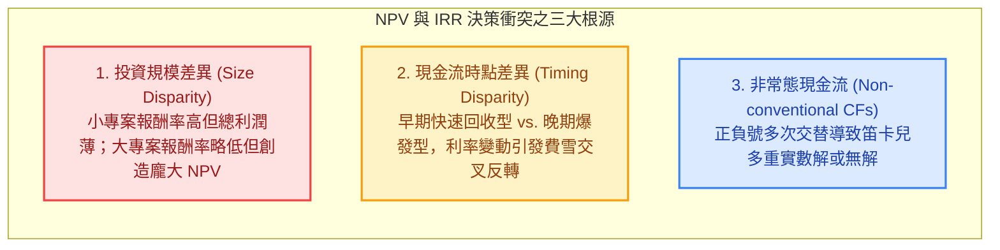
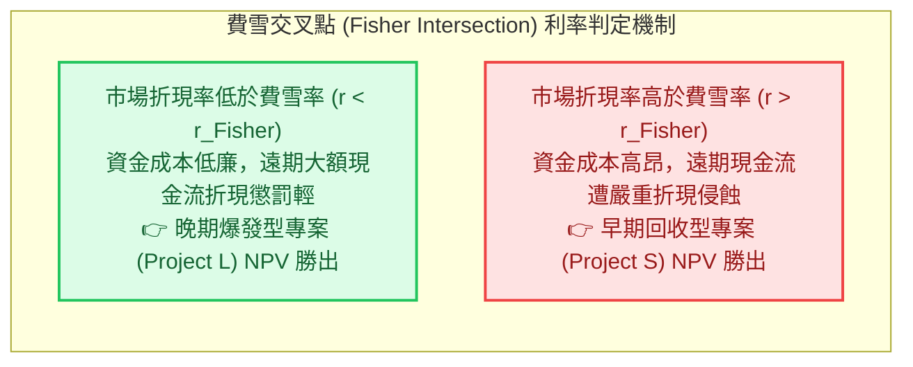

---
{"dg-publish":true,"permalink":"/98/npv-net-present-value/","tags":["商業概念","財務管理","資本預算","公司理財","投資決策","企業評價","PMBA"],"dg-note-properties":{"aliases":["淨現值法","淨現值","Net Present Value","NPV","淨現值法則","NPV Rule","net-present-value_淨現值法"],"tags":["商業概念","財務管理","資本預算","公司理財","投資決策","企業評價","PMBA"]}}
---

# 淨現值法 (Net Present Value, NPV)

> 💡 **導航與索引**：本篇為資本預算與投資決策之唯一黃金標準，亦可參閱評價母法 [[98_商業概念庫/dcf_現金流量折現法\|DCF 現金流量折現法]]、價值管理模型 [[98_商業概念庫/sva_股東價值增加\|SVA 股東價值增加]]、折現率基準 [[98_商業概念庫/wacc_加權平均資本成本\|加權平均資金成本 (WACC)]]、相對收益指標 [[98_商業概念庫/internal-rate-of-return_內部報酬率\|內部報酬率 (IRR)]] 與資本投入量體 [[98_商業概念庫/capital-expenditure_資本支出\|資本支出 (CapEx)]]。

---

## 一、 核心定義與財務學黃金準則

- **淨現值法 (Net Present Value, NPV)** 是公司理財、資本預算（Capital Budgeting）與重大策略投資決策體系中，**衡量企業價值創造的唯一「黃金標準（The Gold Standard）」**。
- **本質與數理定義**：
  淨現值衡量一項長期投資專案在整個生命週期內，所有預期的增額現金流入現值，扣除初始與後續資本投入現值後的**絕對超額財富增量**。
  $$\text{NPV} = \sum_{t=1}^n \frac{\text{CF}_t}{(1 + r)^t} - \text{CF}_0 = \sum_{t=0}^n \frac{\text{CF}_t}{(1 + r)^t}$$
  - $\text{CF}_t$：第 $t$ 期之預期增額自由現金流量（Incremental Free Cash Flow）。
  - $r$：反映該專案特定風險的資本機會成本（Opportunity Cost of Capital / Hurdle Rate），通常為企業的 [[98_商業概念庫/wacc_加權平均資本成本\|WACC]] 或經風險調整後的專案折現率。
  - $\text{CF}_0$：期初初始資本支出與營運資金投入（Initial Outlay）。

- **決策法則與股東財富創造哲學**：
  - **$\text{NPV} > 0$（接受專案）**：專案收益率超越了出資人承擔風險所要求的機會成本，為全體股東創造實質的超額經濟利潤。企業價值與每股股價將因此而提升：
    $$\Delta \text{股東財富} = \text{專案之 NPV 絕對金額}$$
  - **$\text{NPV} < 0$（嚴格否決）**：專案收益無法彌補資本成本，哪怕會計損益表呈現正數淨利，本質上仍在**摧毀股東真實財富**。
  - **$\text{NPV} = 0$（中立門檻）**：專案獲利剛好打平資本成本，企業規模擴大但未創造超額經濟租金。

---

## 二、 資本預算五大評估法則全方位對比

在重大專案審核中，經理人常運用五大工具，但唯有 NPV 具備最健全的理論基礎：

### 資本預算決策工具全維度比較表

| 評估法則 | 考量全生命週期現金流？ | 考量貨幣時間價值？ | 隱含再投資率假設 | 互斥專案排序可靠度 | 理論健全度評價 |
| :--- | :---: | :---: | :--- | :---: | :--- |
| **淨現值法 (NPV)** | **是** | **是** | **資金成本（WACC）** | **完全可靠（黃金標準）** | ⭐️⭐️⭐️⭐️⭐️ **最優** |
| **內部報酬率 (IRR)** | **是** | **是** | **專案自身的 IRR**（過度樂觀） | 經常失真（規模與時點衝突） | ⭐️⭐️⭐️ 次佳 |
| **獲利指數 (PI)** | **是** | **是** | **資金成本（WACC）** | 有規模盲點（偏好小專案） | ⭐️⭐️⭐️⭐️ 資本限額首選 |
| **折現回收期 (DPP)** | **否**（忽略回收期後） | **是** | 無再投資假設 | 不適用 | ⭐️⭐️ 流動性輔助快篩 |
| **普通回收期 (PP)** | **否** | **否** | 無再投資假設 | 不適用 | ⭐️ 粗糙初篩 |
| **會計報酬率 (AAR)** | **是**（但為帳面利潤） | **否** | 無再投資假設 | 極度不可靠 | ❌ 最差（會計調節扭曲） |

---

## 三、 NPV 之四大理論基石（超越所有競爭工具之核心優勢）

1. **嚴格貫徹貨幣時間價值（Time Value of Money, TVM）**：
   NPV 依據複利原理以 $(1+r)^t$ 將遠期現金流精確貼現，徹底破除「當前一元等同未來一元」之會計盲點。
2. **全生命週期洞察（Total Lifecycle Inclusiveness）**：
   完整捕捉專案從研發、建廠、成熟營運至末期殘值回收的所有現金流，杜絕「回收期法」忽略回收年限後龐大獲利的短視缺陷。
3. **價值可加性定理（Value Additivity Property，數學最高優勢）**：
   $$\text{NPV}(A + B) = \text{NPV}(A) + \text{NPV}(B)$$
   企業由眾多專案組合而成，企業總市值增量即為各專案 NPV 之代數加總。**IRR 與 PI 為相對比率，絕不具備可加性**（$\text{IRR}(A+B) \ne \text{IRR}(A) + \text{IRR}(B)$），因此在企業多專案資本配置中，只有 NPV 能直接指導組合價值最大化。
4. **客觀穩健的再投資率假設（Realistic Reinvestment Rate）**：
   - NPV 假設專案產生的中間現金流均能以**客觀市場資金成本 $r$（WACC）**再投資，符合資本市場競爭邏輯；
   - 反觀 IRR 隱含假設中間現金能以「IRR 本身」持續再投資（若專案 IRR 高達 40%，實務上企業根本不可能無限複製 40% 的標的），形成虛幻的數學膨脹。

---

## 四、 課堂白板推導專題：互斥專案衝突、費雪交叉點與資本限額

### 1. 互斥專案（Mutually Exclusive Projects）下 NPV 與 IRR 的決策衝突

當兩個專案彼此排他、僅能擇一執行時，NPV 與 IRR 經常給出相反的優先級排序。衝突源自三大本質：

#### (1) 規模差異（Size Disparity）：百分比迷思 vs. 絕對財富
- **課堂經典對比案例**：
  - **專案 A（小專案）**：期初投資 1,000 萬，一年後收回 1,500 萬 $\implies \text{IRR} = 50\%$。在資金成本 $r = 10\%$ 下，$\text{NPV}_A = \frac{1,500}{1.1} - 1,000 = 363.6 \text{ 萬元}$。
  - **專案 B（大專案）**：期初投資 1 億元，一年後收回 1.3 億元 $\implies \text{IRR} = 30\%$。在資金成本 $r = 10\%$ 下，$\text{NPV}_B = \frac{13,000}{1.1} - 10,000 = 1,818.2 \text{ 萬元}$。
- **經理人決策裁決**：
  雖然 $\text{IRR}_A (50\%) > \text{IRR}_B (30\%)$，但專案 B 為股東創造的絕對財富（1,818 萬）是專案 A（364 萬）的五倍！**股東花的是新台幣，不是百分比；經理人必須果斷選擇 NPV 最大的專案 B**。

#### (2) 現金流時點差異（Timing Disparity）與費雪交叉點（Fisher Intersection）
- **費雪交叉點（Fisher Intersection Rate, $r_{\text{Fisher}}$）**：使兩互斥專案之淨現值完全相等時的折現率。即兩專案「增額現金流（$\Delta\text{CF} = \text{CF}_A - \text{CF}_B$）」的內部報酬率：
  $$\text{NPV}_A(r_{\text{Fisher}}) - \text{NPV}_B(r_{\text{Fisher}}) = \sum_{t=0}^n \frac{\text{CF}_{A,t} - \text{CF}_{B,t}}{(1 + r_{\text{Fisher}})^t} = 0$$

#### (3) 非常態現金流（Non-conventional CFs）與多重 IRR 困境
- 當現金流正負符號在生命週期中變動多次（如露天開礦專案：期初開採投入 $-$，營運期流入 $+$，期末環境復原與除役支出 $-$），依笛卡兒正負號法則，IRR 將產生**多個正實數解（Multiple IRRs）**甚至無數學解，使得 IRR 指標徹底癱瘓；而 NPV 曲線依然單調可算，始終給出唯一的清晰指引。

---

### 2. 資本限額（Capital Rationing）下的獲利指數（PI）與組合最佳化

當企業面臨嚴格的內部融資上限或外部信貸額度限制（資本限額）時，單一挑選最大 NPV 的專案可能過早耗盡所有預算，錯失總和更高的小專案組合：

- **獲利指數 (Profitability Index, PI)**：
  $$\text{PI} = \frac{\sum_{t=1}^n \frac{\text{CF}_t}{(1 + r)^t}}{\text{CF}_0} = 1 + \frac{\text{NPV}}{\text{CF}_0}$$
- **資本配置法則**：
  在資本限額約束下，依 **PI 降冪排序** 依序挑選專案，或透過整數線性規劃（Integer Programming），追求在總預算限制下的**「全專案 NPV 總和最大化」**：
  $$\max \sum_{i=1}^m x_i \cdot \text{NPV}_i \quad \text{s.t.} \quad \sum_{i=1}^m x_i \cdot \text{CF}_{0,i} \le \text{預算上限}, \quad x_i \in \{0, 1\}$$

---

## 五、 經理人思維與增額現金流實務四大紀律

在落實 NPV 計算時，輸入端的現金流量估算往往比公式本身更具挑戰性（Garbage In, Garbage Out）。經理人必須嚴格遵循「獨立專案增額原則（Stand-Alone Principle）」：

1. **沉沒成本（Sunk Costs）必須 100% 徹底剔除**：
   過去已經發生、無論決策接受與否皆無法追回的支出（如前期市調費、可行性研究費、專利前置檢索費），**絕對不可計入專案期初投入**。計入沉沒成本屬於嚴重的經理人心理偏誤。
2. **機會成本（Opportunity Costs）必須 100% 嚴格納入**：
   若專案使用企業目前閒置的廠房或土地，即使未發生實體現金流出，也必須將該資產「若出租他人可收之租金」或「若直接變現之市價扣稅額」計為專案之現金流出。
3. **產品侵蝕與副作用（Erosion / Cannibalization）必須核算**：
   新產品上市若會導致公司既有舊產品銷售衰退（自相殘殺），舊產品損失的邊際貢獻現金流必須視為新專案的現金流減項。
4. **營運資金墊付（$\Delta\text{NWC}$）與設備殘值稅盾**：
   - 營收擴張必伴隨應收帳款與存貨積壓，期初與擴張期 $\Delta\text{NWC} > 0$ 為現金流出；但專案結束時，營運資金將全額回沖收回（現金流入）。
   - 專案終期出售二手設備之實質現金流入，必須精確計入帳面殘值與處分損益之稅盾調節：
     $$\text{稅後殘值現金流} = \text{出售市價} - \text{稅率} \times (\text{出售市價} - \text{帳面價值})$$

---

## 六、 關聯主題與模組網絡

- 🧭 **課程核心模組對接**：
  - [[02_核心必修/01_財務管理/L05_資本支出預算(或投資)決策|L05 資本支出預算決策]]（五大評估法則全方位對比、互斥專案規模與時點衝突、費雪交叉點）
  - [[02_核心必修/01_財務管理/L06_資本支出預算(或投資)決策|L06 資本支出預算決策]]（增額現金流、沉沒成本與機會成本、稅盾與殘值處理）
  - [[02_核心必修/01_財務管理/L07_資本支出預算決策|L07 資本支出預算決策]]（專案風險調整折現率、情境分析與敏感度分析）
  - [[04_主題選修/12_產業分析與投資策略/02_模組筆記/Module_1_總論與架構/M1-2_三大景氣循環與資本評價邏輯|M1-2 三大景氣循環與資本評價邏輯]]（3.2 資本預算：打破 IRR 迷思，NPV 絕對金額優先原則、門檻收益率 Hurdle Rate）
  - [[04_主題選修/10_創業與企業財務策略/02_模組筆記/Module_1_創新思維與商業模式/M1-2_白板決策鏈與財務價值三角|M1-2 白板決策鏈與財務價值三角]]（資本支出折舊回沖與 EVA 傳導）
  - [[02_核心必修/01_財務管理/L01_財務管理導論|L01 財務管理導論]]（股東財富最大化目標、代理人過度投資與棄保投資博弈）
- 🔗 **核心概念原子卡片**：
  - [[dcf_現金流量折現法|現金流量折現法 (DCF)]] ｜ [[sva_股東價值增加|股東價值增加 (SVA)]]
  - [[wacc_加權平均資本成本|加權平均資金成本 (WACC)]] ｜ [[return-on-invested-capital_資本投入報酬率|資本投入報酬率 (ROIC)]]
  - [[internal-rate-of-return_內部報酬率|內部報酬率 (IRR)]] ｜ [[internal-rate-of-return-2_修正內部報酬率|修正內部報酬率 (MIRR)]]
  - [[free-cash-flow-liang_自由現金流量|自由現金流量 (FCF)]] ｜ [[capital-expenditure_資本支出|資本支出 (CapEx)]]
  - [[pvgo_成長機會現值|成長機會現值 (PVGO)]] ｜ [[dupont-analysis_杜邦分析法|杜邦分析法 (DuPont)]]
