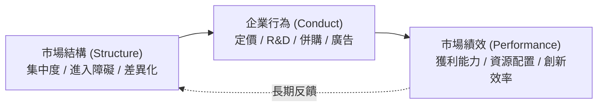

---
{"dg-publish":true,"permalink":"/98/scp/","tags":["商業概念","產業分析","產業組織學"],"dg-note-properties":{"aliases":["SCP","Structure-Conduct-Performance","SCP架構"],"tags":["商業概念","產業分析","產業組織學"]}}
---

# SCP 模型 (Structure-Conduct-Performance)

## 📌 概念定義
**SCP 模型**（Structure-Conduct-Performance Model，結構-行為-績效模型）由 Joe S. Bain 與 Edward S. Mason 於產業組織學（Industrial Organization）中提出，是用於分析「產業市場結構」、「企業戰略行為」與「整體市場績效」之間因果連結的經典分析架構。

---

## 💡 三大核心要素

### 1. 市場結構 (Market Structure)
* **產業集中度**：如 [[he-fen-da-er-zhi-shu-hhi_赫芬達爾指數 HHI]]、[[industry-concentration_產業集中度|CR4 / CR8]]。
* **[[barriers-to-entry_進入障礙]]與[[exit-barriers_退出障礙]]**：規模經濟、資本門檻、法規管制。
* **產品差異化與成本結構**：固定成本佔比與產品替代性。

### 2. 企業行為 (Market Conduct)
* **價格戰略**：邊際成本定價、掠奪性定價或卡特爾默契聯合。
* **非價格競爭**：研發投入、品牌建立與行銷推廣。
* **組織與併購**：垂直整合與橫向併購。

### 3. 市場績效 (Market Performance)
* **經濟效率**：產能利用率與[[economies-of-scale_規模經濟]]實現程度。
* **獲利能力**：[[industry-ping-jia-yu-valuation-indicator-valuation-metrics_產業評價與估值指標 Valuation Metrics|ROIC]]、ROE 與利潤率。
* **技術進步**：產業創新速度與專利產出。

---

## 🔗 相關概念
* [[bo-te-five-forces-analysis_波特五力分析]]
* [[industry-concentration_產業集中度]]
* [[he-fen-da-er-zhi-shu-hhi_赫芬達爾指數 HHI]]
* [[yi-dong-zhang-ai-mobility-barriers_移動障礙 Mobility Barriers]]
