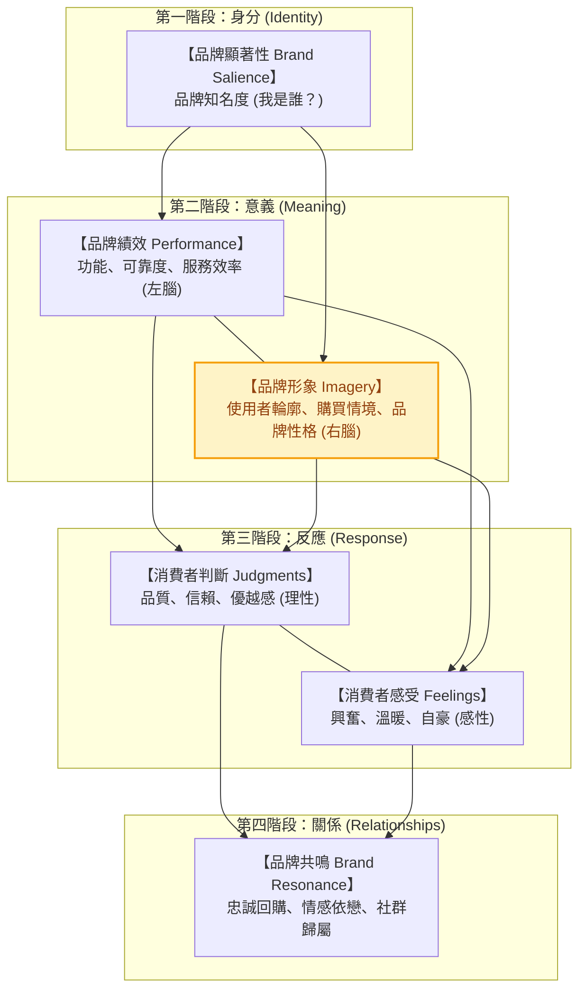

---
{"dg-publish":true,"permalink":"/98/brand-4/","tags":["商業概念","行銷管理","品牌管理","競爭策略","PMBA"],"dg-note-properties":{"aliases":["品牌形象","Brand Image","Brand Imagery","品牌聯想","Brand Personality","品牌個性"],"tags":["商業概念","行銷管理","品牌管理","競爭策略","PMBA"]}}
---


# 品牌形象 (Brand Image & Brand Imagery)

## 一、 核心定義與本質

- **品牌形象 (Brand Image)** 是指**消費者在大腦記憶網絡中，對某個品牌所持有的主觀感知、情感評價與信念之總和**。
- **大衛·艾克 (David A. Aaker) 的聯想理論**：
  品牌形象本質上由一組相互交織的**「[[98_商業概念庫/brand-equity_品牌權益\|品牌聯想]]（Brand Associations）」**所構成，反映了顧客如何理解該品牌的屬性、利益與價值。
- **品牌識別 vs. 品牌形象（內外鏡像關係）**：

| 比較構面 | 品牌識別 (Brand Identity) | 品牌形象 (Brand Image) |
| :--- | :--- | :--- |
| **發起視角** | **由內而外 (Inside-Out)**：企業管理層主動定義。 | **由外而內 (Outside-In)**：消費者客觀接收後的感知投射。 |
| **核心提問** | 「我們希望外界如何看待我們？」 | 「顧客實際上如何看待我們？」 |
| **控制程度** | 企業具備高度掌控權（願景、使命、視覺識別 VI）。 | 受顧客個人體驗、口耳相傳、社群輿論與競品動態影響。 |
| **管理目標** | 清晰定義差異化的價值主張與品牌承諾。 | 縮小**「形象落差 (Image Gap)」**，使外界感知完全契合品牌識別。 |

---

## 二、 凱勒 (Kevin Lane Keller) CBBE 模型中的品牌形象

在凱文·凱勒（Keller）的 [[98_商業概念庫/customer-brand-equity_顧客基礎品牌權益\|顧客基礎品牌權益 (CBBE)]] 金字塔中，**品牌形象（Brand Imagery）**是建立「品牌意義（Brand Meaning）」的感性支柱，與理性的「品牌績效（Brand Performance）」平行並重：



### 1. 成功品牌聯想的三大黃金維度
要將單純的品牌知名度轉化為高額品牌資產，品牌形象背後的聯想網絡必須通過三大檢驗：
1. **強烈度 (Strength)**：品牌訊息與消費者的連結強度及提取速度。取決於資訊處理的深度與接觸頻率。
2. **偏好度 (Favorability)**：該聯想能否滿足顧客的核心需求與願望，激發正向好評。
3. **獨特性 (Uniqueness)**：該聯想是否具備排他性，能否形成有別於競品的**差異化特點（Point of Difference, POD）**，而非僅止於產業必備的相仿點（Point of Parity, POP）。

---

## 三、 品牌形象四大解構構面

```text
┌────────────────────────────────────────────────────────┐
│                   品牌形象之四大核心構面                │
├──────────────────────────┬─────────────────────────────┤
│ 1. 使用者輪廓 (Profiles) │ 誰是典型愛用者？ (階層/風格) │
├──────────────────────────┼─────────────────────────────┤
│ 2. 購買與情境 (Context)  │ 何時、何地、何種場合使用？   │
├──────────────────────────┼─────────────────────────────┤
│ 3. 品牌個性 (Personality)│ 若品牌化身為人，具備何種性格?│
├──────────────────────────┼─────────────────────────────┤
│ 4. 傳承與故事 (Heritage) │ 創辦人歷史、傳奇歷程與文化   │
└──────────────────────────┴─────────────────────────────┘
```

### 1. 使用者輪廓 (User Profiles)
- 消費者往往將產品與「典型使用者」形象劃上等號。涵蓋人口統計變數（性別、年齡、收入）與心理變數（社會階層、政治傾向、生活方式）。
- *範例*：哈雷機車（Harley-Davidson）聯想到硬漢與追尋自由者；Lululemon 聯想到熱愛健康、生活自律的中產都會女性。

### 2. 購買與使用情境 (Purchase & Usage Situations)
- 品牌在何種時空背景下被召喚出來，強化了特定的情境專屬聯想。
- *範例*：送禮情境聯想到白蘭氏燕窩、婚禮誓約聯想到 Tiffany & Co.、加班提神聯想到 Red Bull。

### 3. 品牌個性五大維度 (Jennifer Aaker's Big Five Brand Personality)
珍妮佛·阿克教授將人類心理學的大五人格模型引入行銷學，確立了品牌個性的五大原型：

| 品牌個性維度 | 核心特質描述 | 代表性經典品牌 |
| :--- | :--- | :--- |
| **1. 純真 (Sincerity)** | 溫暖、誠懇、真誠、腳踏實地、家庭導向 | **迪士尼 (Disney)**、**嬌生 (Johnson & Johnson)**、**無印良品 (MUJI)** |
| **2. 刺激 (Excitement)** | 大膽、前衛、活力、充滿想像力、引領時代 | **紅牛 (Red Bull)**、**特斯拉 (Tesla)**、**Nike** |
| **3. 能力 (Competence)** | 可靠、專業、聰明、成功、值得信賴 | **IBM**、**台積電 (TSMC)**、**Volvo**、**微軟 (Microsoft)** |
| **4. 精緻 (Sophistication)** | 奢華、優雅、精緻品味、魅力迷人、高貴地位 | **香奈兒 (Chanel)**、**勞力士 (Rolex)**、**Apple** |
| **5. 強悍 (Ruggedness)** | 粗獷、堅韌、戶外探險、硬派無畏 | **Jeep**、**The North Face**、**哈雷 (Harley-Davidson)** |

### 4. 歷史傳承與品牌故事 (Heritage & Stories)
- 品牌的起源神話、創辦人精神與文化歷史，賦予品牌深厚的情感厚度與不可替代性。
- *範例*：瑞士百達翡麗（Patek Philippe）的傳承理念：「沒有人能真正擁有百達翡麗，你只不過是為下一代保管而已。」

---

## 四、 商業策略與財務價值

1. **定價話語權與溢價空間 (Pricing Power & Price Premium)**：
   - 強大的品牌形象讓產品徹底脫離成本加成的商品化陷阱（Commoditization），建立深厚的[[98_商業概念庫/economic-moat_經濟護城河\|無形資產護城河]]，使消費者願意支付數倍溢價。
2. **降低獲客成本 (CAC) 與極大化顧客終身價值 (CLV)**：
   - 鮮明正向的品牌形象大幅縮短顧客購買決策時間，自帶社群裂變與自然搜尋流量，抑制行銷銷售費用（SG&A）佔比。
3. **品牌延伸的護航效應 (Brand Extension Leverage)**：
   - 良好母品牌形象為跨品類新品提供信用背書（如 Apple 從電腦延伸至手機、穿戴手錶），大幅降低新市場拓荒之消費者心理防線。
4. **防範品牌老化與品牌稀釋 (Brand Dilution Risk)**：
   - 經理人向下延伸副牌或跨界授權時，必須嚴控品質一致性，避免過度商品化導致高端形象折損崩塌；當形象與時代脫節時，需果斷啟動[[98_商業概念庫/brand_品牌重塑\|品牌重塑 (Rebranding)]]。

---

## 五、 關聯主題與模組網絡

- 🧭 **課程核心模組對接**：
  - [[02_核心必修/02_行銷管理/L04_品牌管理與品牌權益\|L04 品牌管理與品牌權益]]（CBBE 金字塔四階路徑、品牌架構與品牌重塑決策）
  - [[02_核心必修/02_行銷管理/L05_產品相關策略\|L05 產品相關策略]]（產品線向下延伸與品牌形象貶值防範）
  - [[04_主題選修/10_創業與企業財務策略/02_模組筆記/Module_1_創新思維與商業模式/M1-9_商業模式畫布架構與價值主張設計\|M1-9 商業模式畫布架構與價值主張設計]]（顧客感知價值方程式中的「形象價值 Image Value」）
  - [[04_主題選修/12_產業分析與投資策略/02_模組筆記/Module_1_總論與架構/M1-5_波特五力分析與量化架構\|M1-5 波特五力分析與量化架構]]（寡占產業龍頭非價格競爭之品牌壁壘）
- 🔗 **核心概念原子卡片**：
  - [[98_商業概念庫/brand-equity_品牌權益\|brand-equity_品牌權益]] ｜ [[98_商業概念庫/customer-brand-equity_顧客基礎品牌權益\|customer-brand-equity_顧客基礎品牌權益]]
  - [[98_商業概念庫/brand-3_品牌識別\|brand-3_品牌識別]] ｜ [[98_商業概念庫/brand-positioning_品牌定位\|brand-positioning_品牌定位]]
  - [[98_商業概念庫/brand-loyalty_品牌忠誠度\|brand-loyalty_品牌忠誠度]] ｜ [[98_商業概念庫/brand-5_品牌共鳴\|brand-5_品牌共鳴]]
  - [[98_商業概念庫/brand-8_品牌知名度\|brand-8_品牌知名度]] ｜ [[98_商業概念庫/brand-10_品牌延伸\|brand-10_品牌延伸]]
  - [[98_商業概念庫/brand-dilution_品牌稀釋\|brand-dilution_品牌稀釋]] ｜ [[98_商業概念庫/brand_品牌重塑\|brand_品牌重塑]]
  - [[98_商業概念庫/economic-moat_經濟護城河\|economic-moat_經濟護城河]] ｜ [[98_商業概念庫/clv-customer-lifetime-value_顧客終身價值\|clv-customer-lifetime-value_顧客終身價值]]
