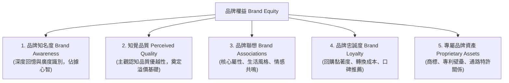
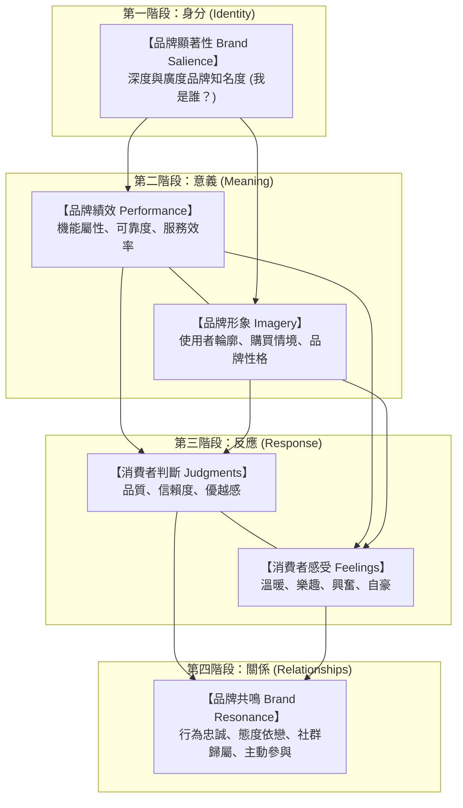

---
{"dg-publish":true,"permalink":"/98/brand-equity/","tags":["商業概念","行銷管理","品牌管理","PMBA"],"dg-note-properties":{"aliases":["品牌權益","Brand Equity","品牌資產"],"tags":["商業概念","行銷管理","品牌管理","PMBA"]}}
---

# 品牌權益 (Brand Equity)

## 一、 核心定義與本質

### 1. 核心定義
- **品牌權益（Brand Equity）** 是指品牌名稱、識別符號與商譽為企業的產品或服務所賦予的**附加價值（Added Value）**。
- 它具體展現在：當消費者面對一項產品時，因為認識並信任該品牌，而產生有別於對「同功能未標示品牌之產品（Generic / Unbranded Product）」的差異化認知、情感偏好與決策反應（Differential Effect）。

### 2. 商業本質與戰略價值
- **心智中的溢價特許權**：品牌權益是企業在顧客大腦中建立的特許地位，賦予企業強大的[[98_商業概念庫/pricing-power_溢價能力\|pricing-power_溢價能力]]，擺脫純粹成本導向的同質化價格戰。
- **對顧客而言（價值創造）**：
  - **大幅降低搜尋成本**：在海量資訊與繁複產品規格中，品牌是第一時間引導選擇的決策捷徑。
  - **化解[[98_商業概念庫/perception-risk_知覺風險\|perception-risk_知覺風險]]**：提供穩定的品質承諾與售後保證，消除購買前的焦慮感。
  - **滿足心理與社交象徵**：產品轉化為展現品味、生活風格或社群歸屬的社交符號。
- **對企業而言（競爭護城河）**：
  - **抗通膨與定價主導權**：在原物料或營運成本上漲時，具備轉嫁成本的底氣。
  - **供應鏈與通路話語權**：自帶客流的品牌形成「拉式需求（Pull Strategy）」，大幅增強對實體與電商通路的談判議價籌碼。
  - **資本市場商譽資產**：在企業併購與評價時，轉化為無形資產溢價與巨額[[98_商業概念庫/goodwill_商譽\|goodwill_商譽]]。

---

## 二、 核心評估架構與經典理論模型

### 1. 艾克（David A. Aaker）品牌資產五維度模型
大衛·艾克教授提出，品牌資產是由以下五大核心構面共同構築而成：

1. **[[98_商業概念庫/brand-8_品牌知名度\|brand-8_品牌知名度]]（Brand Awareness）**：消費者能否在該產品類別中迅速聯想並辨識出該品牌，涵蓋從輔助知名度（Recognition）、未提示回憶（Recall）到第一提及（Top of Mind，佔據[[98_商業概念庫/mind-share_心智佔有率\|mind-share_心智佔有率]]）。
2. **知覺品質（Perceived Quality）**：顧客對產品或服務相較於替代品整體品質與機能的主觀評價，是支撐品牌溢價的實質基礎。
3. **[[98_商業概念庫/brand-4_品牌形象\|品牌聯想]]（Brand Associations）**：消費者記憶庫中所有與該品牌連結的節點（包括功能屬性、品牌個性、企業社會責任與品牌代言人）。
4. **[[98_商業概念庫/brand-loyalty_品牌忠誠度\|brand-loyalty_品牌忠誠度]]（Brand Loyalty）**：核心忠實顧客持續回購並抵禦競品降價誘惑的能力，直接決定了企業未來的現金流穩定度與[[98_商業概念庫/clv-customer-lifetime-value_顧客終身價值\|clv-customer-lifetime-value_顧客終身價值]]。
5. **專屬品牌資產（Proprietary Brand Assets）**：法律保障的註冊商標、技術專利與排他性通路網絡，防止對手侵權仿冒。

---

### 2. 凱勒（Kevin Lane Keller）CBBE 品牌共鳴金字塔
凱文·凱勒教授建立的[[98_商業概念庫/customer-brand-equity_顧客基礎品牌權益\|customer-brand-equity_顧客基礎品牌權益]]（Customer-Based Brand Equity, CBBE）模型，揭示了由理智與感性雙路徑共同攀登至頂層「品牌共鳴」的四階段演進：

- **第一階段（身分）**：建立[[98_商業概念庫/brand-3_品牌識別\|品牌識別]]與顯著性，確保進入消費者的採購考慮集合（Consideration Set）。
- **第二階段（意義）**：左腦理性傳遞產品績效，右腦感性刻畫品牌個性與情境形象。
- **第三階段（反應）**：引導顧客產生理性肯定（專業判斷）與正向情緒體驗（感性感受）。
- **第四階段（關係）**：達成頂層的[[98_商業概念庫/brand-5_品牌共鳴\|brand-5_品牌共鳴]]，讓消費者成為品牌的熱烈擁護者與傳教士。

---

## 三、 品牌權益的衡量指標與量化公式

評估品牌權益通常兼顧**顧客心智認知（質化與行為）**與**財務估值（量化資本）**兩大層面：

### 1. 顧客端與市場端指標

| 評估維度 | 量化指標 | 計算公式 / 衡量方法 | 商業意涵 |
| :--- | :--- | :--- | :--- |
| **價格溢價能力** | **Price Premium** | $$\text{溢價率 (\%)} = \frac{P_{\text{品牌}} - P_{\text{基準白牌}}}{P_{\text{基準白牌}}} \times 100\%$$ | 衡量消費者因品牌光環而願意額外支付的溢價百分比。 |
| **顧客推薦口碑** | **淨推薦值 (NPS)** | $$\text{NPS} = \% \text{推薦者 (9-10分)} - \% \text{批評者 (0-6分)}$$ | 衡量顧客主動為品牌宣傳的滿意度與口碑忠誠度。 |
| **心智與市場份額** | **心智轉化率** | $$\text{心智轉化率} = \frac{\text{市場佔有率 (Market Share)}}{\text{心智佔有率 (Mind Share)}}$$ | 檢視品牌的認知度是否能高效率轉化為實際銷售營收。 |
| **顧客資產價值** | **[[98_商業概念庫/clv-customer-lifetime-value_顧客終身價值\|顧客終身價值 (CLV)]]** | $$\text{CLV} = \sum_{t=1}^{n} \frac{(R_t - C_t) \times r^t}{(1 + d)^t}$$ | 強大品牌透過降低流失率、提高留存率（$r$）倍增顧客長遠價值。 |

---

### 2. 財務端品牌估值模型

1. **溢價收益法（Premium Profit Method）**：
   將企業產品售價與同質無品牌（白牌）產品價差所帶來的超額營運毛利，扣除專屬品牌推廣費用後進行折現：
   $$\text{品牌經濟附加利潤} = (P_{\text{品牌}} - P_{\text{無品牌}}) \times Q_{\text{銷售量}} - \text{專屬品牌行銷費用}$$

2. **權利金節省法（Relief from Royalty Method）**：
   國際評價準則常用方法，估算如果企業自身未擁有該品牌，而需向外部權利人取得商標授權時，未來每年需支付之權利金現值：
   $$\text{品牌現值} = \sum_{t=1}^{n} \frac{\text{預估營收}_t \times \text{合理授權權利金率} \times (1 - \text{營所稅率})}{(1 + \text{加權平均資金成本 } WACC)^t}$$

3. **Interbrand 品牌價值評估體系**：
   - **財務分析（Financial Forecast）**：預測歸屬於無形資產的未來經濟利潤。
   - **品牌角色分析（Role of Brand Index, RBI）**：評估品牌在消費者購買決策中的影響比重（例如精品業可高達 80%，工業原料可能僅 10%）。
   - **品牌強度分析（Brand Strength Index, BSI）**：從領導力、穩定性、國際化與法規保護等構面評分，決定折現率。

---

## 四、 商業策略意涵與經理人思維

### 1. 守護價格底線，嚴防「促銷成癮症」
- 許多經理人面對短期業績目標時，常頻繁祭出大打折促銷。
- **經理人洞見**：過度促銷是摧毀品牌權益的毒藥。降價會打破消費者原有的「價格錨點（Price Anchor）」，向市場釋放「這項商品根本不值原價」的強烈負面信號，吸引無忠誠度的價格傭兵，永久損害品牌的[[98_商業概念庫/pricing-power_溢價能力\|pricing-power_溢價能力]]。

### 2. 品牌延伸與槓桿效應的「品牌稀釋陷阱」
- 透過[[98_商業概念庫/brand-10_品牌延伸\|brand-10_品牌延伸]]或[[98_商業概念庫/line-extension_線延伸\|line-extension_線延伸]]跨入新領域，能大幅壓低市場教育費用。
- **邊界警訊（[[98_商業概念庫/brand-dilution_品牌稀釋\|brand-dilution_品牌稀釋]]）**：
  - 延伸必須基於消費者能理解的「核心能力關聯性」。
  - 若過度授權或跨足與原本高階定位衝突的平價品類（如皮爾卡登過度授權案），將迅速稀釋母品牌數十年累積的心智資產，造成不可逆的品牌貶值。

### 3. 品牌重塑（Rebranding）的系統工程
- 當面臨市場結構變遷、品牌形象老化或跨國轉型時，企業需評估啟動[[98_商業概念庫/brand_品牌重塑\|brand_品牌重塑]]。
- **實踐原則**：重塑絕非僅是更換 Logo 或視覺包裝，而是必須同步更新產品體驗、組織服務與價值承諾的系統化變革，避免「換湯不換藥」引發既有忠實客群的強烈反彈。

---

## 五、 關聯主題與模組筆記
* [[02_核心必修/02_行銷管理/_行銷管理 MOC\|行銷管理 MOC 課程導航]]
* [[02_核心必修/02_行銷管理/L04_品牌管理與品牌權益\|L04 核心必修：品牌管理與品牌權益]]
* [[98_商業概念庫/customer-brand-equity_顧客基礎品牌權益\|customer-brand-equity_顧客基礎品牌權益]]
* [[98_商業概念庫/brand-8_品牌知名度\|brand-8_品牌知名度]]
* [[98_商業概念庫/brand-4_品牌形象\|brand-4_品牌形象]]
* [[98_商業概念庫/brand-5_品牌共鳴\|brand-5_品牌共鳴]]
* [[98_商業概念庫/brand-loyalty_品牌忠誠度\|brand-loyalty_品牌忠誠度]]
* [[98_商業概念庫/brand-10_品牌延伸\|brand-10_品牌延伸]]
* [[98_商業概念庫/brand-dilution_品牌稀釋\|brand-dilution_品牌稀釋]]
* [[98_商業概念庫/brand-positioning_品牌定位\|brand-positioning_品牌定位]]
* [[98_商業概念庫/pricing-power_溢價能力\|pricing-power_溢價能力]]
* [[98_商業概念庫/perception-risk_知覺風險\|perception-risk_知覺風險]]
* [[98_商業概念庫/mind-share_心智佔有率\|mind-share_心智佔有率]]
* [[98_商業概念庫/goodwill_商譽\|goodwill_商譽]]
* [[98_商業概念庫/clv-customer-lifetime-value_顧客終身價值\|clv-customer-lifetime-value_顧客終身價值]]
