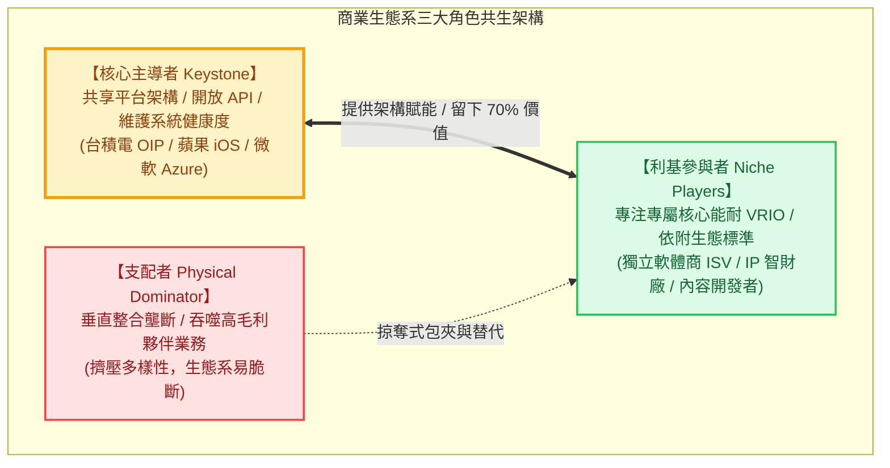

---
{"dg-publish":true,"permalink":"/98/business-ecosystem/","tags":["商業概念","策略管理","平台經濟","PMBA"],"dg-note-properties":{"aliases":["商業生態系","生態系策略","商業生態系統","Business Ecosystem"],"tags":["商業概念","策略管理","平台經濟","PMBA"]}}
---

# 商業生態系 (Business Ecosystem)

## 一、 核心定義與理論本質
- **商業生態系 (Business Ecosystem)** 是由詹姆斯·摩爾（James F. Moore, 1993）率先引入商管領域、並由 Marco Iansiti & Roy Levien（2004）深化之重大策略分析概念。
- **本質定義**：跨越傳統產業垂直邊界，由一群具有鬆散互賴關係的組織（包括核心技術平台提供者、供應商、互補品開發者、經銷商、外包商及終端顧客）所形成的**動態非線性共生價值網絡**。
- **典範轉移**：產業競爭的根本單元，已由「單一企業對抗」或「線性價值鏈競爭」，全面升級為**「生態系對抗生態系（Ecosystem vs. Ecosystem）」**。

---

## 二、 核心架構與三大角色矩陣

### 1. 三大核心成員角色
1. **核心主導者 (Keystone)**：
   - 擔任系統中樞，提供開放性標準架構、界面（API/SDK）與信用結算環境。
   - 遵循**「創造整體大價值，僅擷取小份額（留 70% 給夥伴）」**原則，維持生態體系的生機。
2. **支配者 (Physical Dominator)**：
   - 掌握核心入口後，企圖向下游或橫向全面掌控，將高毛利互補品收歸己有，導致外部夥伴喪失創新動機與叛逃。
3. **利基者 (Niche Players)**：
   - 佔生態系全體廠商之 90% 以上，依附於 Keystone 的標準，專注自身專屬性核心技術。

### 2. 生態系統健康度三大衡量維度 (Health Dimensions)
- **生產力 (Productivity)**：生態系將技術與資本投入轉化為持續降低成本與創新產品的效率。
- **強韌度 (Robustness)**：面臨外部環境劇變、技術突變或地緣政治衝擊時，生態系維持功能不崩潰的抗震力。
- **利基創造力 / 多樣性 (Niche Creation & Diversity)**：生態系能否持續孕育出全新細分市場與新型商業模式的能力。

---

## 三、 產業意涵與經理人策略決策

1. **從「擁有資產」轉向「協調網絡」**：
   - 傳統經理人習慣以併購與垂直整合控制資產；現代生態系經理人則專注於**「界面控制權（Control of Interfaces）」**與**「數據協同效能」**。
2. **防範自毀性壟斷**：
   - Keystone 若過度提高抽成（如引發全球訴訟的 30% 蘋果稅爭議），容易逼迫高價值利基者倒戈或聯合反抗，削弱生態系壁壘。
3. **利基者的生存之道**：
   - 避免過度依賴單一生態系，維持跨平台多棲能力，並將核心能力鎖定在平台難以標準化或低成本複製之極高資產專屬性（Asset Specificity）環節。

---

## 四、 雙向關聯網絡

- 課程核心筆記對接：
  - [[04_主題選修/12_產業分析與投資策略/02_模組筆記/Module_1_總論與架構/M1-8_商業生態系與平台網絡\|M1-8_商業生態系與平台網絡]]（主導者/支配者定位、雙邊市場網絡效應與平台包夾）
  - [[04_主題選修/12_產業分析與投資策略/02_模組筆記/Module_1_總論與架構/M1-6_產業分析模式與九大分析工具矩陣\|M1-6_產業分析模式與九大分析工具矩陣]]（商業生態系模式解構與利益池分析）
  - [[04_主題選修/12_產業分析與投資策略/02_模組筆記/Module_1_總論與架構/M1-5_波特五力分析與量化架構\|M1-5_波特五力分析與量化架構]]（價值網共生戰略：反制五力之第四路徑）
  - [[04_主題選修/12_產業分析與投資策略/02_模組筆記/Module_1_總論與架構/M1-7_產業市場空間與策略群組\|M1-7_產業市場空間與策略群組]]（價值要素空間與移動障礙防禦）
- 概念卡片雙向鏈結：
  - [[98_商業概念庫/two-sided-market_雙邊市場\|two-sided-market_雙邊市場]]
  - [[98_商業概念庫/platform-envelopment_平台包夾\|platform-envelopment_平台包夾]]
  - [[04_主題選修/12_產業分析與投資策略/01_總體與個案/cases_企業與產業案例庫\|cases_企業與產業案例庫]]（台積電 OIP 生態、蘋果 iOS vs Android）
