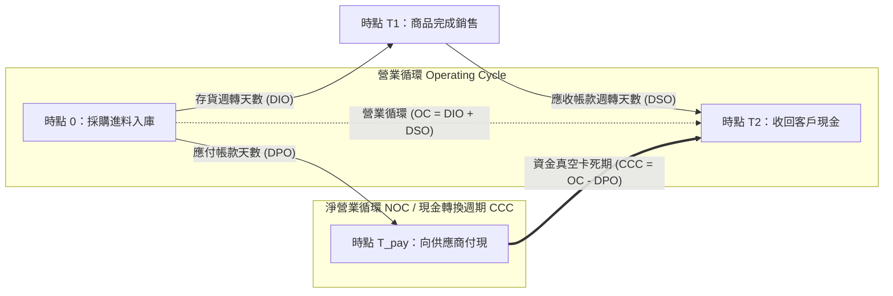

---
{"dg-publish":true,"permalink":"/98/cycle/","tags":["商業概念","財務管理","營運資金","流動性分析","PMBA"],"dg-note-properties":{"aliases":["淨營業循環週期","淨營業循環","Net Operating Cycle","NOC","現金轉換週期","Cash Conversion Cycle","CCC"],"tags":["商業概念","財務管理","營運資金","流動性分析","PMBA"]}}
---

# 淨營業循環週期 (Net Operating Cycle, NOC / CCC)

## 一、 核心定義與本質
- **淨營業循環週期（Net Operating Cycle, NOC）**，在現代財務管理與營運分析中亦普遍稱為**現金轉換週期（Cash Conversion Cycle, CCC）**。
- **本質與意涵**：
  - 企業從「**實際向供應商支付現金購料**」開始，經歷生產製造、庫存倉儲、商品銷售，直到「**從客戶端全數收回銷售現金**」為止的**淨時間差（天數）**。
  - 它衡量了企業的**真金白銀被完全卡死在產銷營運鏈中的真空天數**。
  - 在此期間內，企業必須自行籌措[[98_商業概念庫/net-working-capital_淨營運資金\|net-working-capital_淨營運資金]]或仰賴短期融資（如[[98_商業概念庫/revolving-credit_循環信用貸款\|revolving-credit_循環信用貸款]]）來支應日常開銷。週期越長，企業的[[98_商業概念庫/liquidity_流動性\|liquidity_流動性]]壓力與利息負擔越大，甚至可能引發[[98_商業概念庫/insolvency-with-profit_黑字倒閉\|insolvency-with-profit_黑字倒閉]]。

---

## 二、 核心計算公式與架構拆解

### 1. 核心總公式
淨營業循環週期由「營業循環（Operating Cycle）」扣除供應商所給予的「商業信用期（應付帳款遞延付款期）」計算而得：

$$\begin{aligned}
\text{淨營業循環週期 (NOC / CCC)} &= \text{營業循環 (Operating Cycle, OC)} - \text{應付帳款週轉天數 (DPO)} \\
&= \text{存貨週轉天數 (DIO)} + \text{應收帳款週轉天數 (DSO)} - \text{應付帳款週轉天數 (DPO)}
\end{aligned}$$

---

### 2. 三大子指標公式拆解

| 指標名稱 | 英文代號 | 計算公式 | 財務與營運意涵 |
| :--- | :---: | :--- | :--- |
| **存貨週轉天數** (Days Sales of Inventory) | **DIO / DSI** | $$\text{DIO} = \frac{\text{平均存貨}}{\text{營業成本 (COGS)}} \times 365 = \frac{365}{\text{存貨週轉率}}$$ | 原物料進廠到製成品售出所需的平均天數（備料、製程與庫存滯銷效率）。 |
| **應收帳款週轉天數** (Days Sales Outstanding) | **DSO** | $$\text{DSO} = \frac{\text{平均應收帳款}}{\text{賒銷營業收入 (Sales)}} \times 365 = \frac{365}{\text{應收帳款週轉率}}$$ | 產品售出至實質收到客戶貨款現金融資的平均天數（客戶授信與催收效率）。 |
| **應付帳款週轉天數** (Days Payable Outstanding) | **DPO** | $$\text{DPO} = \frac{\text{平均應付帳款}}{\text{營業成本 (或進貨賒購額)}} \times 365 = \frac{365}{\text{應付帳款週轉率}}$$ | 採購原物料至實際向供應商開立支票付現的天數（享受供應商無息信用能力）。 |

---

### 3. 資金時程與轉換流程圖 (Timeline)

---

## 三、 數值策略判讀與實務案例

### 1. 正淨營業循環（Positive CCC > 0）——「傳統營運模式」
- **情境示範**：某傳統精密製造廠，$\text{DIO} = 65 \text{ 天}$、$\text{DSO} = 45 \text{ 天}$、$\text{DPO} = 30 \text{ 天}$。
  $$\text{CCC} = 65 + 45 - 30 = 80 \text{ 天}$$
- **策略判讀**：公司在付款給供應商後，整整有 80 天手頭沒有回收該筆訂單的現金，必須自行籌措 80 天的[[98_商業概念庫/working-capital_營運資金\|working-capital_營運資金]]墊款。若遇到客戶延期付款或庫存積壓，資金鏈斷裂風險將急遽升高。

### 2. 負淨營業循環（Negative CCC < 0）——「極致供應鏈護城河」
- **情境示範**：大型零售通路（如 Costco、Amazon）或直銷電腦模式（Dell）：$\text{DIO} = 20 \text{ 天}$、$\text{DSO} = 3 \text{ 天}$、$\text{DPO} = 60 \text{ 天}$。
  $$\text{CCC} = 20 + 3 - 60 = -37 \text{ 天}$$
- **策略判讀**：
  - 當 $\text{DPO} > \text{DIO} + \text{DSO}$，CCC 出現**負數**。
  - **商業奇蹟**：企業在把商品賣出並全額收現之後，過了 37 天才需要付錢給供應商！
  - 企業形同擁有龐大的**供應商免息浮存金（Float）**做為擴張與資本運作資金，形成極強的規模競爭障礙。

---

## 四、 經理人管理槓桿：縮短週期的三大路徑

1. **壓低存貨天數（降低 DIO）**：
   - 導入豐田式精實生產（Lean Manufacturing）或及時生產（JIT）。
   - 透過數據預測優化 SKU 品項，避免呆滯料與過度庫存。
2. **加速帳款收回（降低 DSO）**：
   - 設計現金折扣條款（例如「$2/10, \text{net } 30$」以折讓換取提早付款）。
   - 依信用評級動態管理賒銷額度，縮短結算與催收流程。
3. **拉長付款期限（提升 DPO）**：
   - 善用企業在產業鏈中的採購規模優勢爭取更長帳期。
   - 導入供應鏈金融（Supply Chain Finance），在不傷害供應商營運的前提下延展付現時程。

---

## 五、 關聯主題與模組筆記
* [[98_商業概念庫/working-capital_營運資金\|working-capital_營運資金]]
* [[98_商業概念庫/net-working-capital_淨營運資金\|net-working-capital_淨營運資金]]
* [[98_商業概念庫/working-capital-management_營運資金管理\|working-capital-management_營運資金管理]]
* [[98_商業概念庫/inventory-turnover-tian-shu_存貨週轉天數\|inventory-turnover-tian-shu_存貨週轉天數]]
* [[98_商業概念庫/receivable-days-turnover_應收帳款週轉天數\|receivable-days-turnover_應收帳款週轉天數]]
* [[98_商業概念庫/payable-days-turnover_應付帳款週轉天數\|payable-days-turnover_應付帳款週轉天數]]
* [[98_商業概念庫/liquidity_流動性\|liquidity_流動性]]
* [[98_商業概念庫/insolvency-with-profit_黑字倒閉\|insolvency-with-profit_黑字倒閉]]
* [[01_基礎先修/財務報表分析/Ch05_流動性分析\|Ch05_流動性分析]]
* [[01_基礎先修/財務報表分析/Ch08_經營能力分析\|Ch08_經營能力分析]]
* [[02_核心必修/01_財務管理/L11_短期融資規劃\|L11_短期融資規劃]]
