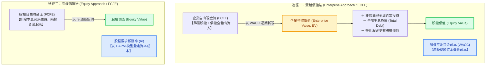

---
{"dg-publish":true,"permalink":"/98/dcf/","tags":["商業概念","財務管理","企業評價","證券評價","公司理財","資本預算","PMBA"],"dg-note-properties":{"aliases":["DCF","現金流量折現法","現金流量折現模型","折現現金流","折現現金流量法","Discounted Cash Flow","DCF估值模型","DCF模型"],"tags":["商業概念","財務管理","企業評價","證券評價","公司理財","資本預算","PMBA"]}}
---


# 現金流量折現法 (Discounted Cash Flow, DCF)

> 💡 **導航與索引**：本篇為企業內在價值評價之母法，亦可參閱折現率基礎 [[98_商業概念庫/weighted-average-cost-of-capital_加權平均資金成本\|加權平均資金成本 (WACC)]] 與分子引擎 [[98_商業概念庫/free-cash-flow-liang_自由現金流量\|自由現金流量 (FCF)]]、[[98_商業概念庫/enterprise-free-cash-flow-liang_企業自由現金流量\|企業自由現金流量 (FCFF)]]。

---

## 一、 核心定義與財務學哲學

- **現金流量折現法 (Discounted Cash Flow, DCF)** 是公司理財、資產定價、資本預算與證券評價中最基石的絕對估值方法（Absolute Valuation Methodology）。
- **內在價值本質（Intrinsic Value）**：
  任何資產或企業的真實內在價值，**等於其在未來存續期間內所能產生的全部預期自由現金流量，以反映該現金流時間價值與風險結構的適當折現率（Discount Rate）折算回當前的現值總和**。
- **古典價值哲學淵源**：
  - 約翰·伯爾·威廉斯（John Burr Williams, 1938）於經典著作《投資價值理論》（*The Theory of Investment Value*）中首度奠定現金流折現的數理基礎。
  - 華倫·巴菲特（Warren Buffett）將其奉為唯一符合邏輯的理性評價法則：「一家企業的價值，等於它在未來存續生命週期中所能產生的現金，以適當折現率折現後的現值總和。」
- **「會計利潤是意見，現金流才是事實 (Profit is an opinion, Cash is a fact)」**：
  會計淨利（Net Income）深受應計原則、收入認列時點、折舊年限與存貨計價等人為政策左右，甚至可能出現「帳面賺錢卻周轉不靈黑字倒閉」的流動性悲劇；唯有扣除必要維運資本支出後、具備真實實質購買力且可自由支配的**真金白銀自由現金流（Free Cash Flow）**，才是支撐企業償債、擴張與發放股利的實體基石。

---

## 二、 DCF 兩大評價途徑：實體價值法 (FCFF) vs. 股權價值法 (FCFE)

在公司理財實務中，依據現金流歸屬對象與對應折現率的不同，DCF 嚴謹區分為兩大路徑：



### 1. 實體價值法（Enterprise Valuation Approach / FCFF 模型，最主流首選）
- **評價邏輯**：先計算企業營運資產整體創造的現金流現值，再扣除非股權求償權。
- **折現對象**：**[[98_商業概念庫/enterprise-free-cash-flow-liang_企業自由現金流量\|企業自由現金流量 (FCFF)]]**。
- **折現率**：**[[98_商業概念庫/weighted-average-cost-of-capital_加權平均資金成本\|加權平均資金成本 (WACC)]]**。
- **計算結果**：**企業價值（Enterprise Value, EV）**。
- **股權價值過渡橋樑（Equity Value Bridge）**：
  $$\text{股權價值 (Equity Value)} = \text{EV} + \text{現金與非營業資產} - \text{生息負債 (Debt)} - \text{特別股} - \text{少數股權}$$
- **優勢**：當企業資本結構（負債比率）動態調整或正在積極去槓桿時，WACC 結構清晰穩定，不受債務融資現金流波動干擾。

### 2. 股權價值法（Equity Valuation Approach / FCFE 模型）
- **評價邏輯**：直接聚焦股東實際可拿到的現金流量進行折現。
- **折現對象**：**股權自由現金流量 (FCFE)**。
- **折現率**：**股權資金成本（Cost of Equity, $r_e$）**，通常以 CAPM 模型推估：$r_e = R_f + \beta \times (R_m - R_f)$。
- **計算結果**：直接得出**股權價值（Equity Value）**。
- **適用場景**：資本結構穩定、或金融業（如商業銀行、金控機構，其負債為營業原材料，無法精確區分 FCFF 與營運性負債）。

---

## 三、 數理架構與兩階段估值模型 (Two-Stage DCF Model)

企業不可能永無止境地享有超額增長，因此實務上普遍採用**「明確預測期 ＋ 永續終值」**之兩階段模型：

$$V_0 = \underbrace{\sum_{t=1}^{n} \frac{\text{CF}_t}{(1 + r)^t}}_{\text{階段一：明確預測期現值 (Forecast Period PV)}} + \underbrace{\frac{\text{TV}_n}{(1 + r)^n}}_{\text{階段二：終值折現現值 (Terminal Value PV)}}$$

### 1. 階段一：明確預測期（Forecast Period，通常設為 $n = 5 \sim 10$ 年）
- 對應台大 PMBA 課程強化的**朱格拉設備與資本支出週期（Juglar Cycle，約 7～10 年）**。
- 分析師需依據市場規模（[[98_商業概念庫/TAM\|TAM]]）、市占率成長路徑、毛利率與費用率展望，自下而上（Bottom-Up）預測每一年的營收、營業利益、稅負、營運資金變動與資本支出。

### 2. 階段二：終值（Terminal Value, $\text{TV}_n$）之兩大估算路徑

#### 路徑 A：戈登永續成長模型（Gordon Perpetual Growth Method）
$$\text{TV}_n = \frac{\text{CF}_{n+1}}{r - g} = \frac{\text{CF}_n \times (1 + g)}{r - g}$$
- **永續成長率 $g$ 的鐵律界限**：  
  $g$ 必須小於或等於企業所在經濟體的長期名目 GDP 成長率（實務上通常設定在 $1.5\% \sim 2.5\%$ 之間，或對齊長期通膨預期）。  
  ⚠️ **數理悖論警告**：若假設 $g > \text{GDP Growth}$，在無窮的時間軸上該企業產值將超越全人類 GDP 總和，屬於嚴重的模型失真！

#### 路徑 B：出場乘數法（Exit Multiple Method）
$$\text{TV}_n = \text{EBITDA}_n \times (\text{目標 EV/EBITDA 乘數})$$
- 採用所屬產業成熟期龍頭企業的歷史中位數乘數，常與戈登永續法交叉對照以提升估值穩健度。

### 3. 現金流量嚴格定義與推導公式

$$\begin{aligned}
\text{FCFF} &= \text{EBIT} \times (1 - T_c) + \text{折舊與攤銷 (D\&A)} - \text{資本支出 (CapEx)} - \Delta \text{非現金營運資金 (NWC)} \\
&= \text{NOPAT (稅後淨營業利益)} + \text{D\&A} - \text{CapEx} - \Delta \text{NWC}
\end{aligned}$$

$$\begin{aligned}
\text{FCFE} &= \text{FCFF} - [\text{利息費用} \times (1 - T_c)] + \text{淨發債 (新借借款 - 償還本金)} \\
&= \text{稅後淨利 (Net Income)} + \text{D\&A} - \text{CapEx} - \Delta \text{NWC} + \text{淨發債}
\end{aligned}$$

- **$\Delta\text{NWC}$（非現金營運資金增量）**：$= \Delta(\text{應收帳款} + \text{存貨}) - \Delta\text{應付帳款}$。營收擴張時通常為正，會形成現金的佔用與流出。
- **CapEx（資本支出）**：維持現有產能運轉與購置新生產設備之現金支出。

---

## 四、 課堂白板推導：景氣循環尺度、折現率敏感度與估值擠壓

結合《產業分析與投資策略》M1-2 與《創業與企業財務策略》白板決策精髓：

```text
三大景氣循環時間刻度與 DCF 預測之映射關係：
┌────────────────────────────────────────────────────────┐
│ 1. 基欽週期 (3~4年 短期存貨) ──▶ 切忌將補庫存單期暴利線性外推      │
│ 2. 朱格拉週期 (8~10年 設備CapEx) ──▶ 精確對接 DCF 5~10年明確預測期 │
│ 3. 康波長週期 (20~30年 技術革命) ──▶ 決定競爭優勢期與終值存續性     │
└────────────────────────────────────────────────────────┘
```

### 1. 穿透景氣循環迷霧，破除「線性外推」陷阱
- 許多分析師在**基欽週期（Kitchin Cycle）**高點（如 2021 年航運缺櫃、驅動 IC 缺料）將爆發性利潤直接年化作為未來 5 年的現金流，導致 DCF 模型算出天價估值；
- 殊不知 2～3 年後進入**朱格拉週期（Juglar Cycle）**新產能集中開出期，供給過剩引發價格崩跌，伴隨龐大折舊吞噬獲利，FCFF 驟降甚至轉負。因此，DCF 預測期必須完整覆蓋整個資本支出循環。

### 2. 門檻收益率（Hurdle Rate $= \text{WACC} + \alpha$）與非線性估值擠壓 (Valuation Compression)
- DCF 評價本質上具有**長久期（Long Duration）資產特性**。
- **升息循環下的幾何級數擠壓**：
  $$\text{PV}(\text{TV}) = \frac{\text{CF}_n(1+g)}{(r - g)(1 + r)^n}$$
  當折現率 $r$（無風險利率或風險溢酬）微幅上升（例如由 6% 上升至 9%），分母中的利差 $(r - g)$ 擴大，且複利折現因子 $(1 + r)^n$ 劇烈放大，導致佔比高達 70% 以上的終值現值遭遇**斷崖式萎縮（Valuation Compression）**。這深刻解釋了為何全球高成長科技股與生技股在央行緊縮週期中股價估值會大幅縮水。

---

## 五、 經理人決策洞察與實務治理盲點

### 1. 「垃圾進、垃圾出 (Garbage In, Garbage Out, GIGO)」與終值黑洞
- **終值敏感度陷阱**：在一般 5 年期 DCF 模型中，**終值佔整體企業價值的比例通常高達 65%～85%**。
- **經理人操縱空間**：只要稍微調整永續成長率 $g$（例如由 2% 微調至 2.5%），或將 WACC 調降 0.5%，企業估值便可憑空暴增 20%～40%。董事會審議併購案時，必須穿透此類「先設定目標併購價、再倒推貼現參數」的數字遊戲。

### 2. 打破 IRR 迷思：[[98_商業概念庫/NPV_淨現值法 _Net Present Value\|NPV 絕對金額優先原則]]
- 課堂白板特別警示：高階經理人在評估資本預算專案時，**千萬不可被高內部報酬率（IRR）所綁架**。
  - 專案甲：投資 1,000 萬，$\text{IRR} = 35\%$，$\text{NPV} = 300 \text{ 萬}$；
  - 專案乙：投資 10 億，$\text{IRR} = 15\%$，$\text{NPV} = 1.5 \text{ 億}$。
- 若兩專案互斥，為股東創造最大真實財富的必然是專案乙。DCF 與 NPV 的核心使命是最大化企業價值的**絕對增量**。

### 3. 忽視營運資金漏斗與資本支出黑洞
- 追求高營收成長而輕忽資產負債表管理，常使應收帳款與存貨大幅積壓（$\Delta\text{NWC} \gg 0$），形成「帳面獲利高速成長、FCFF 現金流持續失血」的虛胖體質；一旦景氣反轉，流動性危機隨之爆發。

---

## 六、 關聯主題與模組網絡

- 🧭 **課程核心模組對接**：
  - [[04_主題選修/12_產業分析與投資策略/02_模組筆記/Module_1_總論與架構/M1-2_三大景氣循環與資本評價邏輯\|M1-2 三大景氣循環與資本評價邏輯]]（DCF 內在價值模型、朱格拉週期、門檻收益率推導）
  - [[04_主題選修/10_創業與企業財務策略/02_模組筆記/Module_1_創新思維與商業模式/M1-2_白板決策鏈與財務價值三角\|M1-2 白板決策鏈與財務價值三角]]（折舊回沖機制、生命週期融資矩陣）
  - [[04_主題選修/10_創業與企業財務策略/02_模組筆記/Module_1_創新思維與商業模式/M1-10_七大市場力量與商業戰略價值公式\|M1-10 七大市場力量與商業戰略價值公式]]（7 Powers 經濟租金與資本價值傳導）
  - [[02_核心必修/01_財務管理/L02_基本財務報表與分析I\|L02 基本財務報表與分析I]]（財報三表勾稽、現金流流轉分析）
  - [[04_主題選修/12_產業分析與投資策略/00_課程導航與進度/mindmap_產業分析與投資策略_心智圖導航\|產業分析與投資策略 心智圖導航]] ｜ [[04_主題選修/10_創業與企業財務策略/00_課程導航與進度/mindmap_創業與企業財務策略_心智圖導航\|創業與企業財務策略 心智圖導航]]
- 🔗 **核心概念原子卡片**：
  - [[98_商業概念庫/weighted-average-cost-of-capital_加權平均資金成本\|加權平均資金成本 (WACC)]] ｜ [[98_商業概念庫/pvgo_成長機會現值\|成長機會現值 (PVGO)]]
  - [[98_商業概念庫/dividend-discount-model_股利折現模型\|股利折現模型 (DDM)]] ｜ [[98_商業概念庫/free-cash-flow-liang_自由現金流量\|自由現金流量 (FCF)]]
  - [[98_商業概念庫/enterprise-free-cash-flow-liang_企業自由現金流量\|企業自由現金流量 (FCFF)]] ｜ [[98_商業概念庫/return-on-invested-capital_資本投入報酬率\|資本投入報酬率 (ROIC)]]
  - [[98_商業概念庫/dupont-analysis_杜邦分析法\|dupont-analysis_杜邦分析法]] ｜ [[98_商業概念庫/sustainable-growth-rate_永續成長率\|永續成長率 (SGR)]]
  - [[98_商業概念庫/capital-expenditure_資本支出\|capital-expenditure_資本支出]] ｜ [[98_商業概念庫/internal-rate-of-return_內部報酬率\|內部報酬率 (IRR)]]
  - [[98_商業概念庫/NPV_淨現值法 _Net Present Value\|淨現值法 (NPV)]]
