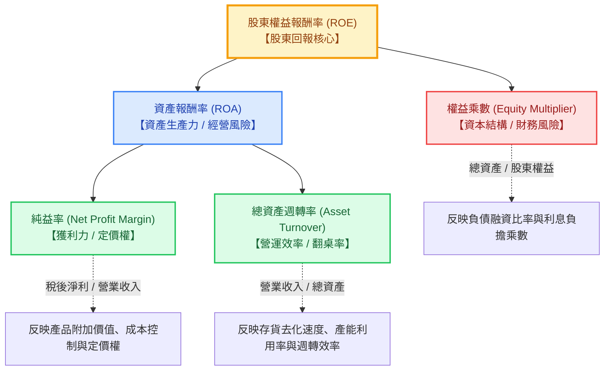
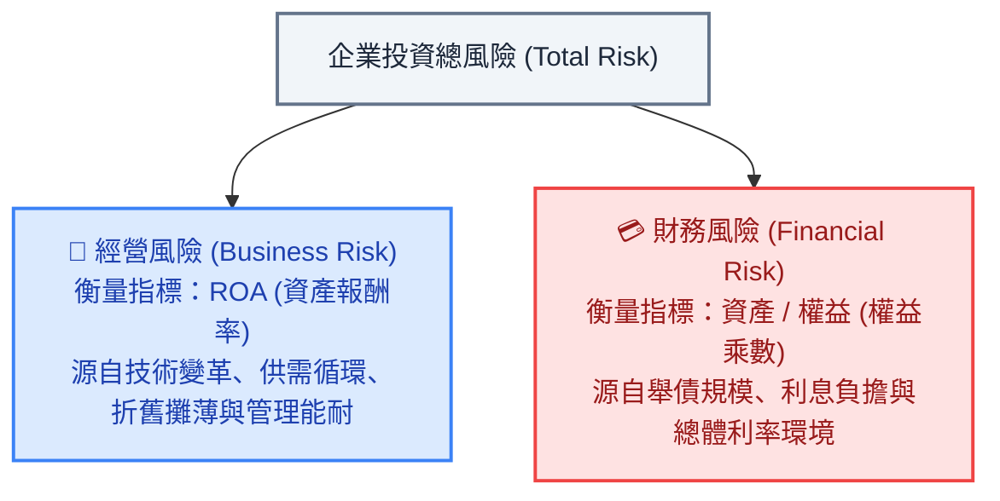

---
{"dg-publish":true,"permalink":"/98/dupont-analysis/","tags":["商業概念","財務管理","財務分析","經營能力分析","獲利能力分析","PMBA"],"dg-note-properties":{"aliases":["杜邦分析法","杜邦分析","杜邦恆等式","DuPont Analysis","DuPont Identity"],"tags":["商業概念","財務管理","財務分析","經營能力分析","獲利能力分析","PMBA"]}}
---

# 杜邦分析法 (DuPont Analysis & DuPont Identity)

## 一、 核心定義與本質

- **杜邦分析法 (DuPont Analysis)** 於 1914 年由美國杜邦公司（E.I. du Pont de Nemours and Company）財務經理唐納森·布朗（F. Donaldson Brown）首創，是財務管理與經營診斷中最經典的分析工具。
- **本質與哲學**：
  杜邦模型將綜合性股東回報指標 **[[98_商業概念庫/shareholder-equity-return-rate_股東權益報酬率\|股東權益報酬率]]（ROE）** 透過連鎖替代分解為互相關聯的三大（或五大）營運驅動因子。它深刻揭示了企業在**「產品定價與獲利力」**、**「資產營運效率（翻桌率）」**與**「財務槓桿政策」**之間的策略取捨，為經理人提供系統性的經營體檢框架。

---

## 二、 杜邦核心分析體系與數理推導

### 1. 經典杜邦三因子拆解 (3-Way DuPont Identity)

$$\text{ROE} = \frac{\text{稅後淨利}}{\text{股東權益}} = \left( \frac{\text{稅後淨利}}{\text{營業收入}} \right) \times \left( \frac{\text{營業收入}}{\text{總資產}} \right) \times \left( \frac{\text{總資產}}{\text{股東權益}} \right)$$

$$\text{ROE} = \text{純益率 (Net Margin)} \times \text{總資產週轉率 (Asset Turnover)} \times \text{權益乘數 (Equity Multiplier)}$$

$$\text{ROE} = \text{ROA (資產報酬率)} \times \text{權益乘數}$$

### 2. 擴充型杜邦五因子模型 (Extended 5-Way DuPont Model)
五因子模型進一步將企業「營業本業獲利」、「利息負擔」與「政府稅負」徹底分離，精確診斷獲利品質：

$$\text{ROE} = \left( \frac{\text{稅後淨利}}{\text{EBT}} \right) \times \left( \frac{\text{EBT}}{\text{EBIT}} \right) \times \left( \frac{\text{EBIT}}{\text{營業收入}} \right) \times \left( \frac{\text{營業收入}}{\text{總資產}} \right) \times \left( \frac{\text{總資產}}{\text{股東權益}} \right)$$

1. **稅負負擔率 (Tax Burden)** = $\frac{\text{稅後淨利}}{\text{EBT}}$：反映企業租稅規劃與實質所得稅率影響（$1 - \text{有效稅率}$）。
2. **利息負擔率 (Interest Burden)** = $\frac{\text{EBT}}{\text{EBIT}}$：反映負債利息對本業利潤的侵蝕程度（無負債時為 1.0，負債越重則越小於 1.0）。
3. **營業利益率 (Operating Margin)** = $\frac{\text{EBIT}}{\text{營收}}$：純粹衡量本業產品定價權、生產成本與營運管銷研發之控制力。
4. **總資產週轉率 (Asset Turnover)** = $\frac{\text{營收}}{\text{總資產}}$：衡量企業運用所有資產創造營業額的流轉效率。
5. **權益乘數 (Equity Multiplier)** = $\frac{\text{總資產}}{\text{股東權益}}$ = $\frac{1}{1 - \text{負債比率}}$：反映企業財務槓桿放大倍數。

---

## 三、 商業模式三大策略光譜

杜邦分析證明：商業世界中不存在單一獲勝路徑，企業可在三大商業模式原型中確立戰略定位：

| 戰略模式原型 | 杜邦核心特徵 | 代表性產業與企業 | 核心商業邏輯與管理要領 |
| :--- | :--- | :--- | :--- |
| **1. 高利潤溢價型 (High Margin)** | **高純益率 × 低週轉率 × 中低槓桿** | • 晶圓代工龍頭（台積電先進製程） • 科技巨頭（Apple） • 頂級奢侈品（愛馬仕、LVMH） • 原廠專利新藥（輝瑞） | 依託技術專利、品牌心智佔有率與[[economic-moat_經濟護城河|經濟護城河]]享有高額定價權。即使資本支出龐大導致週轉率平緩，仍能創造 25%~35% 以上的超額 ROE。 |
| **2. 高週轉薄利型 (High Turnover)** | **低純益率 × 高週轉率 × 中低槓桿** | • 量販量販店（Costco、Walmart） • 連鎖超商（統一超、全家） • 快時尚零售（Zara、Uniqlo） • 連鎖餐飲（翻桌率取向） | 純益率往往僅 2%～4%，但憑藉極致的供應鏈整合、庫存去化速度與低現金轉換週期（CCC），實現每年 3～5 次資產週轉，以「翻桌率」撬動高 ROE。 |
| **3. 高財務槓桿型 (High Leverage)** | **低純益率 × 低週轉率 × 極高槓桿** | • 商業銀行、金控機構 • 設備租賃公司 • 重資產不動產開發商 | 純益率與資產週轉率均低，主要仰賴吸收存款或發行長期公司債（權益乘數高達 10～15 倍），透過資本中介擴大股東報酬。 |

---

## 四、 產業雙重風險模型：經營風險 vs. 財務風險

課堂白板推導深入揭示杜邦公式背後的「雙重風險哲學」：

$$\text{企業總投資風險 (Total Risk)} = \underbrace{\text{ROA (經營風險)}}_{\text{產業與營運特性}} \times \underbrace{\text{權益乘數 (財務風險)}}_{\text{資本結構融資選擇}}$$

1. **經營風險（Business Risk，由 ROA 衡量）**：反映企業在不考慮資本結構舉債的情況下，純粹運用產業資產造血的實質能力。重資產製造業或高研發生技業本身承擔極高的經營風險。
2. **財務風險（Financial Risk，由權益乘數衡量）**：反映企業透過向債權人借貸放大利潤的程度。
3. **⚠️ 經典管理警示（槓桿毒藥與斷崖效應）**：
   - 當 $\text{ROA} > \text{借款利率}$ 時，舉債產生正向槓桿，股東享受超額報酬；
   - 一旦景氣下行、營收下滑導致 $\text{ROA} < \text{借款利率}$，負向槓桿將以數倍幅度撕裂股東權益，迅速擊穿利息保障倍數，引發流動性斷裂與破產危機（如 2008 年海運業或高槓桿房企崩解）。

---

## 五、 經理人思維與公司治理盲點

1. **高階經理人美化 ROE 的道德風險 (Moral Hazard)**：
   - 提升純益率需要數年技術攻關與品牌積累；提升週轉率需要重組跨國供應鏈與去庫存；
   - 然而，**拉高權益乘數只需「向銀行大舉借貸」或「借債買回庫藏股以壓縮淨資產分母」**，次日即可粉飾 ROE 達成 KPI。董事會必須穿透杜邦結構，嚴防經理人飲鴆止渴。
2. **庫存塞貨與應收帳款膨脹警訊**：
   - 當經理人為了衝刺短期業績強行向通路塞貨（Channel Stuffing）時，損益表純益率看似亮麗，但資產週轉率驟降、應收帳款天數（DSO）與存貨天數（DIO）激增，現金轉換週期（CCC）失控，往往預告隨後的巨額呆帳與存貨跌價損失。

---

## 六、 關聯主題與模組網絡

- 🧭 **課程核心模組對接**：
  - [[02_核心必修/01_財務管理/L02_基本財務報表與分析I|L02 基本財務報表與分析I]]（杜邦三因子與五因子擴充推導、商業模式三原型）
  - [[01_基礎先修/財務報表分析/Ch07_獲利能力分析|Ch07 獲利能力分析]]（ROE 三核動力引擎、連鎖替代法）
  - [[01_基礎先修/財務報表分析/Ch08_經營能力分析|Ch08 經營能力分析]]（資產週轉率與營業週期軸心）
  - [[04_主題選修/12_產業分析與投資策略/02_模組筆記/Module_1_總論與架構/M1-2_三大景氣循環與資本評價邏輯|M1-2 三大景氣循環與資本評價邏輯]]（杜邦雙重風險模型：經營風險 vs. 財務風險）
  - [[04_主題選修/10_創業與企業財務策略/02_模組筆記/Module_1_創新思維與商業模式/M1-10_七大市場力量與商業戰略價值公式|M1-10 七大市場力量與商業戰略價值公式]]（杜邦分析與 EVA 資本結構傳導）
  - [[mindmap_創業與企業財務策略_心智圖導航|創業與企業財務策略 心智圖導航]]
- 🔗 **核心概念原子卡片**：
  - [[return-on-invested-capital_資本投入報酬率]] ｜ [[pvgo_成長機會現值]] ｜ [[sva_股東價值增加|股東價值增加 (SVA)]]
  - [[wacc_加權平均資本成本|加權平均資金成本 (WACC)]] ｜ [[equity-cost_權益成本]]
  - [[sustainable-growth-rate_永續成長率]] ｜ [[earnings-per-share_每股盈餘]]
  - [[economic-moat_經濟護城河]] ｜ [[clv-customer-lifetime-value_顧客終身價值]]
