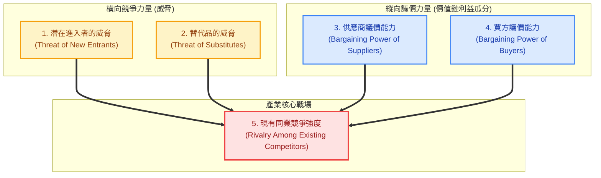

---
{"dg-publish":true,"permalink":"/98/five-forces-analysis/","tags":["商業概念","產業分析","策略管理","競爭策略","PMBA"],"dg-note-properties":{"aliases":["五力分析","波特五力分析","五力模型","Porter's Five Forces","Five Forces Analysis"],"tags":["商業概念","產業分析","策略管理","競爭策略","PMBA"]}}
---


# 波特五力分析 (Porter's Five Forces Analysis)

## 一、 核心定義與經濟學本質

- **波特五力分析 (Porter's Five Forces)** 由哈佛商學院麥可·波特（Michael E. Porter, 1979, 2008）提出，奠基於產業組織經濟學（Industrial Organization）的 **SCP 典範（Structure-Conduct-Performance）**。
- **產業獲利天花板本質**：
  決定一個產業長期平均資本回報率（ROIC）與吸引力的，並非短期的景氣循環、產品熱潮或管理層運氣，而是**五種基本競爭力量的綜合強度（The Collective Strength of Five Forces）**。
  - **五力越強大**：產業利潤池被上下游、替代品、新進者與同業多方侵蝕，全體廠商陷入低毛利微利困境。
  - **五力越弱小**：產業結構寬鬆，廠商普遍享有結構性的超額經濟利潤（Economic Rents）。
- **審視五力的「內外雙重視角（Two-Way Perspective）」**：
  - **產業內既有者視角**：關注自身的**「定價話語權（Pricing Power）」**與防禦利潤遭外部掠奪的能力。
  - **產業外潛在進入者視角**：關注產業的**「超額獲利能力（Profitability）」**。當某一產業享有超常暴利，即使進入門檻高，也會成為吸引外部充沛資本跨界掠奪的「血腥誘餌」；既有者唯有持續拉高技術或重置壁壘，才能將誘惑轉化為真正的威懾。

---

## 二、 五大結構性力量深度解構



### 1. [[98_商業概念庫/potential-entrants_潛在進入者\|潛在進入者的威脅]] (Threat of New Entrants)
- **破壞機制**：新進者往往攜帶龐大資本、新產能與掠奪市占的野心，必然迫使既有者削價防守或大幅增加研發行銷費用，壓低產業利潤。
- **決定進入威脅的六大壁壘（Entry Barriers）**：
  1. **[[98_商業概念庫/economies-of-scale_規模經濟\|economies-of-scale_規模經濟]]**：既有廠商以巨大銷量分攤固定資產與研發成本；新進入者若以小規模切入將承受單位成本劣勢，若以大規模切入則引發產能過剩與強烈報復。
  2. **資本需求門檻**：建廠、研發與設備投資所需的不可逆沉沒資本（如先進製程晶圓廠百億美元投資）。
  3. **顧客[[98_商業概念庫/switching-costs_轉換成本\|轉換成本]]**：客戶更換廠商所承擔的技術相容、數據遷移、合約違約與人員培訓成本。
  4. **銷售通路排他性**：既有巨頭透過長期排他合約或高額進場費（Slotting Fees）鎖死黃金實體與數位通路。
  5. **專屬性成本優勢**：與規模無關的先發優勢（專利佈局、最佳地理區位、獨家原料、[[98_商業概念庫/experience-curve_經驗曲線與學習曲線\|學習曲線]]）。
  6. **政府法規與特許政策**：執照管制、環境安規、藥證查驗登記（如 FDA、PIC/S GMP）。
- **延伸經濟學：可競爭市場（Contestable Market - Baumol）**：
  若市場進出障礙接近於零（無沉沒成本，進入者可 Hit-and-Run），即使當前為高度集中甚至單一獨占，獨占者亦不敢開出暴利，必須維持競爭性定價以防外部資本隨時切入套利。

### 2. [[98_商業概念庫/threat-of-substitutes_替代品威脅\|替代品的威脅]] (Threat of Substitutes)
- **定義與本質**：來自**「不同產業」**，但能夠滿足顧客**「相同核心功能需求」**的產品或服務（如：台灣高鐵替代國內民航線；Zoom 視訊會議替代跨國商務飛行）。
- **關鍵驅動與衝擊**：
  - **設定產業價格天花板 (Price Ceiling)**：替代品是利潤的隱形殺手，一旦既有產品漲價，需求將大規模外流至替代品賽道。
  - **相對性價比突破**：異業新技術（如固態電池、生成式 AI）性能以指數級提升且成本暴跌時，將引發雪崩式跨界替代。
  - **防禦策略**：既有龍頭必須提早佈局第二成長曲線，進行自我顛覆式轉型（如蘋果佈局穿戴裝置防禦智慧型手機被替代）。

### 3. [[98_商業概念庫/bargaining-power-of-buyers_買方議價能力\|買方的議價能力]] (Bargaining Power of Buyers)
- **實質衝擊**：強勢買方透過**壓低採購價格、延長付款帳期（DSO）、索求額外客製服務**，大幅擠壓賣方毛利。
- **買方強勢之觸發條件**：
  1. **買方集中度極高**：少數大客戶貢獻絕大部分營收（如 Apple 對零組件供應商）。
  2. **產品標準化無差異**：買方轉單成本極低。
  3. **採購支出佔買方成本比重極高**：買方對價格高度敏感，錙銖必較。
  4. **具備[[98_商業概念庫/backward-integration_後向整合\|後向整合能力]]**：買方有實力自行研發製造（如雲端 CSP 巨頭自研 ASIC 晶片威脅外購晶片商）。
  5. **極端案例：單一買方體制（Monopsony）**：如台灣健保署對處方藥廠掌控全額預算與藥價核定權，造成傳統學名藥廠議價力微乎其微。

### 4. [[98_商業概念庫/bargaining-power-of-suppliers_供應商議價能力\|供應商的議價能力]] (Bargaining Power of Suppliers)
- **實質衝擊**：強勢供應商透過**強制提價、配額配售、轉嫁通膨成本、降低交貨彈性**，將產業利潤洗劫向上游。
- **供應商強勢之觸發條件**：
  1. **供應商集中度遠高於買方產業**：少數寡占原廠主宰（如 ASML 之於 EUV 曝光機、NVIDIA 之於 AI 高階 GPU）。
  2. **原料或零組件具備不可替代之專利與技術專屬性**。
  3. **轉換供應商之驗證代價極高**：重新認證需耗時數年且面臨斷料風險。
  4. **具備[[98_商業概念庫/forward-integration_前向整合\|前向整合威脅]]**：供應商具備直接跨足下游終端產品的能力。

### 5. [[98_商業概念庫/existing-competitors_現有競爭者\|現有同業競爭強度]] (Rivalry Among Existing Competitors)
- **破壞機制**：業內競爭是利潤的最直接毀滅者。競爭白熱化引發慘烈價格戰與龐大行銷廣告軍備競賽，直接重挫 ROE 與 ROIC。
- **白熱化競爭之五大結構性誘因**：
  1. **勢均力敵的競爭者眾多**：無具備絕對威懾力的領導者，易引發爭奪霸權混戰。
  2. **產業成長陷入停滯**：增量市場消失，淪為殘酷的零和博弈（Zero-Sum Game）。
  3. **高固定成本與高庫存持有成本**：景氣下滑時，廠商為分攤折舊、填補產能利用率而瘋狂削價拋售（如成熟製程晶圓、石化、貨櫃海運）。
  4. **產品同質化與缺乏差異**：缺乏品牌溢價與護城河，價格成為唯一決策標準。
  5. **高[[98_商業概念庫/exit-barriers_退出障礙\|退出障礙]] (High Exit Barriers)**：
     - 專用性資產無法轉售變現、清算資遣補償沉重、政府政治力阻止關廠。虧損企業因「死不起」而長期滯留市場，使全行業承受漫長產能過剩折磨（如鋼鐵、水泥、老牌車廠）。

---

## 三、 市場結構量化指標與實務評估模型

商管決策嚴禁僅停留在主觀定性描述，必須透過客觀數據與模型量化產業結構：

### 1. 產業集中度指標（Concentration Ratio & HHI）

| 指標名稱 | 計算公式 | 判讀準則與主管機關反托拉斯標準 |
| :--- | :--- | :--- |
| **產業集中度<br>($CR_n$)** | $$CR_n = \sum_{i=1}^{n} S_i$$<br>*(前 $n$ 大廠商市占總和)* | • $CR_4 > 60\%$：高度寡占市場，龍頭具備默契定價力。<br>• $40\% \le CR_4 \le 60\%$：中度寡占市場。<br>• $CR_4 < 40\%$：競爭型或完全競爭市場。 |
| **赫芬達爾指數<br>($\text{HHI}$)** | $$\text{HHI} = \sum_{i=1}^{N} (S_i \times 100)^2$$<br>*(市占率平方和，介於 0~10,000)* | • **平方加權特徵**：對龍頭廠商超級規模優勢極度敏感。<br>• $\text{HHI} < 1,500$：低度集中。<br>• $1,500 \le \text{HHI} \le 2,500$：中度集中。<br>• $\text{HHI} > 2,500$：高度集中（美司法部 DOJ 嚴格審查併購）。 |

### 2. 五力雷達圖量化評估 (Five Forces Radar Matrix)
以 1～5 分客觀評估五大力量強度（數值越高代表力量越強、對產業利潤侵蝕越嚴重）：
- **台灣製藥產業五力雷達圖實例**：
  - 買方議價力：**4.2 分**（健保單一買方砍價）
  - 現有競爭強度：**3.8 分**（學名藥同質廝殺）
  - 潛在進入威脅：**3.2 分**（PIC/S GMP 法規壁壘但外商具威脅）
  - 供應商議價力：**2.5 分**（原料藥全球來源分散）
  - 替代品威脅：**2.0 分**（處方西藥具療效驗證難以直接替代）
  - 👉 **結論**：整體產業平均 ROIC 受買方與同業強烈壓抑，純傳統學名藥廠難以享有高資本回報。

### 3. 從五力推導關鍵成功因素 (Key Success Factors, KSF)
```
Step 1: 外部要素盤點 ──▶ 篩選 20~25 項關鍵競爭要素
Step 2: 專家權重賦予 ──▶ 透過德爾菲法 (Delphi) 給予重要性權重
Step 3: 競爭激烈度打分 ──▶ 依客觀量化指標評定競爭烈度 (1~5 分)
Step 4: 加權計量評估 ──▶ 計算各要素加權總分 (權重 × 評分)
Step 5: 優先順序精煉 ──▶ 精煉出主宰產業勝負的「前 5~9 項核心 KSF」
```

---

## 四、 理論盲點與企業四大反制戰略

### 1. 五力架構的理論盲點與學術批判
1. **靜態橫斷面盲點 (Static Blind Spot)**：五力模型呈現的是產業結構的「靜態快照」，無法預測技術點突變、跨界降維打擊與政策突變。
2. **零和博弈偏誤 (Zero-Sum Fallacy)**：假設利潤池固定、各方彼此殘殺；忽略了企業可透過**「[[98_商業概念庫/complementary-goods_互補品\|complementary-goods_互補品]]」**與**「[[98_商業概念庫/strategy-coopetition_競合戰略 Coopetition\|競合戰略]]」**將整體產業利潤池做大（正和博弈）。
3. **廠商同質化假設 (Firm Homogeneity)**：五力模型偏向外部決定論；然而**資源基礎觀點 (RBV)** 證實，同產業內部因企業核心資源與動態能耐（VRIO）不同，獲利能力呈現天壤之別（如台積電 vs 聯電）。

### 2. 企業反制五力壓迫的四大戰略路徑

| 戰略路徑 | 核心作為 | 企業實證代表案例 |
| :--- | :--- | :--- |
| **1. 防禦定位<br>(Positioning)** | 尋找五力壓迫最微弱的利基賽道或競爭空白區，避開正面交火。 | **寶雅 (POYA)**：避開超商與量販紅海，鎖定美妝雜貨高坪效利基，創造高 ROE。 |
| **2. 重塑結構<br>(Reshaping)** | 主動發動戰略併購提升集中度、拉高顧客轉換成本或進行垂直整合。 | **台積電**：自研 CoWoS 先進封裝跨越封測邊界；**保瑞藥業**：併購國際廠拉高集中度。 |
| **3. 利用變革<br>(Exploiting)** | 順應新技術或法規轉折，在進入壁壘瓦解時搶先佔據制高點。 | **廣達**：由低毛利 NB 代工果斷跨足 CSP 白牌 AI 伺服器，完成產業躍遷。 |
| **4. 生態共生<br>(Ecosystem)** | 導入價值網理念，扶植互補品，結合策略聯盟打破單向對抗。 | **蘋果 iOS 生態圈**：扶植數百萬開發者互補品，大幅提升硬體黏著度與服務利潤。 |

---

## 五、 關聯主題與模組網絡

- 🧭 **課程核心模組對接**：
  - [[04_主題選修/12_產業分析與投資策略/02_模組筆記/Module_1_總論與架構/M1-5_波特五力分析與量化架構\|M1-5 波特五力分析與量化架構]]（完整模組筆記：五力雷達圖、台灣製藥實證、分析工具四象限演化矩陣）
  - [[04_主題選修/12_產業分析與投資策略/02_模組筆記/Module_1_總論與架構/M1-3_產業獲利結構差異與十大經典理論\|M1-3 產業獲利結構差異與十大經典理論]]（哈佛學派 SCP 典範由上而下決定論）
  - [[04_主題選修/12_產業分析與投資策略/02_模組筆記/Module_1_總論與架構/M1-6_產業分析模式與九大分析工具矩陣\|M1-6 產業分析模式與九大分析工具矩陣]]（產業結構層至企業層分析工具鏈）
  - [[04_主題選修/12_產業分析與投資策略/02_模組筆記/Module_1_總論與架構/M1-7_產業市場空間與策略群組\|M1-7 產業市場空間與策略群組]]（群組層級五力非均質分佈與移動障礙）
  - [[04_主題選修/12_產業分析與投資策略/00_課程導航與進度/mindmap_產業分析與投資策略_心智圖導航\|產業分析與投資策略 心智圖導航]]
- 🔗 **核心概念原子卡片**：
  - [[98_商業概念庫/potential-entrants_潛在進入者\|potential-entrants_潛在進入者]] ｜ [[98_商業概念庫/barriers-to-entry_進入障礙\|barriers-to-entry_進入障礙]] ｜ [[98_商業概念庫/economies-of-scale_規模經濟\|economies-of-scale_規模經濟]]
  - [[98_商業概念庫/threat-of-substitutes_替代品威脅\|threat-of-substitutes_替代品威脅]] ｜ [[98_商業概念庫/switching-costs_轉換成本\|switching-costs_轉換成本]]
  - [[98_商業概念庫/bargaining-power-of-buyers_買方議價能力\|bargaining-power-of-buyers_買方議價能力]] ｜ [[98_商業概念庫/backward-integration_後向整合\|backward-integration_後向整合]]
  - [[98_商業概念庫/bargaining-power-of-suppliers_供應商議價能力\|bargaining-power-of-suppliers_供應商議價能力]] ｜ [[98_商業概念庫/forward-integration_前向整合\|forward-integration_前向整合]]
  - [[98_商業概念庫/existing-competitors_現有競爭者\|existing-competitors_現有競爭者]] ｜ [[98_商業概念庫/exit-barriers_退出障礙\|exit-barriers_退出障礙]] ｜ [[98_商業概念庫/market-concentration_市場集中度\|market-concentration_市場集中度]]
  - [[98_商業概念庫/value-net_價值網\|value-net_價值網]] ｜ [[98_商業概念庫/strategy-coopetition_競合戰略 Coopetition\|strategy-coopetition_競合戰略 Coopetition]] ｜ [[98_商業概念庫/complementary-goods_互補品\|complementary-goods_互補品]]
  - [[98_商業概念庫/value-curve_價值曲線\|value-curve_價值曲線]] ｜ [[98_商業概念庫/economic-moat_經濟護城河\|economic-moat_經濟護城河]]
  - [[98_商業概念庫/bo-te-five-forces-analysis_波特五力分析\|bo-te-five-forces-analysis_波特五力分析]]
