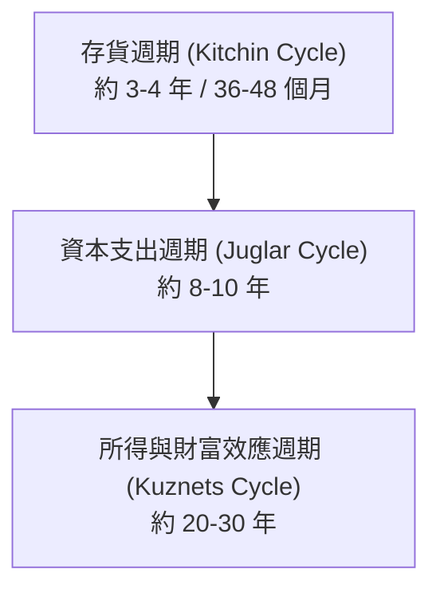

---
{"dg-publish":true,"permalink":"/98/san-da-economics-xun-huan-cycle/","tags":["商業概念","總體經濟","產業分析"],"dg-note-properties":{"aliases":["經濟循環週期","三層經濟循環","庫存與資本支出週期"],"tags":["商業概念","總體經濟","產業分析"]}}
---

# 三大經濟循環週期

## 📌 概念定義
在總體經濟與產業評估中，產業景氣受到三層不同時間跨度的循環週期交疊驅動：

---

## 📊 三大週期解析

### 1. 存貨週期 / 基欽週期 (Kitchin Cycle)
* **週期長度**：約 **3~4 年（36~48 個月）**。
* **核心驅動**：廠商去庫存與補庫存的短期供需波動。

### 2. 資本支出週期 / 朱格拉週期 (Juglar Cycle)
* **週期長度**：約 **8~10 年**。
* **核心驅動**：企業設備更新、廠房建置與大規模產能擴張週期（如半導體晶圓廠建廠）。

### 3. 所得與財富效應週期 / 庫茲涅茨週期 (Kuznets Cycle)
* **週期長度**：約 **20~30 年**。
* **核心驅動**：房地產、人口結構變化與長期財富累積帶動的耐久財消費週期。

---

## 🔗 相關概念
* [[jing-qi-xun-huan_景氣循環]]
* [[industry-ping-jia-yu-valuation-indicator-valuation-metrics_產業評價與估值指標 Valuation Metrics]]
