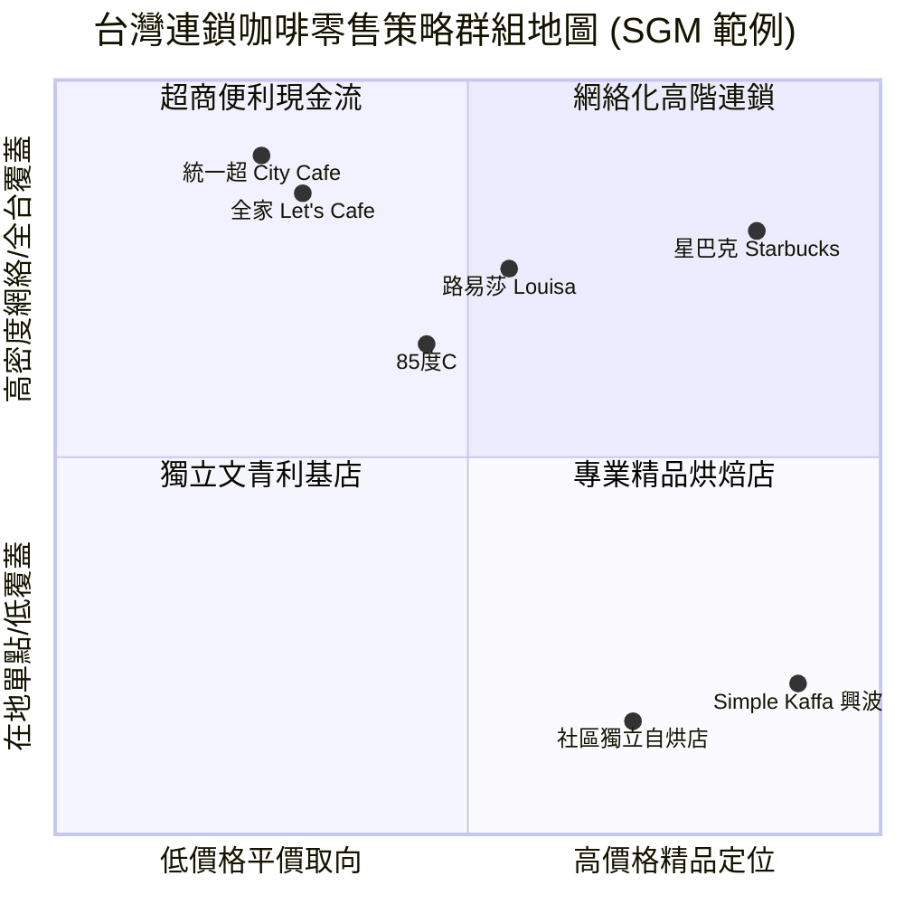

---
{"dg-publish":true,"permalink":"/98/strategic-groups-strategic-groups-strategic-groups/","tags":["商業概念","產業分析","策略管理","競爭策略","PMBA"],"dg-note-properties":{"aliases":["策略群組","Strategic Groups","戰略群組","策略群組地圖","SGM","移動障礙","Mobility Barriers"],"tags":["商業概念","產業分析","策略管理","競爭策略","PMBA"]}}
---


# 策略群組 (Strategic Groups & Mobility Barriers)

## 一、 核心定義與理論淵源

- **策略群組 (Strategic Groups)** 最初由麥可·亨特（Michael S. Hunt, 1972）於美國家電產業研究中提出，後由邁克爾·波特（Michael E. Porter, 1979, 1980）與凱夫斯（Caves & Porter, 1977）正式確立為競爭戰略的核心分析基石。
- **學術定義**：
  策略群組是指在**同一個產業當中，在關鍵策略操作構面上採用相同或相似策略組合、具備相近資源配置的一組企業集合**。
- **經濟學理論本質（彌補產業組織理論缺陷）**：
  - 傳統哈佛學派 SCP 典範預設同產業廠商具備「同質性（Homogeneity）」，認為外部結構（波特五力）決定所有廠商的命運。
  - 然而實證研究顯示：**身處完全相同五力結構下的廠商，其資本投入回報率（ROIC）與股東權益報酬率（ROE）依然存在長期且懸殊的差距**。
  - 策略群組是連接「外部巨觀產業結構（五力分析）」與「微觀企業內部資源能耐（RBV / VRIO）」的中層關鍵樞紐，解釋了**產業內微觀異質性（Intra-Industry Heterogeneity）**與超額利潤池的分配邏輯。

---

## 二、 策略群組地圖 (Strategic Group Mapping, SGM) 與繪製標準

策略群組地圖（SGM）是將產業內複雜的多邊競爭關係進行「空間二維降維視覺化」的經典工具。



### 1. 繪製 SGM 的四步標準作業流程
```
Step 1: 變數篩選 ──▶ 挑選 2 項最關鍵且互不相關（正交性 Orthogonal）的核心策略變數 (X 軸與 Y 軸)
Step 2: 廠商分群 ──▶ 將策略定位、資源配置與營運模式相近之企業歸入同一群組
Step 3: 氣泡繪製 ──▶ 繪製群組氣泡，圓圈面積代表該群組在產業中的「整體營收市占率」
Step 4: 空間剖析 ──▶ 測算各群組間的「策略距離 (Strategic Distance)」與未被滿足的「競爭空白區 (White Space)」
```

### 2. 座標軸選取關鍵戒律
- 嚴禁選取**高度正相關之變數**（如：不能同時選「價格高低」與「品質高低」，因為高定價通常伴隨高規格，圖形會退化為 45 度對角線，失去分群意義）。
- 必須選取**決定產業成敗的策略作為（Strategic Conduct）**（如：航空業選「航網模式（樞紐 vs. 點對點）」與「服務層級」；半導體選「資本密集度 (CapEx)」與「技術節點領先性」）。

### 3. 策略操作的 13 大關鍵構面
企業劃分策略群組時，通常依據以下 13 項具體競爭構面：
1. 專業化程度（Specialization） 2. 品牌認同度（Brand Identification） 3. 推拉行銷策略（Push vs. Pull） 4. 通路選擇（Channel Selection） 5. 產品品質水準（Product Quality） 6. 技術領導地位（Technological Leadership） 7. 垂直整合程度（Vertical Integration） 8. 成本地位（Cost Position） 9. 顧客服務深度（Service） 10. 定價政策（Pricing Policy） 11. 財務槓桿（Leverage） 12. 母公司關係（Parent Relationship） 13. 地緣政商關係（Governmental Relations）。

---

## 三、 移動障礙 (Mobility Barriers) 與群組利潤池防禦

邁克爾·波特指出：**「移動障礙之於策略群組，正如進入障礙之於整個產業。」**

- **定義**：阻止企業從某一個策略群組跨越進入另一個獲利更高之策略群組的結構性壁壘。
- **經濟學意涵**：
  - **移動障礙愈高，該群組長期享有的超額報酬（Economic Rents）愈穩固**。
  - 若群組缺乏移動障礙，低階群組同業會迅速模仿跟進，群組超額利潤將在短時間內被迅速均等化。
  - 單純依靠日常營運效率（Operational Effectiveness）無法跨越移動障礙；唯有**顛覆性商業模式創新（BMI）**或[[98_商業概念庫/value-curve_價值曲線\|價值曲線]]突破方能實現跨越。

### 防禦群組利益的七大移動障礙體系

| 移動障礙構面 | 結構性壁壘本質 | 跨越代價與阻力 | 產業實例 |
| :--- | :--- | :--- | :--- |
| **1. 規模經濟** | 特定群組營運模式下的最小有效規模（MES）。 | 新進者產能不足面臨劇烈單位成本劣勢；大規模進入則引發產能過剩。 | 台積電先進製程晶圓廠百億美元規模優勢。 |
| **2. 產品差異化與品牌** | 長年累積的顧客心智佔有率與商譽資產。 | 需投入巨額沉沒成本以克服消費者的心理偏好與品牌忠誠。 | 勞力士、愛馬仕頂級奢品之歷史品牌溢價。 |
| **3. 資本需求門檻** | 進入特定高階群組所需之專屬性不可逆資產投資。 | 承擔龐大沉沒資本風險與融資利息負擔。 | 傳統樞紐航空公司全球客機機隊採購與自建物流冷鏈。 |
| **4. 顧客轉換成本** | 客戶更換至新群組產品時產生的相容性與學習障礙。 | 需補貼客戶違約金、提供免費系統遷移並承擔試錯風險。 | 企業更換 SAP / Oracle 等核心 ERP 系統。 |
| **5. 通路取得排他性** | 既有群組透過長期排他合約或進場費鎖死黃金通路。 | 新進者難以上架，被迫承擔自建直營通路的龐大推廣成本。 | 可口可樂、統一超商對黃金貨架的長期壟斷。 |
| **6. 專屬成本優勢** | 與規模無關的專利池、封閉生態系與經驗學習曲線。 | 侵權訴訟風險、高額授權費、難以逆向工程之配方製程。 | NVIDIA CUDA 軟硬體綁定生態系與專利池。 |
| **7. 法規與特許政策** | 政府特許牌照管制、航權時間帶（Slots）、碳配額限制。 | 行政審批週期漫長、政商遊說門檻、甚至具備法定數量排他。 | 樞紐機場熱門登機時間帶、金融特許銀行執照。 |

---

## 四、 群組層級五力與動態演化四部曲

### 1. 群組層級五力（五力的非均質分佈）
波特五力在同一個產業內部並非均勻分佈：
- **高階群組（如高專利原廠藥、樞紐全服務航空）**：面對極低買方議價力與極高移動障礙，享有定價特權與寬廣利潤安全邊際。
- **低階群組（如平價學名藥、代工組裝廠）**：面對單一買方強烈砍價、低技術壁壘與同質化殺價，深陷割喉紅海。

### 2. 策略群組演化四部曲 (Dynamic Evolution)
```
1. 異化 (Differentiation) ──▶ 個別先驅者在環境變遷下採取相異創新策略（如 Southwest 早期開創點對點航線）
            ▼
2. 同化 (Assimilation)   ──▶ 其他同業見其超額利潤豐厚，蜂擁效仿跟進，形成同質新梯隊
            ▼
3. 融合 (Integration)    ──▶ 新梯隊內部建立起特定的供應鏈規範與標準，逐步構築專屬移動障礙
            ▼
4. 分殖 (Speciation)     ──▶ 群組向外擴張並搶佔傳統群組利潤池，正式成為產業主流策略群組
```

### 3. 競爭空白區 (White Space) 的真偽辨識
策略群組地圖上看到的無人佔據之處，必須審慎檢驗：
- **真藍海（True White Space）**：潛在需求巨大，但因過往技術不成熟或商業思維受限而未被開拓，可透過[[98_商業概念庫/value-curve_價值曲線\|價值曲線]]切入開創。
- **經濟死地（Economic Graveyard）**：看似無人競爭，但背後缺乏商業獲利邏輯、TAM 空間極微、或單位成本永遠無法被定價所覆蓋的「陷阱區」。

---

## 五、 跨產業代表性標竿案例對標

### 1. 美國國內航空業對標（解除管制後的兩大極端群組）
- **群組 A：傳統樞紐輻射航網巨頭 (Hub-and-Spoke)**（Delta、United、American）
  - *策略配置*：寬窄體混合機隊、全球樞紐機場中轉、多艙等服務、複雜會員里程計劃。
  - *移動障礙*：樞紐登機門時間帶排他、全球航線聯盟、龐大機隊資本。
- **群組 B：點對點低成本航空 (LCC)**（Southwest Airlines）
  - *策略配置*：全波音 737 單一機型、二級機場直飛、單一艙等、極致縮短地面週轉時間（< 25 分鐘）。
  - *移動障礙*：敏捷高效組織文化、極低資產營運單位成本、長期燃油避險合約能力。

### 2. 全球製藥產業對標（專利與價格定位劃分）
- **群組 A：高專利原廠藥 (Ethical / Innovative Pharma)**（默沙東 Merck、輝瑞 Pfizer）
  - 研發支出佔營收 15%~20%，承擔三期臨床失敗風險，享有 20 年專利壟斷定價特權，毛利率 > 80%。
- **群組 B：一般學名藥與 OTC (Generic Drugs)**（Eli Lilly 部分事業、各國在地學名藥廠）
  - 研發支出 < 5%，專利過期後快速進行生物等效（BE）逆向工程，依賴健保單一買方給付，價格敏感度極高。

---

## 六、 高階經理人實戰決策工具箱 (9-Question Checklist)

當企業管理階層評估是否跨越既有群組、或防禦現有群組時，應檢核九大關鍵問句：

1. **群組辨識**：我們身處的策略群組，核心競爭條件取決於產品規格、顧客價值，還是專屬性資產？
2. **利潤池移轉**：產業利潤池是否正向特定策略群組快速轉移？（如組裝廠向 GPU 運算板轉移）
3. **障礙侵蝕**：隔絕本群組的七大移動障礙中，哪一項正被新技術（如生成式 AI）削弱？
4. **跨越代價**：跨入高階群組所需的沉沒資本（研發/品牌），預期 IRR 是否實質覆蓋門檻收益率？
5. **同業報復**：若跨入目標群組，該群組既有龍頭的價格與產能報復烈度有多大？
6. **顧客摩擦**：目標群組顧客是否存在高轉換成本？我們是否具備顯著的[[98_商業概念庫/value-curve_價值曲線\|價值曲線]]突破點？
7. **空白區真偽**：SGM 地圖上看到的競爭空白區，究竟是潛在藍海還是經濟死地？
8. **演化階段**：目標群組處於異化、同化、融合還是分殖階段？我們是先發者還是後進者？
9. **退路規劃**：若跨越失敗，專用固定資產是否具備退出障礙或轉用價值？

---

## 七、 關聯主題與模組網絡

- 🧭 **課程核心模組對接**：
  - [[04_主題選修/12_產業分析與投資策略/02_模組筆記/Module_1_總論與架構/M1-7_產業市場空間與策略群組\|M1-7 產業市場空間與策略群組]]（完整課程模組筆記：13 策略構面、集群分析計量驗證、決策工具箱）
  - [[04_主題選修/12_產業分析與投資策略/02_模組筆記/Module_1_總論與架構/M1-5_波特五力分析與量化架構\|M1-5 波特五力分析與量化架構]]（五力在群組層級之非均質分佈）
  - [[04_主題選修/12_產業分析與投資策略/02_模組筆記/Module_1_總論與架構/M1-6_產業分析模式與九大分析工具矩陣\|M1-6 產業分析模式與九大分析工具矩陣]]（SGM 在產業九大分析工具鏈中的定位）
  - [[04_主題選修/12_產業分析與投資策略/00_課程導航與進度/mindmap_產業分析與投資策略_心智圖導航\|產業分析與投資策略 心智圖導航]]
- 🔗 **核心概念原子卡片**：
  - [[98_商業概念庫/bo-te-five-forces-analysis_波特五力分析\|bo-te-five-forces-analysis_波特五力分析]] ｜ [[98_商業概念庫/barriers-to-entry_進入障礙\|barriers-to-entry_進入障礙]] ｜ [[98_商業概念庫/exit-barriers_退出障礙\|exit-barriers_退出障礙]]
  - [[98_商業概念庫/value-curve_價值曲線\|value-curve_價值曲線]] ｜ [[98_商業概念庫/switching-costs_轉換成本\|switching-costs_轉換成本]] ｜ [[98_商業概念庫/economies-of-scale_規模經濟\|economies-of-scale_規模經濟]]
  - [[98_商業概念庫/product-differentiation_產品差異化\|product-differentiation_產品差異化]] ｜ [[98_商業概念庫/economic-moat_經濟護城河\|economic-moat_經濟護城河]] ｜ [[98_商業概念庫/SCP模型\|SCP模型]]
