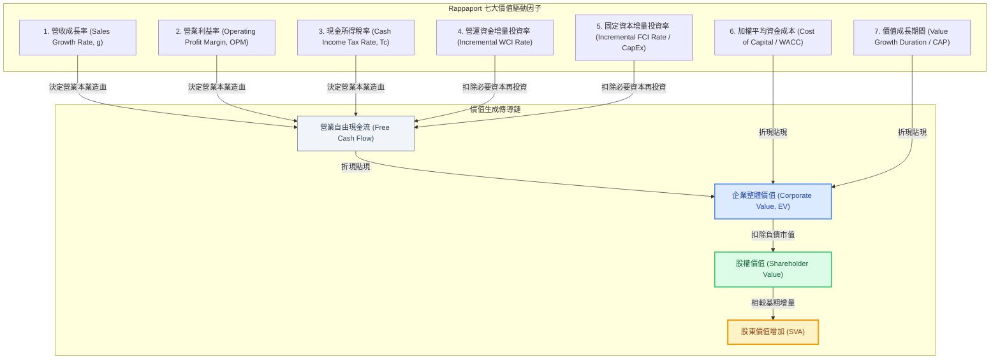

---
{"dg-publish":true,"permalink":"/98/sva/","tags":["商業概念","財務管理","價值管理","公司理財","企業評價","策略管理","PMBA"],"dg-note-properties":{"aliases":["SVA","Shareholder Value Added","股東價值增加","股東附加價值","股東價值增創","股東價值創造","拉帕波特股東價值模型","Rappaport SVA"],"tags":["商業概念","財務管理","價值管理","公司理財","企業評價","策略管理","PMBA"]}}
---

# 股東價值增加 (Shareholder Value Added, SVA)

> 💡 **導航與索引**：本篇為價值導向管理（VBM）與策略估值之核心工具，亦可參閱評價母法 [[98_商業概念庫/dcf_現金流量折現法\|DCF 現金流量折現法]]、資本預算黃金標準 [[98_商業概念庫/NPV_淨現值法 _Net Present Value\|淨現值法 (NPV)]]、資本折現基準 [[98_商業概念庫/wacc_加權平均資本成本\|加權平均資金成本 (WACC)]] 與資本運用效率 [[98_商業概念庫/return-on-invested-capital_資本投入報酬率\|資本投入報酬率 (ROIC)]]。

---

## 一、 核心定義與策略財務哲學

- **股東價值增加 (Shareholder Value Added, SVA)** 由阿爾弗雷德·拉帕波特（Alfred Rappaport）於 1986 年經典著作《創造股東價值：商業績效的新標準》（*Creating Shareholder Value: The New Standard for Business Performance*）中首創，是**價值導向管理（Value-Based Management, VBM）**與策略性公司理財的基石模型。
- **核心哲學與本質**：
  - 企業的一切策略決策（資本支出、研發投入、併購擴張、市場進入）的終極衡量標準，在於**該決策是否能為股東創造超越資本成本的真實經濟財富增量**。
  - **破解傳統會計盈餘的四大盲點**：拉帕波特深刻指出，每股盈餘（EPS）、淨利潤、營業額與會計 ROE 等傳統指標存在嚴重誤導性：
    1. **忽視股權資本成本**：會計利潤僅扣除負債利息，完全無視股東投入資本所要求的機會成本（$r_e$）；
    2. **深受會計人為政策扭曲**：折舊攤銷年限、存貨計價方法、研發費用化與應計項目調節極易被人為粉飾；
    3. **忽視營運資金與資本支出黑洞**：營收與利潤的成長往往伴隨著鉅額的應收帳款、存貨積壓與固定資本沉沒；
    4. **完全忽視貨幣時間價值（TVM）**：傳統會計將未來獲利與當前現金等量齊觀。
  - SVA 將**前瞻性現金流量折現（DCF）**與**企業長期策略規劃**深度結合，將抽象的戰略目標轉化為可量化、可追蹤的價值創造引擎。

---

## 二、 Rappaport 七大價值驅動因子 (The 7 Value Drivers)

拉帕波特將企業的整體商業戰略精確拆解為**「七大營運與財務價值驅動因子」**，任何企業決策皆透過此七大齒輪傳導至自由現金流與股東價值：

### 七大驅動因子之決策意涵：
1. **營收成長率 ($g$)**：業務擴張速度，但**成長只有在回報率高於 WACC 時才能創造價值**；
2. **營業利益率 ($\text{OPM}$)**：反映產品定價權、品牌溢價與生產成本控制能力；
3. **所得稅負擔 ($T_c$)**：實質現金稅率，反映企業租稅規劃與政策租稅盾效益；
4. **營運資金投資率 ($\text{WCI}$)**：每增加一元營收所需額外墊付的應收帳款與存貨現金；
5. **固定資本投資率 ($\text{FCI}$)**：每增加一元營收所需追加的廠房、設備與技術專利資本支出（CapEx）；
6. **加權平均資金成本 ($\text{WACC}$)**：出資人要求的最低機會成本門檻折現率；
7. **價值成長期間（Value Growth Duration, VGD / 競爭優勢存續期 CAP）**：企業依託經濟護城河（[[economic-moat_經濟護城河|Economic Moat]]）享有超額回報的年限。

---

## 三、 SVA 數理模型與計算體系

### 1. 企業價值與股東價值整體拆解
在拉帕波特架構下，企業總體價值與股東價值表達為：
$$\text{企業實體價值 (Corporate Value)} = \text{預測期內營運現金流現值} + \text{殘值折現值 (Residual Value PV)} + \text{市場可變現資產}$$

$$\text{股東價值 (Shareholder Value)} = \text{企業實體價值} - \text{生息負債市值 (Market Value of Debt)}$$

### 2. SVA 核心增量公式
$$\text{SVA} = \text{期末股東價值} - \text{期初股東價值（調整股東資本淨投入與股利分配）}$$

在策略專案或業務單位（SBU）層級，SVA 聚焦於該策略在評估期內所創造的超額現金流現值總和：
$$\text{SVA} = \underbrace{\text{PV of Cumulative Operating Cash Flows}}_{\text{營業造血現值}} + \underbrace{\text{PV of Residual Value}}_{\text{策略終期殘值現值}} - \underbrace{\text{Incremental Capital Invested}}_{\text{新增投資資本總現值}}$$

- **判定準則**：
  $$\begin{cases}
  \text{SVA} > 0 & \implies \text{策略創造股東價值（超額經濟回報）} \\
  \text{SVA} = 0 & \implies \text{策略價值中立（僅獲得要求報酬）} \\
  \text{SVA} < 0 & \implies \text{策略摧毀股東價值（盲目擴張陷阱，應予否決或剝離）}
  \end{cases}$$

---

## 四、 價值創造三大流派全方位對比：SVA vs. EVA vs. DCF (NPV)

在公司理財與價值管理領域，拉帕波特的 **SVA**、思騰思特（Stern Stewart）的 **EVA** 與經典 **DCF / NPV** 構成了現代價值評估的三大基石：

| 比較維度 | 股東價值增加 (SVA) | 經濟附加價值 (EVA) | 淨現值 / 現金流折現 (NPV / DCF) |
| :--- | :--- | :--- | :--- |
| **開創學者與機構** | Alfred Rappaport (1986) | Stern Stewart & Co. (1990) | John Burr Williams (1938) / Fisher |
| **數理基礎** | **多期自由現金流量 (Multi-period FCF)** | **單期會計調整經濟利潤 (Single-period)** | **全生命週期增額現金流量** |
| **計算核心公式** | $\text{PV}(\text{FCF}) + \text{PV}(\text{RV}) - \text{新增資本投入}$ | $\text{NOPAT} - \text{WACC} \times \text{投入資本}$ | $\sum \frac{\text{CF}_t}{(1+r)^t} - \text{CF}_0$ |
| **會計調整需求** | **無**（直接使用真實現金流） | **高**（需進行多達數十項 GAAP 調整） | **無**（基於收付實現之現金流） |
| **核心管理用途** | 長期策略規劃、併購估值、SBU 戰略定位 | 年度績效考核、經理人短期激勵獎酬 | 資本預算立項、專案核准黃金標準 |
| **時間視角** | 前瞻性、跨週期策略視角 | 過去式／當期考核視角 | 全生命週期折現視角 |
| **理論內在一致性** | ⭐️⭐️⭐️⭐️⭐️ **三者在數理上本質等價**：在乾淨盈餘關係（Clean Surplus）下，折現 EVA 總和 $\equiv$ SVA $\equiv$ DCF NPV |

---

## 五、 經理人決策洞察與治理實務盲點

### 1. 破解「營收高成長、股東價值毀滅」的成長陷阱
- 許多高階主管盲目追求營收規模與市占率擴張，推動成長率 $g = 25\%$ 的大專案。
- **SVA 照妖鏡**：若支撐該成長所需墊付的營運資金率（$\text{WCI}$）與設備支出率（$\text{FCI}$）極高，且專案邊際資本報酬率低於資本成本（$\text{ROIC} < \text{WACC}$），則該成長每擴大一元，$\text{SVA}$ 負值就擴大一元！
- **治理啟發**：不具經濟利潤的盲目擴張是在「燒股東的錢替市場做公益」。

### 2. SVA 導向的策略事業部（SBU）重組與剝離（Divestiture）
- 透過 SVA 矩陣檢視企業多元化事業群：
  - **SVA 正向高貢獻事業**：加大資源傾斜，延長競爭優勢期（CAP）；
  - **SVA 持續負向侵蝕事業**：果斷進行流程再造、外包輕資產化，或直接出售剝離，將收回的資本返還股東。

### 3. 破除併購（M&A）中的「EPS 增厚假象（EPS Accretion Fallacy）」
- 投行常以「併購後次年合併 EPS 將立即成長 15%」作為誘餌遊說執行長進行大型併購。
- 拉帕波特早在 1986 年即嚴正警告：**EPS 成長絕不等於價值創造**！若買方支付了過高的收購溢價（Purchase Premium），使得合併後產生的增額現金流現值小於收購代價，則 $\text{SVA} < 0$。此併購在本質上是在毀滅買方股東的實質財富。

---

## 六、 關聯主題與模組網絡

- 🧭 **課程核心模組對接**：
  - [[02_核心必修/01_財務管理/L01_財務管理導論|L01 財務管理導論]]（股東財富最大化哲學、代理人問題與治理邊界）
  - [[02_核心必修/01_財務管理/L05_資本支出預算(或投資)決策|L05 資本支出預算決策]]（資本預算黃金標準、價值可加性）
  - [[04_主題選修/10_創業與企業財務策略/02_模組筆記/Module_1_創新思維與商業模式/M1-10_七大市場力量與商業戰略價值公式|M1-10 七大市場力量與商業戰略價值公式]]（Hamilton Helmer 7 Powers 經濟租金與 SVA 價值傳導）
  - [[04_主題選修/10_創業與企業財務策略/02_模組筆記/Module_1_創新思維與商業模式/M1-2_白板決策鏈與財務價值三角|M1-2 白板決策鏈與財務價值三角]]（資本取得 ROA ➔ 運用 ROIC ➔ 返還 ROE 之循環）
  - [[04_主題選修/12_產業分析與投資策略/02_模組筆記/Module_1_總論與架構/M1-2_三大景氣循環與資本評價邏輯|M1-2 三大景氣循環與資本評價邏輯]]（資本配置二維矩陣、門檻收益率 Hurdle Rate）
  - [[mindmap_創業與企業財務策略_心智圖導航|創業與企業財務策略 心智圖導航]] ｜ [[mindmap_產業分析與投資策略_心智圖導航|產業分析與投資策略 心智圖導航]]
- 🔗 **核心概念原子卡片**：
  - [[dcf_現金流量折現法|現金流量折現法 (DCF)]] ｜ [[NPV_淨現值法 _Net Present Value|淨現值法 (NPV)]]
  - [[wacc_加權平均資本成本|加權平均資金成本 (WACC)]] ｜ [[return-on-invested-capital_資本投入報酬率|資本投入報酬率 (ROIC)]]
  - [[pvgo_成長機會現值|成長機會現值 (PVGO)]] ｜ [[dupont-analysis_杜邦分析法|杜邦分析法 (DuPont)]]
  - [[free-cash-flow-liang_自由現金流量|自由現金流量 (FCF)]] ｜ [[capital-expenditure_資本支出|資本支出 (CapEx)]]
  - [[economic-moat_經濟護城河|經濟護城河 (Economic Moat)]] ｜ [[sustainable-growth-rate_永續成長率|永續成長率 (SGR)]]
