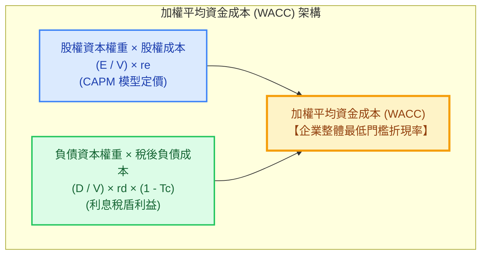

---
{"dg-publish":true,"permalink":"/98/wacc/","tags":["商業概念","財務管理","公司理財","資本結構","企業評價","PMBA"],"dg-note-properties":{"aliases":["WACC","加權平均資本成本","加權平均資金成本","Weighted Average Cost of Capital","加權資金成本","最適資金成本"],"tags":["商業概念","財務管理","公司理財","資本結構","企業評價","PMBA"]}}
---

# 加權平均資金成本 (Weighted Average Cost of Capital, WACC)

> 💡 **導航與索引**：本篇亦可參閱庫內標準命名字卡 [[98_商業概念庫/weighted-average-cost-of-capital_加權平均資金成本\|weighted-average-cost-of-capital_加權平均資金成本]]。

## 一、 核心定義與財務學本質

- **加權平均資金成本 (WACC)** 是公司理財、資本預算與企業評價中最核心的折現率指標，代表**企業為籌集與維持營運資本（包含股權資本與債權資本），所必須支付給全體出資人的加權平均最低預期回報率（Hurdle Rate）**。
- **出資人 vs. 經理人的雙重視角**：
  - **投資人視角（Required Rate of Return）**：出資者承擔企業經營風險與財務風險所要求的最低要求報酬率。
  - **企業經理人視角（Opportunity Cost）**：動用社會資本與股東財富的**「機會成本（Opportunity Cost）」**。
- **企業價值極大化 vs. WACC 極小化**：
  在[[98_商業概念庫/dcf_現金流量折現法\|現金流量折現（DCF）]]模型中，企業實體價值（Enterprise Value, EV）等於未來所有[[98_商業概念庫/enterprise-free-cash-flow-liang_企業自由現金流量\|企業自由現金流]]（FCFF）以 WACC 折現之現值總和：
  $$\text{企業價值 (EV)} = \sum_{t=1}^{\infty} \frac{\text{FCFF}_t}{(1 + \text{WACC})^t}$$
  👉 **核心定理**：當企業尋得一組最適資本結構，使得加權平均資金成本 $\text{WACC}$ 降至最低點時，企業整體價值必然達到極大化：
  $$\min \text{WACC} \iff \max \text{Enterprise Value } (V = B + S)$$

---

## 二、 標準計算公式與參數深層拆解

### 1. 標準計算公式
$$\text{WACC} = \left( \frac{E}{V} \times r_e \right) + \left[ \frac{D}{V} \times r_d \times (1 - T_c) \right]$$

若企業發行特別股（Preferred Stock），公式擴充為：
$$\text{WACC} = \left( \frac{E}{V} \times r_e \right) + \left( \frac{P}{V} \times r_p \right) + \left[ \frac{D}{V} \times r_d \times (1 - T_c) \right]$$

### 2. 各參數實務取值標準與嚴格規範

| 公式參數 | 財務意義 | 實務計量標準與規範 | 經理人常見錯誤陷阱 |
| :--- | :--- | :--- | :--- |
| **$E$** | 股權市場價值 (Equity) | **市值（Market Value）**：每股市價 $\times$ 在外流通股數。 | ❌ 誤用資產負債表之「股東權益帳面價值」。 |
| **$D$** | 有息負債市場價值 (Debt) | 短期借款 + 長期借款 + 應付公司債之現時市值。 | ❌ 誤將應付帳款等「無息營運負債」計入。 |
| **$V = E + D$** | 企業總資本市值 | 總有息資本規模。 | ❌ 忽略隨股價波動之動態權重重估。 |
| **$r_e$** | [[98_商業概念庫/equity-cost_權益成本\|股權成本]] (Cost of Equity) | 採用 **CAPM 模型**：$$r_e = R_f + \beta_e [E(R_m) - R_f]$$ | ❌ 誤以為股權資金「不用付利息＝無成本」。股權具剩餘索償權，成本遠高於債務。 |
| **$r_d$** | 負債成本 (Cost of Debt) | 公司發行新債之**邊際到期殖利率（YTM）**或銀行新增放款利率。 | ❌ 誤採過去歷史借款之會計平均利息支出。 |
| **$(1 - T_c)$** | **利息稅盾效應** (Interest Tax Shield) | $T_c$ 為法定邊際企業所得稅率。因借款利息可在稅前列支扣抵稅額，實質降低債務成本。 | ❌ 漏乘 $(1 - T_c)$，忽略稅法賦予負債的租稅補貼優勢。 |

---

## 三、 資本結構理論演進中的 WACC 軌跡

### 1. 完美無稅市場：MM 定理命題二 (Modigliani-Miller, 1958)
- 在無交易成本、無稅收的完美資本市場中，雖然負債成本 $r_d$ 低於股權成本 $r_e$，但舉債所增加的財務風險會導致股東要求的股權報酬率 $r_e$ 線性上升：
  $$r_e = r_0 + \frac{D}{E}(r_0 - r_d)$$
- **WACC 恆等於無槓桿權益成本 $r_0$**。舉債帶來的低成本優勢被股東要求的高風險溢酬 100% 抵消，資本結構完全不影響企業價值。

### 2. 存在公司所得稅：MM 定理修正 (1963)
- 利息支出具備稅盾庇護，加權平均資金成本隨槓桿上升單調遞減：
  $$\text{WACC} = r_0 \left[ 1 - T_c \frac{D}{V} \right]$$
- 理論極端推論：企業應 100% 負債營運以極小化 WACC。

### 3. 真實世界摩擦：靜態權衡理論 (Trade-Off Theory)
- 舉債過高將觸發**財務困境成本（Financial Distress Costs）**、破產清算風險與代理人衝突。
- **U 型曲線規律**：
  - 低負債時：利息稅盾佔據主導，WACC 隨負債比率上升而下滑。
  - 超過最適槓桿後：破產風險溢酬壓倒稅盾效益，股權與債權成本同步垂直飆升，WACC 急速反彈。
  - **U 型曲線谷底最低點** ── 即為企業的 **[[98_商業概念庫/capital-structure-2_最佳資本結構\|最佳資本結構]]**。

---

## 四、 高階經理人實戰決策三大軍規

### 1. 資本預算門檻收益率 (Hurdle Rate)
在審批新廠擴建、研發立項或跨國併購等[[98_商業概念庫/capital-expenditure_資本支出\|資本支出]]時，嚴禁僅以定存或低利借款利率作為基準：
$$\text{門檻收益率 (Hurdle Rate)} = \text{WACC} + \alpha$$
- $\alpha$ 為該專案相對於公司整體業務的**特有風險貼水**。
- > 💡 **課堂金句**：很多經理人常說「現在銀行借款只要 2.5%，我這個案子 IRR 有 6% 為什麼不能做？」——如果公司的 WACC 是 7.5%，加上專案風險貼水 $\alpha = 2\%$，門檻收益率高達 9.5%。做 6% 的專案就是在拿股東的資本去補貼市場，實質在虧損毀滅財富！

### 2. 經濟增加值 (EVA) 價值創造檢驗
企業是否在「實質創造股東價值」，唯一標準是本業獲利效率是否超越資金成本：
$$\text{經濟增加值 (EVA)} = (\text{ROIC} - \text{WACC}) \times \text{投入資本 (Invested Capital)}$$
- **$\text{ROIC} > \text{WACC}$（超額利差正向）**：企業實質創造經濟利潤，擴張具備正正當性。
- **$\text{ROIC} < \text{WACC}$（價值毀滅陷阱）**：即使會計報表營收成長、EPS 上升，每一塊錢新投資本質上都在摧毀股東財富！此時經理人應立即停止盲目擴張，將現金 100% 透過股利或庫藏股返還股東。

### 3. DCF 建模防範「雙重計算陷阱 (Double Counting Fallacy)」
- 當以企業自由現金流量（FCFF）配合 WACC 折現時，**營業現金流中嚴禁再次扣除利息支出**。
- 借款之利息負擔與稅盾利益已完整在 WACC 折現率的 $r_d(1 - T_c)$ 中體現；若現金流又扣利息，將犯下重複扣除的致命錯誤，嚴重低估專案真實價值。

---

## 五、 關聯主題與模組網絡

- 🧭 **課程核心模組對接**：
  - [[02_核心必修/01_財務管理/L08_資本結構理論與決策\|L08 資本結構理論與決策]]（無稅 MM 定理推導、WACC 恆定性與財務槓桿風險傳導）
  - [[02_核心必修/01_財務管理/L09_資本結構理論與決策\|L09 資本結構理論與決策]]（有稅 MM 稅盾、靜態權衡理論 U 型曲線與 WACC 極小化）
  - [[02_核心必修/01_財務管理/L05_資本支出預算(或投資)決策\|L05 資本支出預算決策]]（NPV 折現率黃金標準、IRR 再投資率假說）
  - [[02_核心必修/01_財務管理/L07_資本支出預算決策\|L07 資本支出預算決策]]（融資利息雙重計算陷阱、專案風險調整折現率）
  - [[04_主題選修/12_產業分析與投資策略/02_模組筆記/Module_1_總論與架構/M1-2_三大景氣循環與資本評價邏輯\|M1-2 三大景氣循環與資本評價邏輯]]（門檻收益率 Hurdle Rate = WACC + α、ROIC vs. WACC 經濟利差）
  - [[04_主題選修/10_創業與企業財務策略/02_模組筆記/Module_1_創新思維與商業模式/M1-10_七大市場力量與商業戰略價值公式\|M1-10 七大市場力量與商業戰略價值公式]]（EVA 經濟增加值推導與定價權）
  - [[04_主題選修/10_創業與企業財務策略/02_模組筆記/Module_1_創新思維與商業模式/M1-2_白板決策鏈與財務價值三角\|M1-2 白板決策鏈與財務價值三角]]（資本定價權與 WACC 折現率博弈）
- 🔗 **核心概念原子卡片**：
  - [[98_商業概念庫/return-on-invested-capital_資本投入報酬率\|return-on-invested-capital_資本投入報酬率]] ｜ [[98_商業概念庫/pvgo_成長機會現值\|pvgo_成長機會現值]]
  - [[98_商業概念庫/NPV_淨現值法 _Net Present Value\|淨現值法 (NPV)]] ｜ [[98_商業概念庫/equity-cost_權益成本\|equity-cost_權益成本]]
  - [[98_商業概念庫/capital-structure_資本結構\|capital-structure_資本結構]] ｜ [[98_商業概念庫/capital-structure-2_最佳資本結構\|capital-structure-2_最佳資本結構]]
  - [[98_商業概念庫/enterprise-value-evaluation_企業價值評估\|enterprise-value-evaluation_企業價值評估]] ｜ [[98_商業概念庫/dcf_現金流量折現法\|現金流量折現法 (DCF)]]
  - [[98_商業概念庫/weighted-average-cost-of-capital_加權平均資金成本\|weighted-average-cost-of-capital_加權平均資金成本]]
